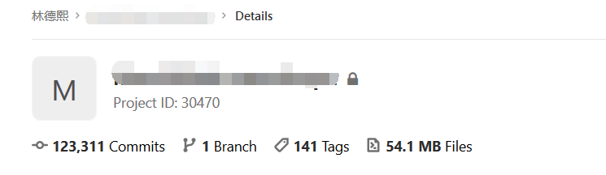
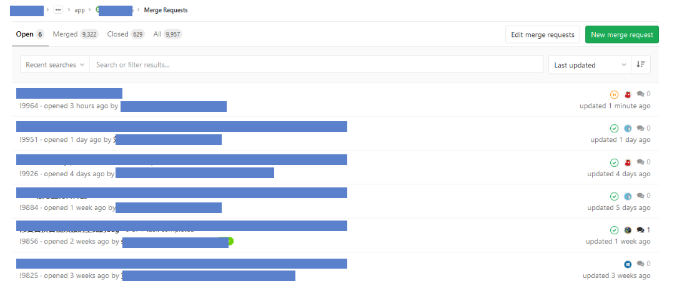
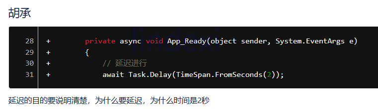

# dotnet 一些代码审查套路

本文记录一些代码审查套路，在看到小伙伴写出某些代码的时候可以告诉他这样写有锅

<!--more-->
<!-- CreateTime:6/6/2020 9:19:16 AM -->


我在各个项目里面进行代码审查，我维护了很多个项目

<!--  -->


这是我截图某一天的一个核心项目的在 Gitlab 上的 MR 情况，我觉得头像应该是不用保密的，这样知道的小伙伴自然就知道了。对了，那些挂了超过3天的都是标记 WIP 还在开发中的

<!--  -->


回到主题，代码审查时有哪些套路？

## 多语言

如果写了固定的在界面显示的字符串，请询问是否需要使用多语言

## 魔数的处理

啥是魔数？写固定的一些数值等

魔数尽量不要出现，抽成常量，便于修改，一定避免不了使用魔数的话添加详细注释

如以下代码，后续维护难度几乎等于无穷

```csharp
Foo(1, 200, 15, 16, 20);
```

## 注释说的是不是和代码做的相同

有时候改动的时候忘记改注释了，此时注释说的和代码做的不是一回事，因此代码审查不要跳过注释写的


## 变量名拼写 语法规范

变量名拼写是否符合语法，符合规范

这部分其实用机器人不错，如 GitHub 的代码风格自动审查机器人 [CodeFactor](https://github.com/marketplace/codefactor ) 可以自动审查代码风格


## 该加单位的属性是否明确了单位

用的最多的就是时间单位，请问如下属性表示的是秒还是毫秒

```csharp
public double Foo { get; }
```

要么让类型可以表示时间的单位，要么在属性命名上区分，请看 [程序猿修养 给属性一个单位](https://blog.lindexi.com/post/%E7%A8%8B%E5%BA%8F%E7%8C%BF%E4%BF%AE%E5%85%BB-%E7%BB%99%E5%B1%9E%E6%80%A7%E4%B8%80%E4%B8%AA%E5%8D%95%E4%BD%8D.html )

## 函数的参数个数不要太多

太多的参数调用起来也不方便，代码可读性也比较渣

```csharp
public void CubeAdsorb(Point start, Point end, Point topLeft, List<Point> points, double theta, Matrix backMatrix, Vector vector, Cube cube)
```

太多的参数建议定义一个新的类用来包装

## 判断逻辑判断方法不要随意倒换

其实只要固定下来，可读性会比较好，如以下反例

```csharp
        internal FontStyle(int style)
        {
            Debug.Assert(0 <= style && style <= 2);

            _style = style;
        }
```

这是 WPF 框架源代码的 FontStyle 类的代码，可读性比较渣的代码是 `0 <= style && style <= 2` 因为判断方法存在一次倒换。第一次判断是使用常量和变量判断，第二次反过来

当然，适应之后也会发现其实上面的写法也是有一些可读的，因为可以和数学一样表示一个区间


## 注意外部属性或字段的变更

有很多代码写的时候需要考虑多线程访问，多线程的时候可能其他线程会变更外部的属性或字段，因此如下面代码是不安全的

```csharp
            if (s_providers == null)
                return null;

            EncodingProvider[] providers = s_providers;
```

上面代码的 `s_providers` 的定义是一个静态字段，上面代码在判断 `s_providers == null` 时，此时 `s_providers` 是存在值的。但是后续获取 `providers = s_providers` 时，可能此时的 `s_providers` 的值就被改为 null 此时的逻辑是不对的

推荐的写法如下

```csharp
            EncodingProvider[] providers = s_providers;
            if (providers == null)
                return null;
```

先获取外部字段放在局部变量，再判断局部变量。这样能解决两次访问外部字段的时候，访问的对象不是相同的对象

## 属性的获取应该是轻量的

从 C# 的设计上，使用属性可以做到对字段或内存空间的封装，可以在获取之前进行一些运算。但是咱默认的约定应该是属性的获取应该是轻量的运算，最好不要做 IO 或重计算，如下面代码

```csharp
public string Foo
{
    get
    {
        // 访问数据库
        // 读写文件
        return xx;
    }
}
```

因为大部分小伙伴在使用属性的时候都是不期望去看 get 的代码，都是认为有这个属性可以获取，也许会写入如下面代码

```csharp
for (int i = 0; i < n; i++)
{
    F1(Foo);
}
```

也就是在循环里面不断获取属性，而这个属性获取的性能又比较差

如果属性的获取的性能比较差，推荐修改为方法，如 `GetFoo` 这样小伙伴看到方法也有预期

## 通过局部变量简化获取属性的属性的写法

如看到以下的代码，会觉得代码很复杂

```csharp
var f1 = Axxx.Bxxxxx.Cxxxxx;
var f2 = F3(f1, Axxx.Bxxxxx.Dxxxxx);
F4(f2, Axxx.Bxxxxx.Exxxxx);
```

如果此时将 `Axxx.Bxxxxx` 提取出来，相对来说代码看起来就没有那么多

```csharp
var bxx = Axxx.Bxxxxx;

var f1 = bxx.Cxxxxx;
var f2 = F3(f1, bxx.Dxxxxx);
F4(f2, bxx.Exxxxx);
```

## 小心属性的属性的属性的写法中途存在空值

尽可能不要太多层的属性的属性的写法，如下面代码，听说下面这行代码抛了一个空异常，请问哪个是空

```csharp
var foo = A.B.C.D.E.F.G;
```


## 事件的加等

推荐存在重入的方法对事件加等之前使用减等，至少多余的减等没啥坏处，但是可以解决某些事件被添加多次

```csharp
public void Foo()
{
    F1Event += F2;
}
```

此时如果存在多次的加等，那么 F1Event 触发一次将会调用两次 F2 方法。而这个逻辑在开始写的时候应该是没锅，但是后续小伙伴改动的时候也许会多调用一次 Foo 方法，此时就炸了

修改后的代码如下

```csharp
public void Foo()
{
    F1Event -= F2;
    F1Event += F2;
}
```

第一次进入的时候，假设 F1Event 是空，此时 `F1Event -= F2` 没有任何作用，也不会出错。但是如果是第二次进入的时候，就可以做到干掉之前监听的事件

好，第二个问题就是应该让减等跟随加等，放在相邻的两句代码。如果不遵守会如何，如下面的故事。逗 A 说德熙说要先减等然后再加等，好我写了下面的代码

```csharp
public void Foo()
{
    F1Event -= F2;

    // 其他的业务

    F1Event += F2;
}
```

然后逗 B 就改了上面的逻辑，中间加了有趣的逻辑，例如再次调用自身

```csharp
public void Foo()
{
    F1Event -= F2;

    // 其他的业务
    Foo();

    F1Event += F2;
}
```

请问上面代码会有什么坑？第一次调用 F1Event 的减等，此时 F1Event 没有被 F2 监听。而第二次调用 Foo 方法，此时 F1Event 没有被 F2 监听。然后在 Foo 里面调用了 `F1Event += F2` 加等一次，接着再来一次加等，最后也就是会加等两次

因此推荐上面的规则，让减等和加等放在相邻的代码，如下面代码

```csharp
public void Foo()
{
    F1Event -= F2;
    F1Event += F2;
}
```

此时没有在加等和减等插入逻辑，基本上除非是多线程，那么最终只是监听一次


## 字典性能相关

字典的时候需要关注的是两次获取的问题

### 字典获取值

如需要判断如果字典存在就获取，有下面两个写法

```csharp
    if (Dictionary.TryGetValue(xx, out var foo))
    {
    }
```

第二个写法如下

```csharp
if(Dictionary.ContainsKey(xx))
{
    var foo = Dictionary[xx];
}
```

这两个方法哪个性能好？其实 TryGetValue 只需要获取一次，性能比较好，测试请看下面博客

[C# 字典 Dictionary 的 TryGetValue 与先判断 ContainsKey 然后 Get 的性能对比](https://blog.lindexi.com/post/C-%E5%AD%97%E5%85%B8-Dictionary-%E7%9A%84-TryGetValue-%E4%B8%8E%E5%85%88%E5%88%A4%E6%96%AD-ContainsKey-%E7%84%B6%E5%90%8E-Get-%E7%9A%84%E6%80%A7%E8%83%BD%E5%AF%B9%E6%AF%94.html )

### 字典添加值

想要判断如果字典不存在值的时候才添加，也有两个写法

```csharp
if(!Dictionary.ContainsKey(xx))
{
    Dictionary[xx] = foo;
}
```

另一个写法是采用 .NET Core 2.0 和 .NET Standard 2.1 添加的 TryAdd 方法添加值

使用 TryAdd 方法的性能会更好，不过这个方法是最近才添加的，也许很多小伙伴不知道

[Dictionary.TryAdd(TKey, TValue) Method (System.Collections.Generic)](https://docs.microsoft.com/en-us/dotnet/api/system.collections.generic.dictionary-2.tryadd?wt.mc_id=MVP )

[dotnet 字典类找不到 TryAdd 方法](https://blog.lindexi.com/post/dotnet-%E5%AD%97%E5%85%B8%E7%B1%BB%E6%89%BE%E4%B8%8D%E5%88%B0-TryAdd-%E6%96%B9%E6%B3%95.html )

## 数组 列表 集合的初始化

如果在此上下文中能够明确知道数组 列表 集合将要分配的大小，那么推荐给定一个指定的大小，如下面代码

```csharp
var foo = new List<int>(10);
```

此规则不仅适用于 List 同时也适用于 Dictionary 等集合类

给定明确的大小可以减少后续的集合分配内存，提升性能。可以提升内存性能和 CPU 性能。原因是 大部分集合类 底层分配是两倍两倍分配，重新分配的内存需要将原有的拷贝过去。而因为是两倍两倍分配，所以大部分时候都会比需要的多一些

因此给定明确的分配大小可以减少内存分配和拷贝，提升性能

详细请看 [List的扩容机制，你真的明白吗？ - 一线码农 - 博客园](https://www.cnblogs.com/huangxincheng/p/12954569.html )


## 字符串的大量拼接使用 StringBuilder 代替

根据字符串的原理，如果进行不断的拼接，将会带来一点性能损耗。原因是每次拼接都会创建新的字符串对象

```csharp
for (int i = 0; i < n; i++)
{
    str += i.ToString();
}
```

如上面代码将会创建大量中间的字符串对象，而最终需要的对象仅仅只有一个字符串。一个优化的方法就是使用 StringBuilder 代替 string 此时能提升不少的性能


## 条件分支的合并

对于同一对象非白即黑的判断，用if……else if……，而不是if……if……两次判断

如以下代码

```csharp
if (n > 10)
{
    // 业务
}
if (n < 10)
{
    // 业务
}
```

明显此时的 n 如果大于 10 那么进入上面分支，此时就不可能进入下面分支。因此使用 else if 可以减少一次判断逻辑

```csharp
if (n > 10)
{
    // 业务
}
else if (n < 10)
{
    // 业务
}
```


## Task

如果一个 Task 在做耗时任务，需要看这个任务是不是会使用很长的时间，如果会就需要设置为长时间线程

## 设置异步方法返回值为 void 不等待

如果设置了异步方法，而且设置了方法的返回值为 void ，那么需要确认是否会出现重入的情况。也就是这个函数可能被多次调用，而且因为没有等待，相同的逻辑被进入多次

## 锁的对象应该是不变的对象

看到使用 lock 时，请关注 lock 的对象。按照 lock 的工作原理，应该 lock 一个多线程访问的时候为共同的对象。根据这一点可以了解到有以下需要注意的套路

- 是否 lock 了一个局部创建的变量
- 是否 lock 了一个本业务外的对象
- 是否 lock 了一个被复制结构体

咱一条条过一下

如下面代码，咱在代码里面 lock 了一个局部创建的变量。那么此时这个变量不能代表多线程进来的时候能访问的相同的对象， 因此这段逻辑的 lock 和没有使用 lock 是等价的

```csharp
public void Foo(A a)
{
    var b = new object();
    lock (b)
    {
        // 业务
    }
}
```

稍微改一下上面代码，咱 lock 的是传入的参数，请问此时是否是安全的

```csharp
public void Foo(A a)
{
    lock (a)
    {
        // 业务
    }
}
```

此时代码是挖坑代码，为什么？在写的时候，也许大部分进入 Foo 的线程能拿到相同的 a 对象，此时的lock就能生效。但是如果后续小伙伴改动了上层业务逻辑，传入的 a 不是相同的对象，那么就 gg 了。相信后续也需要用比较多的精力才能调试出来这里的坑

好，下一条，是否 lock 了一个本业务外的对象

这个问题是也许会出现相互等待的锁，因为很难了解到本业务外的对象是否也会被其他业务拿来作为锁的对象。此时就可能出现了某个线程获取了 A 对象的锁，然后等待本线程执行完成。但是本线程又想要获取 A 对象的锁，此时就挖了一个大坑

不经意会写出的坑还有如下代码

```csharp
lock ("林德熙是逗比")
```

所有字符串常量只要字面值相同，就是相同对象。敲黑板，这一点很重要，尽量不要将字符串作为锁对象

最后一条，根据 lock 的定义，和第一条相同的坑，因为结构体每次获取都是复制新的值，此时是不安全的，也就是两次结构体虽然代码看起来是相同的对象，但是实际上存在了结构体的复制。虽然一般小伙伴写不出这样的代码，但是写出来就是挖坑

代码审查到锁要求第一个注意的是是否使用了相同的对象，以及使用用的对象是共享的，会被其他业务拿来作为锁的对象


## 延迟的目的要说明清楚

如图

<!--  -->


看到 `await Task.Delay(TimeSpan.FromSeconds(2));` 的代码需要留意一下，也许这是逗比代码


## Obsolete 标记建议告知新的方法

咱可以给不适用的属性或方法或类表示 Obsolete 特性，这就能告诉开发者不建议使用此方法或属性等。此时既然建议了不要使用，那么有啥可以代替，或者应该如何做？此时推荐写在 Obsolete 里面，告诉开发者推荐的做法

因此如果代码审查看到仅有 `[Obsolete]` 就需要提示添加告诉开发者推荐的做法


## 是否吃掉异常

如果运行某个业务，然后这个业务没有按照预期执行，也没有什么日志输出。那么此时的调试就坑了。也就是说业务吃掉了异常，会让调用业务的上层觉得很诡异，因为异常没有抛出，上层业务不知道存在异常。如果此时也没有做日志，那么小伙伴想想可以如何调试

```csharp
try
{
    // 业务
}
catch
{

}
```

在代码审查看到吃掉全部异常的，就需要问问小伙伴是否必要，另外需要问问他是否可以记一下日志


## 最后再附加小笑话

### 谁删了我的代码

德熙看到了胡承评论了代码的变量名不好理解，因为德熙觉得这个变量名修改是很快的事情，于是就点了已解决。这时德熙在本地修改了变量名，出去和小伙伴聊天，回来就上传代码。过了几分钟，发现dev上没有自己的代码，而且MegerRequest合并了。是谁删了我的代码？

实际上在德熙提交之前，胡承已经把代码合并到dev了，如果一个分支在合并到dev之后的提交是不会自动合并到dev，需要再次提交请求才会合并。

如果要避免再次发生这个事情，那么在解决完之后提交再点击以解决

<!--  -->


<a rel="license" href="http://creativecommons.org/licenses/by-nc-sa/4.0/"></a><br />本作品采用<a rel="license" href="http://creativecommons.org/licenses/by-nc-sa/4.0/">知识共享署名-非商业性使用-相同方式共享 4.0 国际许可协议</a>进行许可。欢迎转载、使用、重新发布，但务必保留文章署名[林德熙](http://blog.csdn.net/lindexi_gd)(包含链接:http://blog.csdn.net/lindexi_gd )，不得用于商业目的，基于本文修改后的作品务必以相同的许可发布。如有任何疑问，请与我[联系](mailto:lindexi_gd@163.com)。 
