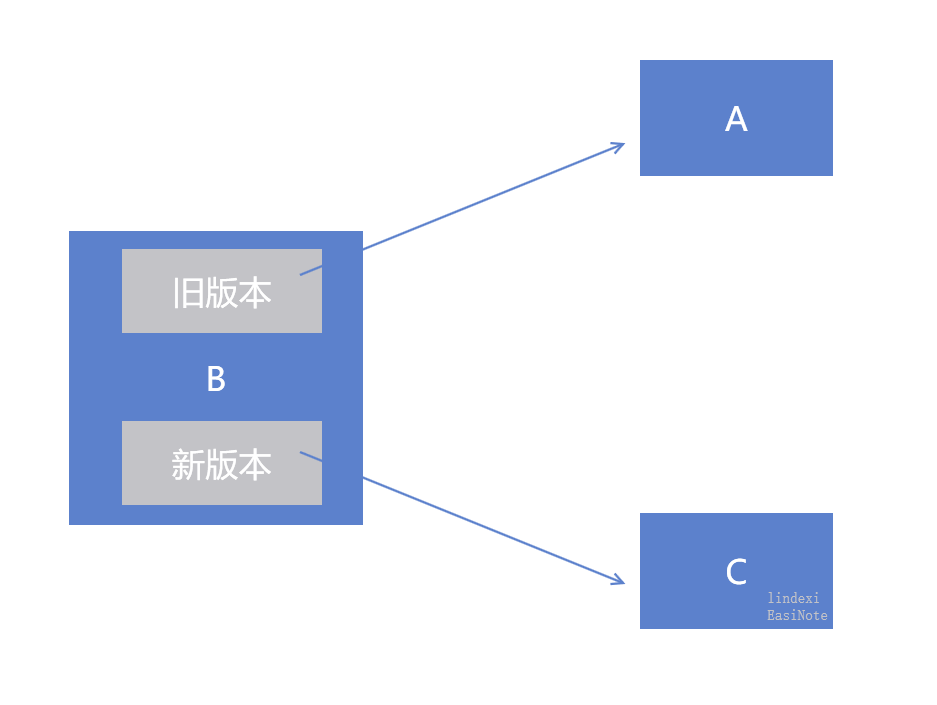
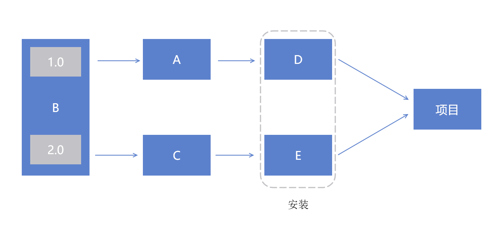

# dotnet 为什么每个项目都会输出一个 NuGet 包而不是一个包带所有项目

在使用 dotnet 打 NuGet 包的时候会发现是每个项目都生成独立的一个 NuGet 包，通过 NuGet 引用依赖指向依赖的项目。那为什么不是我最终只打出一个 NuGet 包，这个 NuGet 包，包含了所有的项目的输出文件？每个项目独立输出是为了解决什么问题？下面让我为你解答

<!--more-->
<!-- 发布 -->

咱不和官方文档等说原因，咱从问题出发

假设咱有两个库项目分别是 A 和 B 两个项目，而 A 项目依赖 B 项目

假设咱决定打包的时候将 A 和 B 两个项目的输出文件 A.dll 和 B.dll 打到一个 NuGet 包里面。很好，此时就只有一个NuGet包，其他开发者安装这个 NuGet 包就拿到了 A.dll 和 B.dll 了，完美

后续小伙伴发现 B 项目需要维护，于是更新了 B 项目的代码。而此时就需要更新一个 NuGet 包，这个 NuGet 包需要包含 A 和 B 的两个项目，因为咱一开始就将 A.dll 和 B.dll 放在相同的一个 NuGet 包里面

此时其他开发者就纳闷了，我就想要更新 B.dll 为什么你也将 A.dll 也给我更新了

这就引入了一个问题，无法做到单独更新，必须捆绑 A 和 B 在一起。这对于补丁发布特别不利

在终于说服了其他开发者 A.dll 其实没改啥东西，就给你挖了几个坑，加班几天你就能修好了。其他开发者终于肯升级整个 NuGet 包了。而时间过了几个月，我创建了 C 项目，此时 C 项目引用了 B 项目。我因为需要一些特殊的需求，我更改了 B 项目的一些逻辑，也打出了新版本的 C 项目的 NuGet 包。总体依赖关系如下

<!--  -->


这就有趣了，我在最终项目里面安装了 A 的 NuGet 和 C 的 NuGet 包，请问最终输出的 B.dll 是新版本还是旧版本？其实就看 VS 的心情了

好，此时小伙伴又想了一个主意，咱将 A.dll 和 B.dll 和 C.dll 都打在一起，这样不就没问题了。没错，解决了上面的问题。不过再过几个月，我又添加了 D 和 E 项目，又需要打在相同的 NuGet 包里面，于是一个 NuGet 包就几乎包含了所有项目的代码

为了解决上面说的坑，就决定了 dotnet 的每个项目打出独立的 NuGet 包。能解决的问题如下

- 引用依赖的时候，能够有条件知道最新版本是哪个。让开发者可以作出高版本兼容低版本，做到版本兼容
- 支持独立更新，可以单独给某个包添加补丁，只需要更新一个包，减少送测过程影响范围
- 传递依赖引用，解决引用的引用的一条链的自动引用，而不是相互覆盖
- 让每个项目按需安装，而不需要带上多余的依赖
- 支持给每个项目独立的描述信息

那小伙伴是不是会问，如果独立拆开多个 NuGet 会有什么问题

### 多个 NuGet 包需要上传多次

如果只是有一个 NuGet 包，那么做一次上传就可以了。现在有多个了，是不是需要执行多次上传

其实不是的，在 NuGet 的上传里面支持通配符的上传，也就是放在一个文件夹里面，可以通过一句 NuGet 命令行全部上传

```
nuget push .\bin\release\*.nupkg
```

### 多个 NuGet 包需要安装多次

如果只有一个 NuGet 包，那么我只需要安装一次就完成了。现在有多个 NuGet 包，我是不是要做很多次安装

其实也不是的，因为 NuGet 包有引用依赖的功能，只需要安装最顶层的 NuGet 包就可以了，其他被最顶层依赖的 NuGet 包都会自动安装

### 多个 NuGet 包中间依赖多个版本如何处理

假设有如下图的引用关系

<!--  -->


在项目里面只写了 D 和 E 的 NuGet 的安装。而 D 和 E 的依赖分别是 D 引用 A 而 E 引用 C 项目，同时 A 和 C 都引用 B 项目，只是引用的版本不相同

通过引用依赖，可以让 A 和 B 和 C 都会自动安装，如果遇到有相同的依赖，将会根据版本号，选用版本最高的一个。如上图的 B 是 A 和 C 相同的依赖，此时判断 C 的依赖的版本更高，因此使用 2.0 版本的 B 库

<a rel="license" href="http://creativecommons.org/licenses/by-nc-sa/4.0/"></a><br />本作品采用<a rel="license" href="http://creativecommons.org/licenses/by-nc-sa/4.0/">知识共享署名-非商业性使用-相同方式共享 4.0 国际许可协议</a>进行许可。欢迎转载、使用、重新发布，但务必保留文章署名[林德熙](http://blog.csdn.net/lindexi_gd)(包含链接:http://blog.csdn.net/lindexi_gd )，不得用于商业目的，基于本文修改后的作品务必以相同的许可发布。如有任何疑问，请与我[联系](mailto:lindexi_gd@163.com)。
