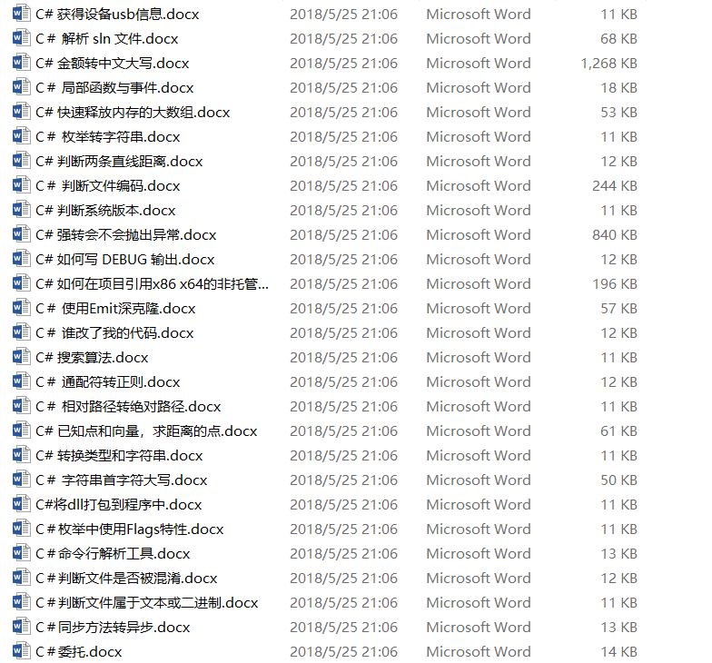
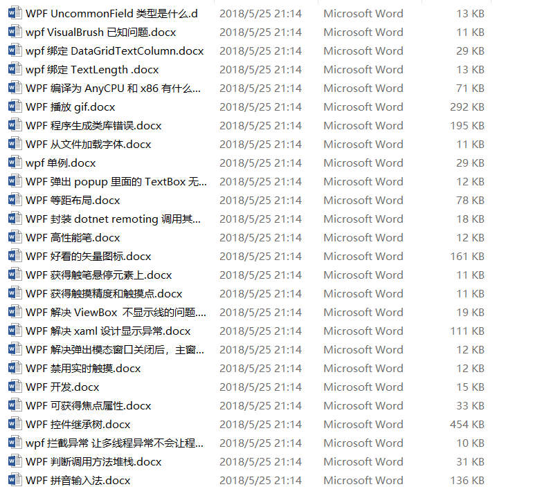
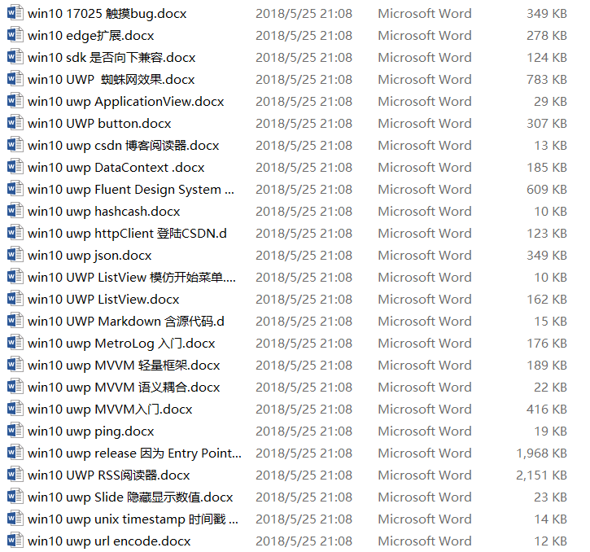
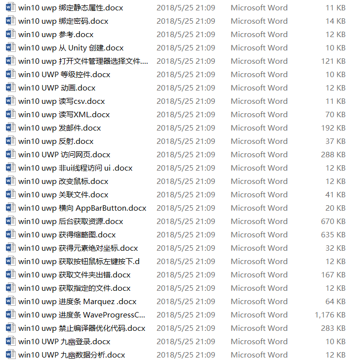
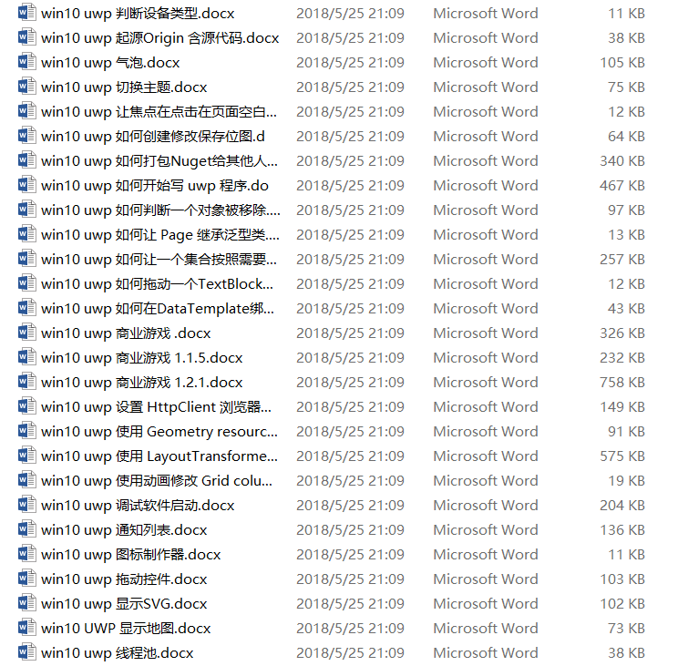
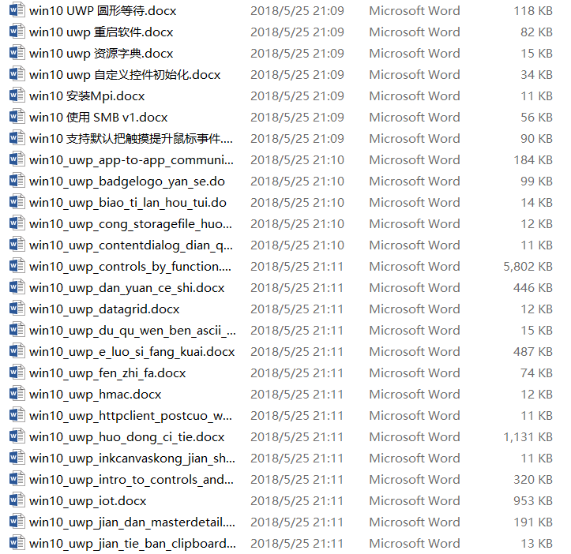
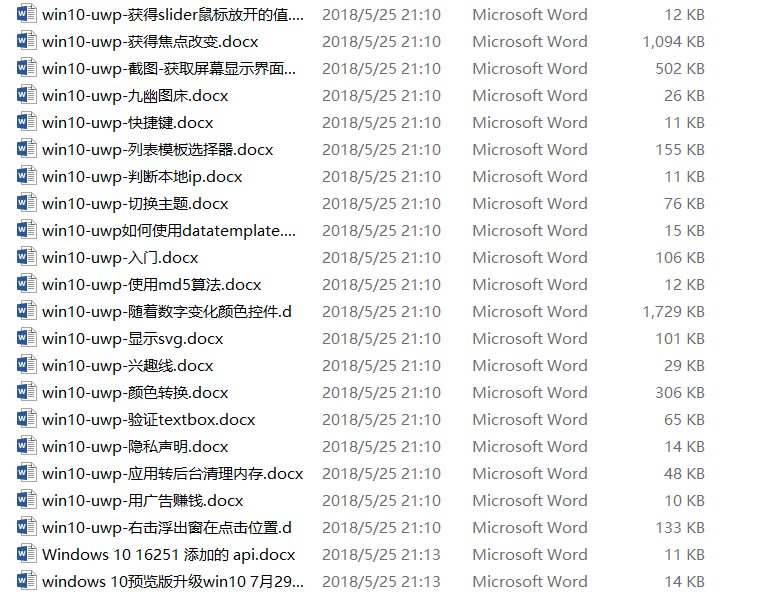
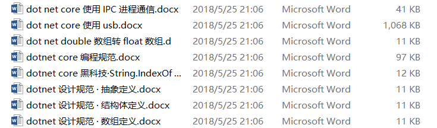
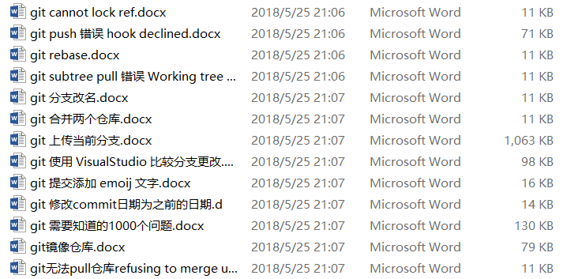

# dotnet 从入门到放弃的 500 篇文章合集

本文是记录我从入门到放弃写的博客

<!--more-->
<!-- CreateTime:2018/8/10 19:16:52 -->

博客包括 C#、WPF、UWP、dotnet core 、git 和 VisualStudio 和一些算法，所有博客使用 docx 保存

下载：[dotnet 从入门到放弃的 500 篇合集-CSDN下载](https://download.csdn.net/download/lindexi_gd/10438477 )

C# 的博客

<!--  -->

WPF 的博客 

<!--  -->

UWP 的博客

<!--  -->

<!--  -->

<!--  -->

<!--  -->

<!--  -->

dotnet core 的博客

<!--  -->

git 相关博客

<!--  -->

所有博客

 - .net Framework 源代码 · Ink
 - .net Framework 源代码 · ScrollViewer
 - .net remoting 使用事件
 - .net remoting 抛出异常
 - .net Standard
 - C# 16 进制字符串转 int
 - C# AddRange 添加位置
 - C# double 好用的扩展
 - C# GUID ToString 
 - C# ValueTuple 原理
 - C# 不能用于文件名的字符
 - C# 判断两条直线距离
 - C# 判断系统版本
 - C# 动态加载卸载 DLL
 - C# 复制列表
 - C# 如何写 DEBUG 输出
 - C# 如何在项目引用x86 x64的非托管代码
 - C# 已知点和向量，求距离的点
 - C# 强转会不会抛出异常
 - C# 很少人知道的科技
 - C# 快速释放内存的大数组
 - C# 搜索算法
 - C# 获得设备usb信息
 - C# 转换类型和字符串
 - C# 遍历枚举
 - C# 金额转中文大写
 - C#将dll打包到程序中
 - c-70
 - c-设计模式-责任链
 - cant found Microsoft.VSSDK.BuildTools.15.0.26201
 - C＃ 6.0 字符串 String Interpolation
 - C＃ await 高级用法
 - C＃ BBcode 转 Markdown
 - C＃ Find vs FirstOrDefault
 - C＃ TextBlock 上标
 - C＃ 代码占用的空间
 - C＃ 使用Emit深克隆
 - C＃ 判断文件编码
 - C＃ 字符串首字符大写
 - C＃ 局部函数与事件
 - C＃ 枚举转字符串
 - C＃ 相对路径转绝对路径
 - C＃ 解析 sln 文件
 - C＃ 谁改了我的代码
 - C＃ 通配符转正则
 - C＃判断文件属于文本或二进制
 - C＃判断文件是否被混淆
 - C＃同步方法转异步
 - C＃命令行解析工具
 - C＃委托
 - C＃枚举中使用Flags特性
 - dot net core 使用 IPC 进程通信
 - dot net core 使用 usb
 - dot net double 数组转 float 数组
 - dotnet core 编程规范
 - dotnet core 黑科技·String.IndexOf 性能
 - dotnet 从入门到放弃的 500 篇博客合集
 - dotnet 设计规范 · 抽象定义
 - dotnet 设计规范 · 数组定义
 - dotnet 设计规范 · 结构体定义
 - gif 格式
 - git cannot lock ref
 - git push 错误 hook declined
 - git rebase
 - git subtree pull 错误 Working tree has modifications
 - git 上传当前分支
 - git 使用 VisualStudio 比较分支更改
 - git 修改commit日期为之前的日期
 - git 分支改名
 - git 合并两个仓库
 - git 提交添加 emoij 文字
 - git 需要知道的1000个问题
 - git无法pull仓库refusing to merge unrelated histories
 - git镜像仓库
 - jekyll 在博客添加流程图
 - jekyll 如何加密博客 防止抓取
 - jekyll 添加 Valine 评论
 - kong_jian
 - Latex 公式速查
 - Latex 去掉行号
 - Latex 论文elsevier，手把手如何用Latex写论文
 - matlab 画图
 - MobaXterm 使用代理
 - Resharper 如何把类里的类移动到其他文件
 - resharper 自定义代码片
 - resharper 跳转到源代码
 - ReverseStructure
 - Roslyn 静态分析
 - san_zhong_fang_shi_shezhi_te_ding_she_bei_uwp_xaml
 - Sublime Text 好用的插件
 - Sublime Text 安装中文、英文字体
 - sublime Text 正则替换
 - SublimeText 粘贴图片保存到本地
 - UWP 分享用那个图标
 - UWP 和 WPF 对比
 - UWP 开发中，需要知道的1000个问题
 - Visual studio C# 代码使用 NotNull
 - visual Studio 无法调试，提示程序跟踪已退出
 - visual-studio-2015-warning-msb3246
 - visual-studio-创建项目失败vstemplate
 - visual-studio-自定义项目模板
 - VisualStduio 打断点调试和不打断点调试有什么区别
 - VisualStudio csproj 添加 ItemGroup 的 Service
 - VisualStudio 修改配色
 - VisualStudio 合并代码文件
 - VisualStudio 扩展开发
 - visualStudio 无法登陆
 - VisualStudio 自定义外部命令
 - win 消息
 - win10 17025 触摸bug
 - win10 edge扩展
 - win10 sdk 是否向下兼容
 - win10 UWP  蜘蛛网效果
 - win10 uwp ApplicationView
 - win10 UWP button
 - win10 uwp csdn 博客阅读器
 - win10 uwp DataContext 
 - win10 uwp Fluent Design System 实践
 - win10 uwp hashcash
 - win10 uwp httpClient 登陆CSDN
 - win10 uwp json
 - win10 UWP ListView 模仿开始菜单
 - win10 UWP ListView
 - win10 UWP Markdown 含源代码
 - win10 uwp MetroLog 入门
 - win10 uwp MVVM 语义耦合
 - win10 uwp MVVM 轻量框架
 - win10 uwp MVVM入门
 - win10 uwp ping
 - win10 uwp release 因为 Entry Point Not Found 无法启动
 - win10 UWP RSS阅读器
 - win10 uwp Slide 隐藏显示数值
 - win10 uwp unix timestamp 时间戳 转 DateTime
 - win10 uwp url encode
 - win10 uwp win2d CanvasVirtualControl
 - win10 uwp xaml 兼容多个版本条件编译
 - win10 uwp xaml 绑定接口
 - win10 uwp xBind 无法获得资源
 - win10 UWP 九幽数据分析
 - win10 UWP 九幽登录
 - win10 uwp 从 Unity 创建
 - win10 UWP 你写我读
 - win10 uwp 使用 Geometry resources 在 xaml
 - win10 uwp 使用 LayoutTransformer
 - win10 uwp 使用动画修改 Grid column 的宽度
 - win10 uwp 依赖属性
 - win10 uwp 修改CalendarDatePicker图标颜色
 - win10 uwp 修改Pivot Header 颜色
 - win10 UWP 修改密码框文字水平
 - win10 uwp 关联文件
 - win10 uwp 切换主题
 - win10 uwp 判断设备类型
 - win10 UWP 动画
 - win10 uwp 参考
 - win10 uwp 反射
 - win10 uwp 发邮件
 - win10 uwp 右击选择GridViewItem
 - win10 uwp 后台获取资源
 - win10 uwp 商业游戏 
 - win10 uwp 商业游戏 1.1.5
 - win10 uwp 商业游戏 1.2.1
 - win10 uwp 图标制作器
 - win10 UWP 圆形等待
 - win10 uwp 如何创建修改保存位图
 - win10 uwp 如何判断一个对象被移除
 - win10 uwp 如何在DataTemplate绑定方法
 - win10 uwp 如何开始写 uwp 程序
 - win10 uwp 如何打包Nuget给其他人
 - win10 uwp 如何拖动一个TextBlock的文字到另一个TextBlock
 - win10 uwp 如何让 Page 继承泛型类
 - win10 uwp 如何让一个集合按照需要的顺序进行排序
 - win10 UWP 序列化
 - win10 UWP 应用设置
 - win10 uwp 异步转同步
 - win10 uwp 打开文件管理器选择文件
 - win10 uwp 拖动控件
 - win10 uwp 按下等待按钮
 - win10 uwp 改变鼠标
 - win10 uwp 显示SVG
 - win10 UWP 显示地图
 - win10 uwp 模拟网页输入
 - win10 uwp 横向 AppBarButton
 - win10 uwp 毛玻璃
 - win10 uwp 气泡
 - win10 uwp 渲染原理 DirectComposition 渲染
 - win10 UWP 用Path画图
 - win10 uwp 禁止编译器优化代码
 - win10 UWP 等级控件
 - win10 uwp 线程池
 - win10 uwp 绑定 OneWay 无法使用
 - win10 uwp 绑定密码
 - win10 uwp 绑定静态属性
 - win10 uwp 自定义控件初始化
 - win10 uwp 获取指定的文件
 - win10 uwp 获取按钮鼠标左键按下
 - win10 uwp 获取文件夹出错
 - win10 uwp 获得元素绝对坐标
 - win10 uwp 获得缩略图
 - win10 uwp 萤火虫效果
 - win10 uwp 让焦点在点击在页面空白处时回到textbox中
 - win10 uwp 设置 HttpClient 浏览器标识
 - win10 UWP 访问网页
 - win10 uwp 读写csv
 - win10 uwp 读写XML
 - win10 uwp 调试软件启动
 - win10 uwp 资源字典
 - win10 uwp 起源Origin 含源代码
 - win10 uwp 进度条 Marquez 
 - win10 uwp 进度条 WaveProgressControl
 - win10 uwp 选颜色
 - win10 uwp 通知列表
 - win10 uwp 重启软件
 - win10 uwp 非ui线程访问 ui 
 - win10 uwp 音频
 - win10 使用 SMB v1
 - win10 安装Mpi
 - win10 支持默认把触摸提升鼠标事件
 - win10-uwp-csdn阅读-源代码
 - win10-uwp-imagesourece-和byte-相互转换
 - win10-uwp-markdown
 - win10-uwp-九幽图床
 - win10-uwp-从type-使用构造
 - win10-uwp-使用md5算法
 - win10-uwp-保存用户选择文件夹
 - win10-uwp-入门
 - win10-uwp-兴趣线
 - win10-uwp-切换主题
 - win10-uwp-列表模板选择器
 - win10-uwp-初始屏幕
 - win10-uwp-判断本地ip
 - win10-uwp-右击浮出窗在点击位置
 - win10-uwp-多语言
 - win10-uwp-存放网络图片到本地
 - win10-uwp-布局
 - win10-uwp-应用转后台清理内存
 - win10-uwp-弹起键盘不隐藏界面元素
 - win10-uwp-快捷键
 - win10-uwp-截图-获取屏幕显示界面保存图片
 - win10-uwp-打包第三方字体到应用
 - win10-uwp-打电话
 - win10-uwp-显示svg
 - win10-uwp-标题栏
 - win10-uwp-用广告赚钱
 - win10-uwp-绘图--line-控件使用
 - win10-uwp-获得slider鼠标放开的值
 - win10-uwp-获得焦点改变
 - win10-uwp-访问解决方案文件
 - win10-uwp-车表盘-径向规
 - win10-uwp-随着数字变化颜色控件
 - win10-uwp-隐私声明
 - win10-uwp-颜色转换
 - win10-uwp-验证textbox
 - win10-uwp如何使用datatemplate
 - win10_uwp_app-to-app_communication_ying_yong_tong_
 - win10_uwp_badgelogo_yan_se
 - win10_uwp_biao_ti_lan_hou_tui
 - win10_uwp_cong_storagefile_huo_qu_wen_jian_da_xiao
 - win10_uwp_contentdialog_dian_que_ding_bu_guan_bi
 - win10_uwp_controls_by_function
 - win10_uwp_dan_yuan_ce_shi
 - win10_uwp_datagrid
 - win10_uwp_du_qu_wen_ben_ascii_cuo_wu
 - win10_uwp_e_luo_si_fang_kuai
 - win10_uwp_fen_zhi_fa
 - win10_uwp_hmac
 - win10_uwp_httpclient_postcuo_wu
 - win10_uwp_huo_dong_ci_tie
 - win10_uwp_inkcanvaskong_jian_shu_ju_bang_ding
 - win10_uwp_intro_to_controls_and_events
 - win10_uwp_iot
 - win10_uwp_jian_dan_masterdetail
 - win10_uwp_jian_tie_ban_clipboard
 - win10_uwp_messagedialog_he_contentdialog
 - win10_uwp_mo_li_gui_chu
 - win10_uwp_pan_duan_wen_jian_cun_zai
 - win10_uwp_quan_ping
 - win10_uwp_ru_herang_webview_biao_shi_win10_shou_ji
 - win10_uwp_ru_men
 - win10_uwp_shangchuan_nuget
 - win10_uwp_she_zhi_qi_dong_chuang_kou_da_xiao_huo_q
 - win10_uwp_shi_yong_you_mo_shu_ru
 - win10_uwp_shou_dong_suo_bitlocker
 - win10_uwp_smmstu_chuang
 - win10_uwp_wang_luo_bian_cheng
 - win10_uwp_win2d
 - win10_uwp_windowcurrentdispatcherzhong_current_wei
 - win10_uwp_wu_fa_fu_jia_dao_coreclr
 - win10_uwp_ying_yong_she_zhi
 - win10_uwp_yin_cang_shi_shi_ke_shi_hua
 - win10_uwp_yi_bu_jin_du_tiao
 - win10_uwp_yuan_jiao_an_niu
 - win10_uwp_yu_yin
 - win10_uwp_zi_ding_yikong_jian_splitviewitem
 - win2d CanvasRenderTarget vs CanvasBitmap
 - win2d 图片水印
 - win2d 画出好看的图形
 - Windows 10 16251 添加的 api
 - windows 10预览版升级win10 7月29 10240.16384
 - windows-10「设置」应用完整ms-settings快捷方式汇总
 - win_10_uwp_biao_qian
 - WPF  DrawingVisual
 - WPF checkbox文字下掉
 - WPF DelegateCommand 出现Specified cast is not valid
 - wpf GifBitmapDecoder 解析 gif 格式
 - WPF ListBox 的选择
 - WPF listView 绑定前一项
 - WPF popup置顶
 - wpf PreviewTextInput 在鼠标输入获得输入
 - WPF Process.Start 出现 Win32Exception 异常
 - WPF UncommonField 类型是什么
 - wpf VisualBrush 已知问题
 - WPF 一个性能比较好的 gif 解析库
 - WPF 从文件加载字体
 - WPF 使用 Direct2D1 画图 绘制基本图形
 - WPF 使用 Direct2D1 画图
 - wpf 使用 Dispatcher.Invoke 冻结窗口
 - WPF 使用 SharpDX 在 D3DImage 显示
 - WPF 使用 SharpDx 异步渲染
 - WPF 使用 SharpDX
 - WPF 使用RPC调用其他进程
 - WPF 使用不安全代码快速从数组转 WriteableBitmap
 - WPF 使用封装的 SharpDx 控件
 - WPF 修改按钮按下的颜色
 - WPF 写系统日志
 - WPF 判断调用方法堆栈
 - wpf 单例
 - WPF 只允许打开一个实例
 - WPF 可获得焦点属性
 - WPF 在 Alt+Tab 隐藏窗口
 - WPF 好看的矢量图标
 - wpf 如何使用 Magick.NET 播放 gif 图片
 - WPF 如何在 WriteableBitmap 写文字
 - WPF 如何在应用程序调试启动
 - WPF 如何在绑定失败异常
 - WPF 如何画出1像素的线
 - WPF 如何调试 binding
 - WPF 封装 dotnet remoting 调用其他进程
 - WPF 延迟加载
 - WPF 开发
 - WPF 异常 NativeWPFDLLLoader.LoadNativeWPFDLL
 - WPF 弹出 popup 里面的 TextBox 无法输入汉字
 - WPF 拖动时出现 Invalid FORMATETC structure
 - WPF 拖动滚动
 - wpf 拦截异常 让多线程异常不会让程序闪退
 - WPF 拼音输入法
 - WPF 控件继承树
 - WPF 提高性能
 - WPF 播放 gif
 - WPF 渲染级别
 - WPF 省市县3级联动
 - WPF 禁用实时触摸
 - WPF 程序生成类库错误
 - WPF 等距布局
 - wpf 绑定 DataGridTextColumn
 - wpf 绑定 TextLength 
 - WPF 编译为 AnyCPU 和 x86 有什么区别
 - WPF 获得触摸精度和触摸点
 - WPF 获得触笔悬停元素上
 - WPF 解决 ViewBox  不显示线的问题
 - WPF 解决 xaml 设计显示异常
 - WPF 解决弹出模态窗口关闭后，主窗口不在最前
 - WPF 设置纯软件渲染
 - WPF 设置输入只能英文
 - WPF 调试 获得追踪输出
 - WPF 资源冻结
 - WPF 高性能笔
 - WPF 鼠标移动到列表上 显示列表图标
 - wpf-DoEvents
 - WPF绑定密码
 - xamarin_forms_jin_du_tiao_kong_jian
 - xaml 添加 region
 - 一个好的程序员
 - 上传代码 CodePlex
 - 为何 987654321 123456789 的值是 8.0000000729
 - 为何使用 DirectComposition
 - 产品经理——做一个自己的系统
 - 从以前的项目格式迁移到 VS2017 新项目格式
 - 代码段
 - 使用 ahk 让普通键盘变为Dvorak键盘
 - 使用 IncrediBuild 提升 VisualStudio 编译速度
 - 使用 Pandoc 把 Markdown 转 Docx
 - 使用 Resharper 快速做适配器
 - 使用 Resharper 特性
 - 使用 RetroShare 分享资源
 - 做一个和微软一样的文档平台
 - 创建不带BOM 的UTF8
 - 博客
 - 图论 Warshall 和Floyd 矩阵传递闭包
 - 在 windows 安装 Jekyll
 - 域名
 - 大文件的存储和备份
 - 如何使用 C# 爬虫获得专栏博客更新排行
 - 如何使用 Q#
 - 如何使用 Telegram 
 - 如何使用本模板搭建博客
 - 如何入门 C++ AMP 教程
 - 如何写毕业论文 表格
 - 如何删除错误提交的 git 大文件
 - 如何在 UWP 使用 wpf 的 Trigger
 - 如何安装 btsync
 - 如何移动 nuget 缓存文件夹
 - 安装 aria2
 - 安装 pip
 - 安装 wordpress
 - 安装visualStudio 出现 cant install Microsoft.TeamFoundation.OfficeIntegration.Resources
 - 开源项目
 - 微软框架下载
 - 手机1520 win8.1升级win10
 - 文件传输
 - 断点调试 Windows 源代码
 - 杀程序员祭天
 - 正则表达式30分钟入门教程
 - 添加右键使用 SublimeText 打开
 - 生成密码
 - 用 sim 卡加密保护资金
 - 硬件分配
 - 神经网络
 - 程序员笑话
 - 简单搭建自己的博客
 - 给博客添加rss订阅
 - 自动机
 - 解决 vs 出现Error MC3000 给定编码中的字符无效
 - 解决 VS 跳转定义和 Resharper 重复
 - 解决 Win10 UWP 无法使用 ss 连接
 - 让 AE 输出 MPEG 
 - 调试 ms 源代码
 - 贡献自己的服务器搭建tor中转
 - 软件设计 白话依赖注入
 - 高效率工具

 本作品采用<a rel="license" href="http://creativecommons.org/licenses/by-nc-sa/4.0/">知识共享署名-非商业性使用-相同方式共享 4.0 国际许可协议</a>进行许可。欢迎转载、使用、重新发布，但务必保留文章署名[林德熙](http://blog.csdn.net/lindexi_gd)(包含链接:http://blog.csdn.net/lindexi_gd )，不得用于商业目的，基于本文修改后的作品务必以相同的许可发布。如有任何疑问，请与我[联系](mailto:lindexi_gd@163.com)。  
