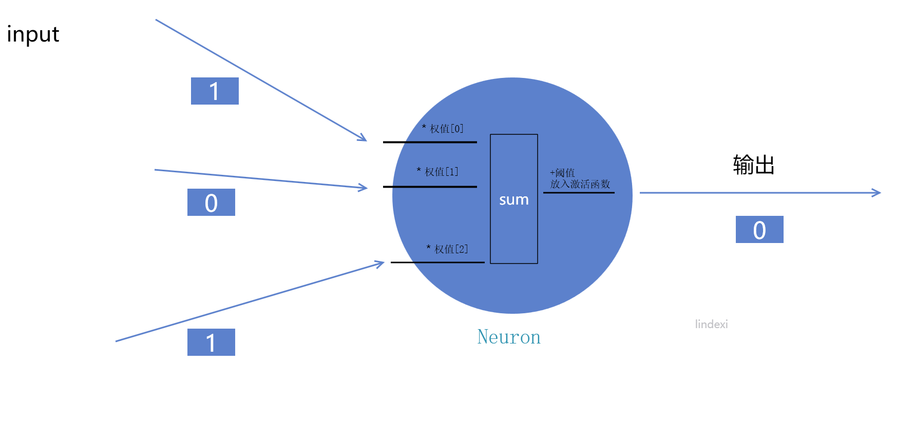
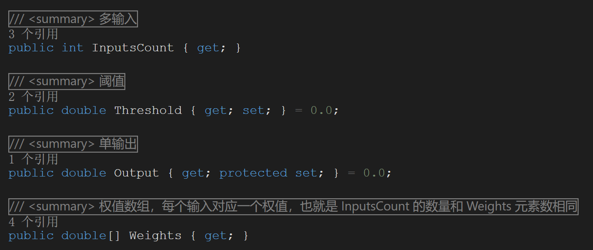

# dotnet 从零开始写一个人工智能 从一个神经元开始

现在小伙伴说的人工智能都是弱智能，可以基于神经网络来做。而神经网络是有多层网络，每一层网络都有多个神经元。那么最简单的神经网络就是只有一层，而这一层只有一个神经元，也就是整个神经网络只是有一个神经元。一个神经元可以用来做什么？可以用来做基础的与或逻辑运算器。在我没有告诉神经元与或的逻辑时，只是通过我传输的输入的值和输出的值，此时神经元经过训练就能自己学会与或的逻辑。本文就在不使用现成的人工智能框架下一步步和大家写这一个神经元和告诉大家这是如何运行的。本文特别适合小伙伴入门神经网络，或者适合小伙伴入手写代码

<!--more-->
<!-- CreateTime:2020/3/3 21:15:08 -->

<!-- 发布 -->

在所有逻辑开始之前，先要了解一下在代码可以如何组织。很多时候都不需要整个逻辑都了解就可以开始写代码了，一边写一边修改才是最具小项目效率的。在开始之前，先约定好本文要做的内容，本文就是来写一个神经网络，这个神经网络其实只有一个神经元而这个网络做的事情就是训练出一个 或 逻辑的计算库

什么是 或 运算呢？其实就是输入两个布尔值，只要存在一个值是 1 那么输出就是 1 除非两个输入都是 0 才能输出 0 的值。那么什么时布尔值呢？就是表示一个数字只有两个取值，在本文这里就使用 0 和 1 两个值。所以 或 运行就是输入两个值，这两个值要么是 0 要么是 1 而输出也相同

来小伙伴，请做一道初中学生题目。我有两个值 a 和 b 可以输入，这两个值要么是 0 要么是 1 的值，我的计算方式是将 a 乘以 x1 然后将 b 乘以 x2 再将这两个数值相加，最后加上 t 的值拿到结果放在 s 中。我要求如果输入的 a 和 b 中只要有一个是 1 那么要求 s 必须大于等于零。求 x1 和 x2 和 t 可以是什么数值

其实这个问题很简单，只要小伙伴稍微思考一下，带着这个问题继续往下看

可以列举出所有的输入和所有的输出的值

```
[0,0] = 0
[0,1] = 1
[1,0] = 1
[1,1] = 1
```

好，先定义一个数据结构，用于存放输入和输出的值

```csharp
    public class Data
    {
        public double[] Input { set; get; }
        public double Output { set; get; }
    }
```

在机器学习里面有一个概念是监督学习，监督学习就是我告诉你输入是什么和输出是什么，然后训练你，我不告诉你中间的逻辑，但是我要求你的输出和我要得输出尽可能相同。现在可以列举出所有的训练数据

```csharp
                var data = new[]
                {
                    new Data()
                    {
                        Input = new double[] {0, 0},
                        Output = 0
                    },
                    new Data()
                    {
                        Input = new double[] {0, 1},
                        Output = 1
                    },
                    new Data()
                    {
                        Input = new double[] {1, 0},
                        Output = 1
                    },
                    new Data()
                    {
                        Input = new double[] {1, 1},
                        Output = 1
                    },
                };
```

接下来就是正文部分了，刚才只是基础的数据定义和一些概念，同时测试一下你是否能看懂上面的代码，如果上面的代码连猜都不动，那么我推荐你点击上面的关闭按钮

基础的神经元可以做如下的定义

- 对每个输入都能添加一个权值
- 本身有一个阀值
- 有一个激活函数

对每个输入都能添加一个权值，在代码上就是有多少个输入就有多少个权值，然后将每个输入乘以自己的权值。将结果叠加起来，然后加上本身的阀值

此时拿到的值需要进行规约，也就是激活函数需要做的事情了，激活函数大概就是将上面的值进行约束然后输出

<!--  -->


好在有了定义之后就好玩了，代码里面需要包含一个叫输入的权重的，另外为了调试方便也顺便添加一个输入个数。也就是咱这个神经元是固定输入个数的，在创建出来的时候就知道输入有多少个啦。当然动态改变个数也可以，只是这样就复杂了一丁点啦

在 C# 中通过 class 定义类，恩，基本上会看我博客的小伙伴都会（写这句话这是瞬间我不知道写什么来着

```csharp
    /// <summary>
    /// 神经元
    /// </summary>
    public class Neuron
    {

    }
```

先包含输入的两个属性定义

```csharp
        /// <summary>
        /// 权值数组，每个输入对应一个权值，也就是 InputsCount 的数量和 Weights 元素数相同
        /// </summary>
        /// 在神经网络的每个元可以收到多个输入，而对每个输入需要使用不同的权值计算。此时对应每个输入一个权值，而输出只有一个
        public double[] Weights { get; }

        /// <summary>
        /// 多输入
        /// </summary>
        public int InputsCount { get; }
```

为了调试方便，顺便也加上一个输出的属性

```csharp
        /// <summary>
        /// 单输出
        /// </summary>
        public double Output { get; protected set; } = 0.0;
```

从上文也说到，除了输入和权重和输出外，还需要一个 阈值 请看代码

```csharp
        /// <summary>
        /// 阈值
        /// </summary>
        public double Threshold { get; set; } = 0.0;
```

那么一个简单的神经元的属性就定义完成了，核心的属性只有两个，也就是权重数组和阀值。而输入个数和输出这两个属性只是为了调试方便，可以在调试时看到状态而已

<!--  -->


定义好了之后，问题来了，请问初始的时候权重和阀值的值是多少呢？这个值我也不知道，那就随机给吧。随机的范围是多少为好，建议先用 [-1,1] 的范围，给定随机数范围可以写一个简单的帮助类

```csharp
    public class DoubleRange
    {
        public DoubleRange(double a, double b)
        {
            Max = Math.Max(a, b);
            Min = Math.Min(a, b);

            Length = Max - Min;
        }

        public double Length { get; }
        public double Max { get; }
        public double Min { get; }

        /// <summary>
        /// 返回在 Min 和 Max 的随机数
        /// </summary>
        /// <returns></returns>
        public double GetRan()
        {
            return Rand.NextDouble() * Length + Min;
        }

        /// <summary>
        /// 随机数生成器
        /// </summary>
        private static Random Rand { get; set; } = new Random();
    }
```

在神经元里面包含了让权重数组和阀值的值随机的方法

```csharp
        /// <summary>
        /// 初始化权值
        /// </summary>
        public void Randomize()
        {
            for (int i = 0; i < InputsCount; i++)
            {
                // 创建在 RandRange.Max 和 RandRange.Min 范围内的随机数
                Weights[i] = RandRange.GetRan();
            }

            Threshold = RandRange.GetRan();
        }
```

接下来就是最重要的神经元计算方法了，这个方法需要将传给这个元的输入进行处理，然后输出一个值

此时输入有多个，在代码中就是使用数组表示，输入个数在创建元的时候已经决定。在本文这里输入个数是 2 个。在经过了激活函数之后，要求输出只能是 0 或 1 中的一个值

```csharp
        public double Compute(double[] input)
        {
            double sum = 0.0;
            for (int i = 0; i < Weights.Length; i++)
            {
                sum += Weights[i] * input[i];
            }

            sum += Threshold;

            // 通过阈值函数将输出规约到 1 和 0 两个值
            var thresholdFunction = new ThresholdFunction();
            double output = thresholdFunction.Function(sum);
            Output = output;
            return output;
        }
```

计算方法就是将每个输入乘以每个输入对应的权值，然后求和。再加上阀值就拿到 sum 的值，接下来就是通过 阀值函数 将输出规约到 1 和 0 两个值。一个简单的阀值函数可以如何写？最简单就是判断所有小于零的就返回 0 其他返回 1 的值

```csharp
    public class ThresholdFunction
    {
        public double Function(double x)
        {
            return (x >= 0) ? 1 : 0;
        }
    }
```

其实此时一个模型就完成了，这个模型还是真能跑的模型，但是还缺少一步就是训练。训练是什么，虽然我有一个模型可以用来计算 或 计算，但是这个模型还没学会 或 是怎么算的，需要一个训练方法让他学会。最简单的训练方法就是每次输入，然后看这个模型的输出，如果输出和正确答案不同，那么让这个模型重新初始化，也就是让每个参数随意给一个

```csharp
    public class Learning
    {
        public Neuron Learn(Data[] data)
        {
            // 一个神经元就足够了
            var neuron = new Neuron(2);

            // 误差
            var error = double.MaxValue;
            var n = 0;

            while (error != 0)
            {
                n++;
                Debug.WriteLine($"第{n}次训练");
                error = 0;
                
                // 修改权值再来一次
                neuron.Randomize();
                foreach (var temp in data)
                {
                    var result = neuron.Compute(temp.Input);

                    // 将计算出来的结果和预期的相减去，就那到了误差
                    error += Math.Abs(temp.Output - result);
                }

            }

            return neuron;
        }
    }
```

从上面代码可以看到只要在每次的模型返回的值和正确答案相同时才会停止训练，否则就继续训练

到这里一个简单的人工智能就完成了，在没有告诉他如何作出 或 计算的逻辑，就依靠一堆随机的参数加上不断的训练告诉他输入是什么而他的输出是否是对的，就能让这个人工智能学会

等等，那么这个人工智能是怎么学会的，刚刚没有写出任何有玄学的代码

我选这个模型是想了很久的，因为这个模型能够让大家很快速的理解。是否还记得本文一开始的题目，没错，其实这个模型只是在求本文开始的题目的值。我的输入是固定的，刚好只有两个值。我要求只要其中一个值是 1 那么在进入阀值函数之前的值就是不小于零的

来列举一个超级简单的公式，这是一个小学的公式，我有 a 和 b 两个称为输入的变量，我还有两个固定的常量未知数 x1 和 x2 还有另一个未知数 t 然后我写出下面的计算方法

```csharp
sum = a * x1 + b * x2 + t
```

这里的 a 和 b 都是变量，可以选的数只有 0 或 1 的一个，要求其中有一个是 1 时，那么 sum 的值就不能小于 0 否则 sum 的值就必须小于 0 求上面三个未知数可以用哪些值

这个问题不难，因为只需要让 t 是负数，同时 t 的值小于 x1 和 x2 中最小的值，而 x1 和 x2 是两个大于零的值就可以

其实这就是 或 逻辑的一个计算方法

那么为什么这个人工智能知道呢？其实他也不知道，因为他只是刚好用随机数的值，而因为只要不是全部答案都对就不能跳出循环，所以反过来说的，能跳出循环也就是参数的值是对的。其实这是真正的计算机思想，如果我要返回一个 10 的数，我可以如何写，其实我可以写一个循环，循环跳出条件是值等于 10 而循环里面不断给值一个随机值，这样借助计算机强大的计算能力就能从一堆没有规律的值里面返回期望的值。或者说如何求 1000 以内 2 的倍数的数，用计算机的思想应该是遍历 1000 个数，如果某个数是 2 的倍数就返回这个数。而用一套有趣的数学方法提升性能的算法这个是数学的思想不是计算机的思想。但是人工智能是一个数学思想和计算机思想混合的思想做的

所以核心是什么？核心在于一个训练方法上。其实现在的很多人工智能计算就和随机猜是一样的，只是放在特定的领域里面加上训练方法限制了训练出来的人工智能对特定输入的正确性比较高

那么是不是我将这个模型复杂化一点，理论上我就作出如人脸识别等烂大街的人工智能工具了？答案是没错的，但是本文特别隐藏了一个细节，那就是属于核心的训练方法

一个复杂一点的神经网络模型，包含的元的数量一般不会太少，而一个元最简单也需要有一个权值参数，意味着需要有一堆参数是相互关联的值需要给出。那么这些参数给什么值好呢？如果都是随机给的，你算算平均需要有多少次，每加上一个元的计算量都是特别复杂的多的。所以现在的人工智能算法方面的一个方向就是提出一个更快的训练方法或者一个模型尽可能让这个模型强大但是需要的参数比较少

从本文也可以看到，基础的人工智能只有简单的逻辑处理，而如果想要作出有思维的人工智能我认为这条路是走不通的。你相信一堆点加上一堆权值是否就能作出智能来？其实相信或不相信都无所谓，因为现在问题在于思维是什么，能否用数学证明思维。或者如何证明某个东西存在思维都是问题。但现在其实有一个方法判定，就是鸭子方法。好像程序员都喜欢鸭子，如小黄鸭调试法。如果一个东西走路像鸭子，叫声像鸭子，那么这个东西就是鸭子

虽然我不知道思维是什么，但是如果一个东西表现和有思维一样，那么这个东西就是有思维

那么人类是否能作出带思维的机器？有一个可怕的证明方法是，先造出机器做的神经元然后逐步替换真的人的神经元一个个替换，请问替换到多少的时候这个人还有思维，是否全部替换之后他依然有思维

如果他依然有思维，那么将这些硬件用软件模拟，是否此时他的思维在计算机里面

逗比们不要担心，因为现在用机器做的神经元还是很难的，所以不要担心你被抓走。毕竟你也不知道你存在的世界是不是真的世界，因为在很久之前有个疯狂的科学家说，他做了一个鱼缸，然后将某个人的头放在鱼缸里面，用机器连接他的眼睛耳朵和触觉给他作出一个虚拟的世界。此时他就分不清他在什么世界了。不逗你了，有一句话是我思故我在，即使世界不是真的，但是现在你在思考这是没错的

在做思维部分会遇到很多玄学问题，研究这个方向的时间单位都是百年的，所以我的贡献大概就是告诉后来的小伙伴，这里有个逗比踩了这些坑，你不要踩了

刚才说到了玄学问题，其实本文说的玄学问题是这样定义

用一枚只有正面的硬币每次都能投出正面，这是现实。而用这枚硬币能投出反面，这是玄学。而科学是证明为什么能投出正面

我现在写的不是科学，有什么有趣的想法也可以告诉我，不管你想的有没依据。或者你有个好想法都是缺少一个程序员帮你写代码也可以叫我

而一个简单的人工智能模型请看 [dotnet 从零开始写一个人工智能](https://blog.lindexi.com/post/dotnet-%E4%BB%8E%E9%9B%B6%E5%BC%80%E5%A7%8B%E5%86%99%E4%B8%80%E4%B8%AA%E4%BA%BA%E5%B7%A5%E6%99%BA%E8%83%BD.html)

其实本文是我在写了一个超级简单的 Xamarin 应用，这个应用支持点击计算就算出输入的值进行或计算

<!--  -->


本文所有代码放在 [github](https://github.com/lindexi/lindexi_gd/tree/6ffd44b95d97f1956a2afb68a41b7443ff9eb6eb/JardalllojoHayeajemjuli) 这是一个 Xamarin 应用，下载之后的构建还需要一定的技术

有没有小伙伴需要科普一下 Xamarin 是什么？这是一个跨平台的技术，可以用来同时构建 Android 和 iOS 应用和桌面应用和 MAC 应用的技术。我现在用它写一个简单的人工智能就可以同时在 Android 和 Windows 上运行了

因为我用安卓模拟器加上 UWP 应用构建就可以在我设备上支持构建安卓和 Windows 应用了

如果有小伙伴看了本文就觉得自己写一个人工智能很简单，那么我必须道歉。我想要说一个一点都不权威的数据，在现在所有地球人出生之前就有一群智商用一个 int 都放不下的科学家在研究人工智能了，还是研究本文说的人工智能神经网络。而今年所有投入到研究的时间应该比你，哦不，我不是说你，我是说在座的各位的吃饭睡觉加起来的时间都要多

那人工智能有那么难？其实也不是，就像咱玩手机的时候需要了解手机是怎么做的？如果站在别人的键盘上，那么很简单就敲出一个人工智能来了，虽然这个应该说是人工智障才对。最快的应用上的方式是采用 ML.NET 这个完全开源的，跨平台也没问题的人工智能库了，使用方法超级简单，至少入门是超级简单的。如何入门还请看国庆大佬的博客 [ML.NET技术研究系列-1入门篇 - Eric zhou - 博客园](https://www.cnblogs.com/tianqing/p/11071864.html) 和队长的博客 [.NET开发人员如何开始使用ML.NET - 张善友 - 博客园](https://www.cnblogs.com/shanyou/p/10890949.html)

<a rel="license" href="http://creativecommons.org/licenses/by-nc-sa/4.0/"></a><br />本作品采用<a rel="license" href="http://creativecommons.org/licenses/by-nc-sa/4.0/">知识共享署名-非商业性使用-相同方式共享 4.0 国际许可协议</a>进行许可。欢迎转载、使用、重新发布，但务必保留文章署名[林德熙](http://blog.csdn.net/lindexi_gd)(包含链接:http://blog.csdn.net/lindexi_gd )，不得用于商业目的，基于本文修改后的作品务必以相同的许可发布。如有任何疑问，请与我[联系](mailto:lindexi_gd@163.com)。
