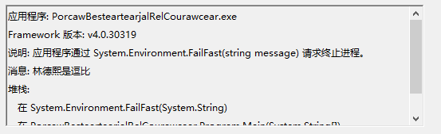

# dotnet 使用 Environment.FailFast 结束程序

在运行到一些诡异的代码，这时的程序已经无法继续运行，需要退出，那么如何在记完日志之后在退出程序记录更多信息？可以通过 Environment.FailFast 里面添加字符串告诉用户当前的进程无法继续运行

<!--more-->
<!-- CreateTime:2019/8/31 16:55:58 -->


在 dotnet 中有 Environment.FailFast 可以用来表示程序无法继续使用需要退出，这个方法和 Exit 不一样的是可以传入字符串

如判断因为林德熙逗比无法继续运行

```csharp
                if (str == "林德熙是逗比")
                {
                    Environment.FailFast(str);
                }
```

这时程序退出，可以在 Windows 日志里面的应用程序找到这个信息

<!--  -->


通过这个方法不仅可以记日志，还可以自动创建一个 DUMP 文件，至于这个 DUMP 放在哪里，请看[win10 uwp 收集 DUMP 文件](https://lindexi.gitee.io/post/win10-uwp-%E6%94%B6%E9%9B%86-DUMP-%E6%96%87%E4%BB%B6.html )

同时这个方法调用的时候 finally 里面的代码是无法执行的

```csharp
            string str = "林德熙是逗比";
            try
            {
                if (str == "林德熙是逗比")
                {
                    Environment.FailFast(str);
                }
            }
            finally
            {
                Console.WriteLine("其实这个代码不会运行");
            } 
```

运行上面的代码是不会看到 finally 的输出

[Environment.FailFast](https://docs.microsoft.com/en-us/dotnet/api/system.environment.failfast?redirectedfrom=MSDN&view=netframework-4.7.2#System_Environment_FailFast_System_String_ )

<a rel="license" href="http://creativecommons.org/licenses/by-nc-sa/4.0/"></a><br />本作品采用<a rel="license" href="http://creativecommons.org/licenses/by-nc-sa/4.0/">知识共享署名-非商业性使用-相同方式共享 4.0 国际许可协议</a>进行许可。欢迎转载、使用、重新发布，但务必保留文章署名[林德熙](http://blog.csdn.net/lindexi_gd)(包含链接:http://blog.csdn.net/lindexi_gd )，不得用于商业目的，基于本文修改后的作品务必以相同的许可发布。如有任何疑问，请与我[联系](mailto:lindexi_gd@163.com)。 
