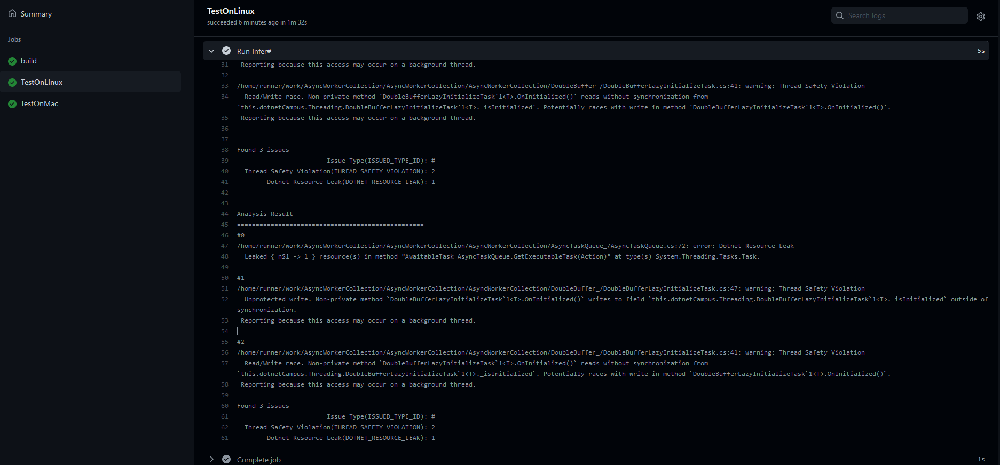

# dotnet 使用 Infer# 自动分析代码缺陷

本文告诉大家如何使用 Infer# 开源库配合 GitHub 的 Action 实现自动分析代码缺陷，如找到可空引用或线程安全等问题

<!--more-->
<!-- CreateTime:2021/11/19 19:39:33 -->

<!-- 发布 -->
<!-- 博客 -->

这是一个在 GitHub 上完全开源的仓库，请看 [https://github.com/microsoft/infersharp](https://github.com/microsoft/infersharp)

刚好今天收到了 Infer# 发布 1.2 版本博客，请看 [Infer# v1.2: Interprocedural Memory Safety Analysis For C# - .NET Blog](https://devblogs.microsoft.com/dotnet/infer-v1-2-interprocedural-memory-safety-analysis-for-c/ )

关于 GitHub 的 Action 的基础入门请看 [dotnet 部署 github 的 Action 进行持续集成](https://blog.lindexi.com/post/dotnet-%E9%83%A8%E7%BD%B2-github-%E7%9A%84-Action-%E8%BF%9B%E8%A1%8C%E6%8C%81%E7%BB%AD%E9%9B%86%E6%88%90.html )

使用的方法非常简单，只需要在 GitHub 的 Action 的配置文件里面添加如下代码

```yml
    - name: Run Infer#      
      uses: microsoft/infersharpaction@v1.2
      with:
        binary-path: 输出二进制文件夹路径
```

如我在 [https://github.com/dotnet-campus/AsyncWorkerCollection](https://github.com/dotnet-campus/AsyncWorkerCollection) 开源仓库上的配置代码如下

```yml
    - name: Run Infer#      
      uses: microsoft/infersharpaction@v1.2
      with:
        binary-path: AsyncWorkerCollection/bin/Release/netcoreapp3.1
```

此输出的二进制文件夹路径里面要求是包含 dll 和 pdb 文件，通过 dll 进行分析，通过 pdb 从而告诉你是哪个文件

效果如下

<!--  -->


可以看到输出了资源没有释放和线程安全问题

```
Found 3 issues
                        Issue Type(ISSUED_TYPE_ID): #
  Thread Safety Violation(THREAD_SAFETY_VIOLATION): 2
        Dotnet Resource Leak(DOTNET_RESOURCE_LEAK): 1


Analysis Result
==================================================
#0
/home/runner/work/AsyncWorkerCollection/AsyncWorkerCollection/AsyncWorkerCollection/AsyncTaskQueue_/AsyncTaskQueue.cs:72: error: Dotnet Resource Leak
  Leaked { n$1 -> 1 } resource(s) in method "AwaitableTask AsyncTaskQueue.GetExecutableTask(Action)" at type(s) System.Threading.Tasks.Task.

#1
/home/runner/work/AsyncWorkerCollection/AsyncWorkerCollection/AsyncWorkerCollection/DoubleBuffer_/DoubleBufferLazyInitializeTask.cs:47: warning: Thread Safety Violation
  Unprotected write. Non-private method `DoubleBufferLazyInitializeTask`1<T>.OnInitialized()` writes to field `this.dotnetCampus.Threading.DoubleBufferLazyInitializeTask`1<T>._isInitialized` outside of synchronization.
 Reporting because this access may occur on a background thread.

#2
/home/runner/work/AsyncWorkerCollection/AsyncWorkerCollection/AsyncWorkerCollection/DoubleBuffer_/DoubleBufferLazyInitializeTask.cs:41: warning: Thread Safety Violation
  Read/Write race. Non-private method `DoubleBufferLazyInitializeTask`1<T>.OnInitialized()` reads without synchronization from `this.dotnetCampus.Threading.DoubleBufferLazyInitializeTask`1<T>._isInitialized`. Potentially races with write in method `DoubleBufferLazyInitializeTask`1<T>.OnInitialized()`.
 Reporting because this access may occur on a background thread.

Found 3 issues
                        Issue Type(ISSUED_TYPE_ID): #
  Thread Safety Violation(THREAD_SAFETY_VIOLATION): 2
        Dotnet Resource Leak(DOTNET_RESOURCE_LEAK): 1
```

此工具只能在 Linux 下运行，官方有制作好一个 docker 文件，可以从 [https://github.com/microsoft/infersharpaction](https://github.com/microsoft/infersharpaction) 拉到。但是问题不大，因为此工具是对输出文件进行分析的，所以可以在 Windows 平台上进行构建，只是将输出的二进制文件使用此工具

在现有的仓库加添加此工具的例子请看 [https://github.com/dotnet-campus/AsyncWorkerCollection/pull/66](https://github.com/dotnet-campus/AsyncWorkerCollection/pull/66)

<a rel="license" href="http://creativecommons.org/licenses/by-nc-sa/4.0/"></a><br />本作品采用<a rel="license" href="http://creativecommons.org/licenses/by-nc-sa/4.0/">知识共享署名-非商业性使用-相同方式共享 4.0 国际许可协议</a>进行许可。欢迎转载、使用、重新发布，但务必保留文章署名[林德熙](http://blog.csdn.net/lindexi_gd)(包含链接:http://blog.csdn.net/lindexi_gd )，不得用于商业目的，基于本文修改后的作品务必以相同的许可发布。如有任何疑问，请与我[联系](mailto:lindexi_gd@163.com)。
