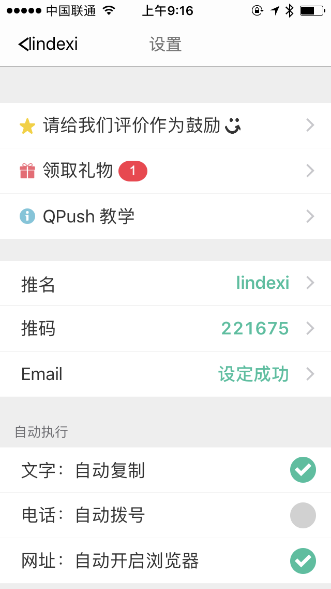
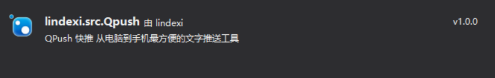
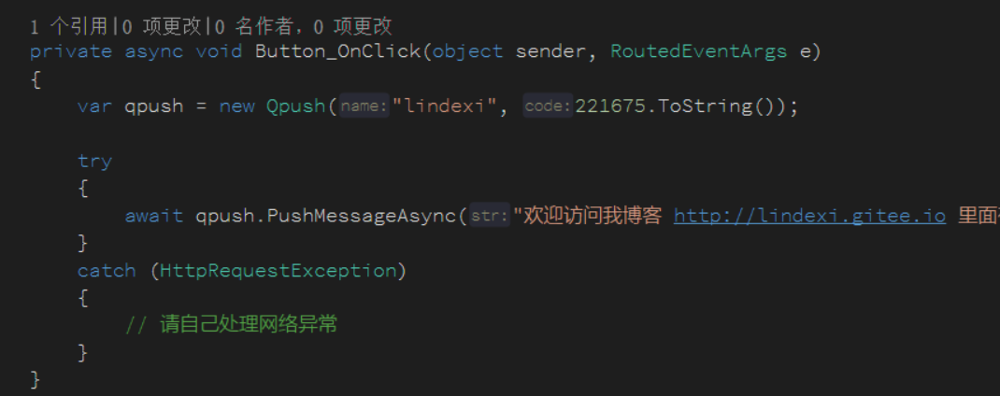
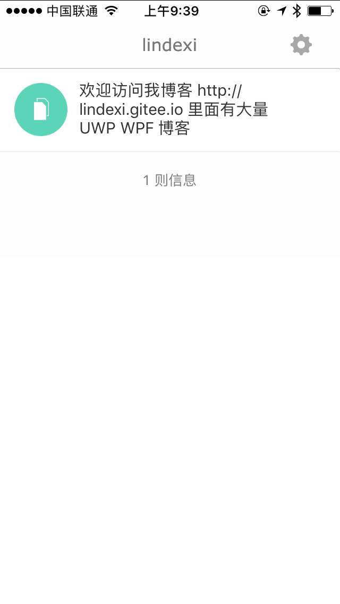
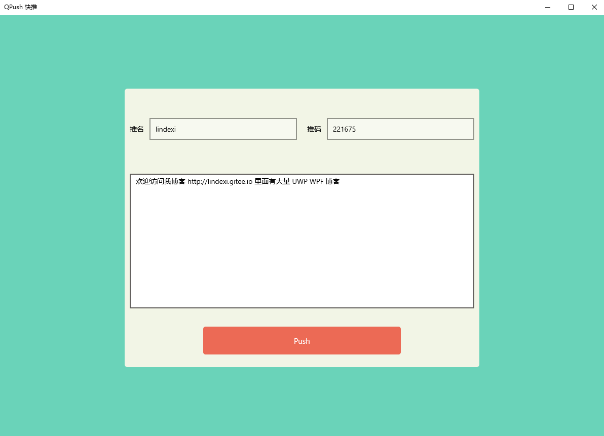

# dotnet 使用 Qpush 快速从电脑到手机推送文字

在手机打字总不是方便，于是就有了 Qpush 这个工具，通过这个工具可以快速从电脑到手机推送文字。

但是这个工具没有找到客户端，于是我就给他写了一个库，通过这个库可以快速进行开发

<!--more-->
<!-- CreateTime:2019/11/29 8:58:57 -->

<!-- 标签：csharp,wpf,dotnetcore,uwp,源代码 -->

先介绍[QPush 快推](https://qpush.me/zh_cn/ )这个从电脑到手机最方便的文字推送工具，可以在网页进行输入，在手机自动复制到剪贴板，相当于在手机使用电脑的输入法

在使用之前需要手机安装客户端

IOS ： https://itunes.apple.com/cn/app/qpush-kuai-tui-cong-dian-nao/id776837597

安卓： 各个应用商店下载

然后打开网页[网页推送](https://qpush.me/zh_cn/push/ )输入推名和推码然后输入内容就可以发送到手机

<!--  -->


但是这个工具有一个缺点就是没有 Windows 客户端，于是我就先做了一个轮子

[](https://www.nuget.org/packages/lindexi.src.Qpush/)

通过抓包知道了浏览器是如何发送，然后创建了一个 nuget 库，只需要通过下面的使用方法就可以使用这个工具

创建一个空白项目，通过 Nuget 安装 lindexi.src.Qpush 注意项目需要使用 dotnet framework 4.5 以上和 dotnet core 2.1 以上

<!--  -->


安装之后就可以通过下面代码从电脑输入内容

```csharp

using lindexi.src;

            var qpush = new Qpush("lindexi", 221675.ToString());

            try
            {
                await qpush.PushMessageAsync("欢迎访问我博客 http://lindexi.gitee.io 里面有大量 UWP WPF 博客");
            }
            catch (HttpRequestException e)
            {
                // 请自己处理网络异常
            }
        
```

现在调用这个代码，尝试在前台放一个按钮，在按钮点击的时候调用上面代码

注意 请将上面的推名和推码修改为你自己的推名和推码

<!--  -->


此时就可以看到手机收到信息

<!--  -->


这个工具做起来难度很低，但是我做出了一个 dll 库，虽然这个库里面就只有一个类

于是根据这个库做出了一个 UWP 的应用，可以在应用商店搜 Qpush 下载，或者[点击](https://www.microsoft.com/store/productId/9MTV8FSB7HX9)下载

<!--  -->


如果想要看 UWP 的源代码，请到 [github](https://github.com/lindexi/UWP/tree/fc9a10c6db9ec3f4f9396134ff4e4246c6cccab9/uwp/src/CipuPursur) 如果发现代码有哪里不清真，欢迎联系

如果觉得直接引用这个库会输出一个 dll 希望放在自己的程序里面，不需要手动去复制下面的源代码，只需要修改 Nuget 包为 [lindexi.src.Qpush.Source](https://www.nuget.org/packages/lindexi.src.Qpush.Source ) 就可以。

这里的 [lindexi.src.Qpush.Source](https://www.nuget.org/packages/lindexi.src.Qpush.Source ) 是一个源代码包，使用 [SourceYard](https://github.com/dotnet-campus/SourceYard ) 做的源代码，安装这个库和复制下面的源代码到自己的项目里面差不多。但是要安装 lindexi.src.Qpush.Source 需要使用 [VS2017 新项目格式](https://blog.lindexi.com/post/%E4%BB%8E%E4%BB%A5%E5%89%8D%E7%9A%84%E9%A1%B9%E7%9B%AE%E6%A0%BC%E5%BC%8F%E8%BF%81%E7%A7%BB%E5%88%B0-VS2017-%E6%96%B0%E9%A1%B9%E7%9B%AE%E6%A0%BC%E5%BC%8F.html )才可以

```csharp
using System;
using System.Net.Http;
using System.Text;
using System.Threading.Tasks;

namespace lindexi.src
{
    /// <summary>
    /// QPush 快推 从电脑到手机最方便的文字推送工具
    /// </summary>
    public class Qpush
    {
        public Qpush(string name, string code)
        {
            if (name == null) throw new ArgumentNullException(nameof(name));
            if (code == null) throw new ArgumentNullException(nameof(code));

            if (string.IsNullOrEmpty(name))
            {
                throw new ArgumentNullException("name 不能为空");
            }

            if (string.IsNullOrEmpty(code))
            {
                throw new ArgumentNullException("code 不能为空");
            }

            Name = name;
            Code = code;
        }

        /// <summary>
        /// 推名
        /// </summary>
        public string Name { get; }

        /// <summary>
        /// 推码
        /// </summary>
        public string Code { get; }

        /// <summary>
        /// 推送信息
        /// </summary>
        public async Task<string> PushMessageAsync(string str)
        {
            const string url = "https://qpush.me/pusher/push_site/";

            var httpClient = new HttpClient();

            httpClient.DefaultRequestHeaders.UserAgent.ParseAdd(
                "Mozilla/5.0 (Windows NT 10.0; Win64; x64) AppleWebKit/537.36 (KHTML, like Gecko) Chrome/71.0.3578.98 Safari/537.36");

            HttpContent content =
                new StringContent(
                    $"name={Uri.EscapeUriString(Name)}&code={Uri.EscapeUriString(Code)}&sig=&cache=false&msg%5Btext%5D={Uri.EscapeUriString(str)}",
                    Encoding.UTF8, "application/x-www-form-urlencoded");
            var code = await (await httpClient.PostAsync(url, content)).Content.ReadAsStringAsync();

            return code;
        }
    }
}
```

<a rel="license" href="http://creativecommons.org/licenses/by-nc-sa/4.0/"></a><br />本作品采用<a rel="license" href="http://creativecommons.org/licenses/by-nc-sa/4.0/">知识共享署名-非商业性使用-相同方式共享 4.0 国际许可协议</a>进行许可。欢迎转载、使用、重新发布，但务必保留文章署名[林德熙](http://blog.csdn.net/lindexi_gd)(包含链接:http://blog.csdn.net/lindexi_gd )，不得用于商业目的，基于本文修改后的作品务必以相同的许可发布。如有任何疑问，请与我[联系](mailto:lindexi_gd@163.com)。
