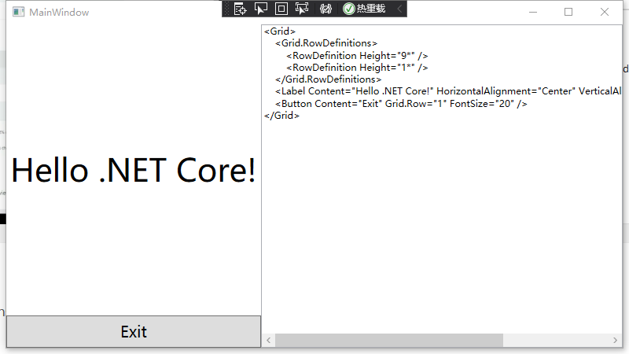

# dotnet 使用 ShowMeTheXAML 显示 WPF 的 XAML 控件内容

本文来告诉大家一个好用的控件库，这个控件库可以方便用在自己编写示例项目中使用。使用 ShowMeTheXAML 控件库可以将某段 XAML 内容作为字符串文本内容显示出来，方便让其他开发者看到界面以及对应的内容

<!--more-->
<!-- 发布 -->

此控件库 ShowMeTheXAML 不仅支持 WPF 同时也支持 UNO 项目

使用此控件的界面逻辑大概如下

```xml
  <showMeTheXaml:XamlDisplay UniqueKey="SomeUniqueString">
    <Grid>
      <Grid.RowDefinitions>
        <RowDefinition Height="9*"/>
        <RowDefinition Height="1*"/>
      </Grid.RowDefinitions>
      <Label Content="Hello .NET Core!" HorizontalAlignment="Center" VerticalAlignment="Center"
             FontSize="40"/>
      <Button Content="Exit" Grid.Row="1" FontSize="20" />
    </Grid>
  </showMeTheXaml:XamlDisplay>
```

界面显示效果如下

<!--  -->


可以看到在界面将写在 XamlDisplay 控件里面的代码显示出来，这样就方便库的开发者提供示例项目给其他开发者阅读，可以看到界面逻辑

以下是使用方法，通过 NuGet 安装以下三个库

- ShowMeTheXAML
- ShowMeTheXAML.MSBuild
- ShowMeTheXAML.AvalonEdit

如果使用新的 csproj 项目格式，可以在 csproj 添加如下代码

```xml
  <ItemGroup>
    <PackageReference Include="ShowMeTheXAML.AvalonEdit" Version="2.0.0" />
    <PackageReference Include="ShowMeTheXAML.MSBuild" Version="2.0.0" />
    <PackageReference Include="ShowMeTheXAML" Version="2.0.0" />
  </ItemGroup>
```

打开 App.xaml.cs 文件，添加如下代码

```csharp
        protected override void OnStartup(StartupEventArgs e)
        {
            XamlDisplay.Init();
            base.OnStartup(e);
        }
```

可以看到 App.xaml.cs 文件内容如下

```csharp
    public partial class App : Application
    {
        protected override void OnStartup(StartupEventArgs e)
        {
            XamlDisplay.Init();
            base.OnStartup(e);
        }
    }
```

接着在需要使用 XamlDisplay 的界面添加命名空间

```xml
        xmlns:showMeTheXaml="clr-namespace:ShowMeTheXAML;assembly=ShowMeTheXAML"
```

如我的 MainWindow.xaml 代码

```xml
<Window x:Class="GihihenalbemHemkearcurearcu.MainWindow"
        xmlns="http://schemas.microsoft.com/winfx/2006/xaml/presentation"
        xmlns:x="http://schemas.microsoft.com/winfx/2006/xaml"
        xmlns:d="http://schemas.microsoft.com/expression/blend/2008"
        xmlns:mc="http://schemas.openxmlformats.org/markup-compatibility/2006"
        xmlns:local="clr-namespace:GihihenalbemHemkearcurearcu"
        xmlns:showMeTheXaml="clr-namespace:ShowMeTheXAML;assembly=ShowMeTheXAML"
        mc:Ignorable="d"
        Title="MainWindow" Height="450" Width="800">
  <showMeTheXaml:XamlDisplay UniqueKey="SomeUniqueString">
    <Grid>
      <Grid.RowDefinitions>
        <RowDefinition Height="9*"/>
        <RowDefinition Height="1*"/>
      </Grid.RowDefinitions>
      <TextBlock Text="Hello .NET Core!" HorizontalAlignment="Center" VerticalAlignment="Center"/>
      <Button Content="Exit" Grid.Row="1" FontSize="20" />
    </Grid>
  </showMeTheXaml:XamlDisplay>
</Window>
```

这个控件库在 GitHub 上完全开源，请看 [https://github.com/Keboo/ShowMeTheXAML](https://github.com/Keboo/ShowMeTheXAML)

<a rel="license" href="http://creativecommons.org/licenses/by-nc-sa/4.0/"></a><br />本作品采用<a rel="license" href="http://creativecommons.org/licenses/by-nc-sa/4.0/">知识共享署名-非商业性使用-相同方式共享 4.0 国际许可协议</a>进行许可。欢迎转载、使用、重新发布，但务必保留文章署名[林德熙](http://blog.csdn.net/lindexi_gd)(包含链接:http://blog.csdn.net/lindexi_gd )，不得用于商业目的，基于本文修改后的作品务必以相同的许可发布。如有任何疑问，请与我[联系](mailto:lindexi_gd@163.com)。
