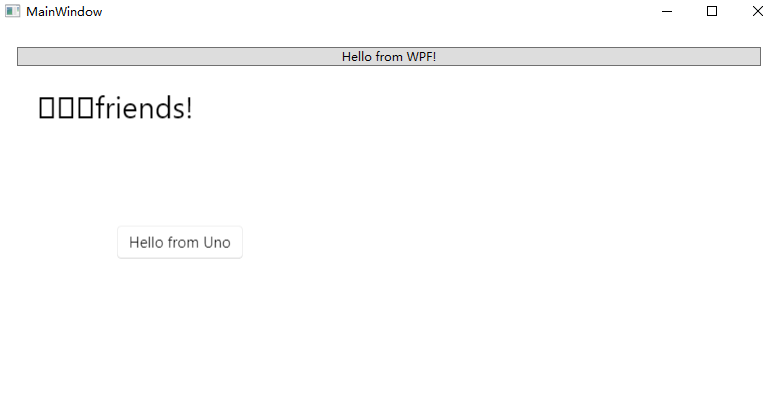
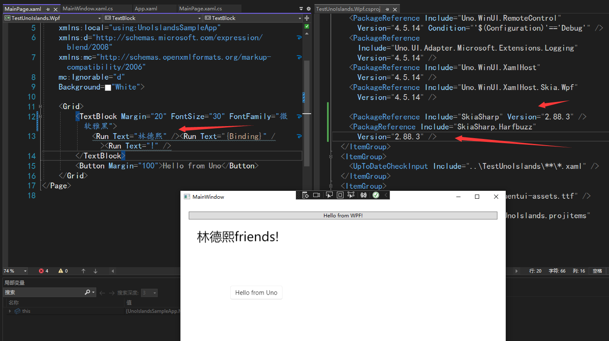

# dotnet 修复 Uno 中文乱码

这是一个历史问题，在使用 Uno 展示中文的时候，如果设置 Uno 的底层使用 Skia 系进行渲染，那么将会因为中文字体问题，导致渲染出现乱码。此问题已被我修复，最佳解法是更新到最新版本

<!--more-->
<!-- 发布 -->
<!-- 博客 -->

在上一篇博客 [使用 Uno Islands 在现有 WPF 里面嵌入 Uno 框架](https://blog.lindexi.com/post/%E4%BD%BF%E7%94%A8-Uno-Islands-%E5%9C%A8%E7%8E%B0%E6%9C%89-WPF-%E9%87%8C%E9%9D%A2%E5%B5%8C%E5%85%A5-Uno-%E6%A1%86%E6%9E%B6.html ) 我在 WPF 里面嵌入了 Uno 应用，但是我发现 TextBlock 无法正常输入中文，如果输入了中文，那将会显示乱码，如下图

<!--  -->


我的代码如下

```xml
    <Grid>
        <TextBlock Margin="20" FontSize="30">
            <Run Text="林德熙" /><Run Text="{Binding}" /><Run Text="!" />
        </TextBlock>
        <Button Margin="100">Hello from Uno</Button>
    </Grid>
```

以上的代码放在[github](https://github.com/lindexi/lindexi_gd/tree/08c2d7c8da65ffbb1d873a9f4fdb21304a9c2688/TestUnoIslands) 和 [gitee](https://gitee.com/lindexi/lindexi_gd/tree/08c2d7c8da65ffbb1d873a9f4fdb21304a9c2688/TestUnoIslands) 欢迎访问

可以通过如下方式获取本文的源代码，先创建一个空文件夹，接着使用命令行 cd 命令进入此空文件夹，在命令行里面输入以下代码，即可获取到本文的代码

```
git init
git remote add origin https://gitee.com/lindexi/lindexi_gd.git
git pull origin 08c2d7c8da65ffbb1d873a9f4fdb21304a9c2688
```

以上使用的是 gitee 的源，如果 gitee 不能访问，请替换为 github 的源。请在命令行继续输入以下代码

```
git remote remove origin
git remote add origin https://github.com/lindexi/lindexi_gd.git
git pull origin 08c2d7c8da65ffbb1d873a9f4fdb21304a9c2688
```

获取代码之后，进入 TestUnoIslands 文件夹


此问题的核心原因如 [WPF 解决 Skia 因为找不到字体而绘制不出中文字符](https://blog.lindexi.com/post/WPF-%E8%A7%A3%E5%86%B3-Skia-%E5%9B%A0%E4%B8%BA%E6%89%BE%E4%B8%8D%E5%88%B0%E5%AD%97%E4%BD%93%E8%80%8C%E7%BB%98%E5%88%B6%E4%B8%8D%E5%87%BA%E4%B8%AD%E6%96%87%E5%AD%97%E7%AC%A6.html ) 所描述，这是因为在 SkiaSharp 里面使用平台调用的时候，传入的中文字体名采用的是 C# 默认的 UTF16 编码。然而在 Skia 里面，期望的字符串编码采用的是 UTF8 编码。这就导致了咱给的中文的字体名，将不会被 Skia 底层识别，从而找不到字体

详细请参阅 [[BUG] sk_fontmgr_match_family_style must input family name argument by utf8 string · Issue #1914 · mono/SkiaSharp](https://github.com/mono/SkiaSharp/issues/1914 )

此问题也有伙伴反馈给 Uno 官方，请看 [Uno with Wpf Chinese code display messy code · Issue #6973 · unoplatform/uno](https://github.com/unoplatform/uno/issues/6973 )

而在 SkiaSharp 里面，此问题已经被我修复，感谢 [lsj](https://blog.sdlsj.net) 帮我调查和提供解决方法。此修复代码已经被合入 SkiaSharp 里，跟随 2.88.3 版本发布。也就是说修复此问题，那只需要更新 SkiaSharp 到 2.88.3 或更高版本

而在 Uno 里面，也更新了依赖的 SkiaSharp 到 2.88.3 版本，详细请看 [chore: Bump to skiasharp 2.88.3 by jeromelaban · Pull Request #10261 · unoplatform/uno](https://github.com/unoplatform/uno/pull/10261 )

也就说只需要将 Uno 更新到最新版本即可修复此问题

如果自己的 Uno 不方便更新，也可以根据 [Uno 官方文档](https://platform.uno/docs/articles/features/using-skia-gtk.html?q=skiasharp#upgrading-to-a-later-version-of-skiasharp) 单独更新 SkiaSharp 的版本。更新方法如下，编辑 csproj 项目文件，添加 SkiaSharp 和 SkiaSharp.Harfbuzz 的引用最新版本，如下面代码

```xml
    <PackageReference Include="SkiaSharp" Version="2.88.3" />
    <PackagReference Include="SkiaSharp.Harfbuzz" Version="2.88.3" />
```

这是我编辑后的 csproj 项目文件，可以提供给大家参考

```xml
<Project Sdk="Microsoft.NET.Sdk">

  <PropertyGroup>
    <OutputType>WinExe</OutputType>
    <TargetFramework>net6.0-windows</TargetFramework>
    <Nullable>enable</Nullable>
    <UseWPF>true</UseWPF>
  </PropertyGroup>

  <ItemGroup>
    <PackageReference Include="Microsoft.Extensions.Logging" Version="6.0.0" />
    <PackageReference Include="Microsoft.Extensions.Logging.Console" Version="6.0.0" />
    <PackageReference Include="Uno.WinUI.Skia.Wpf" Version="4.5.14" />
    <PackageReference Include="Uno.WinUI.RemoteControl" Version="4.5.14" Condition="'$(Configuration)'=='Debug'" />
    <PackageReference Include="Uno.UI.Adapter.Microsoft.Extensions.Logging" Version="4.5.14" />
    <PackageReference Include="Uno.WinUI.XamlHost" Version="4.5.14" />
    <PackageReference Include="Uno.WinUI.XamlHost.Skia.Wpf" Version="4.5.14" />

    <PackageReference Include="SkiaSharp" Version="2.88.3" />
    <PackagReference Include="SkiaSharp.Harfbuzz" Version="2.88.3" />
  </ItemGroup>
  <ItemGroup>
    <UpToDateCheckInput Include="..\TestUnoIslands\**\*.xaml" />
  </ItemGroup>
  <ItemGroup>
    <Content Include="Assets\Fonts\uno-fluentui-assets.ttf" />
  </ItemGroup>
  <Import Project="..\TestUnoIslands\TestUnoIslands.projitems" Label="Shared" />

</Project>
```

在更新完成 Uno 和 SkiaSharp 之后，还需要给定一个中文字体名，否则也许会因为 Skia 选用的默认字体不支持中文而乱码

```xml
        <TextBlock Margin="20" FontSize="30" FontFamily="微软雅黑">
            <Run Text="林德熙" /><Run Text="{Binding}" /><Run Text="!" />
        </TextBlock>
```

如此即可解决问题

我更改之后，可以看到如下界面，可以看到中文可以显示

<!--  -->


我更改后的代码也放在[github](https://github.com/lindexi/lindexi_gd/tree/613b6ec4fc7650fba9af341a090b653899d5cb63/TestUnoIslands) 和 [gitee](https://gitee.com/lindexi/lindexi_gd/tree/613b6ec4fc7650fba9af341a090b653899d5cb63/TestUnoIslands) 欢迎访问

可以通过如下方式获取本文的源代码，先创建一个空文件夹，接着使用命令行 cd 命令进入此空文件夹，在命令行里面输入以下代码，即可获取到本文的代码

```
git init
git remote add origin https://gitee.com/lindexi/lindexi_gd.git
git pull origin 613b6ec4fc7650fba9af341a090b653899d5cb63
```

以上使用的是 gitee 的源，如果 gitee 不能访问，请替换为 github 的源。请在命令行继续输入以下代码

```
git remote remove origin
git remote add origin https://github.com/lindexi/lindexi_gd.git
git pull origin 613b6ec4fc7650fba9af341a090b653899d5cb63
```

获取代码之后，进入 TestUnoIslands 文件夹

