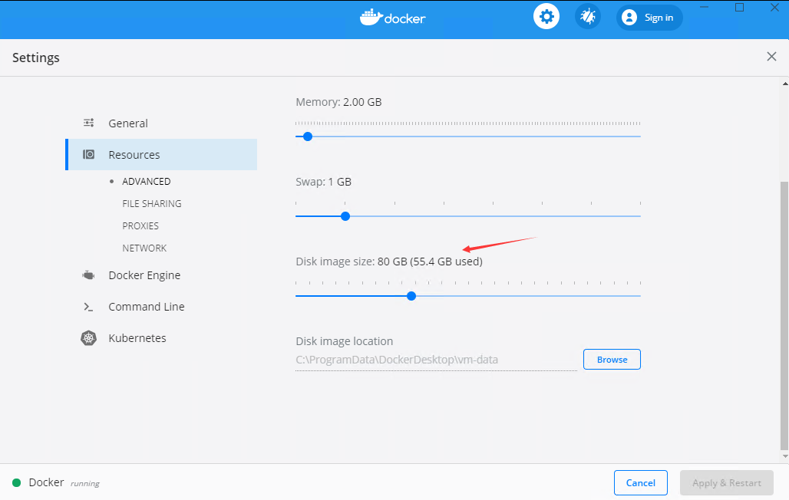

# dotnet 制作 docker 提示 Insufficient space in download directory 磁盘空间不足

随着 .NET 5 的发布，我在给团队内部打一个特殊的 .NET 5 的 docker image 过程，发现了提示 Insufficient space in download directory 磁盘空间不足

<!--more-->
<!-- CreateTime:2020/11/17 20:04:49 -->


在执行命令行时可以看到如下提示内容

```
Step 3/7 : RUN yum update
 ---> Running in 5069e0aebc60
Loaded plugins: fastestmirror, ovl
Determining fastest mirrors


 One of the configured repositories failed (Unknown),
 and yum doesn't have enough cached data to continue. At this point the only
 safe thing yum can do is fail. There are a few ways to work "fix" this:

     1. Contact the upstream for the repository and get them to fix the problem.

     2. Reconfigure the baseurl/etc. for the repository, to point to a working
        upstream. This is most often useful if you are using a newer
        distribution release than is supported by the repository (and the
        packages for the previous distribution release still work).

     3. Run the command with the repository temporarily disabled
            yum --disablerepo=<repoid> ...

     4. Disable the repository permanently, so yum won't use it by default. Yum
        will then just ignore the repository until you permanently enable it
        again or use --enablerepo for temporary usage:

            yum-config-manager --disable <repoid>
        or
            subscription-manager repos --disable=<repoid>

     5. Configure the failing repository to be skipped, if it is unavailable.
        Note that yum will try to contact the repo. when it runs most commands,
        so will have to try and fail each time (and thus. yum will be be much
        slower). If it is a very temporary problem though, this is often a nice
        compromise:

            yum-config-manager --save --setopt=<repoid>.skip_if_unavailable=true

Insufficient space in download directory /var/cache/yum/x86_64/7/base
    * free   0
    * needed 100 k
The command '/bin/sh -c yum update' returned a non-zero code: 1
```

解决方法就是修改磁盘空间

<!--  -->


<a rel="license" href="http://creativecommons.org/licenses/by-nc-sa/4.0/"></a><br />本作品采用<a rel="license" href="http://creativecommons.org/licenses/by-nc-sa/4.0/">知识共享署名-非商业性使用-相同方式共享 4.0 国际许可协议</a>进行许可。欢迎转载、使用、重新发布，但务必保留文章署名[林德熙](http://blog.csdn.net/lindexi_gd)(包含链接:http://blog.csdn.net/lindexi_gd )，不得用于商业目的，基于本文修改后的作品务必以相同的许可发布。如有任何疑问，请与我[联系](mailto:lindexi_gd@163.com)。
