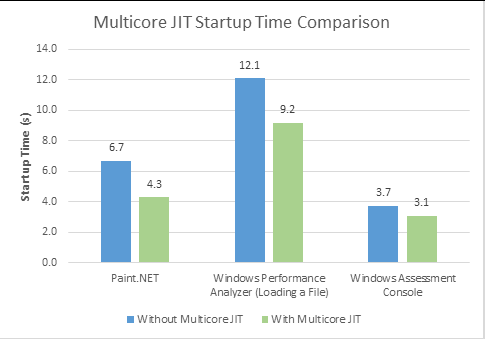

# dotnet 启动 JIT 多核心编译提升启动性能

用2分钟提升十分之一的启动性能，通过在桌面程序启动 JIT 多核心编译提升启动性能

在 dotnet 可以通过让 JIT 进行多核心编译提升软件的启动性能，在默认托管的 ASP.NET 程序是开启的，对 WPF 等桌面程序需要手动开启

<!--more-->
<!-- CreateTime:2019/8/31 16:55:58 -->


在 Main 函数或 App 的构造函数添加下面代码可以开启

```csharp
using System.Runtime;


            ProfileOptimization.SetProfileRoot(@"C:\lindexi\");
            ProfileOptimization.StartProfile("Startup.Profile");
```

在 SetProfileRoot 设置一个文件夹，这个文件夹需要是已经存在文件夹，如果设置到一个不存在的文件夹，那么这个方法也不会出现异常，只是什么都不会做

在StartProfile设置一个文件名，将会在这个文件记录启动的时候需要调用的函数

## 原理

在可以进行多线程计算的设备，可以通过一个线程运行代码，多个线程进行 JIT 编译，提高性能。

在 SetProfileRoot 设置一个文件夹，将会在这个文件夹存放用于提升性能的文件，在 StartProfile 将会创建一个二进制文件记录在启动的时候需要调用的函数

在第一次运行程序的时候，会判断是否存在提升性能的文件，如果不存在就在启动的时候后台收集需要调用的函数，将这些函数记在提升性能的文件。

在第二次运行程序的时候，因为已经存在提升性能的文件，读取这个文件可以知道在启动的时候需要调用的函数，于是就进行后台多线程JIT编译这些会调用到的方法

## 启动这个功能

默认在 ASP.NET 是启动这个功能，如果需要关闭这个功能，请在 web.config 文件添加下面代码

```csharp
<system.web>
  <compilation profileGuidedOptimizations="None" />
</system.web>
```

在 WPF 等桌面程序默认是没有开启，需要调用本文一开始说的两个函数开启，需要注意两个方法的顺序是固定，先设置文件夹然后设置文件，注意设置的文件夹需要是存在同时可以写文件

请在程序执行调用 SetProfileRoot 两个函数，如 Main 或 App 构造函数

如果一个应用程序表现是根据传入的命令行有不同的运行方法，如我在做的软件，有备课和授课两个不同的方法，这两个不同的方法启动需要调用的方法也不相同，就需要通过命令行在 StartProfile 使用两个不同的文件，对于不同的模式使用不同文件

```csharp
ProfileOptimization.SetProfileRoot(@"C:\lindexi\");
if ( Editing )
{
	// 现在进入备课模式
    ProfileOptimization.StartProfile("Editing.Profile");
}
else
{
	// 现在使用的是授课方法
	ProfileOptimization.StartProfile("Displaying.Profile");
}
```

这里可以根据不同的命令参数使用不同的文件，这样不同的命令可以对使用的不同的启动方法做不同优化

## 环境

要求是在非单核的设备上，同时需要在 .NET Framework 4.5 和以上或 dotnet core 3.0 以上

## 性能

经过很多次测试，发现调用 SetProfileRoot 两个函数需要的时间在我的设备上大概是 0.2 ms 这个时间不算短，同时发现实际到软件启动完成的时间几乎没有提升

因为很多软件的启动时间都在文件读写上，而不是在 JIT 编译的时间

所以不启动这个功能和启动的启动性能几乎没有提升

为什么这个功能不在默认的桌面程序打开？因为这个功能需要读写提升性能的文件，而默认很难知道这个文件应该放在哪，同时启动的时候读取文件的时间很多时候比JIT编译长。

在 ASP.NET 可以通过托管的方式做到自动读取提升性能的文件，所以默认就在 ASP.NET 使用

<!--  -->


在 dotnet core 还可以使用[阶梯编译](https://blog.lindexi.com/post/dotnet-core-2.1-%E4%BD%BF%E7%94%A8%E9%98%B6%E6%A2%AF%E7%BC%96%E8%AF%91.html ) 在软件启动的过程使用到的方法都使用快速编译的方法，减少JIT执行的时间
 
[ProfileOptimization](https://docs.microsoft.com/en-us/dotnet/api/system.runtime.profileoptimization?redirectedfrom=MSDN&view=netframework-4.7.2 )

[Impove App Launch Performance With MultiCore JIT in .NET Framework 4.5](https://www.c-sharpcorner.com/UploadFile/99bb20/impove-app-launch-performance-with-multicore-jit-in-net-fra/ )

[multicore - Does ProfileOptimization actually work? - Stack Overflow](https://stackoverflow.com/questions/12968029/does-profileoptimization-actually-work )

<a rel="license" href="http://creativecommons.org/licenses/by-nc-sa/4.0/"></a><br />本作品采用<a rel="license" href="http://creativecommons.org/licenses/by-nc-sa/4.0/">知识共享署名-非商业性使用-相同方式共享 4.0 国际许可协议</a>进行许可。欢迎转载、使用、重新发布，但务必保留文章署名[林德熙](http://blog.csdn.net/lindexi_gd)(包含链接:http://blog.csdn.net/lindexi_gd )，不得用于商业目的，基于本文修改后的作品务必以相同的许可发布。如有任何疑问，请与我[联系](mailto:lindexi_gd@163.com)。
