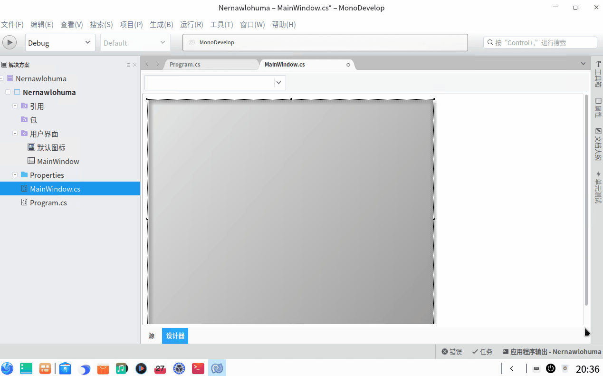
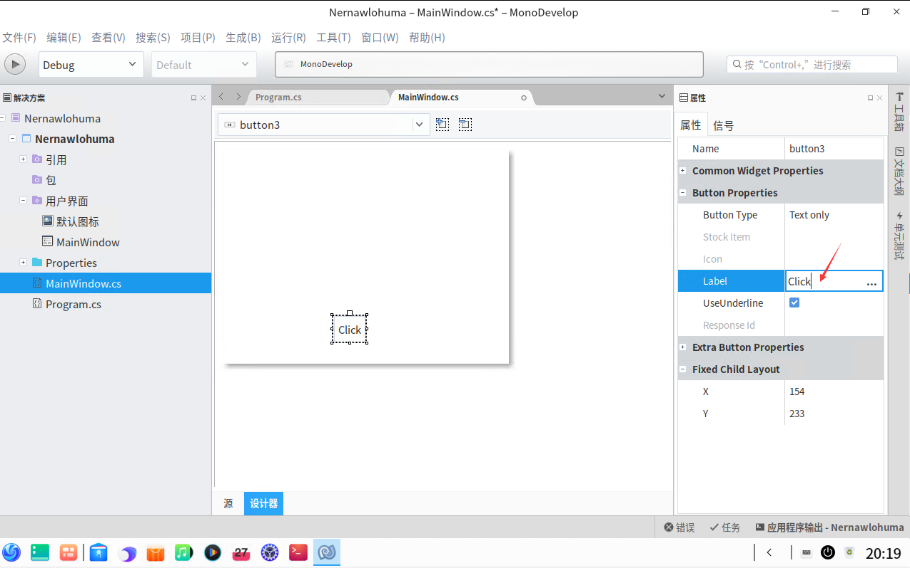
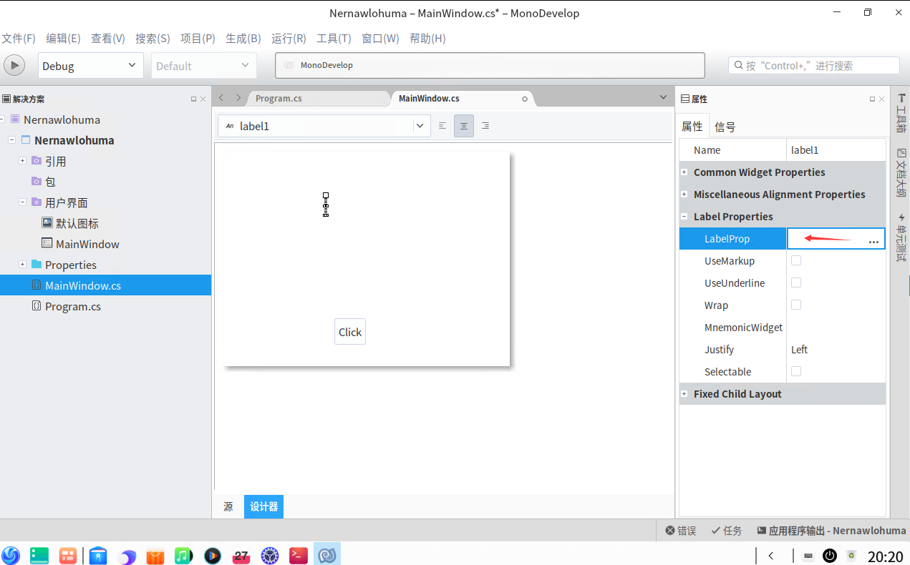
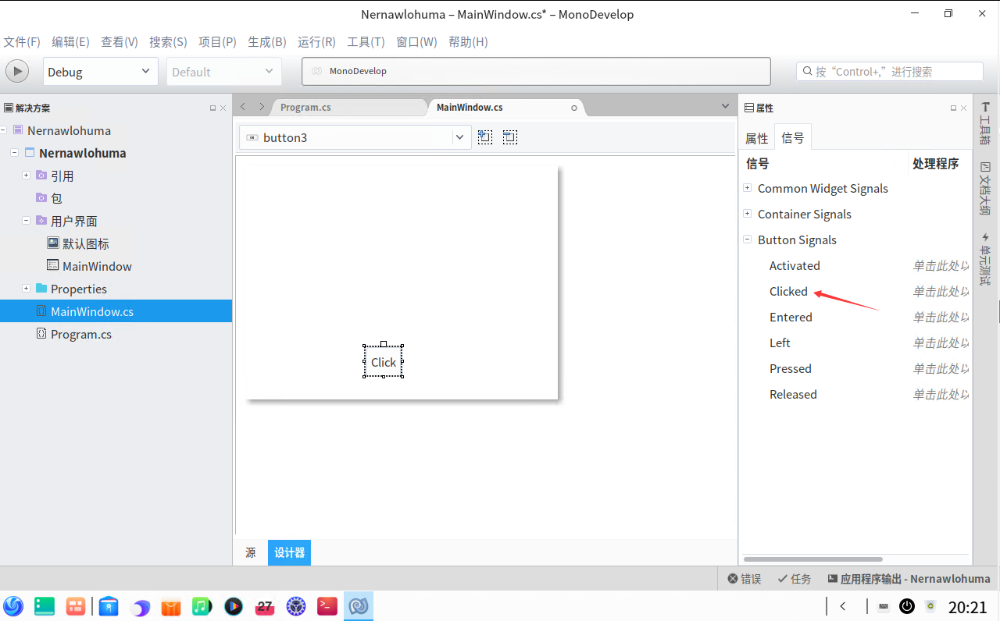
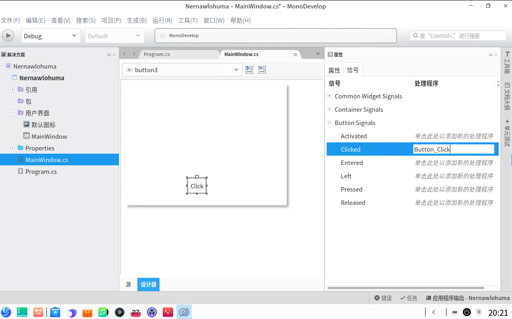
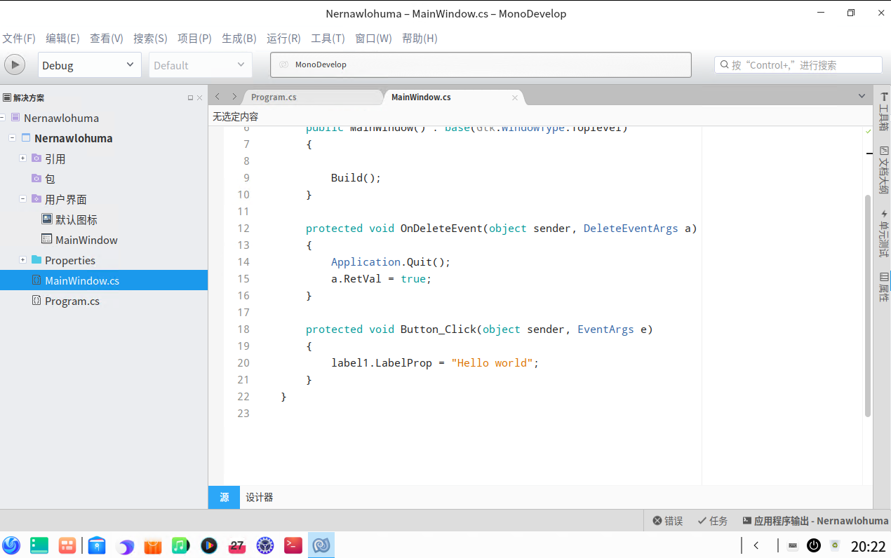
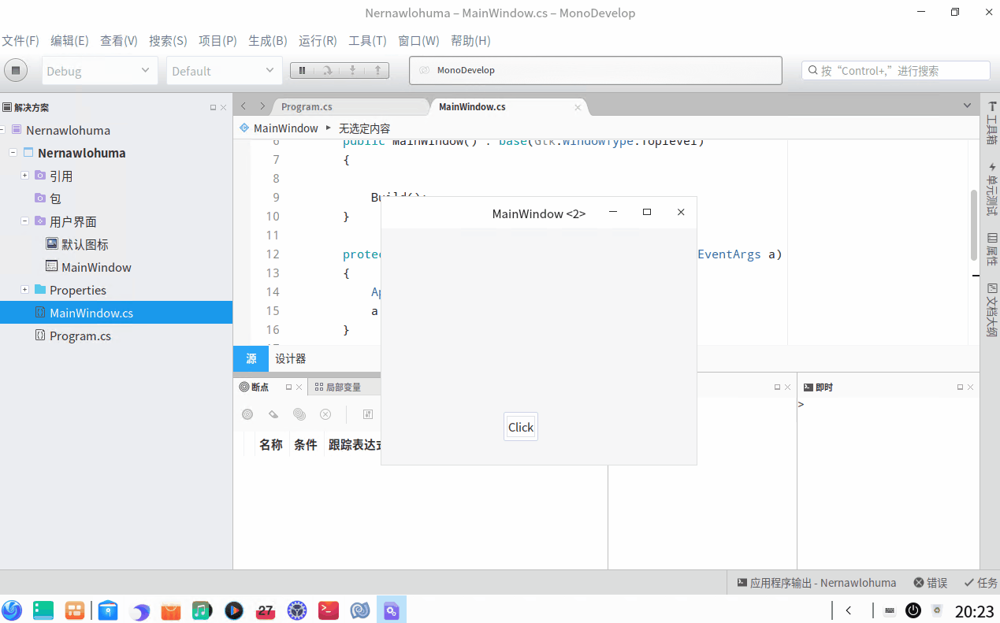

# dotnet 在 UOS 国产系统上使用 MonoDevelop 进行拖控件开发 GTK 应用

先从一个 Hello World 应用开始，试试和古老的 WinForms 一样的拖控件式开发

<!--more-->
<!-- CreateTime:2020/8/31 20:33:41 -->

<!-- 发布 -->

在创建完成一个 GTK# 2.0 应用之后，咱可以试试开始拖控件的开发，当然这个开发方式开发出来的应用界面有点古老。不过作为玩还是不错的

先拖入一个容器，和 WPF 一样，窗口里面的内容只允许一项，如果这一项是组件，那么意味着不能添加其他的元素，因此此时推荐使用是一个一个容器

接着拖入一个按钮和一个文本

<!--  -->

然后点击按钮的属性的 Label 修改按钮显示文本内容为 Click 如下图

<!--  -->

选择文本，设置文本内容是空字符串

<!--  -->

按钮点击的事件，可以在属性的信号里面找到点击事件

<!--  -->

填写事件名，此时将会在 MainWindow.cs 文件创建方法

<!--  -->

返回代码，在按钮点击方法里面设置文本内容

<!--  -->

此时运行代码，可以看到如下界面

<!--  -->

这就是最简单的拖控件的方法

 本作品采用<a rel="license" href="http://creativecommons.org/licenses/by-nc-sa/4.0/">知识共享署名-非商业性使用-相同方式共享 4.0 国际许可协议</a>进行许可。欢迎转载、使用、重新发布，但务必保留文章署名[林德熙](http://blog.csdn.net/lindexi_gd)(包含链接:http://blog.csdn.net/lindexi_gd )，不得用于商业目的，基于本文修改后的作品务必以相同的许可发布。如有任何疑问，请与我[联系](mailto:lindexi_gd@163.com)。
