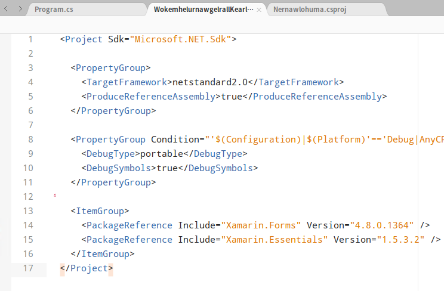
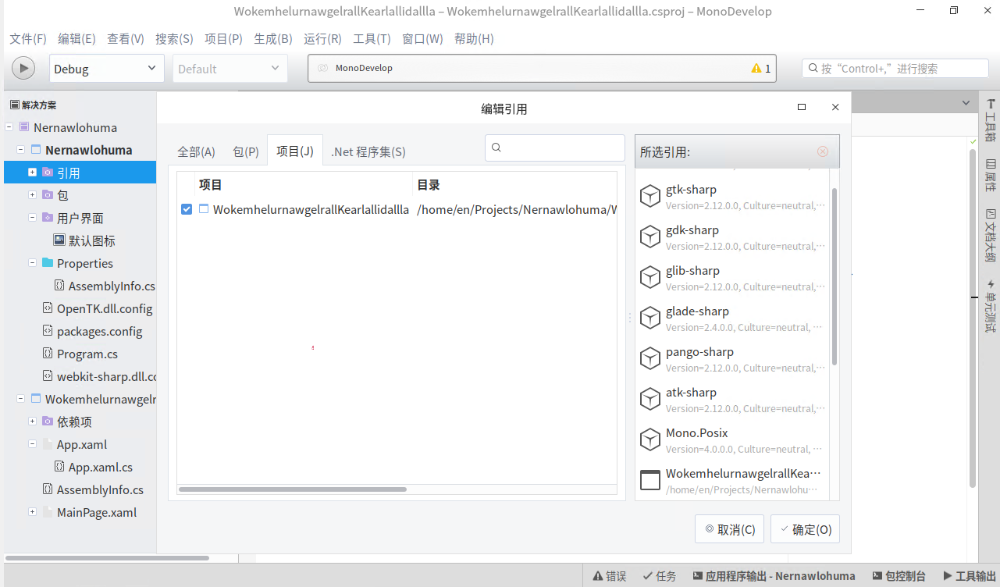

# dotnet 在 UOS 国产系统上使用 Xamarin Forms 创建 xaml 界面的 GTK 应用

在前面几篇博客告诉大家如何部署 GTK 应用，此时的应用是特别弱的，大概只是到拖控件级。尽管和 WinForms 一样也能写出特别强大的应用，但是为了提升一点开发效率，咱开始使用 xaml 神器写界面。本文告诉大家如何在 UOS 国产系统上，通过 Xamarin.Forms 使用 XAML 写界面逻辑，构建出 GTK 应用

<!--more-->
<!-- CreateTime:2020/9/1 21:18:30 -->


本文将使用特别底层的方法告诉大家如何一步步创建，而不是告诉大家如何在 IDE 上进行快速的创建。因此本文更适合用来告诉大家一些基础的内容，而不适合用来规模化创建上

请注意，本文的步骤很多，只是我为了让大家能了解更多细节。实际上没有那么复杂

在开始之前，请确定你安装好了环境，如何安装请看下面博客

- [dotnet 在 UOS 国产系统上安装 MonoDevelop 开发工具](https://blog.lindexi.com/post/dotnet-%E5%9C%A8-UOS-%E5%9B%BD%E4%BA%A7%E7%B3%BB%E7%BB%9F%E4%B8%8A%E5%AE%89%E8%A3%85-MonoDevelop-%E5%BC%80%E5%8F%91%E5%B7%A5%E5%85%B7.html )
- [dotnet 在 UOS 国产系统上使用 MonoDevelop 创建 GTK 全平台带界面应用](https://blog.lindexi.com/post/dotnet-%E5%9C%A8-UOS-%E5%9B%BD%E4%BA%A7%E7%B3%BB%E7%BB%9F%E4%B8%8A%E4%BD%BF%E7%94%A8-MonoDevelop-%E5%88%9B%E5%BB%BA-GTK-%E5%85%A8%E5%B9%B3%E5%8F%B0%E5%B8%A6%E7%95%8C%E9%9D%A2%E5%BA%94%E7%94%A8.html )
- [dotnet 在 UOS 国产系统上使用 MonoDevelop 进行拖控件开发 GTK 应用](https://blog.lindexi.com/post/dotnet-%E5%9C%A8-UOS-%E5%9B%BD%E4%BA%A7%E7%B3%BB%E7%BB%9F%E4%B8%8A%E4%BD%BF%E7%94%A8-MonoDevelop-%E8%BF%9B%E8%A1%8C%E6%8B%96%E6%8E%A7%E4%BB%B6%E5%BC%80%E5%8F%91-GTK-%E5%BA%94%E7%94%A8.html )

如 [dotnet 在 UOS 国产系统上使用 MonoDevelop 创建 GTK 全平台带界面应用](https://blog.lindexi.com/post/dotnet-%E5%9C%A8-UOS-%E5%9B%BD%E4%BA%A7%E7%B3%BB%E7%BB%9F%E4%B8%8A%E4%BD%BF%E7%94%A8-MonoDevelop-%E5%88%9B%E5%BB%BA-GTK-%E5%85%A8%E5%B9%B3%E5%8F%B0%E5%B8%A6%E7%95%8C%E9%9D%A2%E5%BA%94%E7%94%A8.html ) 所说，创建一个空白的 GTK# 应用

<!--  -->


<!--  -->


<!--  -->


接着创建一个控制台项目，假定这个项目是 A 项目，这个控制台项目将会添加 Xamarin.Foms 负载，然后将构建出基于 Xamarin.Forms 的界面 dll 文件，接着将由 GTK 项目，假定命名为 B 项目，作为最终原生控件支持，被 Xamarin.Forms 的界面 dll 所映射，因此刚才新建的 GTK 项目就是最终入口项目，应用程序由他启动

<!--  -->


在创建的控制台项目里面，编辑 csproj 文件，右击刚才创建的控制台项目，点击工具，点击编辑文件

<!--  -->


修改 csproj 文件为下面内容

```xml
<Project Sdk="Microsoft.NET.Sdk">

  <PropertyGroup>
    <TargetFramework>netstandard2.0</TargetFramework>
    <ProduceReferenceAssembly>true</ProduceReferenceAssembly>
  </PropertyGroup>

  <PropertyGroup Condition="'$(Configuration)|$(Platform)'=='Debug|AnyCPU'">
    <DebugType>portable</DebugType>
    <DebugSymbols>true</DebugSymbols>
  </PropertyGroup>

  <ItemGroup>
    <PackageReference Include="Xamarin.Forms" Version="4.8.0.1364" />
    <PackageReference Include="Xamarin.Essentials" Version="1.5.3.2" />
  </ItemGroup>
</Project>
```

<!--  -->


有小伙伴说，在 Windows 下，用 VS 新建一个 Xamarin.Forms 项目之后，再拷贝到 UOS 上，也是可以的，但是有一点需要注意的是不能拷贝 `bin` 和  `obj` 文件夹过去，原因是在 obj 文件夹存放了很多依赖本机电脑的文件夹绝对路径的文件，如 nuget 还原里面的 project.assests.json 文件将会包含 fallback 路径，如果拷贝到 Linux 下的系统，也许会看到如下提示


```
Error MSB4018 The "ResolvePackageAssets" task failed unexpectedly. NuGet.Packaging.Core.PackagingException: Unable to find fallback package folder 'C:\ProgramData\Xamarin\NuGet\'
```

或者

```
Error MSB4018 The "ResolvePackageAssets" task failed unexpectedly. NuGet.Packaging.Core.PackagingException: Unable to find fallback package folder 'C:\Program Files (x86)\Xamarin\NuGet\'
```

如果忘了这一点复制了 obj 文件夹，可以在 UOS 这个 Linux 系统下删除 obj 文件夹，解决 Xamarin Forms 在 Linux 系统构建失败的问题

先忽略从Windows等系统创建好了 Xamarin Forms 的方法，咱就在 UOS 上一步步创建

删除 A 项目，也就是安装了 Xamarin Forms 的控制台项目，的 Program.cs 文件

然后选择新建一个空 xml 文件，创建完成之后修改命名为 App.xaml 文件，同时创建一个空类叫 App.xaml.cs 文件

这两个文件将表示 Xamarin Forms 项目的起始，也就是在 Xamarin 层的启动入口。在使用 Xamarin.Forms 的 GTK 应用，有两层入口，第一层是本机程序的入口，也就是 B 项目的 Program 文件的 Main 方法入口，第二层就是 Xamarin.Forms 的 App 入口。应用程序启动的时候，先进入第一层入口，在第一层入口初始化本机相关的进程，然后进入第二层入口，在第二层入口初始化 Xamarin 应用

在 App.xaml 添加下面代码，下面代码的 `x:Class="WokemhelurnawgelrallKearlallidallla.App"` 其实 WokemhelurnawgelrallKearlallidallla 就是项目名

```xml
<?xml version="1.0" encoding="utf-8" ?>
<Application xmlns="http://xamarin.com/schemas/2014/forms"
             xmlns:x="http://schemas.microsoft.com/winfx/2009/xaml"
             xmlns:d="http://xamarin.com/schemas/2014/forms/design"
             xmlns:mc="http://schemas.openxmlformats.org/markup-compatibility/2006"
             mc:Ignorable="d"
             x:Class="WokemhelurnawgelrallKearlallidallla.App">
    <Application.Resources>

    </Application.Resources>
</Application>
```

其实上面的 App.xaml 是空代码，有意义的代码放在 App.xaml.cs 请看代码

```csharp
using Xamarin.Forms;

namespace WokemhelurnawgelrallKearlallidallla
{
    public partial class App : Application
    {
        public App()
        {
            InitializeComponent();

            MainPage = new MainPage();
        }
    }
}
```

上面代码的核心就是在构造方法调用 InitializeComponent 方法，然后设置主页面

接着咱需要新建一个主界面，新建 MainPage 的 xml 文件，然后修改命名为 MainPage.xaml 文件

然后填写界面代码

```xml
<?xml version="1.0" encoding="utf-8" ?>
<ContentPage xmlns="http://xamarin.com/schemas/2014/forms"
             xmlns:x="http://schemas.microsoft.com/winfx/2009/xaml"
             xmlns:d="http://xamarin.com/schemas/2014/forms/design"
             xmlns:mc="http://schemas.openxmlformats.org/markup-compatibility/2006"
             mc:Ignorable="d"
             x:Class="WokemhelurnawgelrallKearlallidallla.MainPage">

    <StackLayout>
        <Label Text="Welcome to Xamarin.Forms!" 
           HorizontalOptions="Center"
           VerticalOptions="CenterAndExpand" />
    </StackLayout>

</ContentPage>
```

还请小伙伴先不要改多内容哈

接着新建 MainPage.xaml.cs 文件，添加下面代码

```csharp
using System.ComponentModel;
using Xamarin.Forms;

namespace WokemhelurnawgelrallKearlallidallla
{
    [DesignTimeVisible(false)]
    public partial class MainPage : ContentPage
    {
        public MainPage()
        {
            InitializeComponent();
        }
    }
}
```

现在新建了 App 应用和 MainPage 一个界面，但是还需要一个 AssemblyInfo.cs 文件，设置程序集特性

```csharp
using Xamarin.Forms.Xaml;

[assembly: XamlCompilation(XamlCompilationOptions.Compile)]
```

这样一个简单的 Xamarin Forms 项目就完成了，设置 GTK 项目，也就是 B 项目，引用 Xamarin Forms 项目，也就是 A 项目

<!--  -->


但是此时将会发现构建不通过，因为 B 项目，也就是 GTK 项目没有引用足够的 NuGet 包。给 B 项目添加以下 NuGet 库

- OpenTK
- Xamarin.Forms
- Xamarin.Forms.Platform.GTK

接着打开 B 项目的 Program.cs 文件，在 Main 方法添加如下代码

```csharp
            Gtk.Application.Init();
            Forms.Init();
 
            var app = new App();
            var window = new FormsWindow();
            window.LoadApplication(app);
            window.SetApplicationTitle("lindexi");
            window.Show();
            Gtk.Application.Run();
```

注意在编辑器里面添加 using 引用

然后删除除了 Program.cs 的其他 cs 代码文件

此时 B 项目，构建之后可以看到如下界面

<!--  -->


当前的项目大概如下

<!--  -->


本文没有给大家一个简单的方法，主要是让大家可以了解更多内容

官方文档请看 [GTK# Platform Setup - Xamarin](https://docs.microsoft.com/en-us/xamarin/xamarin-forms/platform/other/gtk?tabs=windows&WT.mc_id=WD-MVP-5003260 )

尽管官方文档里面说的是预览版，但是经过了2年的开发，现在不能的支持的点很少。另外，这里的 GTK 支持的代码都是完全开源的，刚好我改的动，所以用起来也不慌

<a rel="license" href="http://creativecommons.org/licenses/by-nc-sa/4.0/"></a><br />本作品采用<a rel="license" href="http://creativecommons.org/licenses/by-nc-sa/4.0/">知识共享署名-非商业性使用-相同方式共享 4.0 国际许可协议</a>进行许可。欢迎转载、使用、重新发布，但务必保留文章署名[林德熙](http://blog.csdn.net/lindexi_gd)(包含链接:http://blog.csdn.net/lindexi_gd )，不得用于商业目的，基于本文修改后的作品务必以相同的许可发布。如有任何疑问，请与我[联系](mailto:lindexi_gd@163.com)。
