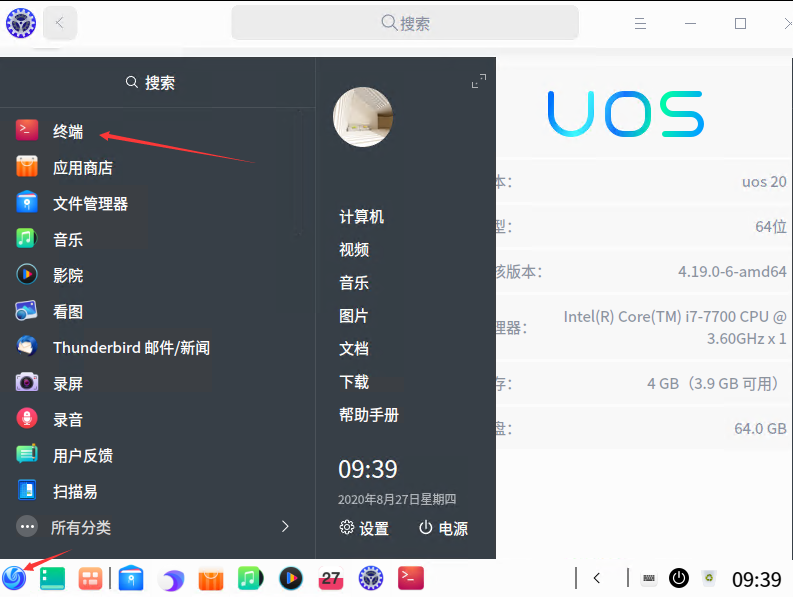
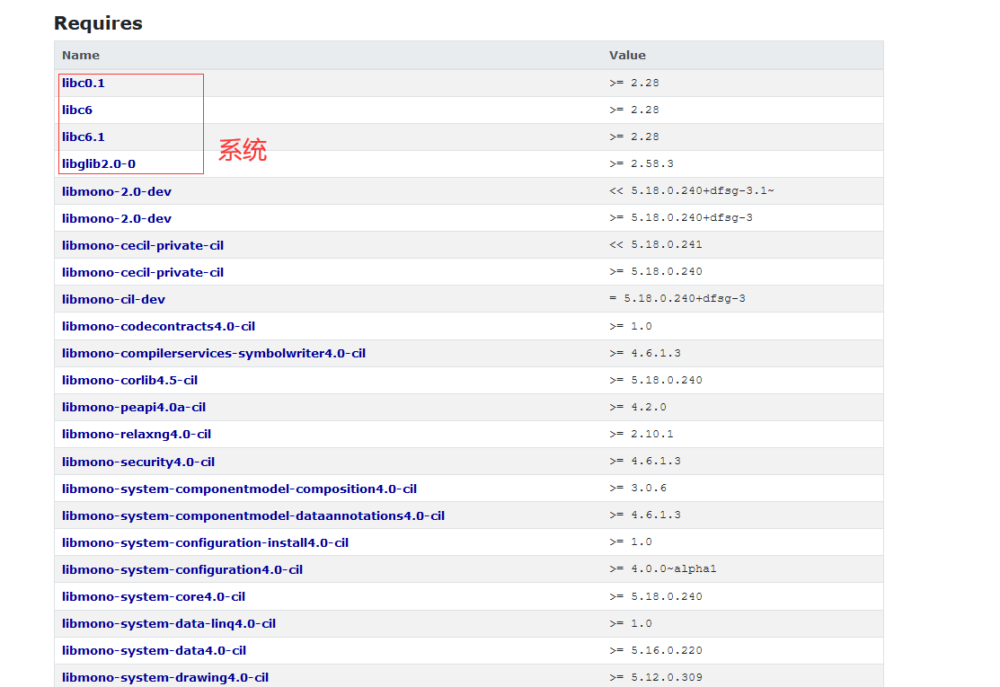

# dotnet 在 UOS 国产系统上安装 Mono 开发工具的方法

本文使用的 UOS 是 UOS 20 x64 版本，这个系统版本是基于 debian 10 的。而默认 mono-devel 是没有提供 UOS 版本，但是有提供 debian 10 版本，而 mono-devel 有很多依赖包，因此手动安装不是很靠谱

<!--more-->
<!-- CreateTime:2020/8/27 9:39:52 -->


本文推荐的方法是配置上 debian 10 的源，然后使用 apt-get 安装，这样步骤比较少。但是有缺点是也许 debian 源会帮你更新一些系统组件，会让你的系统凉凉。因此少珺同学推荐在安装完成就干掉 debian 源

进入 UOS 系统，点击左下角的图标，也就是相当于 Windows 的开始按钮，点击终端。这里的终端就是命令行工具类似 Windows 的 cmd 工具

<!--  -->


进入 `/etc/apt` 文件夹，在终端输入下面代码

```csharp
cd /etc/apt
```

使用 vim 工具编辑 sources.list 文件，添加 debian 源

```csharp
vim sources.list
```

在 vim 工具里面，是纯命令行工具，按下 `i` 进入输入编辑模式，输入 debian 源

```
deb https://mirrors.ustc.edu.cn/debian buster main contrib non-free
```

上面命令详细含义请看 [Debian 源使用帮助 — USTC Mirror Help 文档](https://mirrors.ustc.edu.cn/help/debian.html )

编辑完成，在 vim 里面退出保存方法是按下 `esc` 键，也就是键盘的左上角的键，然后输入 `:wq` 回车就可以退出保存。这一步难度比较大，请小伙伴参阅 [Linux vim如何保存退出-百度经验](https://jingyan.baidu.com/article/148a1921ca21f14d70c3b169.html )

接着开始安装 mono-devel 工具

```
sudo apt-get install mono-devel
```

等待安装

安装完成之后，尝试在终端输入 mono 命令，如果能看到 mono 输出，那么证明安装成功

以上方法步骤很少，很简单，下面是我开始使用的手工方法

下面方法不适合初学者

先进入 [https://debian.pkgs.org/10/debian-main-amd64/mono-devel_5.18.0.240+dfsg-3_all.deb.html](https://debian.pkgs.org/10/debian-main-amd64/mono-devel_5.18.0.240+dfsg-3_all.deb.html) 找到下载链接

在终端使用 `wget` 下载

```csharp
wget http://ftp.br.debian.org/debian/pool/main/m/mono/mono-devel_5.18.0.240+dfsg-3_all.deb
```

接着使用 dpkg 命令安装

```csharp
dpkg -i mono-devel_5.18.0.240+dfsg-3_all.deb
```

安装的时候会提示你缺少必要的库，这些库在 [https://debian.pkgs.org/10/debian-main-amd64/mono-devel_5.18.0.240+dfsg-3_all.deb.html](https://debian.pkgs.org/10/debian-main-amd64/mono-devel_5.18.0.240+dfsg-3_all.deb.html) 列出

<!--  -->


除了系统的库之外，其他的库都需要手动点击进去，然后和上面步骤差不多进行安装

如果安装到一半，因为需要安装的库太多了，准备放弃了，可以采用如上文方法，在 sources.list 文件，添加 debian 源

然后运行下面代码

```csharp
sudo apt update
sudo apt --fix-broken install
```

然后输入 y 继续

安装完成尝试输入 mono 如果能看到输出那么证明安装成功

更多请看 [Mono](https://www.mono-project.com/ ) 官网

<a rel="license" href="http://creativecommons.org/licenses/by-nc-sa/4.0/"></a><br />本作品采用<a rel="license" href="http://creativecommons.org/licenses/by-nc-sa/4.0/">知识共享署名-非商业性使用-相同方式共享 4.0 国际许可协议</a>进行许可。欢迎转载、使用、重新发布，但务必保留文章署名[林德熙](http://blog.csdn.net/lindexi_gd)(包含链接:http://blog.csdn.net/lindexi_gd )，不得用于商业目的，基于本文修改后的作品务必以相同的许可发布。如有任何疑问，请与我[联系](mailto:lindexi_gd@163.com)。
