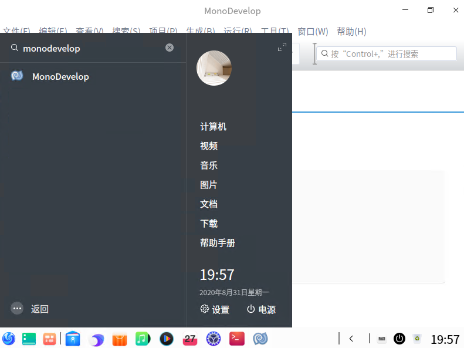

# dotnet 在 UOS 国产系统上安装 MonoDevelop 开发工具

本文告诉大家如何在 UOS 上安装 MonoDevelop 开发工具。本文使用的 UOS 是 UOS 20 x64 版本，这个系统版本是基于 debian 10 的，默认的 MonoDevelop 开发工具是没有提供 UOS 版本，但是有提供 debian 10 版本

<!--more-->
<!-- 发布 -->

手动安装 MonoDevelop 不靠谱，本文推荐大家通过使用 debian 10 版本方法进行安装

在开始之前，还需要小伙伴安装好 mono 开发工具，安装方法请看 [dotnet 在 UOS 国产系统上安装 Mono 开发工具的方法](https://blog.lindexi.com/post/dotnet-%E5%9C%A8-UOS-%E5%9B%BD%E4%BA%A7%E7%B3%BB%E7%BB%9F%E4%B8%8A%E5%AE%89%E8%A3%85-Mono-%E5%BC%80%E5%8F%91%E5%B7%A5%E5%85%B7%E7%9A%84%E6%96%B9%E6%B3%95.html)

接着进入 `/etc/apt` 文件夹，在终端输入下面代码

```csharp
cd /etc/apt
```

使用 vim 工具编辑 sources.list 文件，添加 debian 源

```csharp
vim sources.list
```

在 vim 工具里面，是纯命令行工具，按下 `i` 进入输入编辑模式，输入 debian 源

```
deb https://mirrors.ustc.edu.cn/debian buster main contrib non-free
```

上面命令详细含义请看 [Debian 源使用帮助 — USTC Mirror Help 文档](https://mirrors.ustc.edu.cn/help/debian.html )

接着加上 Mono 仓库源

```csharp
sudo apt install apt-transport-https dirmngr
sudo apt-key adv --keyserver hkp://keyserver.ubuntu.com:80 --recv-keys 3FA7E0328081BFF6A14DA29AA6A19B38D3D831EF
echo "deb https://download.mono-project.com/repo/debian vs-buster main" | sudo tee /etc/apt/sources.list.d/mono-official-vs.list
sudo apt update
```

上面命令详细请看 [MonoDevelop 安装方法](https://www.monodevelop.com/download/#fndtn-download-lin-debian )

接着使用下面代码安装 MonoDevelop 工具

```csharp
sudo apt-get install monodevelop
```

安装完成之后，请回到 `/etc/apt` 文件夹，注释掉 sources.list 文件添加的 debian 源，不然也许会帮你更新 Kernal 组件，然后你重启之后就不能打开了

安装完成之后，可以从 UOS 的编程工具

<!--  -->


<a rel="license" href="http://creativecommons.org/licenses/by-nc-sa/4.0/"></a><br />本作品采用<a rel="license" href="http://creativecommons.org/licenses/by-nc-sa/4.0/">知识共享署名-非商业性使用-相同方式共享 4.0 国际许可协议</a>进行许可。欢迎转载、使用、重新发布，但务必保留文章署名[林德熙](http://blog.csdn.net/lindexi_gd)(包含链接:http://blog.csdn.net/lindexi_gd )，不得用于商业目的，基于本文修改后的作品务必以相同的许可发布。如有任何疑问，请与我[联系](mailto:lindexi_gd@163.com)。
