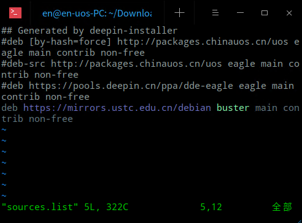

# dotnet 在 UOS 国产系统上安装 dotnet sdk 的方法


本文告诉大家如何在 UOS 国产系统上安装 dotnet sdk 的方法

<!--more-->
<!-- CreateTime:2020/9/4 8:50:35 -->


使用的 UOS 是 UOS 20 x64 版本，这个系统版本是基于 debian 10 的，可以使用 debian 10 的方法安装

进入 UOS 系统，点击左下角的图标，也就是相当于 Windows 的开始按钮，点击终端。这里的终端就是命令行工具类似 Windows 的 cmd 工具

<!--  -->


进入 `/etc/apt` 文件夹，在终端输入下面代码

```csharp
cd /etc/apt
```

使用 vim 工具编辑 sources.list 文件，添加 debian 源

```csharp
vim sources.list
```

在 vim 工具里面，是纯命令行工具，按下 `i` 进入输入编辑模式，输入 debian 源

```
deb https://mirrors.ustc.edu.cn/debian buster main contrib non-free
```

然后注释掉其他的源

<!--  -->


按照 [在 Debian 上安装 .NET Core ](https://docs.microsoft.com/zh-cn/dotnet/core/install/linux-debian?WT.mc_id=DX-MVP-5003606 ) 的方法，在命令行输入下面代码，将 Microsoft 包签名密钥添加到受信任密钥列表，并添加包存储库

```csharp
wget https://packages.microsoft.com/config/debian/10/packages-microsoft-prod.deb -O packages-microsoft-prod.deb
sudo dpkg -i packages-microsoft-prod.deb
```

接下来开始安装 dotnet sdk 在控制台输入下面代码

```csharp
sudo apt-get update; \
  sudo apt-get install -y apt-transport-https && \
  sudo apt-get update && \
  sudo apt-get install -y dotnet-sdk-3.1
```

欢迎小伙伴加入 xamarin 国产 UOS 开发群： 810052083 

如果安装失败了，请看 [官方文档](https://docs.microsoft.com/zh-cn/dotnet/core/install/linux-debian?WT.mc_id=DX-MVP-5003606 ) 

<a rel="license" href="http://creativecommons.org/licenses/by-nc-sa/4.0/"></a><br />本作品采用<a rel="license" href="http://creativecommons.org/licenses/by-nc-sa/4.0/">知识共享署名-非商业性使用-相同方式共享 4.0 国际许可协议</a>进行许可。欢迎转载、使用、重新发布，但务必保留文章署名[林德熙](http://blog.csdn.net/lindexi_gd)(包含链接:http://blog.csdn.net/lindexi_gd )，不得用于商业目的，基于本文修改后的作品务必以相同的许可发布。如有任何疑问，请与我[联系](mailto:lindexi_gd@163.com)。
