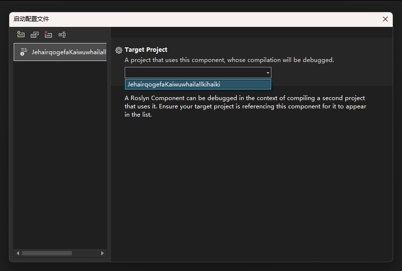
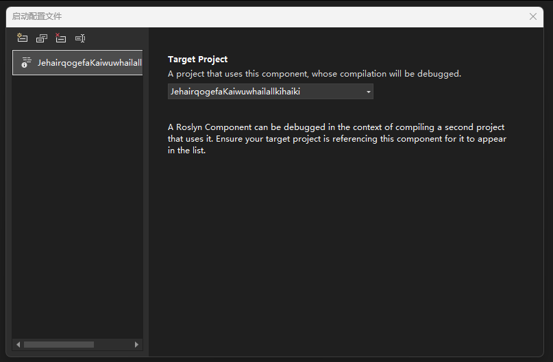

# dotnet 在 VisualStudio 一键 F5 启动调试 Roslyn 分析器项目

本文将告诉大家如何在 VisualStudio 里面，一键使用习惯的 F5 键进行快速构建和启动调试 Roslyn 分析器项目

<!--more-->
<!-- 发布 -->
<!-- 博客 -->

在 dotnet 里面编写的 SourceGenerator 源代码生成器，或者是分析器时，可能编写的逻辑比较复杂，期望制作一个项目进行调试。或者是原本分析器能够跑得好好的，莫名就在某个项目上应用失败，期望能够调试失败的项目

本文将和大家介绍如何使用 DebugRoslynComponent 启动方式进行调试启动 Roslyn 分析器项目

本文先告诉大家完全手动的编辑文件的配置方式，然后再告诉大家如何通过图形化的配置方式作为日常工程化的配置

## 手动配置

开始之前，先确保被调试项目正确引用了 Roslyn 分析器项目。如本文这里有两个项目，分别是 `JehairqogefaKaiwuwhailallkihaiki.Analyzer` 分析器项目和 `JehairqogefaKaiwuwhailallkihaiki` 控制台项目

在 `JehairqogefaKaiwuwhailallkihaiki` 控制台项目里面引用 `JehairqogefaKaiwuwhailallkihaiki.Analyzer` 分析器项目，且在 csproj 里面设置 `OutputItemType="Analyzer" ReferenceOutputAssembly="false"` 属性，如以下代码所示。这两个属性的含义分别是 `OutputItemType="Analyzer"` 为配置将项目引用为分析器，而 `ReferenceOutputAssembly="false"` 则设置不引用其输出程序集内容，即不使用分析器项目里面的任何公开类型，不建立引用程序集关系

```xml
<Project Sdk="Microsoft.NET.Sdk">

  <PropertyGroup>
    <OutputType>Exe</OutputType>
    <TargetFramework>net9.0</TargetFramework>
    <ImplicitUsings>enable</ImplicitUsings>
    <Nullable>enable</Nullable>
  </PropertyGroup>

  <ItemGroup>
    <ProjectReference Include="..\JehairqogefaKaiwuwhailallkihaiki.Analyzer\JehairqogefaKaiwuwhailallkihaiki.Analyzer.csproj" OutputItemType="Analyzer" ReferenceOutputAssembly="false"/>
  </ItemGroup>

</Project>
```

如果大家不确定自己的配置是否正确，可在本文末尾找到本文所有代码的下载方法，拉取本文的项目进行对比

确保 `JehairqogefaKaiwuwhailallkihaiki.Analyzer` 分析器项目正确配置了 `IsRoslynComponent` 属性，分析器项目的 csproj 项目文件代码如下

```xml
<Project Sdk="Microsoft.NET.Sdk">

  <PropertyGroup>
    <TargetFramework>netstandard2.0</TargetFramework>
    <EnforceExtendedAnalyzerRules>true</EnforceExtendedAnalyzerRules>
    <IsRoslynComponent>true</IsRoslynComponent>
  </PropertyGroup>

  <ItemGroup>
    <PackageReference Include="Microsoft.CodeAnalysis.CSharp" Version="4.11.0" />
  </ItemGroup>

</Project>
```

完成准备工作之后，在 `JehairqogefaKaiwuwhailallkihaiki.Analyzer` 分析器项目添加 `launchSettings.json` 调试启动配置文件，在里面设置 DebugRoslynComponent 为 `commandName` 内容。将要被调试的 `JehairqogefaKaiwuwhailallkihaiki` 控制台项目相对路径设置到 `targetProject` 属性里面，其文件代码如下

```json
{
  "profiles": 
  {
    "JehairqogefaKaiwuwhailallkihaiki.Analyzer": 
    {
      "commandName": "DebugRoslynComponent",
      "targetProject": "..\\JehairqogefaKaiwuwhailallkihaiki\\JehairqogefaKaiwuwhailallkihaiki.csproj"
    }
  }
}
```

完成这些步骤之后，即可愉快的在分析器项目打上断点，设置分析器项目为启动项目，然后直接在 Visual Studio 使用 F5 一键运行启动调试分析器项目

本文代码放在 [github](https://github.com/lindexi/lindexi_gd/tree/c0e948b2a3aab521f2d6d86593c385f4d406cfa5/Roslyn/JehairqogefaKaiwuwhailallkihaiki) 和 [gitee](https://gitee.com/lindexi/lindexi_gd/tree/c0e948b2a3aab521f2d6d86593c385f4d406cfa5/Roslyn/JehairqogefaKaiwuwhailallkihaiki) 上，可以使用如下命令行拉取代码。我整个代码仓库比较庞大，使用以下命令行可以进行部分拉取，拉取速度比较快

先创建一个空文件夹，接着使用命令行 cd 命令进入此空文件夹，在命令行里面输入以下代码，即可获取到本文的代码

```
git init
git remote add origin https://gitee.com/lindexi/lindexi_gd.git
git pull origin c0e948b2a3aab521f2d6d86593c385f4d406cfa5
```

以上使用的是国内的 gitee 的源，如果 gitee 不能访问，请替换为 github 的源。请在命令行继续输入以下代码，将 gitee 源换成 github 源进行拉取代码。如果依然拉取不到代码，可以发邮件向我要代码

```
git remote remove origin
git remote add origin https://github.com/lindexi/lindexi_gd.git
git pull origin c0e948b2a3aab521f2d6d86593c385f4d406cfa5
```

获取代码之后，进入 Roslyn/JehairqogefaKaiwuwhailallkihaiki 文件夹，即可获取到源代码

## 图形化的配置方式

有伙伴说每次都需要新建 `launchSettings.json` 文件，这一点都不工程化，期望能够有更加方便的做法。我接下来将和大家介绍更加 UI 图形化的配置方式。在如通过上文准备步骤，确保分析器项目正确配置了 `IsRoslynComponent` 属性，和被调试项目正确添加了分析器项目引用，配置了 `OutputItemType="Analyzer"` 之后，即可愉快进入以下的图形化的配置

本文使用的 Visual Studio 为 Visual Studio 2022 17.12.4 版本

配置步骤如下：

先在 解决方案资源管理器 里面右击分析器项目，点击 设为启动项目 选项，将分析器项目设置为启动项目

再点击分析器项目的调试属性，如下图所示

<!--  -->


在打开的启动配置文件窗口里面，找个命令行参数，随便写入点字符。这个过程仅仅只是为了让 VisualStudio 帮助咱快速创建 `launchSettings.json` 文件而已。我现在还没有找到比这个方法更加顺手便捷的方式哈

<!--  -->


双击 `Properties\launchSettings.json` 文件进入编辑，现在可见的 `launchSettings.json` 文件的内容大概如下

```json
{
  "profiles": 
  {
    "JehairqogefaKaiwuwhailallkihaiki.Analyzer": 
    {
      "commandName": "Project",
      "commandLineArgs": "123"
    }
  }
}
```

此时将 `commandName` 属性的 `Project` 内容换成 `DebugRoslynComponent` 内容，再删除 `commandLineArgs` 等其他属性。此时先不要写 `targetProject` 属性项，因为这个属性项要写相对路径，手写太烦了。编辑完成之后的 `launchSettings.json` 文件的内容大概如下

```json
{
  "profiles": 
  {
    "JehairqogefaKaiwuwhailallkihaiki.Analyzer": 
    {
      "commandName": "DebugRoslynComponent"
    }
  }
}
```

继续点击分析器项目的调试属性，此时可见启动配置文件窗口界面如下

<!--  -->


愉快点击下拉菜单，选择要调试项目即可，如下图所示

<!--  -->


选中之后的效果如下图所示

<!--  -->


完成之后，再次打开 `launchSettings.json` 文件，可以看到机智的 Visual Studio 已经帮咱填充了 `targetProject` 属性内容了。通过 Visual Studio 的填充，可以让咱不需要写繁琐的相对路径，也不用担心写错项目路径导致调试出错

```json
{
  "profiles": 
  {
    "JehairqogefaKaiwuwhailallkihaiki.Analyzer": 
    {
      "commandName": "DebugRoslynComponent",
      "targetProject": "..\\JehairqogefaKaiwuwhailallkihaiki\\JehairqogefaKaiwuwhailallkihaiki.csproj"
    }
  }
}
```

如此就完成了配置工作

以下是一些踩坑经验

如果在打开的启动配置文件窗口里面，没有找到期望的调试项目，如下图所示，那么可能的原因就是期望的调试项目没有设置正确的分析器项目引用，即期望被调试的项目的 csproj 项目文件里面缺少如 `<ProjectReference Include="你的分析器项目" OutputItemType="Analyzer" ReferenceOutputAssembly="false"/>` 这样的代码，或分析器项目引用路径错误，引用了其他的分析器项目

<!--  -->


## 无法启动调试 0x80070057 错误

在准备进入调试时，按下 F5 却被zz的 Visual Studio 提示如下错误

> 无法启动调试
>
> 不支持操作。未知错误：0x80070057。

<!--  -->


或英文版的如下提示错误

> Unable to start debugging.
>
> Operation not supported. Unknown error: 0x80070057.

出现这个问题是 Visual Studio 缓存识别错误或被调试的项目路径错误，需要先关闭 Visual Studio 然后清理 sln 文件所在文件夹里的 `.vs` 文件夹，和各个项目的 `bin` 和 `obj` 文件夹。接着再重复点击分析器项目的调试属性，愉快点击下拉菜单，重新选择要调试项目即可

<!--  -->


更多技术博客，请参阅 [博客导航](https://blog.lindexi.com/post/%E5%8D%9A%E5%AE%A2%E5%AF%BC%E8%88%AA.html )