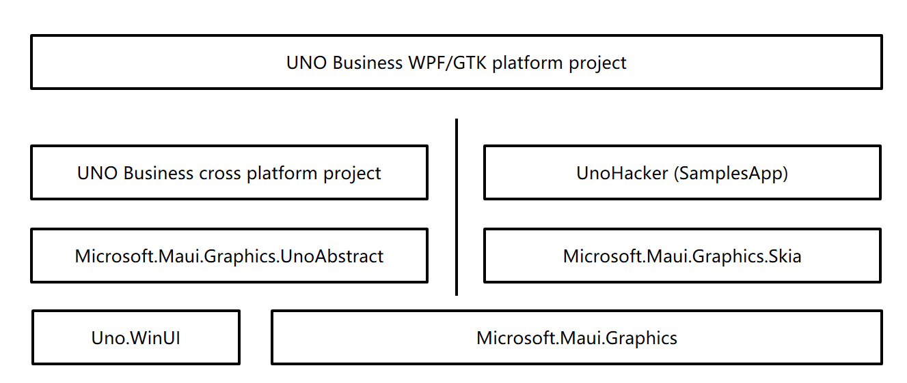
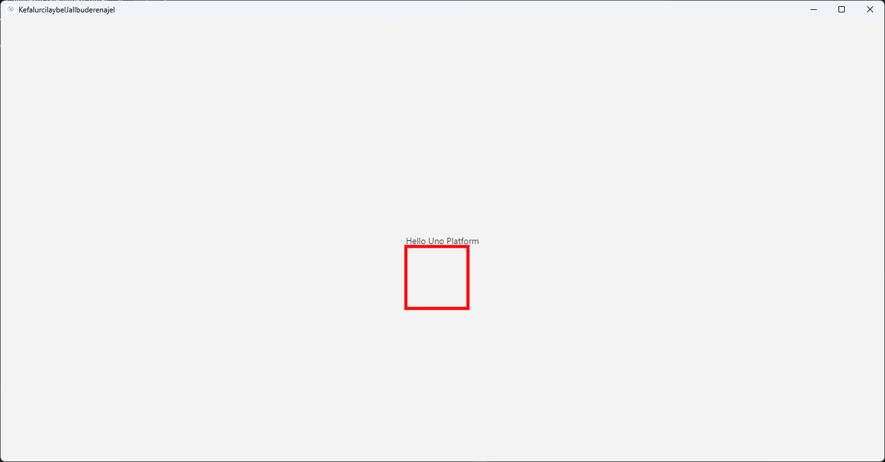

# dotnet 如何将 Microsoft.Maui.Graphics 对接到 UNO 框架

本文将和大家介绍如何将 Microsoft.Maui.Graphics 对接到 UNO 框架里面。一旦完成 Microsoft.Maui.Graphics 对接，即可让 UNO 框架复用现有的许多绘制的基础设施和现有基础库，且可以更进一步与 MAUI 打通

<!--more-->
<!-- 发布 -->
<!-- 博客 -->

众所周知，在 UNO 里面有大量的项目类型都是基于 Skia 作为底层渲染引擎构建出来的。在 Microsoft.Maui.Graphics 中有对 Skia 的一个实现，即 Microsoft.Maui.Graphics.Skia 实现方式。根据 [UNO 的 Skia 例子](https://github.com/unoplatform/Uno.Samples/tree/master/UI/SkiaSharpTest) 可以知道，在 UNO 里面是可以采用 SKXamlCanvas 执行直接对 Skia 绘制的内容的

然而坏消息是当前在 2024.01.29 时，在 UNO 里面的 SKXamlCanvas 是采用一个 Hack 的方式与 UNO 对接。在 SKXamlCanvas 里面将会重新创建 SKSurface 用于让开发者在此之上绘制，接着再将绘制的 Bitmap 通过 CPU 拷贝到 UNO 的 WriteableBitmap 上，让 UNO 使用图片绘制的形式将 WriteableBitmap 绘制出来。通过 WriteableBitmap 与 Skia 进行间接对接的方式，将会极大影响绘制性能，在绘制的中间存在很大的 CPU 压力和绘制延迟。此问题的讨论地址： <https://github.com/unoplatform/uno/discussions/15097>

为了减少 SKXamlCanvas 的 Hack 方式的影响，本文这里采用了 UNO 框架里面未公开的 Visual 绘制方式。由于本方式用到的是 UNO 框架私有的 API 实现的功能，因此可能在后续的 UNO 更新版本，本文提供的方法将会无效

本文不是提供一个开箱即用的方法，代替的是，本文提供的是一套源代码搭建对接的方法。阅读完成本文，你将学会如何自行在自己的 UNO 项目里面搭建与 Microsoft.Maui.Graphics 对接的代码，且了解其中的细节实现逻辑，方便你进行更进一步的定制。在本文末尾你将找到本文用到的所有代码的下载方法

本文以下提供了在 Uno.Skia.WPF 和 Uno.Skia.GTK 平台下，使用与 UNO 的 Visual 直接对接的方式，而不是经过了 WriteableBitmap 的 SKXamlCanvas 方式，进行与 Microsoft.Maui.Graphics.Skia 对接，进而将 Microsoft.Maui.Graphics 对接到 UNO 框架

整体的架构引用关系图如下

<!--  -->


上图的 Microsoft.Maui.Graphics.UnoAbstract 和 UnoHacker (SamplesApp) 就是接下来咱重点要工作的部分，额外的一部分工作则放在 Uno.Skia.WPF 和 Uno.Skia.GTK 平台对接代码上，平台项目的对接工作量很小，所需的代码量很少

先从 Microsoft.Maui.Graphics.UnoAbstract 项目的搭建开始，在 Microsoft.Maui.Graphics.UnoAbstract 项目里面提供了一些用于 UnoHacker (SamplesApp) 使用的 Hack 接口，用于方便上层应用框架对接，其定义的代码如下

```csharp
using Microsoft.UI.Xaml;

namespace Microsoft.Maui.Graphics.UnoAbstract;

public interface IHack
{
    FrameworkElement Create();
}

public static class HackHelper
{
    public static IHack? Hack { set; get; }
}
```

通过以上的代码，即可在 HackHelper 里面注入 Hack 对象的值。另外的，为了获取到绘图的通知，即与 FrameworkElement 的更特殊的实现，这里也需要在 Microsoft.Maui.Graphics.UnoAbstract 项目里面添加名为 IDrawableNotify 的接口，代码如下

```csharp
namespace Microsoft.Maui.Graphics.UnoAbstract;

public interface IDrawableNotify
{
    event EventHandler<ICanvas>? Draw;
}
```

完成基础的接口定义之后，即可在 Microsoft.Maui.Graphics.UnoAbstract 项目编写用于给通用跨平台的 UNO 业务项目直接使用的 GraphicsCanvas 类型。此 GraphicsCanvas 类型将继承 Microsoft.UI.Xaml.Controls.Canvas 类型，可以直接在 XAML 里面加入，且在开始绘制时触发 Draw 事件，方便业务代码使用 Draw 事件编写 Microsoft.Maui.Graphics 的绘制业务代码

```csharp
using Microsoft.UI.Xaml;
using Microsoft.UI.Xaml.Controls;

namespace Microsoft.Maui.Graphics.UnoAbstract;

public class GraphicsCanvas : Canvas, IDrawableNotify
{
    public GraphicsCanvas()
    {
        SizeChanged += OnSizeChanged;
        var frameworkElement = HackHelper.Hack?.Create();

        if (frameworkElement != null)
        {
            IDrawableNotify drawableNotify = (IDrawableNotify) frameworkElement;
            drawableNotify.Draw += OnDraw;
            Children.Add(frameworkElement);
            FrameworkElement = frameworkElement;
        }
        else
        {
            var textBlock = new TextBlock()
            {
                Text = "Not Supported"
            };

            FrameworkElement = textBlock;
        }
    }

    private FrameworkElement FrameworkElement { get; }

    private void OnDraw(object? sender, ICanvas e)
    {
        Draw?.Invoke(this, e);
    }

    private void OnSizeChanged(object sender, SizeChangedEventArgs e)
    {
        FrameworkElement.Width = e.NewSize.Width;
        FrameworkElement.Height = e.NewSize.Height;
    }

    public event EventHandler<ICanvas>? Draw;
}
```

接下来创建 UnoHacker (SamplesApp) 项目，这个项目需要设置项目的程序集名为 `SamplesApp` 才可以使用到 UNO 框架里面的一些内部成员，方便起见可以将此项目直接命名为 SamplesApp 项目。之所以叫这个名字是因为在 UNO 里面添加了 Internal 对名为 `SamplesApp` 程序集可见

再次说明，由于 UnoHacker (SamplesApp) 项目将使用 UNO 的一些不公开的类型，可能在后续的 UNO 版本里将会失效

在 UnoHacker (SamplesApp) 项目里面只需一个简单的类型，此类型将与 UNO 的 Visual 进行对接，代码如下

```csharp
public class GraphicsCanvasElement : FrameworkElement
{
    public GraphicsCanvasElement()
    {
        Visual.Children.InsertAtBottom(new GraphicsCanvasVisual(Visual.Compositor, this));
    }

    public event EventHandler<ICanvas>? Draw;

    internal void InvokeDraw(ICanvas canvas)
    {
        Draw?.Invoke(this, canvas);
    }

    class GraphicsCanvasVisual : Visual
    {
        public GraphicsCanvasVisual(Compositor compositor, GraphicsCanvasElement owner) : base(compositor)
        {
            _owner = new WeakReference<GraphicsCanvasElement>(owner);
        }

        private readonly WeakReference<GraphicsCanvasElement> _owner;

        internal override void Draw(in DrawingSession session)
        {
            if (_owner.TryGetTarget(out var graphicsCanvasElement))
            {
                using var skiaCanvas = new SkiaCanvas();
                skiaCanvas.Canvas = session.Surface.Canvas;
                graphicsCanvasElement.InvokeDraw(skiaCanvas);
            }
        }
    }
}
```

如此就完成了与 Microsoft.Maui.Graphics 对接的基础代码了，剩余的工作就需要在具体的 Uno.Skia 平台项目里面编写对接代码，通过在 Uno.Skia 平台项目里面编写对接代码将 Microsoft.Maui.Graphics.UnoAbstract 与 UnoHacker (SamplesApp) 项目进行对接。额外说明的是为什么不能将 Microsoft.Maui.Graphics.UnoAbstract 与 UnoHacker (SamplesApp) 项目合并，原因是为了让 Microsoft.Maui.Graphics.UnoAbstract 项目还可以在 UNO 的非 Skia 实现平台上使用，只让 UnoHacker (SamplesApp) 项目强引用 UNO 的 Skia 实现，如此即可让 Microsoft.Maui.Graphics.UnoAbstract 项目同时被 UNO 的 WinUI3 等非 Skia 的实现的项目进行对接

接下来开始编写 Uno.Skia.WPF 和 Uno.Skia.GTK 平台对接代码，这两个部分的平台对接代码内容都是相同的。先定义一个名为 HackElement 的继承 GraphicsCanvasElement 的控件，代码如下，定义此类型控件仅仅只是为了方便统一对接代码而已

```csharp
public partial class HackElement : GraphicsCanvasElement, IDrawableNotify
{
}
```

接着创建名为 `Hack` 的类型，让此类型继承 Microsoft.Maui.Graphics.UnoAbstract 的 IHack 接口，代码如下

```csharp
public class Hack : IHack
{
    public FrameworkElement Create()
    {
        return new HackElement();
    }
}
```

最后创建 HackInitializer 类型，用于将 Hack 类型放入到 Microsoft.Maui.Graphics.UnoAbstract 的 HackHelper 静态类型里面

```csharp
static class HackInitializer
{
    public static void Init()
    {
        HackHelper.Hack = new Hack();
    }
}
```

通过以上的封装代码，即可在各平台项目里面通过调用 HackInitializer 的 Init 方法，即可完成所有的对接逻辑。比如在 Uno.Skia.Wpf 的默认 App 构造函数里面，调用 `HackInitializer.Init();` 代码。比如在 Uno.Skia.GTK 项目里面的 Program 里面，使用如下面代码调用对接方法

```csharp
public class Program
{
    public static void Main(string[] args)
    {
        ExceptionManager.UnhandledException += delegate (UnhandledExceptionArgs expArgs)
        {
            Console.WriteLine("GLIB UNHANDLED EXCEPTION" + expArgs.ExceptionObject.ToString());
            expArgs.ExitApplication = true;
        };

        HackInitializer.Init();

        var host = new GtkHost(() => new AppHead());

        host.Run();
    }
}
```

完成所有对接逻辑之后，接下来即可在 UNO 的全平台项目里面，使用 GraphicsCanvas 绘制业务代码的界面。比如在 MainPage.xaml 里面添加以下代码

```xml
      xmlns:graphics="using:Microsoft.Maui.Graphics.UnoAbstract"

  <StackPanel x:Name="StackPanel"
        HorizontalAlignment="Center"
        VerticalAlignment="Center">
    <TextBlock x:Name="TextBlock" AutomationProperties.AutomationId="HelloTextBlock"
          Text="Hello Uno Platform"
          HorizontalAlignment="Center" />
    <Border Background="AliceBlue">
      <graphics:GraphicsCanvas Draw="GraphicsCanvas_OnDraw"/>
    </Border>
  </StackPanel>
```

在后台代码即可在 `GraphicsCanvas_OnDraw` 方法的 Microsoft.Maui.Graphics.ICanvas 参数里面获取到与整个 Microsoft.Maui.Graphics 对接的开始，如下面代码简单绘制界面

```csharp
    private void GraphicsCanvas_OnDraw(object? sender, ICanvas e)
    {
        e.StrokeSize = 5;
        e.StrokeColor = Colors.Red;
        e.DrawRectangle(0, 0, 100, 100);
    }
```

运行项目，将可以看到如下界面

<!--  -->


本文以上代码放在[github](https://github.com/lindexi/lindexi_gd/tree/daf3e44a853177d55e9ebb15d989e27b1e497591/KefalurcilaybelJallbuderenajel) 和 [gitee](https://gitee.com/lindexi/lindexi_gd/tree/daf3e44a853177d55e9ebb15d989e27b1e497591/KefalurcilaybelJallbuderenajel) 欢迎访问

可以通过如下方式获取本文的源代码，先创建一个空文件夹，接着使用命令行 cd 命令进入此空文件夹，在命令行里面输入以下代码，即可获取到本文的代码

```
git init
git remote add origin https://gitee.com/lindexi/lindexi_gd.git
git pull origin daf3e44a853177d55e9ebb15d989e27b1e497591
```

以上使用的是 gitee 的源，如果 gitee 不能访问，请替换为 github 的源。请在命令行继续输入以下代码

```
git remote remove origin
git remote add origin https://github.com/lindexi/lindexi_gd.git
git pull origin daf3e44a853177d55e9ebb15d989e27b1e497591
```

获取代码之后，进入 KefalurcilaybelJallbuderenajel 文件夹