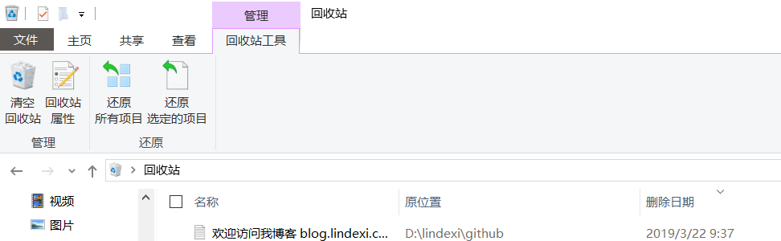

# dotnet 将文件删除到回收站

默认删除文件的时候 File.Delete 是将文件永久删除，如果是一些文档，建议删除到回收站，这样用户可以自己还原

通过 SHFileOperation 可以将文件放在回收站

<!--more-->
<!-- CreateTime:2019/8/31 16:55:58 -->


本文提供的方法暂时只能在 x86 程序使用，此方法暂时不适合 dotnet core 程序

添加一个帮助类

```csharp
    public static class RecycleBin
    {
        public static void DeleteToRecycleBin(string file)
        {
            var shf = new SHFILEOPSTRUCT
            {
                wFunc = FO_DELETE,
                fFlags = FOF_ALLOWUNDO | FOF_NOCONFIRMATION,
                // pFrom 需要在字符串后面加两个 \0 才可以 https://docs.microsoft.com/en-us/windows/desktop/api/shellapi/ns-shellapi-_shfileopstructa
                pFrom = file + "\0"
            };
            SHFileOperation(ref shf);
        }

        [StructLayout(LayoutKind.Sequential, CharSet = CharSet.Auto, Pack = 1)]
        private struct SHFILEOPSTRUCT
        {
            public int hwnd;
            [MarshalAs(UnmanagedType.U4)] public int wFunc;
            public string pFrom;
            public string pTo;
            public short fFlags;
            [MarshalAs(UnmanagedType.Bool)] public bool fAnyOperationsAborted;
            public int hNameMappings;
            public string lpszProgressTitle;
        }

        [DllImport("shell32.dll", CharSet = CharSet.Auto)]
        private static extern int SHFileOperation(ref SHFILEOPSTRUCT FileOp);

        private const int FO_DELETE = 3;
        private const int FOF_ALLOWUNDO = 0x40;
        private const int FOF_NOCONFIRMATION = 0x10;
    }
```

这个类里面只有一个公开方法，要求传入一个文件

下面添加一些测试的代码

```csharp
        static void Main(string[] args)
        {
            var folder = @"D:\lindexi\github\";
            var file = Path.Combine(folder, "欢迎访问我博客 blog.lindexi.com 里面有大量 UWP WPF 博客.txt");
            Directory.CreateDirectory(folder);
            if (!File.Exists(file))
            {
                File.WriteAllText(file, "欢迎访问我博客 blog.lindexi.com 里面有大量 UWP WPF 博客");
            }

            RecycleBin.DeleteToRecycleBin(file);
        }
```

尝试运行代码

<!--  -->


如果可以引用`Microsoft.VisualBasic`那么写起来就很清真

```csharp
Microsoft.VisualBasic.FileIO.FileSystem.DeleteDirectory(filename or folder,
      Microsoft.VisualBasic.FileIO.UIOption.OnlyErrorDialogs, 
        Microsoft.VisualBasic.FileIO.RecycleOption.SendToRecycleBin);
```

代码在[github](https://github.com/lindexi/lindexi_gd/tree/f3eee3b6b4ffff7f3957fea7d6372f3b060f0885/SeltewitirkiNirwemaki)

[c# - Send a File to the Recycle Bin - Stack Overflow](https://stackoverflow.com/questions/3282418/send-a-file-to-the-recycle-bin )

[Delete files or folders to recycle bin in C#](https://www.fluxbytes.com/csharp/delete-files-or-folders-to-recycle-bin-in-c/ )

<a rel="license" href="http://creativecommons.org/licenses/by-nc-sa/4.0/"></a><br />本作品采用<a rel="license" href="http://creativecommons.org/licenses/by-nc-sa/4.0/">知识共享署名-非商业性使用-相同方式共享 4.0 国际许可协议</a>进行许可。欢迎转载、使用、重新发布，但务必保留文章署名[林德熙](http://blog.csdn.net/lindexi_gd)(包含链接:http://blog.csdn.net/lindexi_gd )，不得用于商业目的，基于本文修改后的作品务必以相同的许可发布。如有任何疑问，请与我[联系](mailto:lindexi_gd@163.com)。  
