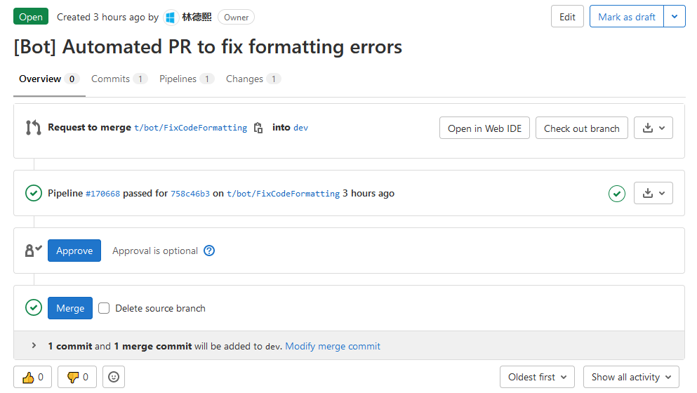

# dotnet 将自动代码格式化机器人带入团队 GitLab 平台

给团队带入一个 代码格式化机器人 能提升团队的幸福度，让团队的成员安心写代码，不用关注代码格式化问题。也可以减少在代码审查里撕格式化问题

本文来告诉大家如何给团队的 GitLab 平台带入一个自动代码格式化机器人

<!--more-->
<!-- 草稿 -->

本文所使用的工具和代码都是完全开源的，请看 [https://github.com/dotnet-campus/dotnetcampus.DotNETBuildSDK](https://github.com/dotnet-campus/dotnetcampus.DotNETBuildSDK)

我所在的团队，用的代码平台只有两个，分别是 GitHub 和 GitLab 这两个。其中 GitHub 上有 GitHub 的 Action 平台，做啥都特别方便，在去年我就完成了给 GitHub 仓库配置自动代码格式化机器人，请看 [dotnet 基于 dotnet format 的 GitHub Action 自动代码格式化机器人](https://blog.lindexi.com/post/dotnet-%E5%9F%BA%E4%BA%8E-dotnet-format-%E7%9A%84-GitHub-Action-%E8%87%AA%E5%8A%A8%E4%BB%A3%E7%A0%81%E6%A0%BC%E5%BC%8F%E5%8C%96%E6%9C%BA%E5%99%A8%E4%BA%BA.html )

在咱 dotnet 里面，有官方发布的专门用于代码格式化的工具 [dotnet format](https://github.com/dotnet/format ) 工具。此工具也在 GitHub 上开源，请看 [dotnet/format: Home for the dotnet-format command](https://github.com/dotnet/format )

引入自动代码格式化机器人，相当于雇一个免费的工具人帮你不断进行 ctrl+k ctrl+d 进行格式化代码

想要在 GitLab 的仓库上引入 C# 自动代码格式化机器人，可以通过组合两个工具来实现，一个工具是 [dotnet format](https://github.com/dotnet/format ) 工具，进行代码格式化。另一个工具是将格式化完成的代码进行推送和创建合并请求

为了方便大家使用，我编写了一个工具，此工具合入了代码格式化和推送代码创建合并请求的功能，使用方法特别简单。基于 dotnet tool 发布，大家部署起来也只需要一句话

如以下代码就是我所在团队里面的 `.gitlab-ci.yml` 配置，只需要如下几句话即可自动在 dev 分支有推送的时候，自动格式化代码，然后创建一个创建合并请求

```yml
stages:
  - build

FormatCode:
  # 自动格式化代码机器人，将使用 dotnet format 格式化
  # 格式化规则参阅 .editorconfig 文件
  stage: build
  script:
    - "chcp 65001"
    - "dotnet tool update -g dotnetCampus.GitLabCodeFormatBot" # 安装或更新工具
    - "AutomateFormatCodeAndCreateGitLabMergeRequest" # 格式化代码，推送代码和创建合并请求
  only:
    - dev
```

运行效果如下

<!--  -->


对于 AutomateFormatCodeAndCreateGitLabMergeRequest 命令，是支持传入丰富的参数的，参数列表如下

- `-CodeFormatBranch`: 用于给格式化代码使用的分支，默认是 t/bot/FixCodeFormatting 分支
- `-GitLabPushUrl`: 用于上传代码的 GitLab 地址，格式如 `git@gitlab.sdlsj.net:lindexi/foo.git` 地址。可选，默认将通过环境变量拼接 `git@$CI_SERVER_HOST:$CI_PROJECT_PATH.git` 地址

- `-GitLab`: GitLab 地址，如 `https://gitlab.sdlsj.net` 。可选，默认将通过环境变量获取 GitLab 的 `$CI_SERVER_URL` 变量
- `-Token`: 拥有创建 MergeRequest 的 Token 值，可在 GitLab 上的 `profile/personal_access_tokens` 生成。可选，默认将通过环境变量获取 GitLab 的 `Token` 变量。此变量需要运维手动设置才有
- `-ProjectId`: 将要创建 MergeRequest 的仓库项目 Id 值。可选，默认将通过环境变量获取 GitLab 的 `$CI_PROJECT_ID` 常量
- `-TargetBranch`: 将从 SourceBranch 合并到 TargetBranch 分支。可选，默认将通过环境变量获取 GitLab 的 `$CI_DEFAULT_BRANCH` 分支，也就是仓库的默认分支
- `-SourceBranch`: 将从 SourceBranch 合并到 TargetBranch 分支。可选，默认将通过环境变量获取 GitLab 的 `$CI_COMMIT_BRANCH` 分支，也就是当前 CI 正在运行分支
- `-Title`: 提交 MergeRequest 的标题。可选，默认是 "[Bot] Automated PR to fix formatting errors" 字符串

在 GitLab 上，将会在调用命令，传入很多变量，因此大部分可选的命令都是可以不用输入。以上代码关于 Token 的生成等，请参阅 


博客


以上工具格式化的配置，是依靠仓库的 `.editorconfig` 文件进行配置，更多请参阅 [.NET code style rule options - .NET](https://docs.microsoft.com/en-us/dotnet/fundamentals/code-analysis/code-style-rule-options?WT.mc_id=WD-MVP-5003260 )

<a rel="license" href="http://creativecommons.org/licenses/by-nc-sa/4.0/"></a><br />本作品采用<a rel="license" href="http://creativecommons.org/licenses/by-nc-sa/4.0/">知识共享署名-非商业性使用-相同方式共享 4.0 国际许可协议</a>进行许可。欢迎转载、使用、重新发布，但务必保留文章署名[林德熙](http://blog.csdn.net/lindexi_gd)(包含链接:http://blog.csdn.net/lindexi_gd )，不得用于商业目的，基于本文修改后的作品务必以相同的许可发布。如有任何疑问，请与我[联系](mailto:lindexi_gd@163.com)。
