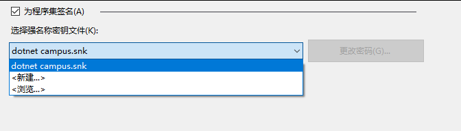

# dotnet 强签名下使用 InternalsVisibleToAttribute 给程序集加上友元

在 dotnet 里面，可以使用 InternalsVisibleToAttribute 特性，给程序集加上友元程序集，这样能让友元程序集访问到 internal 的程序。也就是说如果我有 A 和 B 两个程序集，我设置了 B 作为 A 的友元程序集 那么此时 B 程序集就能访问 A 程序集里面所有的 internal 成员。默认的友元设置只需要通过 InternalsVisibleToAttribute 特性写入友元程序集名就可以，但是如果程序集有强签名，就需要加上公钥

<!--more-->
<!-- CreateTime:2020/12/18 20:49:41 -->

<!-- 发布 -->

假定我有 A 和 B 两个程序集，我想要让 B 可以访问到 A 程序集里面所有的 internal 成员，那么我可以在 A 程序集里面通过 InternalsVisibleToAttribute 加上友元程序集，如下面代码

```csharp
[assembly: InternalsVisibleTo("B")]
```

以上代码需要写在 using 下面，命名空间 namespace 定义的上面，基本上这个代码都放在 AssemblyInfo.cs 文件里面

但如果此时的 A 程序集是添加了强签名的，那么以上代码将构建不通过

```
错误	CS1726	友元程序集引用“KicibehemNilaycahikem”无效。强名称签名的程序集必须在其 InternalsVisibleTo 声明中指定一个公钥。		
```

添加了强签名的程序集用途是说明这个程序集是谁发布的，而没有任何保密等作用。不过防篡改功能也是可以通过强签名实现的，在运行的时候判断一下文件摘要信息和公钥比对就可以知道文件是否被篡改。但这样做不到防破解和代码保密等

而给程序集加强签名的方法也很简单，咱可以自由创建自己的 snk 密钥文件，这里面包含的是非对称的加密。做法是右击项目属性，选择为程序集签名，然后下拉选择新建或使用现有的证书

<!--  -->


新建的时候输入证书名就可以，可以不加上密码

此时就可以拿到 snk 密钥文件，同时给程序集加上签名了

而想要加入到友元的程序集，也需要签名，对于友元程序集的签名密钥没有要求，只要有签名就可以了。如上面例子的 B 程序集，也使用一个密钥文件进行签名，签名之后，还需要将密钥文件的公钥写到 InternalsVisibleTo 的参数里面，格式如下

```csharp
 	[assembly: InternalsVisibleTo("B, PublicKey=******")]
```

那么咱如何拿到 PublicKey 的值，上面代码的 ****** 代表的只是 B 的公钥。假定 B 程序集的密钥文件是 dotnet-campus.snk 文件，那么通过以下步骤就可以拿到此密钥文件的公钥

先打开开发者命令行工具

<!--  -->


在开发者命令行工具可以使用 sn 命令，用到签名工具。使用 sn 工具读取出 dotnet-campus.snk 的公钥，可以使用下面代码

```csharp
sn -p "dotnet-campus.snk" "dotnet-campus.PublicKey.snk"
```

运行上面代码将会创建 dotnet-campus.PublicKey.snk 文件，这个文件里面将包含 dotnet-campus.snk 密钥文件的公钥

接下来咱使用下面命令输出 dotnet-campus.PublicKey.snk 文件的公钥

```csharp
sn -tp dotnet-campus.PublicKey.snk
```

此时输出的内容大概如下，这就是密钥文件的公钥

```
Microsoft(R) .NET Framework 强名称实用工具 版本 4.0.30319.0
版权所有(C) Microsoft Corporation。保留所有权利。

公钥(哈希算法: sha1):
002400000480000094000000060200000024000052534131000400000100010069a9f306e1a644
e0576651ebe3ec12a535f55f2268e50da02cfa9b969b6492a80a4c7bf7b17b9edb232fbfc0c617
8ea1f5ef58f3d82f25dfa7b6cf02e0bde35f879e45d8af6847fac7c1c1a5e855d915a552aef4f0
dc97d4cab25f70524ca74912121a1f2233c96cd501b5efc717d933bf15f23d256aa7cf37b9ce81
4fd2def1

公钥标记为 d9b785a303650e22
```

在代码里面将公钥内容替换到上面的 ****** 内容，大概如下

```csharp
[assembly: InternalsVisibleTo("B,PublicKey=002400000480000094000000060200000024000052534131000400000100010069a9f306e1a644e0576651ebe3ec12a535f55f2268e50da02cfa9b969b6492a80a4c7bf7b17b9edb232fbfc0c6178ea1f5ef58f3d82f25dfa7b6cf02e0bde35f879e45d8af6847fac7c1c1a5e855d915a552aef4f0dc97d4cab25f70524ca74912121a1f2233c96cd501b5efc717d933bf15f23d256aa7cf37b9ce814fd2def1")]
```

[使用InternalsVisibleToAttribute给assembly添加“友元assembly”特性遭遇"强签名" - jack_Meng - 博客园](https://www.cnblogs.com/mq0036/p/9660746.html )

<a rel="license" href="http://creativecommons.org/licenses/by-nc-sa/4.0/"></a><br />本作品采用<a rel="license" href="http://creativecommons.org/licenses/by-nc-sa/4.0/">知识共享署名-非商业性使用-相同方式共享 4.0 国际许可协议</a>进行许可。欢迎转载、使用、重新发布，但务必保留文章署名[林德熙](http://blog.csdn.net/lindexi_gd)(包含链接:http://blog.csdn.net/lindexi_gd )，不得用于商业目的，基于本文修改后的作品务必以相同的许可发布。如有任何疑问，请与我[联系](mailto:lindexi_gd@163.com)。
