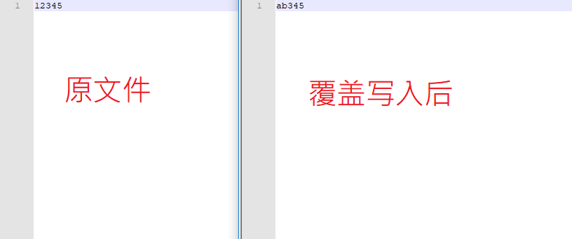

# dotnet 文件读写务必注意事项

这是启亮整理的文档，我就帮他发布了

<!--more-->
<!-- CreateTime:2019/11/29 8:34:43 -->

<!-- csdn -->

在开发中，涉及文件读写时，一定要注意以下事项，以避免未知情况发生。

- 一定要进行文件夹路径存在与否的判断，尤其是拼接时
- 文件存在与否的判断，如果存在，
- 如果文件存在，写入时，注意函数调用，是否采用了成覆盖方式，以致文件原来的内容还残留在文件尾部

   如原文件内容12345，覆盖写入“ab”，由于没有清除原内容，最后造成了非预期的内容“ab345”

   <!--  -->

   

- 读写权限的判断
- 区分相对路径、绝对路径
- 注意多进程访问和多线程访问
- 注意文件编码，注意带BOM和不带的
   
   请看[C＃ 判断文件编码](https://blog.lindexi.com/post/C-%E5%88%A4%E6%96%AD%E6%96%87%E4%BB%B6%E7%BC%96%E7%A0%81.html )
 
 本作品采用<a rel="license" href="http://creativecommons.org/licenses/by-nc-sa/4.0/">知识共享署名-非商业性使用-相同方式共享 4.0 国际许可协议</a>进行许可。欢迎转载、使用、重新发布，但务必保留文章署名[林德熙](http://blog.csdn.net/lindexi_gd)(包含链接:http://blog.csdn.net/lindexi_gd )，不得用于商业目的，基于本文修改后的作品务必以相同的许可发布。如有任何疑问，请与我[联系](mailto:lindexi_gd@163.com)。
