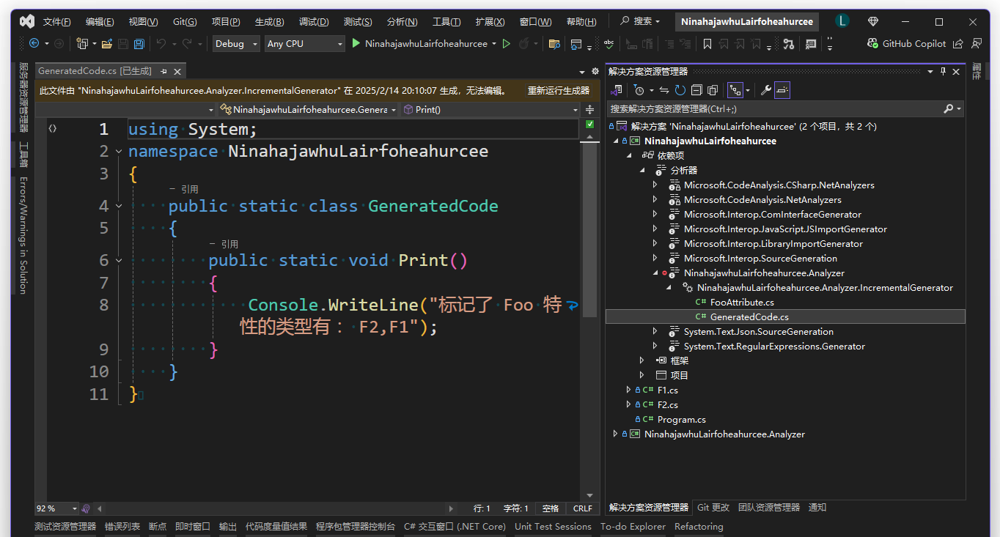

# dotnet 源代码生成器分析器入门

本文将带领大家入门 dotnet 的 SourceGenerator 源代码生成器技术，期待大家阅读完本文能够看懂理解和编写源代码生成器和分析器

<!--more-->
<!-- CreateTime:2025/02/11 07:29:34 -->

<!-- 草稿 -->

恭喜你看到了本文，进入到 C# dotnet 的深水区。如果你还是在浅水玩耍的小鲜肉，推荐你点击右上方的关闭按钮，避免受到过于深入的知识的污染

我所在的团队在 Rosyln 刚出来没两年就开始玩了，那时候还没有现在这么多机制。我之前很多关于 Rosyln 的博客涉及到了很底层的玩法，导致入门门槛过高。随着 dotnet 生态的不断建设，渐渐有了源代码生成技术、增量源代码生成技术等等。这次我打算综合之前的经验和知识，根据现在的 dotnet 的生态技术，编写这篇入门博客，让大家更好地入门源代码生成器和分析器，降低入门门槛。本文将尽量使用比较缓的知识爬坡方式编写，以便让大家更舒适地进入到源代码生成器和分析器的世界

在开始之前期望大家已经了解基础的 dotnet C# 基础知识，了解基础的概念和项目组织结构

在阅读本文过程中，发现本文有任何错误或不足之处，欢迎大家在评论区留言或发送邮件给我，我会尽快修正。如果大家有任何问题或疑问，也欢迎大家在评论区留言或发送邮件给我，我会尽快回复

本文内容比较长，知识量比较多，推荐先点收藏

## 项目搭建

本文先从项目搭建开始告诉大家如何创建一个源代码生成器项目。本文后续的内容将会在这个项目中进行演示。本文的编写顺序是先搭建项目，然后再讲解一些基础的概念和用法，再到如何进行调试，最后提供一些实际的演练给到大家。基础知识部分也放在演练里面，先做演练再讲基础知识，防止一口气拍出大量基础知识劝退大家

本文的推荐打开方式是一边阅读本文，一边打开 Visual Studio 2022 或更高版本，对照本文的内容进行操作。照着本文的内容对照着编写代码，可以让大家更好地理解本文的内容，照着过一遍预计就能掌握基础的源代码生成器和分析器的知识，入门源代码生成器和分析器的编写

本文过程中会添加一些外部链接文档，这些外部链接文档都是可选阅读内容，只供大家感兴趣时扩展阅读。本文的核心内容是在本文中编写的，不需要阅读外部链接文档也能够掌握本文的内容。作为入门博客，我担心自己编写过程中存在高手盲区问题，于是尽可能将更多细节写出来，尽管这样会导致一些重复的表述

先新建一个控制台项目，新建完成在 Visual Studio 2022 或更高版本中打开项目，双击 csproj 项目文件，即可进行编辑项目文件

本文这里新建了一个名为 `DercelgefarKarhelchaye.Analyzer` 的控制台项目。也许细心的伙伴发现了这个项目使用了 `Analyzer` 作为后缀，这是因为在 dotnet 中源代码生成器和分析器是一体的，按照历史原因的惯性，依然将其命名为分析器项目。在 Visual Studio 2022 的每个项目依赖项里面，大家都会看到如下图的一个名为分析器的项，而没有专门一个名为源代码生成器的项，其原因也是如此

<!--  -->


如果在这一步就开始卡住了也不用慌，本文在整个过程中都会给出示例代码。我整个代码仓库比较庞大，使用本文各个部分提供的拉取源代码的命令行代码，可以减少拉取的数据，提升拉取的速度，且能够确保切换到正确的 commit 代码

创建之后，在 Visual Studio 的解决方案里的界面大概如下

<!--  -->


编辑名为 `DercelgefarKarhelchaye.Analyzer` 的控制台项目的 csproj 项目文件，将其 TargetFramework 降级到 netstandard2.0 版本，且按照 dotnet 的惯例，使用 NuGet 添加必要的组件。编辑之后的 csproj 项目文件的内容如下

```xml
<Project Sdk="Microsoft.NET.Sdk">

  <PropertyGroup>
    <TargetFramework>netstandard2.0</TargetFramework>
    <LangVersion>latest</LangVersion>
    <EnforceExtendedAnalyzerRules>true</EnforceExtendedAnalyzerRules>
  </PropertyGroup>

  <ItemGroup>
    <PackageReference Include="Microsoft.CodeAnalysis.Analyzers" Version="3.11.0" PrivateAssets="all" />
    <PackageReference Include="Microsoft.CodeAnalysis.CSharp" Version="4.12.0" PrivateAssets="all" />
  </ItemGroup>

</Project>
```

为什么需要降级为 netstandard2.0 版本？这是为了让此分析器项目能够同时在 dotnet CLI 和 Visual Studio 2022 里面使用。在 Visual Studio 2022 里，当前依然使用的是 .NET Framework 的版本。于是求最小公倍数，选择了 netstandard2.0 版本。预计后续版本才能使用到最新的 dotnet 框架版本

以上的 `<LangVersion>latest</LangVersion>` 只是为了方便让咱使用最新的语言特性。前面选择的 netstandard2.0 会导致语言特性默认开得比较低，这里设置为 latest 可以让我们使用最新的语言特性，让代码编写更加方便。这里需要再次提醒，在 dotnet 里面，语言和框架是分开的。使用低版本框架也能使用高版本语言。如果对语言和框架的关系依然有所疑惑，推荐先了解一下 dotnet 的基础知识，不要着急往下看。编写源代码生成器和分析器需要对 dotnet 有一定的了解，否则写着就开始混淆概念了

以上的 `<EnforceExtendedAnalyzerRules>true</EnforceExtendedAnalyzerRules>` 的作用是强制执行扩展分析器规则。这个属性是为了让我们在编写分析器的时候能够更加严格，让我们的代码更加规范。这里大家不需要细致了解，如有兴趣，请参阅 [Roslyn 分析器 EnforceExtendedAnalyzerRules 属性的作用](https://blog.lindexi.com/post/Roslyn-%E5%88%86%E6%9E%90%E5%99%A8-EnforceExtendedAnalyzerRules-%E5%B1%9E%E6%80%A7%E7%9A%84%E4%BD%9C%E7%94%A8.html )
<!-- [Roslyn 分析器 EnforceExtendedAnalyzerRules 属性的作用 - lindexi - 博客园](https://www.cnblogs.com/lindexi/p/17678673.html ) -->

以上的 `Microsoft.CodeAnalysis.Analyzers` 和 `Microsoft.CodeAnalysis.CSharp` 是必须的组件。`Microsoft.CodeAnalysis.Analyzers` 是分析器的基础组件，`Microsoft.CodeAnalysis.CSharp` 是 C# 的基础组件。这两个组件是必须的，没有这两个组件，我们就无法编写分析器和源代码生成器

通过以上的步骤也可以让大家看到，其实 dotnet 分析器项目也没什么特殊的，依然可以通过一个简单的控制台项目修改而来。其核心关键仅仅只是安装了 `Microsoft.CodeAnalysis.Analyzers` 和 `Microsoft.CodeAnalysis.CSharp` 两个组件而已

<!--  -->


现在只是有了一个空的分析器项目，但是还不知道这个项目的效果。为了让分析器项目工作，那就需要有一个被分析的项目。为此咱就再次新建一个控制台项目，让这个控制台项目成为被分析项目

我这里新建了一个名为 `DercelgefarKarhelchaye` 的控制台项目。编辑 `DercelgefarKarhelchaye` 的 csproj 项目文件，让其引用 `DercelgefarKarhelchaye.Analyzer` 项目，且设置 `DercelgefarKarhelchaye.Analyzer` 为分析器。编辑之后的 csproj 项目文件的内容如下

```xml
<Project Sdk="Microsoft.NET.Sdk">

  <PropertyGroup>
    <OutputType>Exe</OutputType>
    <TargetFramework>net9.0</TargetFramework>
    <ImplicitUsings>enable</ImplicitUsings>
    <Nullable>enable</Nullable>
  </PropertyGroup>

  <ItemGroup>
    <ProjectReference Include="..\DercelgefarKarhelchaye.Analyzer\DercelgefarKarhelchaye.Analyzer.csproj" OutputItemType="Analyzer" ReferenceOutputAssembly="false"/>
  </ItemGroup>

</Project>
```

可以看到以上的 csproj 项目文件和正常的控制台项目的差别仅仅只有在对 `DercelgefarKarhelchaye.Analyzer.csproj` 的引用上。且和正常的引用项目的方式不同的是，这里额外添加了 `OutputItemType="Analyzer" ReferenceOutputAssembly="false"` 两个配置。这两个配置的作用如下：

- 以上的 `OutputItemType="Analyzer"` 是告诉 dotnet 这个引用项目是一个分析器项目。这个配置是必须的，没有这个配置，dotnet 就不知道这个项目是一个分析器项目。通过这个配置是告诉 dotnet 这个项目是一个分析器项目，才能让 dotnet 在编译的时候能够正确地当成分析器处理这个项目
- 以上的 `ReferenceOutputAssembly="false"` 是告诉 dotnet 不要引用这个项目的输出程序集。正常的项目是不应该引用分析器项目的程序集的，分析器项目的作用仅仅只是作为分析器，而不是提供程序集给其他项目引用。这个配置是为了让 dotnet 在编译的时候不要引用这个项目的输出程序集，避免引用错误或导致不小心用了不应该使用的类型

对于正常的项目引用来说，一旦存在项目引用，那被引用的项目的输出程序集就会被引用。此时项目上就可以使用被引用项目的公开类型，以及获取 NuGet 包依赖传递等。但是对于分析器项目来说，这些都是不应该的，正常就不能让项目引用分析器项目的输出程序集。这就是为什么会额外添加 `ReferenceOutputAssembly="false"` 配置的原因

<!--  -->


在这里，咱接触到了非常多次的 csproj 项目文件，如果大家对 csproj 项目文件格式感兴趣，请参阅 [理解 C# 项目 csproj 文件格式的本质和编译流程 - walterlv](https://blog.walterlv.com/post/understand-the-csproj )

以上的步骤完成之后，最简单的分析器项目和被分析的项目就搭建完成了。这也是分析器的基础，大部分的带分析器的代码都是如此方式搭建的。但也有其他部分是通过 NuGet 带出去的分析器，被 NuGet 带出去的分析器能够更好做到开箱即用，不需要让分析器尝试构建。在后文将会讲解如何将分析器通过 NuGet 带出去，即如何进行分发分析器

现在的分析器项目还没有任何源代码生成和分析的功能，接下来咱将编写简单的源代码生成的代码，让大家看到源代码生成器的效果

## 编写源代码生成器

在 `DercelgefarKarhelchaye.Analyzer` 项目中新建一个名为 `IncrementalGenerator` 的源代码生成器类。编辑 `IncrementalGenerator` 类，让其继承 `IIncrementalGenerator` 接口，实现 `Initialize` 方法，且标记 `[Generator(LanguageNames.CSharp)]` 特性。编辑之后的 `HelloWorldGenerator` 类的内容如下

```csharp
using Microsoft.CodeAnalysis;

namespace DercelgefarKarhelchaye.Analyzer;

[Generator(LanguageNames.CSharp)]
public class IncrementalGenerator : IIncrementalGenerator
{
    public void Initialize(IncrementalGeneratorInitializationContext context)
    {
        ... // 忽略其他代码
    }
}
```

本文这里直接就是和大家介绍 IIncrementalGenerator 增量 Source Generator 源代码生成器技术，不再介绍 ISourceGenerator 源代码生成器技术。其原因是在 2022 之后，官方大力推荐的是使用 IIncrementalGenerator 增量源代码生成器技术。从业务上讲，仅仅只是 IIncrementalGenerator 多了增量的功能，在进行源代码生成逻辑处理中没有太大的差别。功能上 IIncrementalGenerator 也能完全代替 ISourceGenerator 的功能。但是在性能上，IIncrementalGenerator 要比 ISourceGenerator 更加高效，更加快速，更加能够防止原本已经很卡的 Visual Studio 更加卡

整个 IIncrementalGenerator 的入口都在 Initialize 方法里面，从 IncrementalGeneratorInitializationContext 参数里可以点出来非常多有用的方法。咱这里先不展开讲解这些方法，先让大家看到一个简单的源代码生成器的效果

在 Initialize 方法里面，咱可以通过 `context.RegisterPostInitializationOutput` 方法注册一个源代码输出。如以下代码所示，将输出一个名为 `GeneratedCode` 的代码

```csharp
    public void Initialize(IncrementalGeneratorInitializationContext context)
    {
        context.RegisterPostInitializationOutput(initializationContext =>
        {
            initializationContext.AddSource("GeneratedCode.cs",
                """
                using System;
                namespace DercelgefarKarhelchaye
                {
                    public static class GeneratedCode
                    {
                        public static void Print()
                        {
                            Console.WriteLine("Hello from generated code!");
                        }
                    }
                }
                """);
        });
    }
```

预期此时能够将生成的 `GeneratedCode` 类型注入到被分析的项目中。在被分析的项目中，可以通过 `GeneratedCode.Print()` 方法输出 `Hello from generated code!` 字符串

好的，进入到 `DercelgefarKarhelchaye` 项目中，编辑 `Program` 类，调用 `GeneratedCode.Print()` 方法。编辑之后的 `Program` 类的内容如下

```csharp
using DercelgefarKarhelchaye;

GeneratedCode.Print();
```

尝试运行一下 `DercelgefarKarhelchaye` 项目，可以看到控制台输出了 `Hello from generated code!` 字符串。这就是源代码生成器的效果，通过源代码生成器生成的代码，注入到被分析的项目中，让被分析的项目能够使用生成的代码

如此证明了在 `DercelgefarKarhelchaye.Analyzer` 分析器项目中编写的源代码生成器生效了。这就是源代码生成器的基硋，通过源代码生成器生成的代码，注入到被分析的项目中，让被分析的项目能够使用生成的代码

以上代码放在 [github](https://github.com/lindexi/lindexi_gd/tree/95c14524130238b2d6fbca97ca35b89dc921536b/Roslyn/DercelgefarKarhelchaye) 和 [gitee](https://gitee.com/lindexi/lindexi_gd/tree/95c14524130238b2d6fbca97ca35b89dc921536b/Roslyn/DercelgefarKarhelchaye) 上，可以使用如下命令行拉取代码。我整个代码仓库比较庞大，使用以下命令行可以进行部分拉取，拉取速度比较快

先创建一个空文件夹，接着使用命令行 cd 命令进入此空文件夹，在命令行里面输入以下代码，即可获取到本文的代码

```
git init
git remote add origin https://gitee.com/lindexi/lindexi_gd.git
git pull origin 95c14524130238b2d6fbca97ca35b89dc921536b
```

以上使用的是国内的 gitee 的源，如果 gitee 不能访问，请替换为 github 的源。请在命令行继续输入以下代码，将 gitee 源换成 github 源进行拉取代码。如果依然拉取不到代码，可以发邮件向我要代码

```
git remote remove origin
git remote add origin https://github.com/lindexi/lindexi_gd.git
git pull origin 95c14524130238b2d6fbca97ca35b89dc921536b
```

获取代码之后，进入 Roslyn/DercelgefarKarhelchaye 文件夹，即可获取到源代码

## 分析和生成入门

在上文中，和大家介绍了如何生成静态的固定的代码内容。在 `RegisterPostInitializationOutput` 方法里面，只允许传递静态固定的代码，不能依据当前项目状态或配置进行动态生成代码。这是因为 `RegisterPostInitializationOutput` 方法的定义上就是用于提供分析器开始分析工作之前的初始化代码。这部分代码由于可不用运行分析过程，可以非常快给到 IDE 层，一般用于提供一些类型定义，可以给到开发者直接快速使用，而不会在使用过程中飘红

上文的代码只是让大家粗略熟悉了一下 `IIncrementalGenerator` 的 API 调用方法。接下来我将带大家开始入门分析器的分析和生成功能

分析和生成很多时候都是不分离的，生成的代码需要依赖分析的结果。为了能让大家更好理解分析器的入门知识，我尝试布置一个任务，接下来让咱根据布置的任务来入门分析和生成功能

### 任务

咱来实现一个经典的需求任务，将项目里面的标记了某个 Attribute 特性的类型全收集起来，最后生成一个代码，让生成的代码输出有哪些类型标记了这个 Attribute 特性，将这些类型的名称输出到控制台

进一步分解任务需求，咱需要有一个源代码生成器。源代码生成器生成两部分代码，第一部分就是 FooAttribute 特性，第二部分就是收集所有标记了 FooAttribute 特性的类型，生成将这些类型的名称输出到控制台的代码。要求全程没有反射参与，全程都是通过 Roslyn 分析和生成完成

### 使用 ForAttributeWithMetadataName 快速分析代码

从工程上进行分析发现，非常大量的分析生成任务都有一个特点，这个特点就是需要找到标记了某个 Attribute 特性的类型或方法或属性等，然后再做某个事情。这个特点其实源自于 dotnet C# 对于 Attribute 特性的设计。Attribute 特性是一种元数据，可以标记在类型、方法、属性等上面，用于描述这个类型、方法、属性等的特性。也常常用于标记给 IDE 和编译器看的，用于告诉 IDE 和编译器这个类型、方法、属性等的特性。比如常用的 `ObsoleteAttribute` 、`CallerMemberNameAttribute` 、`DebuggerDisplayAttribute` 等等

在 `IIncrementalGenerator` 增量 Source Generator 源代码生成器中，提供了 ForAttributeWithMetadataName 工具方法。如此方法名所述，这个方法是用于找到标记了某个 Attribute 特性的类型、方法、属性等。这个方法的使用非常简单，只需要传递一个 Attribute 特性的完整名称，就可以找到标记了这个 Attribute 特性的类型、方法、属性等

在上文的任务中，咱需要找到标记了某个 Attribute 特性的类型，然后将这些类型的名称输出到控制台。这个任务非常适合使用 ForAttributeWithMetadataName 方法来实现。接下来咱就来实现这个任务

依然是新建两个项目，其中一个作为分析器项目，另一个作为被分析的项目。大家既可以在上文现有的项目中继续编写，也可以新建两个项目。这里我新建了一个名为 `NinahajawhuLairfoheahurcee.Analyzer` 的分析器项目，和一个名为 `NinahajawhuLairfoheahurcee` 的被分析项目。本文内容里面只给出关键代码片段，如需要全部的项目文件，可在下文找到所有代码的下载方法。如果自己编写的代码构建不通过或运行输出不符合预期，也推荐大家拉取本文的代码进行阅读

先来完成任务需求分解中的第一部分，编写 FooAttribute 特性代码的生成。由于 FooAttribute 特性的代码不依赖任何分析结果，因此可以使用 RegisterPostInitializationOutput 方法生成。修改上文的 RegisterPostInitializationOutput 注册 `GeneratedCode.cs` 的代码，将其替换为 `FooAttribute.cs` 的生成代码，如下所示

```csharp
[Generator(LanguageNames.CSharp)]
public class IncrementalGenerator : IIncrementalGenerator
{
    public void Initialize(IncrementalGeneratorInitializationContext context)
    {
        // 先注册一个特性给到业务方使用
        context.RegisterPostInitializationOutput(initializationContext =>
        {
            initializationContext.AddSource("FooAttribute.cs",
                """
                namespace Lindexi;

                public class FooAttribute : Attribute
                {
                }
                """);
        });
    }
}
```

完成这一步之后，即可在业务端编写类型，将类型标记上 FooAttribute 特性。回到名为 `NinahajawhuLairfoheahurcee` 的被分析项目，在 `NinahajawhuLairfoheahurcee` 控制台项目里面添加两个类型，让这两个类型标记上 FooAttribute 特性，用于后续测试类型被收集

```csharp
using Lindexi;

namespace NinahajawhuLairfoheahurcee;

[Foo]
public class F1
{
}

[Foo]
public class F2
{
}
```

在 IIncrementalGenerator 增量 Source Generator 源代码生成，可在 IncrementalGeneratorInitializationContext 里面的 SyntaxProvider 属性，通过 ForAttributeWithMetadataName 快速收集标记了某个特性的类型、属性、方法等等

基本写法格式如下

```csharp
var provider =
    context.SyntaxProvider.ForAttributeWithMetadataName
    (
        "特性名",
        (SyntaxNode node, CancellationToken token) => 语法判断条件,
        (GeneratorAttributeSyntaxContext syntaxContext, CancellationToken token) => 语义处理和获取返回值
    );
```

第一个参数是特性名，记得带上特性的命名空间，以及写明特性的全名。在正常的 C# 代码里面，都会忽略 Attribute 后缀，但是在这里需要带上 Attribute 后缀。第二个参数是语法判断条件，用于判断当前节点是否符合条件。第三个参数是语义处理和获取返回值，用于处理当前节点的语义，获取返回值

那什么是语法，什么是语义呢？ 在 Roslyn 里面，将初步的代码分析的语法层面内容称为 Syntax 语法。语法是非常贴近编写出来的代码直接的内存映射的样子，这个过程里面只做片面考虑，即不考虑代码之间的引用关系，只考虑代码语法本身。语法分析过程是最早的过程，也是损耗极小的过程，也是可以并行化执行的过程。一般来说，进行语法分析都可以将写出来的代码分为一个个 SyntaxTree 语法树，每个代码或代码片都可以转换为一个 SyntaxNode 语法节点

对应于 Syntax 语法的概念，语义 Semantic 则是包含了代码的含义，不仅仅只是语法层面上，语义 Semantic 包含了代码之间的引用关系，包含了各个符号的信息。语义分析过程是在语法分析之后的过程，执行过程中有所损耗，且存在多个代码文件和程序集之间的引用关联关系，这就是为什么在 IIncrementalGenerator 增量 Source Generator 源代码生成设计中是先做语法分析，判断结果通过，再做语义分析的原因

再简单理解可以是如 C# 里面有分部类的概念，进行语法分析的时候，只能一次一个文件一个文件的分析，难以或无法直接分部类的其他分部在哪。但是进行语义分析的时候，可以将所有分部类的信息都收集起来，然后再进行分析，这样就能够找到所有分部类的信息。且在语义分析过程中，能够非常明确知道某个符号的确切含义

语法和语义有比较庞大的知识，我将在后文的专门章节里面详细介绍。这里只是让大家粗略了解一下语法和语义的概念，以便大家能够更好理解后续的内容。本章内容也不会涉及多少的语法和语义知识，不需要对语法和语义有太多的了解，只需要知道这两个概念的存在即可

粗略了解了一点语法和语义的概念，接下来咱就来实现 ForAttributeWithMetadataName 方法的使用。在 `NinahajawhuLairfoheahurcee.Analyzer` 分析器项目中，修改 IncrementalGenerator 类的 Initialize 方法，添加 ForAttributeWithMetadataName 方法的使用，如下所示

```csharp
        IncrementalValuesProvider<string> targetClassNameProvider = context.SyntaxProvider.ForAttributeWithMetadataName("Lindexi.FooAttribute",
            // 进一步判断
            (SyntaxNode node, CancellationToken token) => node.IsKind(SyntaxKind.ClassDeclaration),
            (GeneratorAttributeSyntaxContext syntaxContext, CancellationToken token) => syntaxContext.TargetSymbol.Name);
```

如上面代码所示，第一个参数传入特性名，即 `"Lindexi.FooAttribute"` 字符串。此时将进入预设逻辑，增量的寻找所有标记了名为 `"Lindexi.FooAttribute"` 特性的类型或属性或方法等等代码。一旦找到了标记了 `"Lindexi.FooAttribute"` 特性的代码，将会进入第二个参数的语法判断条件，即 `(SyntaxNode node, CancellationToken token) => node.IsKind(SyntaxKind.ClassDeclaration)` 代码块。此时将进入进一步判断，只有当找到的代码是类声明的时候，才是符合咱的任务需求的代码，即满足感兴趣的条件。这里的 SyntaxNode.IsKind 方法是判断当前传入的 SyntaxNode 是什么。前面步骤只是找到了标记了 `"Lindexi.FooAttribute"` 特性的代码，这里进一步判断找到的代码是不是类声明。满足前两个步骤，则证明这是一个在类型上面标记了名为 `"Lindexi.FooAttribute"` 特性的代码，可以进入最后一个参数里面进行进一步的语义处理

进一步的语义处理是 `(GeneratorAttributeSyntaxContext syntaxContext, CancellationToken token) => syntaxContext.TargetSymbol.Name` 代码块。这里的 GeneratorAttributeSyntaxContext.TargetSymbol 属性是当前找到的代码的符号，即当前找到的代码的语义信息。这里的 TargetSymbol.Name 属性是当前找到的代码的名称，即当前找到的代码的类型名称。这里的代码块返回的是当前找到的代码的类型名称，即当前找到的代码的名称

将其返回的内容是类似 Linq 的查询结果，即 `IncrementalValuesProvider<string>` 类型。这个类型是一个增量的值提供者，而不是立刻就返回一次所有满足条件的代码。在 Visual Studio 里面的执行逻辑上，大家可以认为是每更改、新增一次代码，就会执行一次这个查询逻辑，整个查询逻辑是源源不断执行的，不是一次性的，也不是瞬时全跑的，而是增量的逐步执行的

执行过程也是一级级执行的，先通过了第一个参数的特性名，快速判断是否满足参数条件，再经过第二个参数进行语法判断。经过前面两个参数判断就可以快速过滤掉大量的代码，如此的方式可以极大减少计算工作量

现在拿到了 `IncrementalValuesProvider<string>` 返回值，能够从这里源源不断取出一个个类型出来。但按照咱的任务需求，咱是需要一口气收集所有类型的，不能一个个慢慢取。为此咱需要将 `IncrementalValuesProvider<string>` 给收集起来，成为一个集合数组。这里可以使用 Collect 方法进行收集，如下所示

```csharp
        IncrementalValueProvider<ImmutableArray<string>> targetClassNameArrayProvider = targetClassNameProvider
            .Collect();
```

可以看到此时返回值就从 `IncrementalValuesProvider<string>` 类型转换为 `IncrementalValueProvider<ImmutableArray<string>>` 类型。核心不同在于 `string` 和 `ImmutableArray<string>` 不可变数组的差异而已。在整个 Roslyn 设计里面，大量采用不可变思想，这里的返回值就是不可变思想的一个体现

最后一步就是将 `IncrementalValueProvider<ImmutableArray<string>>` 返回值注册到输出源代码中。在 `IncrementalGenerator` 类的 Initialize 方法里面，使用 `context.RegisterSourceOutput` 方法注册输出源代码，如下所示

```csharp
        context.RegisterSourceOutput(targetClassNameArrayProvider, (productionContext, classNameArray) =>
        {
            productionContext.AddSource("GeneratedCode.cs",
                $$"""
                using System;
                namespace NinahajawhuLairfoheahurcee
                {
                    public static class GeneratedCode
                    {
                        public static void Print()
                        {
                            Console.WriteLine("标记了 Foo 特性的类型有： ｛｛string.Join(",", classNameArray)｝｝");
                        }
                    }
                }
                """);
        });
```

尝试运行控制台项目，可见此时能够输出以下内容到控制台

```
标记了 Foo 特性的类型有： F1,F2
```

尝试展开 Visual Studio 的 依赖项->分析器，如下图所示

<!--  -->


可以看到生成的代码如下

```csharp
using System;
namespace NinahajawhuLairfoheahurcee
{
    public static class GeneratedCode
    {
        public static void Print()
        {
            Console.WriteLine("标记了 Foo 特性的类型有： F2,F1");
        }
    }
}
```

如此以来，对比传统的反射的方法，源代码生成的方式可以将耗时完全放在开发编译过程，不会占用用户端的执行时间。且这个过程都是完完全全的直接代码，也方便运行时的 JIT 进行优化，大大提升了运行时间。完完全全的直接代码也带来了静态分析的友好，可以作为代码裁剪和 AOT 的底层支持

喜欢点点的伙伴也许在准备写 RegisterSourceOutput 的时候，就发现了还有一个名为 RegisterImplementationSourceOutput 方法，那 RegisterSourceOutput 和 RegisterImplementationSourceOutput 的差别是什么？这两个方法对最终生成的代码是没有影响的，核心差别是 RegisterImplementationSourceOutput 是用来注册具体实现生成的代码，这部分输入的代码会被 IDE 作为可选分析项。如 RegisterImplementationSourceOutput 命名所述，这是一个用来注册“具体实现”的代码，在代码里面，咱可以强行将代码分为“定义代码”和“实现代码”，比如说方法签名是定义代码，方法体是实现代码。从 IDE 的分析角度来看，只对“定义代码”而跳过“实现代码”，可以更大程度的减少分析压力，提升分析速度。通过 RegisterImplementationSourceOutput 方法注册的代码，会被 IDE 作为可选分析项，不会因为生成了大量代码导致 IDE 过于卡顿。但带来的问题是这部分生成代码可能不被加入 IDE 分析，导致业务方调用时飘红。因此通过 RegisterImplementationSourceOutput 生成的代码，基本要求是不会被业务方直接调用。常用的套路是先通过 RegisterSourceOutput 或甚至是 RegisterPostInitializationOutput 生成分部类或分部方法，然后再慢慢在 RegisterImplementationSourceOutput 里面填充实现代码。如果感觉对 RegisterSourceOutput 和 RegisterImplementationSourceOutput 的差别还是很混乱，没关系，咱将在后文通过实践来让大家更好地理解两者的差别

以上就是通过 ForAttributeWithMetadataName 开始入门编写分析和收集和生成的简单例子，如果对 ForAttributeWithMetadataName 使用方法感兴趣，扩展阅读部分请参阅 [使用 ForAttributeWithMetadataName 提高 IIncrementalGenerator 增量 Source Generator 源代码生成开发效率和性能](https://blog.lindexi.com/post/%E4%BD%BF%E7%94%A8-ForAttributeWithMetadataName-%E6%8F%90%E9%AB%98-IIncrementalGenerator-%E5%A2%9E%E9%87%8F-Source-Generator-%E6%BA%90%E4%BB%A3%E7%A0%81%E7%94%9F%E6%88%90%E5%BC%80%E5%8F%91%E6%95%88%E7%8E%87%E5%92%8C%E6%80%A7%E8%83%BD.html ) 
<!-- [使用 ForAttributeWithMetadataName 提高 IIncrementalGenerator 增量 Source Generator 源代码生成开发效率和性能 - lindexi - 博客园](https://www.cnblogs.com/lindexi/p/18009107 ) -->

如果大家照着以上的例子编写不出来能构建通过的代码，或者是运行代码不符合预期，欢迎拉取我的示例代码进行阅读

同样的，以上代码放在 [github](https://github.com/lindexi/lindexi_gd/tree/b8c036de9d9d7c4b1a3d329054086d6566d14dc4/Roslyn/NinahajawhuLairfoheahurcee) 和 [gitee](https://gitee.com/lindexi/lindexi_gd/tree/b8c036de9d9d7c4b1a3d329054086d6566d14dc4/Roslyn/NinahajawhuLairfoheahurcee) 上，可以使用如下命令行拉取代码。我整个代码仓库比较庞大，使用以下命令行可以进行部分拉取，拉取速度比较快

先创建一个空文件夹，接着使用命令行 cd 命令进入此空文件夹，在命令行里面输入以下代码，即可获取到本文的代码

```
git init
git remote add origin https://gitee.com/lindexi/lindexi_gd.git
git pull origin b8c036de9d9d7c4b1a3d329054086d6566d14dc4
```

以上使用的是国内的 gitee 的源，如果 gitee 不能访问，请替换为 github 的源。请在命令行继续输入以下代码，将 gitee 源换成 github 源进行拉取代码。如果依然拉取不到代码，可以发邮件向我要代码

```
git remote remove origin
git remote add origin https://github.com/lindexi/lindexi_gd.git
git pull origin b8c036de9d9d7c4b1a3d329054086d6566d14dc4
```

获取代码之后，进入 Roslyn/NinahajawhuLairfoheahurcee 文件夹，即可获取到源代码

## 更底层的收集分析和生成

阅读到这里，也许大家会感慨，使用 `ForAttributeWithMetadataName` 还是有很大的限制。比如我的需求任务是分析任意的继承了 IFoo 接口的代码，而没有任何的标记，那应该如何做呢？只通过 `ForAttributeWithMetadataName` 是无法实现的。这个时候就需要更底层的收集分析和生成技术

本文会和大家介绍 `ForAttributeWithMetadataName` 仅仅只是因为 `ForAttributeWithMetadataName` 方法使用简单，且使用频率高。不代表只能通过 `ForAttributeWithMetadataName` 方法进行分析和生成。实际上，`ForAttributeWithMetadataName` 方法只是对更底层的收集分析和生成技术的封装，更底层的收集分析和生成技术是可以实现更多的需求任务的

在 IIncrementalGenerator 增量 Source Generator 源代码生成里面提供了众多数据源入口，比如整个的配置、引用的程序集、源代码等等。最核心也是用最多的就是通过提供的源代码数据源进行收集分析

按照官方的设计，将会分为三个步骤完成增量代码生成：

1. 告诉框架层需要关注哪些文件或内容或配置的变更
  - 在有对应的文件等的变更情况下，才会触发后续步骤。如此就是增量代码生成的关键
2. 告诉框架层从变更的文件里面感兴趣什么数据，对数据预先进行处理
  - 预先处理过程中，是会不断进行过滤处理的，确保只有感兴趣的数据才会进入后续步骤
  - 其中第一步和第二步可以合在一起
3. 使用给出的数据进行处理源代码生成逻辑
  - 这一步的逻辑和普通的 Source Generator 是相同的，只是输入的参数不同

按照以上的步骤，咱来开始重新实现上文的使用 `ForAttributeWithMetadataName` 实现的任务需求。这次咱将不使用 `ForAttributeWithMetadataName` 方法，而是使用更底层的收集分析和生成技术。在这个实现过程中，大家也能感受到使用 `ForAttributeWithMetadataName` 方法的便捷性

为了方便大家后续拉取代码方便，防止多个版本之间的代码误导。我这里重新新建了两个项目，分别是名为 `BegalllalhereCilaywhonerdem.Analyzer` 的分析器项目，和一个名为 `BegalllalhereCilaywhonerdem` 的被分析项目。本文内容里面只给出关键代码片段，如需要全部的项目文件，可在下文找到所有代码的下载方法。如果自己编写的代码构建不通过或运行输出不符合预期，也推荐大家拉取本文的代码进行阅读

先完全按照上文的方式进行项目组织，甚至是完全的代码拷贝。因为接下来咱简要替换的部分只是将原本的 `ForAttributeWithMetadataName` 相关代码进行替换而已，其他逻辑依然保持不变

删掉原本的 `ForAttributeWithMetadataName` 相关代码，即删掉如下代码

```csharp
        IncrementalValuesProvider<string> targetClassNameProvider = context.SyntaxProvider.ForAttributeWithMetadataName("Lindexi.FooAttribute",
            // 进一步判断
            (SyntaxNode node, CancellationToken token) => node.IsKind(SyntaxKind.ClassDeclaration),
            (GeneratorAttributeSyntaxContext syntaxContext, CancellationToken token) => syntaxContext.TargetSymbol.Name);
        IncrementalValueProvider<ImmutableArray<string>> targetClassNameArrayProvider = targetClassNameProvider
            .Collect();
```

接下来咱将使用更底层的收集分析和生成技术，即从 `context.SyntaxProvider.CreateSyntaxProvider` 方法开始

在 `context.SyntaxProvider.CreateSyntaxProvider` 方法里面包含两个参数，第一个参数是一个进行语法判断的过程，第二个参数是进行语义进一步判断和加工处理的逻辑。也就是说 CreateSyntaxProvider 方法就包含了上文所述的“告诉框架层需要关注哪些文件或内容或配置的变更”和“告诉框架层从变更的文件里面感兴趣什么数据，对数据预先进行处理”两个步骤

在 CreateSyntaxProvider 方法里面，第一步的语法判断是判断当前传入的是否类型定义。如果是类型定义，则读取其标记的特性，判断特性满足 `Lindexi.FooAttribute` 的特征时，则算语法判断通过，让数据走到下面的语义判断处理上。其代码大概如下

```csharp
        IncrementalValueProvider<ImmutableArray<string>> targetClassNameArrayProvider = context.SyntaxProvider
            .CreateSyntaxProvider((node, _) =>
            {
                if (node is not ClassDeclarationSyntax classDeclarationSyntax)
                {
                    return false;
                }

                // 为什么这里是 Attribute List 的集合？原因是可以写出这样的语法
                // ```csharp
                // [A1Attribute, A2Attribute]
                // [A3Attribute]
                // private void Foo()
                // {
                // }
                // ```
                foreach (AttributeListSyntax attributeListSyntax in classDeclarationSyntax.AttributeLists)
                {
                    foreach (AttributeSyntax attributeSyntax in attributeListSyntax.Attributes)
                    {
                        NameSyntax name = attributeSyntax.Name;
                        string nameText = name.ToFullString();
                        if (nameText == "Foo")
                        {
                            return true;
                        }

                        if (nameText == "FooAttribute")
                        {
                            return true;
                        }

                        // 可能还有 global::Lindexi.FooAttribute 的情况
                        if (nameText.EndsWith("Lindexi.FooAttribute"))
                        {
                            return true;
                        }

                        if (nameText.EndsWith("Lindexi.Foo"))
                        {
                            return true;
                        }
                    }
                }

                return false;
            }, (syntaxContext, _) =>
            {
                // 先忽略语义处理过程代码
            }).Collect();
```

如上述的代码所示，首先是经过 `if (node is not ClassDeclarationSyntax classDeclarationSyntax)` 判断，过滤掉非类型定义部分的代码。此时就可以确保大量的代码都不会进入到后续分支。毕竟对于正常的代码逻辑来说，类型的定义还是少数哈。接着的逻辑编写就有些考大家对于 C# 的基础语法知识了，先获取特性列表。这里获取到的是列表的集合，为什么呢？因为在 C# 代码里面允许以下的写法，如上文代码注释所述

```csharp
[A1Attribute, A2Attribute]
[A3Attribute]
private void Foo()
{
}
```

以上代码里面的 `[A1Attribute, A2Attribute]` 就是一个特性列表，而 `[A1Attribute, A2Attribute]` 和  `A3Attribute` 三个特性构成了特性列表的集合，如此才能保证能够获取到所有的特性且不丢失语法上的特征。即可能某些特性是和其他的特性写在一起的特征才不会被丢失。这就是为什么需要有两层的 foreach 循环才能遍历所有的特性的原因

在语法层面上，是不能完全判断一个特性是否真的是某个指定类型的特性的，比如说对以下代码的分析

```csharp
[Foo]
public class F1
{
}
```

在语法层面上只能知道 F1 类型标记了 `[Foo]` 特性，但不知道这个 `[Foo]` 特性是否真的是 `Lindexi.FooAttribute` 特性。需要在语义分析过程中，进一步判断是否真的是 `Lindexi.FooAttribute` 特性。语法层面上只能知道写下去的是什么代码，完全字面量。这也就是为什么上面代码的判断逻辑会额外多了那么多判断的原因。当然了，如果大家图省事，那直接判断是否包含 `Foo` 字符串也可以的

上面代码使用了对 `NameSyntax` 调用 `ToFullString` 方法获取到所标记的名，再通过字符串判断逻辑，判断是否可能是标记了 `Lindexi.FooAttribute` 特性

```csharp
                        NameSyntax name = attributeSyntax.Name;
                        string nameText = name.ToFullString();

                        if (nameText == "Foo")
                        {
                            return true;
                        }

                        if (nameText == "FooAttribute")
                        {
                            return true;
                        }

                        // 可能还有 global::Lindexi.FooAttribute 的情况
                        if (nameText.EndsWith("Lindexi.FooAttribute"))
                        {
                            return true;
                        }

                        if (nameText.EndsWith("Lindexi.Foo"))
                        {
                            return true;
                        }
```

如果大家对以上的  `NameSyntax` 的 `ToFullString` 感兴趣，请参阅 [Roslyn NameSyntax 的 ToString 和 ToFullString 的区别](https://blog.lindexi.com/post/Roslyn-NameSyntax-%E7%9A%84-ToString-%E5%92%8C-ToFullString-%E7%9A%84%E5%8C%BA%E5%88%AB.html )

虽然上文判断逻辑看起来写的很多，但也不代表能通过语法判断逻辑的，就一定是标记了 `Lindexi.FooAttribute` 特性。在语义部分进行进一步处理，代码如下

```csharp
          context.SyntaxProvider
            .CreateSyntaxProvider((node, _) =>
            {
                // 忽略语法处理部分代码
            }, (syntaxContext, _) =>
            {
                ISymbol declaredSymbol = syntaxContext.SemanticModel.GetDeclaredSymbol(syntaxContext.Node);
                if (declaredSymbol is not INamedTypeSymbol namedTypeSymbol)
                {
                    return (string) null;
                }

                ImmutableArray<AttributeData> attributeDataArray = namedTypeSymbol.GetAttributes();

                // 在通过语义判断一次，防止被骗了
                if (!attributeDataArray.Any(t =>
                        t.AttributeClass?.ToDisplayString(SymbolDisplayFormat.FullyQualifiedFormat) ==
                        "global::Lindexi.FooAttribute"))
                {
                    return (string) null;
                }

                return namedTypeSymbol.Name;
            })
```

由于在语法分析过程中，只能知道标记了名为 Foo 的特性，不知道是否真的是特性。需要在语义分析过程中，进一步判断是否真的是特性。进一步判断的方法就是通过 `GetAttributes` 方法获取标记在类型上面的特性，此时和语法不同的是，可以拿到分部类上面标记的特性，不单单只是某个类型文件而已。接着使用 ToDisplayString 方法获取标记的特性的全名，判断全名是否为 `global::Lindexi.FooAttribute` 从而确保类型符合预期。当然了，这个过程里面，咱是省略了判断 `global::Lindexi.FooAttribute` 特性是属于哪个程序集的。正常的分析器项目里面也不会真的去判断某个全名的类型属于哪个程序集的。这个方法即是缺陷也是功能，方便很多开发者只要写出来“鸭子”类型即可的行为。这里说的“鸭子”行为就是只要一个类型的命名空间和名字符合约定即可，至于这个类型是放在哪个程序集和用什么方式的可访问描述都不重要。许多的 C# 高版本语法也是这么定义出来的，如 `init` 或 `ValueTuple` 等等。因为通过这样的设计，可以更好的让 C# 语言和具体的框架分离，这也是 C# dotnet 的设计基本原则

在通过了语义判断逻辑之后，即可决定返回值是 `(string) null` 还是 `namedTypeSymbol.Name` 的值。返回值这一步就对应着 “告诉框架层从变更的文件里面感兴趣什么数据，对数据预先进行处理”步骤

合起来的代码实现如下

```csharp
        IncrementalValueProvider<ImmutableArray<string>> targetClassNameArrayProvider = context.SyntaxProvider
            .CreateSyntaxProvider((node, _) =>
            {
                if (node is not ClassDeclarationSyntax classDeclarationSyntax)
                {
                    return false;
                }

                // 为什么这里是 Attribute List 的集合？原因是可以写出这样的语法
                // ```csharp
                // [A1Attribute, A2Attribute]
                // [A3Attribute]
                // private void Foo()
                // {
                // }
                // ```
                foreach (AttributeListSyntax attributeListSyntax in classDeclarationSyntax.AttributeLists)
                {
                    foreach (AttributeSyntax attributeSyntax in attributeListSyntax.Attributes)
                    {
                        NameSyntax name = attributeSyntax.Name;
                        string nameText = name.ToFullString();
                        if (nameText == "Foo")
                        {
                            return true;
                        }

                        if (nameText == "FooAttribute")
                        {
                            return true;
                        }

                        // 可能还有 global::Lindexi.FooAttribute 的情况
                        if (nameText.EndsWith("Lindexi.FooAttribute"))
                        {
                            return true;
                        }

                        if (nameText.EndsWith("Lindexi.Foo"))
                        {
                            return true;
                        }
                    }
                }

                return false;
            }, (syntaxContext, _) =>
            {
                ISymbol declaredSymbol = syntaxContext.SemanticModel.GetDeclaredSymbol(syntaxContext.Node);
                if (declaredSymbol is not INamedTypeSymbol namedTypeSymbol)
                {
                    return (string) null;
                }

                ImmutableArray<AttributeData> attributeDataArray = namedTypeSymbol.GetAttributes();

                // 在通过语义判断一次，防止被骗了
                if (!attributeDataArray.Any(t =>
                        t.AttributeClass?.ToDisplayString(SymbolDisplayFormat.FullyQualifiedFormat) ==
                        "global::Lindexi.FooAttribute"))
                {
                    return (string) null;
                }

                return namedTypeSymbol.Name;
            }).Collect();
```

依然和 `使用 ForAttributeWithMetadataName 快速分析代码` 章一样，将 `targetClassNameArrayProvider` 注册到输出源代码中，如下所示

```csharp
        context.RegisterSourceOutput(targetClassNameArrayProvider, (productionContext, classNameArray) =>
        {
             ... // 一摸一样的生成代码
        });
```

这就是直接使用 CreateSyntaxProvider 方法进行语法语义分析代替 ForAttributeWithMetadataName 的方式

以上代码放在 [github](https://github.com/lindexi/lindexi_gd/tree/cde8c2a0bd1da7a17467655ff1fc1d78ad28fbed/Roslyn/BegalllalhereCilaywhonerdem) 和 [gitee](https://gitee.com/lindexi/lindexi_gd/tree/cde8c2a0bd1da7a17467655ff1fc1d78ad28fbed/Roslyn/BegalllalhereCilaywhonerdem) 上，可以使用如下命令行拉取代码。我整个代码仓库比较庞大，使用以下命令行可以进行部分拉取，拉取速度比较快

先创建一个空文件夹，接着使用命令行 cd 命令进入此空文件夹，在命令行里面输入以下代码，即可获取到本文的代码

```
git init
git remote add origin https://gitee.com/lindexi/lindexi_gd.git
git pull origin cde8c2a0bd1da7a17467655ff1fc1d78ad28fbed
```

以上使用的是国内的 gitee 的源，如果 gitee 不能访问，请替换为 github 的源。请在命令行继续输入以下代码，将 gitee 源换成 github 源进行拉取代码。如果依然拉取不到代码，可以发邮件向我要代码

```
git remote remove origin
git remote add origin https://github.com/lindexi/lindexi_gd.git
git pull origin cde8c2a0bd1da7a17467655ff1fc1d78ad28fbed
```

获取代码之后，进入 Roslyn/BegalllalhereCilaywhonerdem 文件夹，即可获取到源代码

改用更底层的收集分析和生成之后，可以看到语法分析的过程的逻辑已经是比较复杂了。这个过程无论是为了提升可调试性也好，还是提升健壮性也好，其中一个重要手段就是为其编写单元测试。当可能存在的条件情况比较多的时候，编写单元测试可以让大家更好的快速模拟各种情况，也能固化行为，防止后续变更逻辑的时候破坏原有的逻辑。接下来我将和大家介绍如何为分析器编写单元测试

## 编写单元测试

为了方便大家获取到正确的代码，我这里依然还是再次新建两个新的项目，分别是名为 `ChunecilarkenaLibeewhemke` 的分析器项目，和名为 `ChunecilarkenaLibeewhemke.Test` 的单元测试项目。其中名为 `ChunecilarkenaLibeewhemke` 的分析器项目里面的内容和上一章提供的代码相同，在本章里面咱重点将放在单元测试项目上

先设置让 `ChunecilarkenaLibeewhemke.Test` 单元测试项目引用 `ChunecilarkenaLibeewhemke` 分析器项目。和前文提及的引用分析器项目不同的是，在单元测试里面就应该添加程序集应用，如此才能够让单元测试项目访问到分析器项目的公开成员，从而进行测试。以下是我设置了单元测试引用分析器项目之后的 `ChunecilarkenaLibeewhemke.Test` 单元测试项目的 csproj 项目文件代码片段

```xml
  <ItemGroup>
    <ProjectReference Include="..\ChunecilarkenaLibeewhemke\ChunecilarkenaLibeewhemke.csproj" ReferenceOutputAssembly="true" OutputItemType="Analyzer" />
  </ItemGroup>
```

以上代码里面的 `OutputItemType="Analyzer"` 是可选的，仅仅用在期望额外将单元测试项目也当成被分析项目时才添加。默认 ReferenceOutputAssembly 属性值就是 true 值，这里强行写 `ReferenceOutputAssembly="true"` 只是为了强调而已，默认不写即可。即默认情况下，只需使用 `<ProjectReference Include="..\ChunecilarkenaLibeewhemke\ChunecilarkenaLibeewhemke.csproj" />` 代码引用即可，和其他单元测试项目没有什么差别

单元测试项目需要添加单元测试负载，这里需要额外添加针对分析器的负载。添加之后的 `ChunecilarkenaLibeewhemke.Test` 单元测试项目的 csproj 项目文件的代码如下

```xml
<Project Sdk="Microsoft.NET.Sdk">

  <PropertyGroup>
    <TargetFramework>net8.0</TargetFramework>
    <ImplicitUsings>enable</ImplicitUsings>
    <Nullable>enable</Nullable>
  </PropertyGroup>

  <ItemGroup>
    <PackageReference Include="Microsoft.NET.Test.Sdk" Version="17.13.0" />
    <PackageReference Include="MSTest.TestAdapter" Version="3.8.2" />
    <PackageReference Include="MSTest.TestFramework" Version="3.8.2" />

    <PackageReference Include="Microsoft.CodeAnalysis.Analyzers" Version="3.11.0" PrivateAssets="all" />
    <PackageReference Include="Microsoft.CodeAnalysis.CSharp" Version="4.12.0" PrivateAssets="all" />
    <PackageReference Include="Microsoft.CodeAnalysis.CSharp.Workspaces" Version="4.12.0" />
    <PackageReference Include="Microsoft.CodeAnalysis.Common" Version="4.12.0" />

    <PackageReference Include="Microsoft.CodeAnalysis.CSharp.Analyzer.Testing.MSTest" Version="1.1.2" />
    <PackageReference Include="Microsoft.CodeAnalysis.CSharp.CodeFix.Testing.MSTest" Version="1.1.2" />
    <PackageReference Include="Microsoft.CodeAnalysis.CSharp.CodeRefactoring.Testing.MSTest" Version="1.1.2" />
    <PackageReference Include="Microsoft.CodeAnalysis.CSharp.SourceGenerators.Testing.MSTest" Version="1.1.2" />
  </ItemGroup>

  <ItemGroup>
    <ProjectReference Include="..\ChunecilarkenaLibeewhemke\ChunecilarkenaLibeewhemke.csproj" ReferenceOutputAssembly="true" OutputItemType="Analyzer" />
  </ItemGroup>

</Project>
```

单元测试项目可以是尽可能的高版本的 .NET 版本，只有分析器项目才在当前为了兼容 VisualStudio 才需要选用旧的 netstandard2.0 版本。单元测试项目是可以独立执行的，也不会被其他模块引用，尽可能高版本可以享用更新的技术

完成单元测试项目的基础准备之后，接下来咱开始新建名为 `IncrementalGeneratorTest` 的单元测试类。在对分析器，特别是源代码生成器的单元测试中，一般都会通过一个自己编写的 CreateCompilation 方法，这个方法的作用是将传入的源代码字符串封装为 CSharpCompilation 类型。接着使用 CSharpGeneratorDriver 执行指定的源代码生成器

常用的封装 CSharpCompilation 代码的 CreateCompilation 方法代码如下。可以简单将 CSharpCompilation 理解为一个虚拟的项目。一个虚拟的项目重要的部分只有两个，一个就是源代码本身，另一个就是所引用的程序集。在单元测试的源代码本身就是通过 `CSharpSyntaxTree.ParseText` 方法将源代码转换为 SyntaxTree 对象。引用程序集可能会复杂一些，在咱这个单元测试里面只需要带上 `System.Runtime` 程序集即可，带上的方法是通过某个 `System.Runtime` 程序集的类型，如 `System.Reflection.Binder` 类型，取其类型所在程序集的路径，再通过 `MetadataReference.CreateFromFile` 作为引用路径
 
```csharp
    private static CSharpCompilation CreateCompilation(string source)
        => CSharpCompilation.Create("compilation",
            new[] { CSharpSyntaxTree.ParseText(source, path: "Foo.cs") },
            new[]
            {
                // 如果缺少引用，那将会导致单元测试有些符号无法寻找正确，从而导致解析失败
                MetadataReference.CreateFromFile(typeof(Binder).GetTypeInfo().Assembly.Location)
            },
            new CSharpCompilationOptions(OutputKind.ConsoleApplication));
``` 

大部分情况下的分析器单元测试项目的 CSharpCompilation 封装代码相对固定，会变更的只有某些引用逻辑而已

开始编写单元测试方法，如以下代码所示

```csharp
[TestClass]
public class IncrementalGeneratorTest
{
    [TestMethod]
    public void Test()
    {
        ... // 在这里编写单元测试代码
    }
}
```

先添加用于测试输入的代码，即假装是项目的代码，我将其放在 `testCode` 变量里面，代码如下

```csharp
    [TestMethod]
    public void Test()
    {
        var testCode =
            """
            using System;
            using Lindexi;

            namespace ChunecilarkenaLibeewhemke.Test
            {
                [Foo]
                public class F1
                {
                }
            
                [FooAttribute]
                public class F2
                {
                }
            }
            """;

        ... // 继续添加更多代码
    }
```

先调用刚才的 CreateCompilation 方法，将 `testCode` 封装为 CSharpCompilation 对象。再创建出期望测试的源代码生成器类型。在一个分析器里面里面可以包含非常多个源代码生成器，在单元测试里面可以非常方便取出期望进行测试的源代码生成器，进行非常特定的测试。这也是单元测试能够带来的多入口的优势。本文这里将测试自己项目里面的名为 `IncrementalGenerator` 的源代码生成器

```csharp
        var generator = new IncrementalGenerator();
```

调用 `CSharpGeneratorDriver.Create` 创建出 GeneratorDriver 对象，用于在单元测试里面执行源代码生成器，从而获取其执行结果。这里需要说明的是整个 Roslyn 都在贯穿不可变设计。不例外，这个 GeneratorDriver 类型也是不可变对象，即在执行源代码生成器之后，是返回一个新的 GeneratorDriver 对象，原本的对象的状态是不改变的。这个设计上可能会让一些伙伴踩坑，让伙伴们发现在执行源代码生成器之后，调用 GeneratorDriver 的 GetRunResult 方法拿不到结果，这是因为调用的 GeneratorDriver 对象还是旧的对象，而是不执行源代码生成器之后的新的对象

为什么 Roslyn 要这么设计 GeneratorDriver 类型呢？除了不可变能够带来很大程度上的降低程序复杂度，方便出现问题快速重现问题和获取过程状态之外。另一个重要原因是可以让 IDE 从某个状态重复多次快速进入下一个状态，而不需要每次都创建新的对象。如咱在某个方法里面开始编写代码，从进入方法开始的状态就可以保留，不断编写代码，不断输入字符或单词的过程中，就可以不断后台调用 GeneratorDriver 对象进行执行源代码生成状态，而不需要每输入一次都创建一次新的对象。如此可以更好的提升 IDE 的性能

合起来的代码如下

```csharp
        var generator = new IncrementalGenerator();
        GeneratorDriver driver = CSharpGeneratorDriver.Create(generator);
```

调用 CSharpGeneratorDriver 的 RunGenerators 执行源代码生成器，记得获取其方法返回值作为新的对象，代码如下

```csharp
        var generator = new IncrementalGenerator();
        GeneratorDriver driver = CSharpGeneratorDriver.Create(generator);

        GeneratorDriver driver2 = driver.RunGenerators(compilation);
```

尝试获取 `driver2` 的结果，获取到源代码生成器输出的源代码内容，代码如下

```csharp
        foreach (var generatedTree in driver2.GetRunResult().GeneratedTrees)
        {
            var generatedCode = generatedTree.ToString();
            Debug.WriteLine(generatedCode);
        }
```

这就是最简单的源代码生成器的单元测试的写法。如果大家对分析器的单元测试感兴趣，可以继续阅读此博客：[为 IIncrementalGenerator 增量 Source Generator 源代码生成项目添加单元测试](https://blog.lindexi.com/post/%E4%B8%BA-IIncrementalGenerator-%E5%A2%9E%E9%87%8F-Source-Generator-%E6%BA%90%E4%BB%A3%E7%A0%81%E7%94%9F%E6%88%90%E9%A1%B9%E7%9B%AE%E6%B7%BB%E5%8A%A0%E5%8D%95%E5%85%83%E6%B5%8B%E8%AF%95.html )

在完成单元测试的搭建之后，自然咱可以添加更多测试逻辑。比如说上文提及的在语法层面上只能知道一个类型标记了名为 `Foo` 的特性，而不知此 `Foo` 具体的是什么样的类型。需要通过进一步的语义过程的判断处理。在这里，咱将通过单元测试构建出这样的情况，进行测试咱的源代码生成器逻辑

编辑放在 `testCode` 的代码，给其添加一些捣乱的代码，更改之后的代码如下

```csharp
        var testCode =
            """
            using System;
            using Lindexi;

            namespace ChunecilarkenaLibeewhemke.Test
            {
                [Foo]
                public class F1
                {
                }
            
                [FooAttribute]
                public class F2
                {
                }
            }

            namespace FooChunecilarkenaLibeewhemke
            {
                public class FooAttribute : Attribute
                {
                }
                
                [Foo]
                public class F3
                {
                }
            }
            """;
```

如上面代码所示，添加了一个放在 `FooChunecilarkenaLibeewhemke` 命名空间下的用于捣乱的 F3 类型，这个 F3 类型实际上标记的是 `FooChunecilarkenaLibeewhemke.FooAttribute` 特性，而不是源代码生成器期望的标记了 `Lindexi.FooAttribute` 特性

尝试调试此单元测试代码，在语义判断处打上断点

<!--  -->


此时可见在语义判断层面上进入了 `if (!attributeDataArray.Any(t => t.AttributeClass?.ToDisplayString(SymbolDisplayFormat.FullyQualifiedFormat) == "global::Lindexi.FooAttribute"))` 判断分支，这就意味着前面的语法判断过程中是放过了 F3 类型这个情况，只有在语义过程中，获取其全名才拿到了真实的名为 `global::FooChunecilarkenaLibeewhemke.FooAttribute` 的全名，从而将其过滤掉。符合预期的就是只输出 F1 和 F2 类型，过滤掉 F3 类型。咱可以在单元测试里面，为生成的代码添加固定测试，确保在变更逻辑的时候，如果有生成代码逻辑变动可以进行拦截。如以下代码所示

```csharp
        GeneratorDriver driver = CSharpGeneratorDriver.Create(generator);
        driver = driver.RunGenerators(compilation);

        foreach (var generatedTree in driver.GetRunResult().GeneratedTrees)
        {
            var generatedCode = generatedTree.ToString();
            Debug.WriteLine(generatedCode);

            if (generatedTree.FilePath.EndsWith("GeneratedCode.cs"))
            {
                var expected =
                    """
                     using System;
                     namespace ChunecilarkenaLibeewhemke
                     {
                         public static class GeneratedCode
                         {
                             public static void Print()
                             {
                                 Console.WriteLine("标记了 Foo 特性的类型有： F1,F2,");
                             }
                         }
                     }
                    """;
                // 防止拉取 git 时出现的 \r\n 不匹配问题。能够解决一些拉取 git 的奇怪的坑，也就是在我电脑上跑的好好的，但为什么在你电脑上就炸了
                expected = expected.Replace("\r\n", "\n");
                Assert.AreEqual(expected, generatedCode.Replace("\r\n", "\n"));
            }
        }
```

通过此单元测试也可以让大家更好地理解语法和语义上的差别，也能够让大家知道为什么尽管通过了语法判断，还需要语义进行兜底的原因。在 C# 语法上，是可以存在局部代码完全相同，每个字符都相同，但实际上其语义是不相同的情况，需要联系其上下文才能知道。语法过程中更加关注语法本身，语义过程中才能从全局角度了解代码的语义

本章的代码放在 [github](https://github.com/lindexi/lindexi_gd/tree/abe3f751fe987a29d0b241501fade1d20c2dc74a/Roslyn/ChunecilarkenaLibeewhemke) 和 [gitee](https://gitee.com/lindexi/lindexi_gd/tree/abe3f751fe987a29d0b241501fade1d20c2dc74a/Roslyn/ChunecilarkenaLibeewhemke) 上，可以使用如下命令行拉取代码。我整个代码仓库比较庞大，使用以下命令行可以进行部分拉取，拉取速度比较快

先创建一个空文件夹，接着使用命令行 cd 命令进入此空文件夹，在命令行里面输入以下代码，即可获取到本文的代码

```
git init
git remote add origin https://gitee.com/lindexi/lindexi_gd.git
git pull origin abe3f751fe987a29d0b241501fade1d20c2dc74a
```

以上使用的是国内的 gitee 的源，如果 gitee 不能访问，请替换为 github 的源。请在命令行继续输入以下代码，将 gitee 源换成 github 源进行拉取代码。如果依然拉取不到代码，可以发邮件向我要代码

```
git remote remove origin
git remote add origin https://github.com/lindexi/lindexi_gd.git
git pull origin abe3f751fe987a29d0b241501fade1d20c2dc74a
```

获取代码之后，进入 Roslyn/ChunecilarkenaLibeewhemke 文件夹，即可获取到源代码

## 直接调试项目

在上一章中，和大家介绍了如何编写单元测试。在此过程中，也许有些伙伴会感觉编写单元测试还是比较繁琐的。或者说在编写单元测试的过程里面会比较耗时，纯字符串方式也没有代码提示，不太适合很多伙伴的工作现状。在大型项目中，或比较正式的项目里面，添加单元测试来提升分析器的稳定性，以及通过更多单元测试测试更多分支。而在许多没有那么多资源可以投入的情况下，则可以追求简单的直接调试项目

简单的直接调试项目的方式指的是直接从分析器项目上，在 VisualStudio 里面一键 F5 就可以启动调试，调试入口和其他任何 dotnet 项目相同，非常方便。不需要去新建一个单元测试项目，可以直接对着目标项目，即被分析项目，进行调试。可以减少在单元测试里面搭建项目引用关系，搭建项目组织等的工作量

直接调试要求 Visual Studio 安装好了 `.NET Compiler Platform SDK` 负载组件，这个组件是用于支持 Roslyn 的调试环境。给 Visual Studio 打上 `.NET Compiler Platform SDK` 负载组件方法如下：

1. 运行“Visual Studio 安装程序”
2. 选择“修改”
3. 检查“Visual Studio 扩展开发”工作负荷。
4. 在摘要树中打开“Visual Studio 扩展开发”节点。
5. 选中“.NET Compiler Platform SDK”框。 将在可选组件最下面找到它

<!--  -->


<!--  -->


依然是为了让大家方便获取正确的代码起见，我这里继续新建两个项目，分别是名为 `JehairqogefaKaiwuwhailallkihaiki.Analyzer` 的分析器项目和名为 `JehairqogefaKaiwuwhailallkihaiki` 的被分析的控制台项目

这两个项目的代码不重要，大家可以使用上文 “更底层的收集分析和生成” 章节的代码。咱重点方在关注如何搭建调试上。大家可以开始对比一下本章介绍的直接调试项目的方法和上文介绍的搭建单元测试进行调试的方法，两个方法之间的便利性。在自己的项目里面选择合适的方式。或者是在项目刚开始的时候选用直接调试项目的方法，在项目成熟过程中再添加单元测试提升其稳定性

直接调试项目的方法的准备工作要求只有两点：

1. 确保分析器项目正确标记了 `IsRoslynComponent` 属性。即在分析器项目的 csproj 项目文件的 PropertyGroup 里面存在 `<IsRoslynComponent>true</IsRoslynComponent>` 代码片段。这个属性是告诉 VisualStudio 这是一个 Roslyn 组件，从而可以在调试的时候启动 Roslyn 的调试环境
2. 确保被调试项目正确添加了分析器项目引用，配置了 `OutputItemType="Analyzer"` 方式的引用

以下为分析器项目和被分析的控制台项目的 csproj 项目文件内容，大家可以对比一下自己的项目是否符合要求

分析器项目：

<!--  -->


```xml
<Project Sdk="Microsoft.NET.Sdk">

  <PropertyGroup>
    <TargetFramework>netstandard2.0</TargetFramework>
    <LangVersion>latest</LangVersion>
    <EnforceExtendedAnalyzerRules>true</EnforceExtendedAnalyzerRules>
    <IsRoslynComponent>true</IsRoslynComponent>
  </PropertyGroup>

  <ItemGroup>
    <PackageReference Include="Microsoft.CodeAnalysis.CSharp" Version="4.11.0" />
  </ItemGroup>

</Project>
```

被分析的控制台项目：

<!--  -->


```xml
<Project Sdk="Microsoft.NET.Sdk">

  <PropertyGroup>
    <OutputType>Exe</OutputType>
    <TargetFramework>net9.0</TargetFramework>
    <ImplicitUsings>enable</ImplicitUsings>
    <Nullable>enable</Nullable>
  </PropertyGroup>

  <ItemGroup>
    <ProjectReference Include="..\JehairqogefaKaiwuwhailallkihaiki.Analyzer\JehairqogefaKaiwuwhailallkihaiki.Analyzer.csproj" OutputItemType="Analyzer" ReferenceOutputAssembly="false"/>
  </ItemGroup>

</Project>
```

准备工作完成之后，即可开始进入配置调试启动工作。我将会先告诉大家如何进行手工配置，再告诉大家如何进行图形化配置。以下是手工配置的部分

### 手工配置

在分析器项目上新建 `Properties\launchSettings.json` 调试启动配置文件。即在 Properties 文件夹里新建名为 `launchSettings.json` 的配置文件

<!--  -->


在`Properties\launchSettings.json` 调试启动配置文件里面设置 DebugRoslynComponent 为 `commandName` 内容。将要被调试的 `JehairqogefaKaiwuwhailallkihaiki` 控制台项目相对路径设置到 `targetProject` 属性里面，其文件代码如下

```json
{
  "profiles": 
  {
    "JehairqogefaKaiwuwhailallkihaiki.Analyzer": 
    {
      "commandName": "DebugRoslynComponent",
      "targetProject": "..\\JehairqogefaKaiwuwhailallkihaiki\\JehairqogefaKaiwuwhailallkihaiki.csproj"
    }
  }
}
```

完成这些步骤之后，手工配置部分就完成了，即可愉快的在分析器项目打上断点，设置分析器项目为启动项目，然后直接在 Visual Studio 使用 F5 一键运行启动调试分析器项目

如果大家发现自己的项目无法进行愉快的调试，可以尝试拉取我的代码用来测试和对比不同

以上代码放在 [github](https://github.com/lindexi/lindexi_gd/tree/c0e948b2a3aab521f2d6d86593c385f4d406cfa5/Roslyn/JehairqogefaKaiwuwhailallkihaiki) 和 [gitee](https://gitee.com/lindexi/lindexi_gd/tree/c0e948b2a3aab521f2d6d86593c385f4d406cfa5/Roslyn/JehairqogefaKaiwuwhailallkihaiki) 上，可以使用如下命令行拉取代码。我整个代码仓库比较庞大，使用以下命令行可以进行部分拉取，拉取速度比较快

先创建一个空文件夹，接着使用命令行 cd 命令进入此空文件夹，在命令行里面输入以下代码，即可获取到本文的代码

```
git init
git remote add origin https://gitee.com/lindexi/lindexi_gd.git
git pull origin c0e948b2a3aab521f2d6d86593c385f4d406cfa5
```

以上使用的是国内的 gitee 的源，如果 gitee 不能访问，请替换为 github 的源。请在命令行继续输入以下代码，将 gitee 源换成 github 源进行拉取代码。如果依然拉取不到代码，可以发邮件向我要代码

```
git remote remove origin
git remote add origin https://github.com/lindexi/lindexi_gd.git
git pull origin c0e948b2a3aab521f2d6d86593c385f4d406cfa5
```

获取代码之后，进入 Roslyn/JehairqogefaKaiwuwhailallkihaiki 文件夹，即可获取到源代码

### 图形化的配置方式

有伙伴说每次都需要新建 `launchSettings.json` 文件，要写相对的项目路径，这一点都不工程化，期望能够有更加方便的做法。我接下来将和大家介绍更加 UI 图形化的配置方式

开始配置之前，请确保分析器项目正确配置了 `IsRoslynComponent` 属性，和被调试项目正确添加了分析器项目引用，配置了 `OutputItemType="Analyzer"` 属性。细节配置还请参考上文的准备工作部分

本文使用的 Visual Studio 为 Visual Studio 2022 17.12.4 版本。如果你的 Visual Studio 版本和我的差距过远，那可能以下图形界面或选项都有比较多的变更。这也就是为什么我选择先和大家介绍手工配置的原因

配置步骤如下：

先在 解决方案资源管理器 里面右击分析器项目，点击 设为启动项目 选项，将分析器项目设置为启动项目

再点击分析器项目的调试属性，如下图所示

<!--  -->


在打开的启动配置文件窗口里面，找个命令行参数，随便写入点字符。这个过程仅仅只是为了让 VisualStudio 帮助咱快速创建 `launchSettings.json` 文件而已。我现在还没有找到比这个方法更加顺手便捷的方式哈

<!--  -->


双击 `Properties\launchSettings.json` 文件进入编辑，现在可见的 `launchSettings.json` 文件的内容大概如下

```json
{
  "profiles": 
  {
    "JehairqogefaKaiwuwhailallkihaiki.Analyzer": 
    {
      "commandName": "Project",
      "commandLineArgs": "123"
    }
  }
}
```

此时将 `commandName` 属性的 `Project` 内容换成 `DebugRoslynComponent` 内容，再删除 `commandLineArgs` 等其他属性。此时先不要写 `targetProject` 属性项，因为这个属性项要写相对路径，手写太烦了。编辑完成之后的 `launchSettings.json` 文件的内容大概如下

```json
{
  "profiles": 
  {
    "JehairqogefaKaiwuwhailallkihaiki.Analyzer": 
    {
      "commandName": "DebugRoslynComponent"
    }
  }
}
```

继续点击分析器项目的调试属性，此时可见启动配置文件窗口界面如下

<!--  -->


愉快点击下拉菜单，选择要调试项目即可，如下图所示

<!--  -->


选中之后的效果如下图所示

<!--  -->


完成之后，再次打开 `launchSettings.json` 文件，可以看到机智的 Visual Studio 已经帮咱填充了 `targetProject` 属性内容了。通过 Visual Studio 的填充，可以让咱不需要写繁琐的相对路径，也不用担心写错项目路径导致调试出错

```json
{
  "profiles": 
  {
    "JehairqogefaKaiwuwhailallkihaiki.Analyzer": 
    {
      "commandName": "DebugRoslynComponent",
      "targetProject": "..\\JehairqogefaKaiwuwhailallkihaiki\\JehairqogefaKaiwuwhailallkihaiki.csproj"
    }
  }
}
```

如此就完成了配置工作

如配置完成运行失败，提示无法启动调试 0x80070057 错误，解决方法请参阅 [dotnet 在 VisualStudio 一键 F5 启动调试 Roslyn 分析器项目](https://blog.lindexi.com/post/dotnet-%E5%9C%A8-VisualStudio-%E4%B8%80%E9%94%AE-F5-%E5%90%AF%E5%8A%A8%E8%B0%83%E8%AF%95-Roslyn-%E5%88%86%E6%9E%90%E5%99%A8%E9%A1%B9%E7%9B%AE.html )
<!-- [dotnet 在 VisualStudio 一键 F5 启动调试 Roslyn 分析器项目 - lindexi - 博客园](https://www.cnblogs.com/lindexi/p/18730521 ) -->

## 使用语法可视化窗格辅助了解语法

有些伙伴会感觉即使在有上文的调试方法辅助的情况下，编写语法分析还是太复杂了，不知道怎么写。自己对语法分析本身也不熟悉，不知道可以如何编写语法分析的代码。这个时候可以使用视觉辅助了解语法

在 Visual Studio 里面自带了语法可视化（Syntax Visualizer）功能，可以帮助大家更加直观的了解代码的语法树。在 Visual Studio 里面打开一个 C# 文件，然后在菜单栏里面点击 `View（视图）` -> `Other Windows（其他窗口）` -> `Syntax Visualizer` 打开语法可视化窗格，如下图所示

<!--  -->


其界面大概如下

<!--  -->


如果没有从视图里面找到 Syntax Visualizer 语法可视化窗格，则需要给 Visual Studio 打上 `.NET Compiler Platform SDK` 负载。正常来说，根据上文的步骤一步步来的伙伴，都在前面准备直接调试的过程里面已经安装好了这个负载。安装方法如下：

1. 运行“Visual Studio 安装程序”
2. 选择“修改”
3. 检查“Visual Studio 扩展开发”工作负荷。
4. 在摘要树中打开“Visual Studio 扩展开发”节点。
5. 选中“.NET Compiler Platform SDK”框。 将在可选组件最下面找到它

详细安装方法请参阅 [使用 Visual Studio 中的 Roslyn 语法可视化工具浏览代码 - C# - Microsoft Learn](https://learn.microsoft.com/zh-cn/dotnet/csharp/roslyn-sdk/syntax-visualizer ) 官方文档

回顾语法可视化窗格界面，可以看到有多个颜色标注出来不同的语法节点，如下图所示

<!--  -->


- 蓝色：`SyntaxNode`，表示声明、语句、子句和表达式等语法构造。
- 绿色：`SyntaxToken`，表示关键字、标识符、运算符等标点。
- 红色：`SyntaxTrivia`，代表语法上不重要的信息，例如标记、预处理指令和注释之间的空格。

通过对照语法可视化窗格，可以更加直观的了解代码的语法树结构，从而更好的编写语法分析代码。在编写语法分析代码的时候，可以通过语法可视化窗格辅助了解语法，更加直观的了解代码的语法树结构，根据语法树结构编写语法分析代码

更多关于使用 Visual Studio 的语法可视化（Syntax Visualizer）窗格方法，请参阅：
[Roslyn 入门：使用 Visual Studio 的语法可视化（Syntax Visualizer）窗格查看和了解代码的语法树 - walterlv](https://blog.walterlv.com/post/roslyn-syntax-visualizer )

## 演练：写一个类型收集器

学习了这么多，可以试试进行一些实践演练

### 演练任务

在上文里面和大家介绍了如何进行类型的收集，在本次演练中，将继续加一点需求：让收集到的类型可以同时生成创建器，创建器里面要求传入上下文参数。这是一个很典型的容器注入的需求。我用具体的代码来更具体地说明的任务需求

假定有 F1 和 F2 和 F3 三个类型，其定义代码分别如下

```csharp
public interface IFoo
{
}

public class F1: IFoo
{
    public F1(IContext context)
    {
        // 忽略其他代码
    }
}

public class F2 : IFoo
{
    public F2(IContext context)
    {
        // 忽略其他代码
    }
}

public class F3 : IFoo
{
    public F3(IContext context)
    {
        // 忽略其他代码
    }
}

public interface IContext
{
    // 忽略其他代码
}
```

预期能够通过源代码生成器生成收集器的代码，其代码预期内容大概如下

```csharp
public static partial class FooCollection
{
    [Collection]
    public static partial IEnumerable<Func<IContext, IFoo>> GetFooCreatorList()
    {
        yield return context => new F1(context);
        yield return context => new F2(context);
        yield return context => new F3(context);
    }
}
```

以上的 FooCollection 的 GetFooCreatorList 方法就是咱源代码生成器的生成任务内容。这是一个知识内容比较综合的演练。我将在这个演练里面和大家演示源代码生成器的日常食用方法

假定现在用户已经定义好了 F1 和 F2 和 F3 三个类型，被其继承的 IFoo 接口和用作参数的 IContext 接口，以及如下代码所示的 FooCollection 的分部 GetFooCreatorList 方法。源代码生成器需要生成 CollectionAttribute 特性类型的代码，以及 FooCollection 的 GetFooCreatorList 分部方法的具体实现代码

```csharp
public static partial class FooCollection
{
    [Collection]
    public static partial IEnumerable<Func<IContext, IFoo>> GetFooCreatorList();
}
```

咱需要做的就是源代码生成器部分的逻辑，这个过程中再加点更多需求，那就是尽可能让 Visual Studio 用的开森，以及在遇到不符合预期的代码时给调皮的开发者报告一些警告信息

### 演练步骤

整体的步骤可以分为以下几个步骤：

- 生成 CollectionAttribute 特性类型的代码
- 分析使用了 CollectionAttribute 特性的分部方法，且找到方法的返回值参数
- 根据返回值参数的类型，遍历收集项目的类型，找到感兴趣的类型，生成创建器代码

依然是为了方便大家获取到正确的源代码，我这里重新创建两个项目，分别是名为 KawhawnahemCanalllearlerwhu 的控制台项目，以及名为 KawhawnahemCanalllearlerwhu.Analyzer 的分析器项目。这两个项目的初始化搭建和上文的章节一样，不再赘述。大家可以直接使用上文的章节的代码进行初始化搭建

完成项目搭建之后，就可以开始进入本次演练的步骤了

生成 CollectionAttribute 特性类型的代码部分，可以参考上文的章节，这里不再赘述。直接使用 RegisterPostInitializationOutput 方法注册生成 CollectionAttribute 特性类型的代码

```csharp
using System;
using System.Buffers;
using System.Collections.Generic;
using System.Collections.Immutable;
using System.Diagnostics;
using System.Linq;
using System.Text;
using System.Threading;

using KawhawnahemCanalllearlerwhu.Analyzer.Properties;

using Microsoft.CodeAnalysis;
using Microsoft.CodeAnalysis.CSharp;
using Microsoft.CodeAnalysis.CSharp.Syntax;

namespace KawhawnahemCanalllearlerwhu.Analyzer;

[Generator(LanguageNames.CSharp)]
public class FooIncrementalGenerator : IIncrementalGenerator
{
    public void Initialize(IncrementalGeneratorInitializationContext context)
    {
        context.RegisterPostInitializationOutput(initializationContext =>
        {
            initializationContext.AddSource("CollectionAttribute.cs",
                """
                namespace Lindexi;

                internal class CollectionAttribute : Attribute
                {
                }
                """);
        });

        ... // 忽略其他代码
    }
}
```

以上代码唯一的细节是设置 CollectionAttribute 为 internal 类型，这样就可以保证 CollectionAttribute 只能在当前项目内部使用，不会被外部项目引用到。如此能够规避多个相互引用的项目同时使用了此分析器，导致生成了多个相同命名空间的 CollectionAttribute 类型的问题

分析使用了 CollectionAttribute 特性的分部方法。使用上文章节的 ForAttributeWithMetadataName 方法找到标记了 CollectionAttribute 特性的方法。这里需要说明的是 ForAttributeWithMetadataName 方法不仅可以用来找类型，还可以用来找其他可以标记特性的成员，自然也包括方法

```csharp
            context.SyntaxProvider.ForAttributeWithMetadataName
            (
                "Lindexi.CollectionAttribute", static (SyntaxNode node, CancellationToken _) =>
                {
                    if (node is MethodDeclarationSyntax methodDeclarationSyntax)
                    {
                        // 判断是否是 partial 分部方法
                        return methodDeclarationSyntax.Modifiers.Any(t => t.IsKind(SyntaxKind.PartialKeyword));
                    }

                    return false;
                },
                (GeneratorAttributeSyntaxContext syntaxContext, CancellationToken _) =>
                {
                    ... // 忽略其他代码
                }
            );
```

在 C# dotnet 里面的分部方法的设计上，可以让源代码生成器和 IDE 都非常开森。其原因是在 IDE 的视角上，分部方法已经完成了整个方法的对外定义。对于其他外部的引用来说，已经满足了基础的符号关系。毕竟对于外部引用来说，具体方法里面的实现是完全不关心的。只要有方法定义，就可以完全建立符号关系。这就意味着具体分部方法的实现代码，可以慢慢让源代码生成器来生成，在源代码生成器生成的过程中，IDE 也不会有任何的报错飘红。对源代码生成器来说，分部方法是一个非常好的锚点，特别是加上标记了特性的分部方法。这就是为什么现在很多 dotnet 基础支持上，都推荐写分部方法标记特性来实现很多功能的原因，比如以下代码演示的 GeneratedRegex 正则表达式源生成器方法

```csharp
[GeneratedRegex("abc|def", RegexOptions.IgnoreCase, "en-US")]
private static partial Regex AbcOrDefGeneratedRegex();

private static void EvaluateText(string text)
{
    if (AbcOrDefGeneratedRegex().IsMatch(text))
    {
        // Take action with matching text
    }
}
```

以上代码为 dotnet 内建机制，可以有效生成高速的 Regex 代码，极大提升整体性能，避免运行时编正则带来的损耗，如对此细节感兴趣，请参阅 [.NET 正则表达式源生成器 - .NET - Microsoft Learn](https://learn.microsoft.com/zh-cn/dotnet/standard/base-types/regular-expression-source-generators )

在 ForAttributeWithMetadataName 的语义转换步骤里面，将获取其分部方法的返回值类型，以及在此同时生成部分代码

获取分部方法的返回值类型，可以通过以下代码获取

```csharp
                context.SyntaxProvider.ForAttributeWithMetadataName
                (
                    "Lindexi.CollectionAttribute", static (SyntaxNode node, CancellationToken _) =>
                    {
                        ... // 忽略其他代码
                    },
                    (GeneratorAttributeSyntaxContext syntaxContext, CancellationToken _) =>
                    {
                        var methodSymbol = (IMethodSymbol)syntaxContext.TargetSymbol;
                        if (!methodSymbol.IsPartialDefinition)
                        {
                            return null;
                        }

                        ITypeSymbol returnType = methodSymbol.ReturnType;
                        // 这是一个泛型类型，我们需要获取泛型参数
                        // 预期是 IEnumerable<Func<IContext, IFoo>> 这样的类型
                        if (returnType is not INamedTypeSymbol methodSymbolReturnType)
                        {
                            return null;
                        }

                        ... // 忽略其他代码
                    });
```

在获取到返回值类型之后，需要进一步判断返回值类型是否符合预期，代码如下

```csharp
 ITypeSymbol returnType = methodSymbol.ReturnType;
 // 这是一个泛型类型，我们需要获取泛型参数
 // 预期是 IEnumerable<Func<IContext, IFoo>> 这样的类型
 if (returnType is not INamedTypeSymbol methodSymbolReturnType)
 {
     return null;
 }

 var fullNameDisplayFormat = new SymbolDisplayFormat
 (
     // 带上命名空间和类型名
     SymbolDisplayGlobalNamespaceStyle.Included,
     // 命名空间之前加上 global 防止冲突
     SymbolDisplayTypeQualificationStyle
         .NameAndContainingTypesAndNamespaces
 );
 var returnTypeName = methodSymbolReturnType.ToDisplayString(fullNameDisplayFormat);

 // 预期的返回值类型
 const string exceptedReturnTypeName = "global::System.Collections.Generic.IEnumerable";

 if (!string.Equals(returnTypeName, exceptedReturnTypeName, StringComparison.InvariantCulture))
 {
     return null;
 }
```

以上代码使用的是让返回值类型输出为全名的方式进行判断，这样的判断方式可以避免存在重名的情况。在判断返回值类型符合预期之后，继续取出其泛型里面的类型

```csharp
 if (methodSymbolReturnType.TypeArguments.Length != 1)
 {
     // 预期是 IEnumerable<Func> 这样的类型，在 IEnumerable 里面只有一个泛型参数
     return null;
 }

 // 取出 IEnumerable<Func<IContext, IFoo>> 中的 Func<IContext, IFoo> 部分
 if (methodSymbolReturnType.TypeArguments[0] is not INamedTypeSymbol funcTypeSymbol)
 {
     return null;
 }
```

同理，拿到了 `funcTypeSymbol` 变量也要判断一下是否 System.Func 类型，以及判断其参数是否符合预期

```csharp
// 取出 IEnumerable<Func<IContext, IFoo>> 中的 Func<IContext, IFoo> 部分
if (methodSymbolReturnType.TypeArguments[0] is not INamedTypeSymbol funcTypeSymbol)
{
    return null;
}

const string exceptedFuncTypeName = "global::System.Func";
var funcTypeName = funcTypeSymbol.ToDisplayString(fullNameDisplayFormat);

if (!string.Equals(funcTypeName, exceptedFuncTypeName, StringComparison.InvariantCulture))
{
    // 如果不是 Func 类型的，则不是预期的
    return null;
}

// 继续取出 Func<IContext, IFoo> 中的 IContext 和 IFoo 部分
if (funcTypeSymbol.TypeArguments.Length != 2)
{
    return null;
}
```

写了这么长的判断，其实只是为了判断是否 `IEnumerable<Func<IContext, IFoo>>` 类型返回值，以及取出 `IContext` 作为参数类型和 `IFoo` 作为返回值类型。虽然代码看起来很长，但相信大家能够很快理解

以下为取出 `IContext` 作为参数类型和 `IFoo` 作为返回值类型的代码，后续逻辑将需要用到这两个类型的语义

```csharp
 // 取出 Func<IContext, IFoo> 中的 IContext 部分
 ITypeSymbol constructorArgumentType = funcTypeSymbol.TypeArguments[0];
 string constructorArgumentTypeName = constructorArgumentType.ToDisplayString(fullNameDisplayFormat);
 // 取出 Func<IContext, IFoo> 中的 IFoo 部分
 ITypeSymbol collectionType = funcTypeSymbol.TypeArguments[1];
 var collectionTypeName = collectionType.ToDisplayString(fullNameDisplayFormat);
```

以上代码在取出的过程中，顺带也获取类型的全名，这在后续的代码生成过程中会用到。在这个步骤里面就立刻生成了部分的代码。这是因为在这里进行生成，可以省去将当前的 IMethodSymbol 传递到后续的代码生成过程中，提升不到一分钱的性能

在 ForAttributeWithMetadataName 的 transform 过程中，作为返回值的内容，都会参与到缓存的计算中。在增量源代码生成设计里面，通过大量的缓存换取减少计算的时间。但缓存本身会涉及很多相等判断逻辑，传递 IMethodSymbol 等符号对象在判断中会比传递字符串更加昂贵，这就是为什么即刻在此进行消费的原因。但这里需要取得一个平衡点，更多发出转换器的代码，而不要在一个转换器里面写太多逻辑，减少变更代码过程中的无效逻辑处理，防止跑了一大堆逻辑但最终因为代码文件内容变更而无效的情况

在本演练例子里面，只是进行部分代码生成，这个过程还是不到一分钱的

在这里期望生成的代码的示例内容

```csharp
// 生成的代码的示例内容
//namespace KawhawnahemCanalllearlerwhu;
//
//public static partial class FooCollection
//{
//    public static partial IEnumerable<Func<IContext, IFoo>> GetFooCreatorList()
//    {
//        yield return context => new F1(context);
//        yield return context => new F2(context);
//        yield return context => new F3(context);
//    }
//}
```

当然了，其中间的 `yield return context => new F1(context);` 等代码，现在还不能生成，因为还没进行项目的类型收集。这个过程将在下一步进行。在这里只生成这个空壳的方法代码框架

生成这个空壳框架代码需要获取到分部方法所在的类型、类型所在的命名空间，分部方法的名称、访问修饰符、是否静态等信息，准备工作如下代码所示

```csharp
 INamedTypeSymbol containingType = methodSymbol.ContainingType;
 string classNamespace = containingType.ContainingNamespace.Name;
 string className = containingType.Name;

 // Modifiers
 Accessibility declaredAccessibility = containingType.DeclaredAccessibility;
 var modifier = AccessibilityToString(declaredAccessibility);

      static string AccessibilityToString(Accessibility accessibility)
        => accessibility switch
        {
            Accessibility.Public => "public",
            Accessibility.Protected => "protected",
            // 不写了，省略。大家有空自己补充
            _ => string.Empty,
        };
```

其拼接的生成的空壳方法框架的代码如下

```csharp
var generatedCode =
        $$"""
          namespace ｛｛classNamespace｝｝;

          ｛｛modifier｝｝｛｛(containingType.IsStatic ? " static" : "")｝｝ partial class ｛｛className｝｝
          {
              ｛｛AccessibilityToString(methodSymbol.DeclaredAccessibility)｝｝｛｛(methodSymbol.IsStatic ? " static" : "")｝｝ partial ｛｛exceptedReturnTypeName｝｝<｛｛exceptedFuncTypeName｝｝<｛｛constructorArgumentTypeName｝｝, ｛｛collectionTypeName｝｝>>
          ｛｛methodSymbol.Name｝｝()
              {
                  yield return context => new F1(context);
              }
          }
          """
    ;
```

注： 为了让我的博客引擎开森，以上代码部分花括号被我替换为了全角花括号。大家在使用的时候需要将全角花括号替换为半角花括号

以上空壳框架代码的 `yield return context => new F1(context);` 将在后续用作替换字符串的占位符，当前生成的代码内容，即 `generatedCode` 变量的字符串内容如下

```csharp
namespace KawhawnahemCanalllearlerwhu;

public static partial class FooCollection
{
    public static partial global::System.Collections.Generic.IEnumerable<global::System.Func<global::KawhawnahemCanalllearlerwhu.IContext, global::KawhawnahemCanalllearlerwhu.IFoo>>
GetFooCreatorList()
    {
        yield return context => new F1(context);
    }
}
```

在源代码生成器的套路里面，就是尽量使用全命名空间，即带上 `global::` 前缀，这样可以避免引用冲突。在这里的代码生成过程中，也是使用了全命名空间的方式，以保证生成的代码可以在任何地方使用。虽然这个方式会让生成的代码比较繁琐，但毕竟是机器生成的代码，不需要人工去编写，只是会添加一些阅读的心智负担

为了在 ForAttributeWithMetadataName 的 transform 进行返回，这里定义一个名为 `CollectionExportMethodInfo` 的类型，用于存储过程信息，其代码如下

```csharp
record CollectionExportMethodInfo
(
    ITypeSymbol ConstructorArgumentType,
    ITypeSymbol CollectionType,
    GeneratedCodeInfo GeneratedCodeInfo,
    Location Location
);
```

在源代码生成器里面使用 `record` 或 `readonly record struct` 是非常舒坦的

使用了本演练介绍的技术的可产品化使用的开源项目： <https://github.com/dotnet-campus/Telescope>


可以看到在 `IIncrementalGenerator` 这部分设计里面是非常靠近 Linq 的设计的。这更底层的设计上，所期望的就是让数据可以和 Linq 的数据流设计一样，能够一级级传递，且过程中是 Lazy 的和带缓存的。核心目的就是减少计算压力，充分利用 Roslyn 的不可变性带来的缓存机制，减少分析过程的计算压力，不让原本就很卡的 Visual Studio 更加卡


这个过程中可以看到似乎有分析器的影子在里面了，报告 过程本身也就是分析器的一个部分，大部分分析器的功能都是和源代码生成器相互重叠的，比如都需要进行语法语义的分析。不同点只是源代码生成器多了一个生成代码的过程

不过这里演示的还不是专用分析器的功能，在下文将会告诉大家如何写一个专用分析器

### 代码

本章的代码放在 [github](https://github.com/lindexi/lindexi_gd/tree/7799af7403b6408b1e30151e144b2273c86433c7/Roslyn/KawhawnahemCanalllearlerwhu) 和 [gitee](https://gitee.com/lindexi/lindexi_gd/tree/7799af7403b6408b1e30151e144b2273c86433c7/Roslyn/KawhawnahemCanalllearlerwhu) 上，可以使用如下命令行拉取代码。我整个代码仓库比较庞大，使用以下命令行可以进行部分拉取，拉取速度比较快

先创建一个空文件夹，接着使用命令行 cd 命令进入此空文件夹，在命令行里面输入以下代码，即可获取到本文的代码

```
git init
git remote add origin https://gitee.com/lindexi/lindexi_gd.git
git pull origin 7799af7403b6408b1e30151e144b2273c86433c7
```

以上使用的是国内的 gitee 的源，如果 gitee 不能访问，请替换为 github 的源。请在命令行继续输入以下代码，将 gitee 源换成 github 源进行拉取代码。如果依然拉取不到代码，可以发邮件向我要代码

```
git remote remove origin
git remote add origin https://github.com/lindexi/lindexi_gd.git
git pull origin 7799af7403b6408b1e30151e144b2273c86433c7
```

获取代码之后，进入 Roslyn/KawhawnahemCanalllearlerwhu 文件夹，即可获取到源代码


### 生成的源代码保存到本地文件


[将 Source Generator 生成的源代码保存到本地文件](https://blog.lindexi.com/post/%E5%B0%86-Source-Generator-%E7%94%9F%E6%88%90%E7%9A%84%E6%BA%90%E4%BB%A3%E7%A0%81%E4%BF%9D%E5%AD%98%E5%88%B0%E6%9C%AC%E5%9C%B0%E6%96%87%E4%BB%B6.html )
<!-- [将 Source Generator 生成的源代码保存到本地文件 - lindexi - 博客园](https://www.cnblogs.com/lindexi/p/18011557 ) -->


## 演练：源代码专有 Interceptor 技术

是否源代码生成器能够干的话，程序猿也能干？介绍 Interceptor 技术

- 演练 使用 Interceptor 的技术


以上介绍的都是从代码入手，通过对现有的代码进行分析而生成新的代码。大家是否好奇其输入源还有没有其他方式。接下来将通过演练的方式和大家分别介绍从 csproj 等项目属性配置以及通过其他非代码文件的方式进行源代码生成

## 演练：将构建时间写入源代码

以上就是通过读取 csproj 项目文件的属性配置，获取构建时间以及将自定义配置内容不写入源代码的过程。接下来将继续通过演练的方式，告诉大家如何在分析器项目里面读取其他非代码文件的内容

## 演练：写一个 禁用API调用 分析器

前面介绍的都是围绕着编写源代码生成器展开的，本章将介绍使用专用分析器技术编写一个纯分析器。这个过程中也会介绍如何读取其他非代码文件的内容作为输入源的方式

在前面的章节有和大家演示过调用 ReportDiagnostic 给出分析报告的方法。在源代码生成器里面给出的分析报告的步骤是进行语法和语义的分析，判断符合某个条件，则给出分析报告的结果。整个过程是非常公式化的。只不过在源代码生成器步骤里面更加侧重如何进行生成代码，从而需要许多细节的分析语法和语义的过程。专用的分析器则可以更大程度地省略掉这些琐碎的步骤，让大家可以使用根据方便的高级的 API 进行快速的分析语法语义

为了能够更好地介绍专用分析器，在本章演练过程中，咱将带着这样的一个任务开始：编写一个禁用API调用分析器

具体的任务需求细节是根据配置的禁用 API 调用文件里面记录的禁用列表，扫描整个项目里面，如果有哪个代码访问了在禁用 API 调用文件记录的禁用方法列表，则给出错误提示

这个需求任务可以强行拆分为两步，第一步是获取到禁用 API 调用文件里面记录的禁用列表，第二步的扫描分析代码调用关系


以上代码放在 [github](https://github.com/lindexi/lindexi_gd/tree/ed27dcda954d4baed58c74b9c1e355468c7135fc/Roslyn/NelbecarballReanallyerhohe) 和 [gitee](https://gitee.com/lindexi/lindexi_gd/tree/ed27dcda954d4baed58c74b9c1e355468c7135fc/Roslyn/NelbecarballReanallyerhohe) 上，可以使用如下命令行拉取代码。我整个代码仓库比较庞大，使用以下命令行可以进行部分拉取，拉取速度比较快

先创建一个空文件夹，接着使用命令行 cd 命令进入此空文件夹，在命令行里面输入以下代码，即可获取到本文的代码

```
git init
git remote add origin https://gitee.com/lindexi/lindexi_gd.git
git pull origin ed27dcda954d4baed58c74b9c1e355468c7135fc
```

以上使用的是国内的 gitee 的源，如果 gitee 不能访问，请替换为 github 的源。请在命令行继续输入以下代码，将 gitee 源换成 github 源进行拉取代码。如果依然拉取不到代码，可以发邮件向我要代码

```
git remote remove origin
git remote add origin https://github.com/lindexi/lindexi_gd.git
git pull origin ed27dcda954d4baed58c74b9c1e355468c7135fc
```

获取代码之后，进入 Roslyn/NelbecarballReanallyerhohe 文件夹，即可获取到源代码

<!-- 
为了能够更好地介绍专用分析器，在本章演练过程中，咱将带着这样的一个任务开始：编写一个 API 实现约束分析器。这个分析器的功能是检查代码中是否符合协议约定的按照某个顺序实现了某些 API 成员

这个任务的背景是-->

介绍分析器
介绍更加明确的分析器

既然有了分析器，可以给开发者报告出一些警告或错误信息，那是否还能自动帮助开发者修复这些问题呢？这就需要用到超过本文范围的 代码修改器 知识了。编写代码修改器是另外的故事了，这里就不展开了，如果大家对此感兴趣，可以参阅 [使用 Roslyn 分析代码注释，给 TODO 类型的注释添加负责人、截止日期和 issue 链接跟踪 - walterlv](https://blog.walterlv.com/post/comment-analyzer-and-code-fix-using-roslyn.html )


## 演练：用源代码生成技术实现中文编程语言

自然而然，大家了解到了从任意的其他非代码文件也能作为输入源，那么是不是可以实现中文编程语言呢？也就是说能否实现从一个包含中文编程语言的文件里面，读取其内容，根据其内容生成对应的代码，通过此方式实现中文编程语言

开始之前，先给大家看看效果

<!--  -->


如果大家感觉这个效果很酷，那请参阅 [dotnet 用 SourceGenerator 源代码生成技术实现中文编程语言](https://blog.lindexi.com/post/dotnet-%E7%94%A8-SourceGenerator-%E6%BA%90%E4%BB%A3%E7%A0%81%E7%94%9F%E6%88%90%E6%8A%80%E6%9C%AF%E5%AE%9E%E7%8E%B0%E4%B8%AD%E6%96%87%E7%BC%96%E7%A8%8B%E8%AF%AD%E8%A8%80.html ) 文章，里面详细介绍了如何通过源代码生成技术实现中文编程语言


## 打包 NuGet 包进行分发

- 如何打包 NuGet 包


以上就是 dotnet 的源代码生成器、分析器的入门介绍，希望能够帮助大家更好的了解源代码生成器、分析器的使用方法。在使用过程中，可能以上介绍的内容还不够满足大家的需求。我将在下文给出一些常用方法，供大家参考

## 常用方法

以下是我记录的一些零碎的常用方法和做法，供大家参考，期望能够解决大家一些使用上的问题

### 获取配置

[IIncrementalGenerator 增量 Source Generator 生成代码入门 读取 csproj 项目文件的属性配置](https://blog.lindexi.com/post/IIncrementalGenerator-%E5%A2%9E%E9%87%8F-Source-Generator-%E7%94%9F%E6%88%90%E4%BB%A3%E7%A0%81%E5%85%A5%E9%97%A8-%E8%AF%BB%E5%8F%96-csproj-%E9%A1%B9%E7%9B%AE%E6%96%87%E4%BB%B6%E7%9A%84%E5%B1%9E%E6%80%A7%E9%85%8D%E7%BD%AE.html )

[Roslyn 分析器 读取 csproj 项目文件的 AdditionalFiles Item 的 Metadata 配置](https://blog.lindexi.com/post/Roslyn-%E5%88%86%E6%9E%90%E5%99%A8-%E8%AF%BB%E5%8F%96-csproj-%E9%A1%B9%E7%9B%AE%E6%96%87%E4%BB%B6%E7%9A%84-AdditionalFiles-Item-%E7%9A%84-Metadata-%E9%85%8D%E7%BD%AE.html )
<!-- [Roslyn 分析器 读取 csproj 项目文件的 AdditionalFiles Item 的 Metadata 配置 - lindexi - 博客园](https://www.cnblogs.com/lindexi/p/18459703 ) -->

### 获取文件的实际本地路径

[Roslyn 源代码生成器 SourceGenerator 获取代码文件的本地绝对路径](https://blog.lindexi.com/post/Roslyn-%E6%BA%90%E4%BB%A3%E7%A0%81%E7%94%9F%E6%88%90%E5%99%A8-SourceGenerator-%E8%8E%B7%E5%8F%96%E4%BB%A3%E7%A0%81%E6%96%87%E4%BB%B6%E7%9A%84%E6%9C%AC%E5%9C%B0%E7%BB%9D%E5%AF%B9%E8%B7%AF%E5%BE%84.html )
<!-- [Roslyn 源代码生成器 SourceGenerator 获取代码文件的本地绝对路径 - lindexi - 博客园](https://www.cnblogs.com/lindexi/p/18705712 ) -->

### 获取引用程序集的所有类型

[IIncrementalGenerator 增量 Source Generator 生成代码入门 获取引用程序集的所有类型](https://blog.lindexi.com/post/IIncrementalGenerator-%E5%A2%9E%E9%87%8F-Source-Generator-%E7%94%9F%E6%88%90%E4%BB%A3%E7%A0%81%E5%85%A5%E9%97%A8-%E8%8E%B7%E5%8F%96%E5%BC%95%E7%94%A8%E7%A8%8B%E5%BA%8F%E9%9B%86%E7%9A%84%E6%89%80%E6%9C%89%E7%B1%BB%E5%9E%8B.html )

### 判断程序集之间的 InternalsVisibleTo 关系

[IIncrementalGenerator 增量 Source Generator 生成代码入门 判断程序集之间的 InternalsVisibleTo 关系](https://blog.lindexi.com/post/IIncrementalGenerator-%E5%A2%9E%E9%87%8F-Source-Generator-%E7%94%9F%E6%88%90%E4%BB%A3%E7%A0%81%E5%85%A5%E9%97%A8-%E5%88%A4%E6%96%AD%E7%A8%8B%E5%BA%8F%E9%9B%86%E4%B9%8B%E9%97%B4%E7%9A%84-InternalsVisibleTo-%E5%85%B3%E7%B3%BB.html )


### 判断程序集的引用关系

[IIncrementalGenerator 增量 Source Generator 生成代码入门 判断程序集的引用关系](https://blog.lindexi.com/post/IIncrementalGenerator-%E5%A2%9E%E9%87%8F-Source-Generator-%E7%94%9F%E6%88%90%E4%BB%A3%E7%A0%81%E5%85%A5%E9%97%A8-%E5%88%A4%E6%96%AD%E7%A8%8B%E5%BA%8F%E9%9B%86%E7%9A%84%E5%BC%95%E7%94%A8%E5%85%B3%E7%B3%BB.html )
<!-- [IIncrementalGenerator 判断程序集的引用关系 - lindexi - 博客园](https://www.cnblogs.com/lindexi/p/17678664.html ) -->

### 获取项目默认命名空间

[IIncrementalGenerator 增量 Source Generator 生成代码入门 获取项目默认命名空间](https://blog.lindexi.com/post/IIncrementalGenerator-%E5%A2%9E%E9%87%8F-Source-Generator-%E7%94%9F%E6%88%90%E4%BB%A3%E7%A0%81%E5%85%A5%E9%97%A8-%E8%8E%B7%E5%8F%96%E9%A1%B9%E7%9B%AE%E9%BB%98%E8%AE%A4%E5%91%BD%E5%90%8D%E7%A9%BA%E9%97%B4.html )

## 参考文档

[从零开始学习 dotnet 编译过程和 Roslyn 源码分析 - walterlv](https://blog.walterlv.com/post/posts-for-learning-dotnet-build-nuget-roslyn.html )

[手把手教你写 Roslyn 修改编译](https://blog.lindexi.com/post/roslyn.html ) 

更多编译器、代码分析、代码生成相关博客，请参阅我的 [博客导航](https://blog.lindexi.com/post/%E5%8D%9A%E5%AE%A2%E5%AF%BC%E8%88%AA.html )
<!--

[Roslyn 入门：使用 Roslyn 静态分析现有项目中的代码（语法分析） - walterlv](https://blog.walterlv.com/post/analysis-code-of-existed-projects-using-roslyn.html )

IIncrementalGenerator 增量 Source Generator 生成代码入门 从语法到语义 获取类型完全限定名
 -->