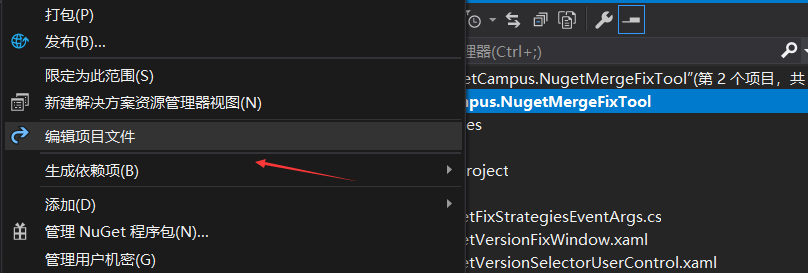
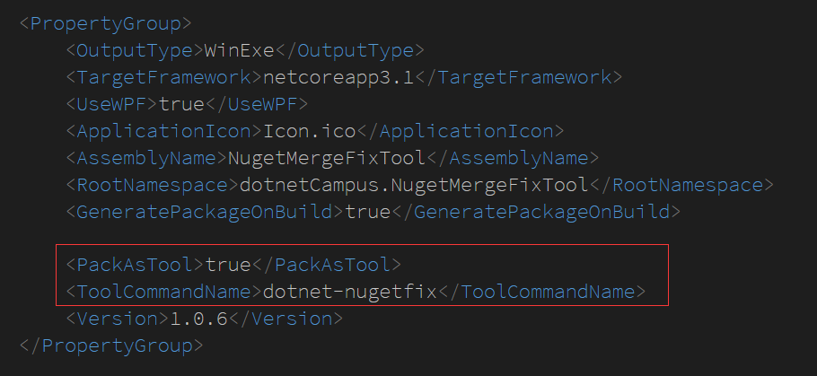
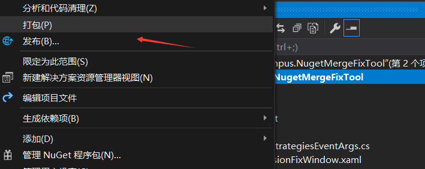
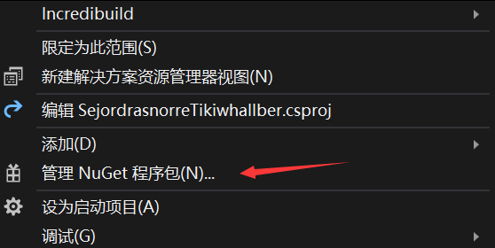
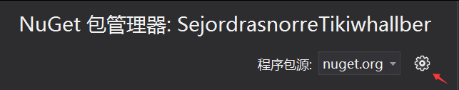
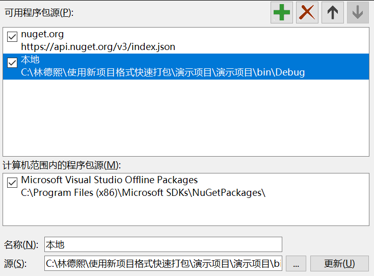

# dotnet 用 NuGet 将自己的工具作为 dotnet tool 分发

我写了一个有趣的工具，我如何将这个工具给到小伙伴予力众生呢？只需要设定这个工具是 dotnet tool 工具就可以通过 NuGet 分发出去啦。几乎所有的 dotnet 开发者都能用上 NuGet 服务，也就是此工具可以被几乎所有的 dotnet 开发者下载使用。那么制作难度有多大呢？基本上有一个现成的项目前提下，只需两句代码，一句命令行，就能完成制作

<!--more-->
<!-- CreateTime:2020/3/3 8:30:10 -->

<!-- 发布 -->

本文分为两部分，第一部分就是如何打包一个 dotnet tool 工具，第二部分是如何分发这个工具

在开始之前，我推荐你先安装好 VisualStudio 工具，在 VisualStudio 2019 的帮助下，能够快速简单进行打包和发布

<div id="toc"></div>

## 如何打包 dotnet tool 工具

其实 dotnet tool 工具没有任何黑科技，原理就是用 dotnet tool install 命令，这个命令将会通过后续传入的包的 id 从 NuGet 上寻找这个工具，下载到本地。此时要求工具本身不需要做安装包等类似的部署，而是直接复制文件过来就能使用的工具

工具的前提要求就是，这个工具本身通过复制文件的形式就能在设备上运行，无需部署

而 NuGet 包的本质就是一个压缩包，将这个工具压缩，然后修改为 NuGet 包，上传到 NuGet 上，这样就支持其他人从 NuGet 上下载这个工具的压缩包。那么工具和其他库的包有什么不同？其实就是在格式上标记这个包是一个工具包而不是一个库的包。关于这个工具包的更多细节请看 [dotnet 手工打一个 dotnet tool 包](https://blog.lindexi.com/post/dotnet-%E6%89%8B%E5%B7%A5%E6%89%93%E4%B8%80%E4%B8%AA-dotnet-tool-%E5%8C%85.html )

知道了这个原理之后咱就知道了，如果是 dotnet core 纯控制台工具，是可以在任何能运行 dotnet 的平台上运行的。而如果是 WPF .NET Core 那么就是能在 win7 sp1 和以上的系统上运行。如果是采用跨平台 UI 技术如 Avalonia 等，那么就能支持在对应平台上运行。这也就是没有限制工具一定只能作为控制台了

将一个现存的 dotnet net core 工具作为 dotnet tool 发布很简单，只有以下步骤

根据 Edi 的博客[教你自制.NET Core Global Tools](https://blog.csdn.net/sD7O95O/article/details/90322977 )可以看到只需要在 VisualStudio 2019 里面双击项目，就可以进入编辑 csproj 文件了，当然右击编辑项目也可以。注意要能双击进去编辑 csproj 要求使用 SDK Style 格式的项目文件，本文也只对此格式的项目文件生效

<!--  -->


在里面添加下面代码

```xml
<PackAsTool>true</PackAsTool>

<ToolCommandName>azureblobsync</ToolCommandName>
```

<!--  -->


上面代码的 PackAsTool 就是告诉 VS 等工具这是一个 dotnet tool 工具，到时候将它输出为 NuGet 库，同时在 NuGet 库里面标记这是工具

第二句代码是 ToolCommandName 这里面的内容就是用来在安装工具之后，通过什么样的命令启动这个工具，换句话说就是安装工具用的是 NuGet 包的 Id 而和执行工具用的命令可以不相同

此时这个工具打包之后，在安装完成之后，在cmd里面启动这个工具就是通过 azureblobsync 这句命令了

在 VisualStudio 2019 里面右击项目，点击打包，此时就可以看到 VisualStudio 打出了一个 NuGet 包了。如果不够自信的话，可以先测试测试这个打出来的工具包

<!--  -->


测试方法非必要，作为一个自信的程序员，自己写出来的工具怎么需要测试呢？反正有问题了再升级一个版本发布咯

等等，我打出来的 NuGet 包放在哪里？其实从 VisualStudio 的输出就可以看到类似下面代码

```csharp
已成功创建包“D:\程序\dotnet 职业技术学院\dotnetCampus.NugetMergeFixTool\bin\Debug\NugetMergeFixTool.1.0.6.nupkg”
```

我要安装这个本地包可以如何做？

右击项目管理 Nuget 包

<!--  -->


点击设置

<!--  -->


点击添加一个本地的包，修改输出包的文件夹

<!--  -->


设置完成之后打开cmd命令行输入下面代码安装自己的 NuGet 库

```csharp
dotnet tool install -g NugetMergeFixTool 
```

如果安装成功了，通过 `azureblobsync` 命令试试能否打开自己的工具。注意请将上面的 NugetMergeFixTool 修改为升级上你打包出来的 NuGet 的 Id 哦，一般 NuGet 的 Id 就是 nuget 包的名字。而 azureblobsync 就是在上方给 csproj 设置的工具启动名了

如果觉得上面步骤太繁琐，也可以忽略，毕竟这只是测试使用而已。作为自信的程序员，代码不用测试就能发布（这是说笑的，小朋友不要模仿

## 分发工具

接下来我如何将我这个库上传到 NuGet 官方网站？首先打开 [https://www.nuget.org/](https://www.nuget.org/ ) 网站，点击 sign in 登录

<!--  -->


有微软帐号的用微软帐号，没有微软帐号的，自己注册一个，注册步骤很简单，基本上看界面就会了

注册完成之后点击 Upload 上传自己刚才打出来的库

<!--  -->


理论上只要不是有提示出错的，其他都可以忽略，点击上传之后就等待一小段时间，如去吃个饭。回来基本上就可以看到发布完成了，此时可以告诉小伙伴在命令行输入一段神奇的代码安装你的工具，然后使用一段有趣的代码启动你的工具

```csharp
dotnet tool install -g NugetMergeFixTool // 这句代码安装工具
azureblobsync // 执行工具
```

注意将上面代码的 NugetMergeFixTool 和 azureblobsync 分别更换为你的 NuGet 包的 Id 和你的工具启动名

这就是 dotnet 工具的强大了，可以通过 dotnet 工具使用 NuGet 上超级多的工具

当然，程序员都喜欢自动化，如果是开源在 Github 的可以使用 [dotnet 配置 github 自动打包上传 nuget 文件](https://blog.lindexi.com/post/dotnet-%E9%85%8D%E7%BD%AE-github-%E8%87%AA%E5%8A%A8%E6%89%93%E5%8C%85%E4%B8%8A%E4%BC%A0-nuget-%E6%96%87%E4%BB%B6.html )

同时包含 GitHub 自动用 Action 打包发布以及整个 dotnet tool 配置的代码请看 [dotnet-campus/dotnetCampus.NugetMergeFixTool: 传说博哥的工具 可以用来修复 git 合并的时候将 csproj 合并坏了的问题，也可以用来快速升级 NuGet 库](https://github.com/dotnet-campus/dotnetCampus.NugetMergeFixTool )

上面这个工具是一个适用于大团队里面合并代码冲突的快速修复工具，可以提升超级多的效率

更多博客

- [程序猿修养 从安装 dotnet 开始](https://blog.lindexi.com/post/%E7%A8%8B%E5%BA%8F%E7%8C%BF%E4%BF%AE%E5%85%BB-%E4%BB%8E%E5%AE%89%E8%A3%85-dotnet-%E5%BC%80%E5%A7%8B.html)
- [教你自制.NET Core Global Tools_dotNET跨平台-CSDN博客](https://blog.csdn.net/sD7O95O/article/details/90322977 )
- [教程：创建 .NET Core 工具 - .NET Core CLI](https://docs.microsoft.com/zh-cn/dotnet/core/tools/global-tools-how-to-create )
- [VisualStudio 使用新项目格式快速打出 Nuget 包](https://blog.lindexi.com/post/VisualStudio-%E4%BD%BF%E7%94%A8%E6%96%B0%E9%A1%B9%E7%9B%AE%E6%A0%BC%E5%BC%8F%E5%BF%AB%E9%80%9F%E6%89%93%E5%87%BA-Nuget-%E5%8C%85.html)
- [dotnet 部署 github 的 Action 进行持续集成](https://blog.lindexi.com/post/dotnet-%E9%83%A8%E7%BD%B2-github-%E7%9A%84-Action-%E8%BF%9B%E8%A1%8C%E6%8C%81%E7%BB%AD%E9%9B%86%E6%88%90.html )
- [dotnet 配置 github 自动打包上传 nuget 文件](https://blog.lindexi.com/post/dotnet-%E9%85%8D%E7%BD%AE-github-%E8%87%AA%E5%8A%A8%E6%89%93%E5%8C%85%E4%B8%8A%E4%BC%A0-nuget-%E6%96%87%E4%BB%B6.html )

<a rel="license" href="http://creativecommons.org/licenses/by-nc-sa/4.0/"></a><br />本作品采用<a rel="license" href="http://creativecommons.org/licenses/by-nc-sa/4.0/">知识共享署名-非商业性使用-相同方式共享 4.0 国际许可协议</a>进行许可。欢迎转载、使用、重新发布，但务必保留文章署名[林德熙](http://blog.csdn.net/lindexi_gd)(包含链接:http://blog.csdn.net/lindexi_gd )，不得用于商业目的，基于本文修改后的作品务必以相同的许可发布。如有任何疑问，请与我[联系](mailto:lindexi_gd@163.com)。
