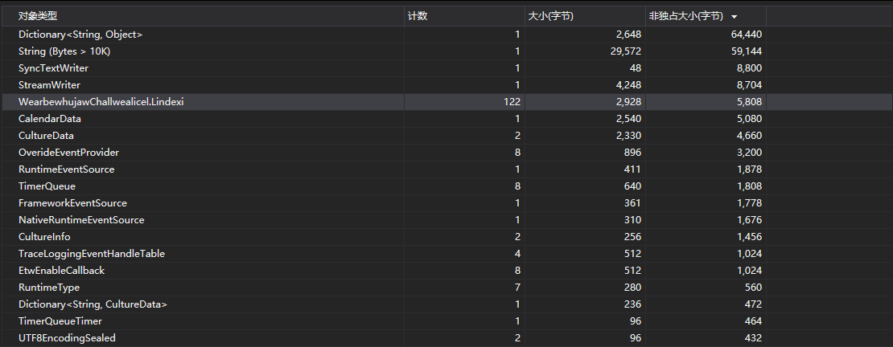

# dotnet 用 gcdump 调试应用程序内存占用

在 Linux 等系统下，没有和 Windows 下这么好的 VisualStudio 支持。在客户端的环境，也不太好在用户端安装一个 VisualStudio 调试。在遇到需要在服务器端或客户端调试应用程序的内存占用时，可以尝试使用 dotnet 的 gcdump 工具进行调试，这个工具使用十分简单，功能也很强大

<!--more-->
<!-- CreateTime:2020/1/17 9:58:59 -->

<!-- 发布 -->

在运行这个工具之前要求设备上先安装 dotnet 环境，有了这个限制，在客户端调试其实不如搭建 VisualStudio 远程调试更好。当然本文主要是广告 gcdump 工具的，怎么能在这里拆台。在服务器端，只有安装了 dotnet 工具，同时不是 Windows 的服务器，不能使用 VisualStudio 远程调试技术前提下。或者不想使用 VisualStudio 抓内存，只是想拿到当前内存信息，有空了再分析。或者是自动化测试的时候，通过调用命令行获取进程的内存，然后自动化分析内存。此时通过 gcdump 都能很好的满足

使用 gcdump 能通过一句命令行调用获取指定 pid 进程的内存快照，将内存快照保存到文件，方便进行分析

在使用 gcdump 之前需要将 gcdump 作为全局工具安装，请在命令行输入下面代码

```cmd
dotnet tool install --global dotnet-gcdump
```

安装完成之后通过下面命令拿到指定进程 ID 的应用的内存

```cmd
dotnet gcdump collect -p <target-process-PID>
```

如准备一个测试用的 dotnet core 程序，可以在[github](https://github.com/lindexi/lindexi_gd/tree/648db1f7aba1308b5741e6b428b78ac1e79a54c3/WearbewhujawChallwealicel)下载我的测试代码

我在测试代码第一句话输出当前进程号，方便使用工具获取当前进程

```csharp
            Console.WriteLine(Process.GetCurrentProcess().Id);
```

然后写出内存泄漏代码

```csharp
            var list = new List<object>();
            while(true)
            {
                list.Add(new Lindexi());
                Task.Delay(TimeSpan.FromMilliseconds(100)).Wait();
            }

    class Lindexi
    {
        
    }
```

使用 dotnet run 运行代码，不需要开启 VisualStudio 就能进行编译运行代码，这也就是可以将 C# 代码当成复杂脚本来用，可以代替部分 PowerShell 功能

打开一个新的命令行，输入 `dotnet gcdump collect -p 99` 请将这句命令的 99 替换为应用的进程号

此时将会在命令行的工作文件夹写入 .gcdump 文件，打开 VisualStudio 拖入 .gcdump 文件就可以解析，通过多个 .gcdump 文件可以了解一段时间内创建的对象，通过单个 gcdump 文件可以分析在当前内存还有哪些对象

<!--  -->


这是[测试程序](https://github.com/lindexi/lindexi_gd/tree/648db1f7aba1308b5741e6b428b78ac1e79a54c3/WearbewhujawChallwealicel)的分析，通过这个工具可以非常方便拿到某个进程的内存

更多关于 gcdump 命令：

- `-p` 指定应用程序进程
- `-o` 指定 gcdump 文件输出路径，默认为`.\YYYYMMDD_HHMMSS_<pid>.gcdump`文件
- `-v` 传入 true 或 false 默认为 false 如果传入 true 将会输出更多调试信息
- `-t` 超时时间，单位是秒，默认是30秒

这个项目完全开源，源代码放在[github](https://github.com/dotnet/diagnostics/tree/master/src/Tools/dotnet-gcdump) 小伙伴如果有问题欢迎到官方交流

[Collecting and analyzing memory dumps](https://devblogs.microsoft.com/dotnet/collecting-and-analyzing-memory-dumps/ )

<a rel="license" href="http://creativecommons.org/licenses/by-nc-sa/4.0/"></a><br />本作品采用<a rel="license" href="http://creativecommons.org/licenses/by-nc-sa/4.0/">知识共享署名-非商业性使用-相同方式共享 4.0 国际许可协议</a>进行许可。欢迎转载、使用、重新发布，但务必保留文章署名[林德熙](http://blog.csdn.net/lindexi_gd)(包含链接:http://blog.csdn.net/lindexi_gd )，不得用于商业目的，基于本文修改后的作品务必以相同的许可发布。如有任何疑问，请与我[联系](mailto:lindexi_gd@163.com)。
