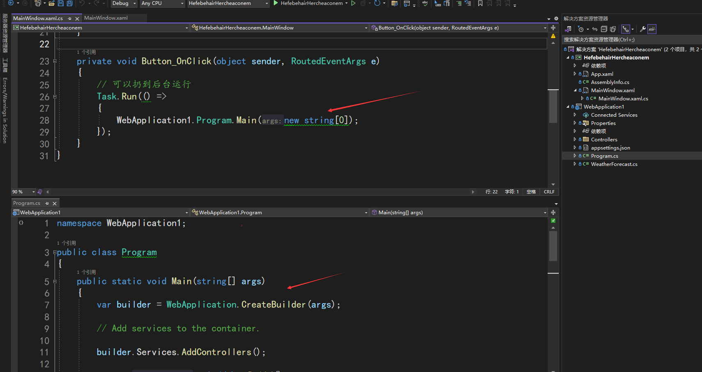

# dotnet 简单方法在一个进程内同时跑起 WPF 和 ASP.NET Core 框架

从设计架构上，无论是 WPF 还是 ASP.NET Core 框架，都是在 dotnet 运行时上层的应用，两个框架处于平级的结构。理论上讲，两个平级的框架只要不存在特殊的情况，都是能够相容存在的。本文将和大家介绍一个非常简单的方法，在一个进程内同时跑起 WPF 和 ASP.NET Core 框架

<!--more-->
<!-- 发布 -->
<!-- 博客 -->

在一个进程内同时跑起 WPF 和 ASP.NET Core 框架在一些业务情况下还是一个不错的选择。比如以 ASP.NET Core 框架为主，让 WPF 作为状态展示的界面。比如以 WPF 为主，让 ASP.NET Core 框架充当应用对外接口，比如多应用之间的通讯等。更多的用法还请发挥你的想象力

只有将 WPF 更新到使用 dotnet core 版本（包含 dotnet 5 、dotnet 6 等等）即可非常简单和 ASP.NET Core 框架在一起跑。接下来我给出一张截图，说不定大家看到了截图就知道了实现方式了

<!--  -->


如上图，我在 WPF 应用的按钮里面点击的时候，启动了 ASP.NET Core 框架

具体的实现方法是：

1. 将 WPF 和 ASP.NET Core 分别定义为两个项目。或者是再多定义一个控制台项目作为入口项目
2. 让 WPF 项目引用 ASP.NET Core 项目。或者是有控制台入口项目的情况下，让控制台入口项目同时引用 WPF 和 ASP.NET Core 项目
3. 找到时机分别启动 WPF 应用和 ASP.NET Core 主机

虽然新建了多个项目，但运行起来只有一个进程。这里需要敲黑板，项目的数量影响的是程序集，不直接影响进程的数量

比如上图给出的方法就是只新建 WPF 和 ASP.NET Core 项目，接着在 WPF 项目的按钮点击事件里面，调用到 ASP.NET Core 项目的 Main 静态函数里面，将 ASP.NET Core 的主机启动

启动 ASP.NET Core 的主机需要使用 Task.Run 的方式，如果不想 Task.Run 的方式，可以将 ASP.NET Core 的 Host 执行从 Run 方法换成 RunAsync 方法走异步

如此简单的方式即可在一个进程里面同时使用 WPF 和 ASP.NET Core 框架

本文的代码放在[github](https://github.com/lindexi/lindexi_gd/tree/0bb1705e0118208f4134b5334ace9ee84270eb5f/HefebehairHercheaconem) 和 [gitee](https://gitee.com/lindexi/lindexi_gd/tree/0bb1705e0118208f4134b5334ace9ee84270eb5f/HefebehairHercheaconem) 欢迎访问

可以通过如下方式获取本文的源代码，先创建一个空文件夹，接着使用命令行 cd 命令进入此空文件夹，在命令行里面输入以下代码，即可获取到本文的代码

```
git init
git remote add origin https://gitee.com/lindexi/lindexi_gd.git
git pull origin 0bb1705e0118208f4134b5334ace9ee84270eb5f
```

以上使用的是 gitee 的源，如果 gitee 不能访问，请替换为 github 的源。请在命令行继续输入以下代码

```
git remote remove origin
git remote add origin https://github.com/lindexi/lindexi_gd.git
git pull origin 0bb1705e0118208f4134b5334ace9ee84270eb5f
```

获取代码之后，进入 HefebehairHercheaconem 文件夹