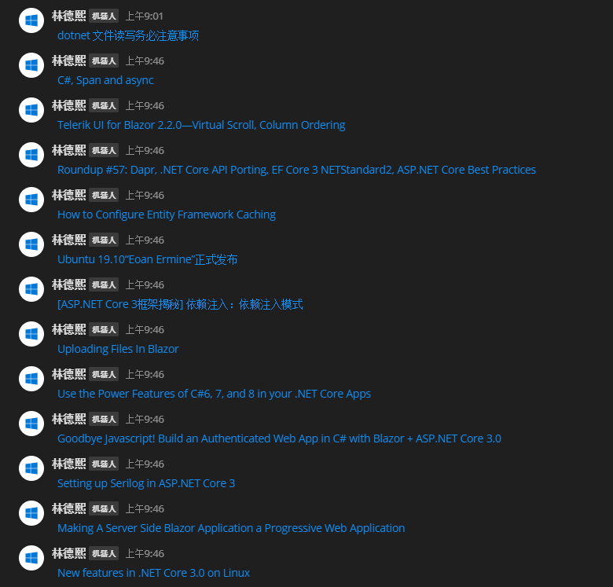

# dotnet 给MatterMost订阅RSS博客

其实MatterMost是有插件可以用来订阅RSS博客的，但是这个订阅插件需要一个个网址输入，而不是一次性输入很多个，于是我去就自己写了一个控制台程序做订阅

<!--more-->
<!-- CreateTime:2020/2/1 9:20:01 -->


这个工具用到 `Microsoft.SyndicationFeed.ReaderWriter` 库，通过这个库可以用来解析RSS内容，所以开发的代码十分少

先通过 NuGet 安装或修改 csproj 代码

```csharp
    <PackageReference Include="Microsoft.SyndicationFeed.ReaderWriter" Version="1.0.2" />
```

在使用RSS之前需要知道有两个通用的格式，一个是 RSSFeed 格式，一个是 AtomFeed 格式，这两个格式需要分别使用两个不同的方式读取

先用 HttpClient 获取 RSS 内容，定义参数 feedUri 表示需要获取的博客链接

```csharp
            var xml = await httpClient.GetStringAsync(feedUri);
```

如我的博客是 [https://blog.lindexi.com/](https://blog.lindexi.com/) 我的订阅地址是 [https://blog.lindexi.com/](https://blog.lindexi.com/) 也就是在 feedUri 里面写的是订阅地址

读取到的内容是 xml 内容，通过下面方法判断当前博客使用的是哪个格式，分别返回不同的读取

```csharp
        private XmlFeedReader GetXmlFeedReader(string xml, XmlReader xmlReader)
        {
            var xDocument = XDocument.Load(new StringReader(xml));
            var rootName = xDocument.Root.Name;
            if (rootName.Namespace.NamespaceName.Contains("Atom", StringComparison.OrdinalIgnoreCase))
            {
                return new AtomFeedReader(xmlReader);
            }

            if (rootName.LocalName.Contains("feed", StringComparison.OrdinalIgnoreCase))
            {
                return new AtomFeedReader(xmlReader);
            }

            if (rootName.ToString().Contains("rss", StringComparison.OrdinalIgnoreCase))
            {
                return new RssFeedReader(xmlReader);
            }

            return new AtomFeedReader(xmlReader);
        }
``` 

上面判断方法是用逗比代码写的，其实 AtomFeedReader 的判断不用那么复杂

判断完成之后就可以使用 feedReader.Read 方法不断读取，因为我只需要博客的内容，所以只获取内容

```csharp
            using (var xmlReader = XmlReader.Create(new StringReader(xml)))
            {
                XmlFeedReader feedReader = GetXmlFeedReader(xml, xmlReader);
                Console.WriteLine("Read");
                while (await feedReader.Read())
                {
                    try
                    {
                        if (feedReader.ElementType == SyndicationElementType.Item)
                        {
                            ISyndicationItem item = await feedReader.ReadItem();
                            rssNewsItems.Add(item);
                        }
                    }
                    catch (Exception e)
                    {
                    }
                }
            }
```

在 ISyndicationItem 里面就包括了博客的标题，描述和发布时间，可以定义另一个类做封装

```csharp
    public class Blog
    {
        public string Title { get; set; }

        public string Url { get; set; }

        public string Description { get; set; }

        public DateTime Time { set; get; }

        /// <inheritdoc />
        public override string ToString()
        {
            return $"{Title} {Time}\n{Url}";
        }
    }
```

这个做法很逗比

```csharp
                var blogList = new List<Blog>();
                foreach (var syndicationItem in syndicationItems)
                {
                    var description =
                        syndicationItem.Description.Substring(0, Math.Min(200, syndicationItem.Description.Length));
                    var time = syndicationItem.Published;
                    var uri = syndicationItem.Links.FirstOrDefault()?.Uri;

                    if (time < syndicationItem.LastUpdated)
                    {
                        time = syndicationItem.LastUpdated;
                    }

                    blogList.Add(new Blog()
                    {
                        Title = syndicationItem.Title,
                        Description = description,
                        Time = time.DateTime,
                        Url = uri?.AbsoluteUri
                    });
                }
```

现在就拿到了 blogList 可以给 MatterMost 发送信息，发送的方法请看 [dotnet core 集成到 Mattermost 聊天工具](https://blog.lindexi.com/post/dotnet-core-%E9%9B%86%E6%88%90%E5%88%B0-Mattermost-%E8%81%8A%E5%A4%A9%E5%B7%A5%E5%85%B7.html )

做出来的效果是这样

<!--  -->


我将这个项目代码放在 [github](https://github.com/lindexi/lindexi_gd/tree/dev/NokekebelaidairJelnechallearrur) 欢迎小伙伴下载，如果觉得好像在哪看过这个代码，那么证明你看过[dotnet 代码调试方法](https://blog.lindexi.com/post/dotnet-%E4%BB%A3%E7%A0%81%E8%B0%83%E8%AF%95%E6%96%B9%E6%B3%95.html) 我在这个博客将这个代码作为例子演示如何调试

用这个方法做的RSS订阅没有 [RSS Stalker](https://www.microsoft.com/store/productId/9N85PV1RJD6VR) 好用

因为我现在是做一个本机的控制台应用，电脑关了就不订阅，于是修改作为一个服务，我将代码放在 [github](https://github.com/lindexi/UWP/tree/53bda931c118033b75fce97427d901a985984ee0/src/%E5%8D%9A%E5%AE%A2%E8%AE%A2%E9%98%85 ) 欢迎小伙伴访问

可以通过 dotnet run 或者作为 docker 运行两个方法

注意我这里也是用内存数据库，如果 docker 关闭或 dotnet run 关闭也会丢失配置

<a rel="license" href="http://creativecommons.org/licenses/by-nc-sa/4.0/"></a><br />本作品采用<a rel="license" href="http://creativecommons.org/licenses/by-nc-sa/4.0/">知识共享署名-非商业性使用-相同方式共享 4.0 国际许可协议</a>进行许可。欢迎转载、使用、重新发布，但务必保留文章署名[林德熙](http://blog.csdn.net/lindexi_gd)(包含链接:http://blog.csdn.net/lindexi_gd )，不得用于商业目的，基于本文修改后的作品务必以相同的许可发布。如有任何疑问，请与我[联系](mailto:lindexi_gd@163.com)。
