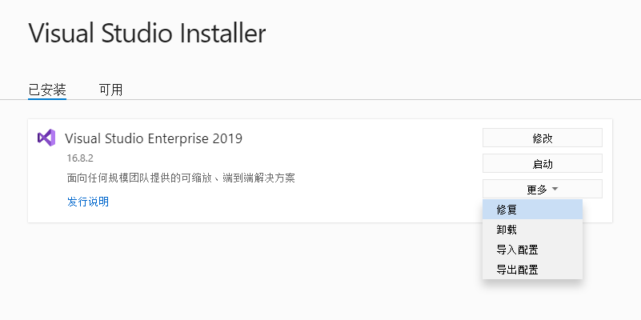
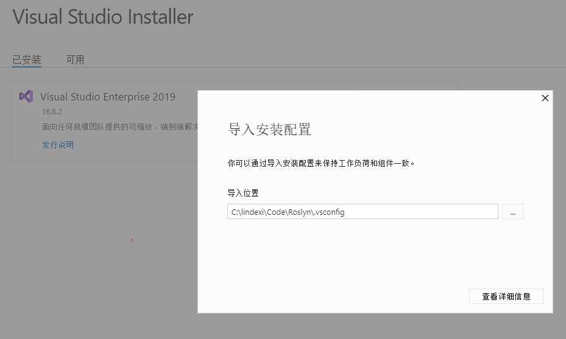

# dotnet 编译 Rolsyn 编译器

这是一个套娃，在编译 Rolsyn 编译器之前需要有 Rolsyn 编译器，用 Rolsyn 编译器来编译 Rolsyn 编译器。本文来告诉大家如何构建 Rolsyn 编译器，步骤特别少，很简单

<!--more-->
<!-- CreateTime:2020/12/1 8:41:20 -->

整个 Rolsyn 编译器的代码基本都是由 C# 和 VB 构成的，所有源代码都在 GitHub 上完全开源请看： [https://github.com/dotnet/roslyn](https://github.com/dotnet/roslyn)

除了 Rolsyn 编译器的代码完全开源外，整个 Rolsyn 编译器的构建脚本和工具也在相同的 GitHub 仓库上完全开源。开源协议是最友好的 MIT 协议，这将允许任何人任何组织和企业任意处置，包括使用，复制，修改，合并，发表，分发，再授权，或者销售。唯一的限制是，软件中必须包含上述版 权和许可提示，后者协议将会除了为用户提供版权许可之外，还有专利许可，并且授权是免费，无排他性的(任何个人和企业都能获得授权)并且永久不可撤销

咱今天就来聊聊如何使用 Rolsyn 编译器来编译 Rolsyn 编译器

在开始之前，还需要先部署一下构建环境

咱使用 Windows 10 系统的设备来进行构建，因为 Windows 系统非常友好，构建环境安装也特别简单。默认的 Win10 系统带了 .NET Framework 但咱需要的 .NET Framework 版本是 4.7.2 以及以上，基本上 1803 （Windows 10 April 2018 Update 10.0.17134）以上版本的 Win10 就带了。相信开发者的系统也不会那么古老

接着将整个 Rolsyn 仓库拉下来

打开 VS 安装程序，点击导入配置，在这一步之前，请确定更新 VS 版本到最新

<!--  -->

导入刚才拉下来的 Rolsyn 仓库的 .vsconfig 文件

<!--  -->

等待 VS 的安装完成，然后切换到网络比较好的环境

安装最新版本的 .NET 5 环境

双击Rolsyn 仓库的 Build.cmd 文件，即可进行构建

如果网络没有问题，那么理论上这个构建也没有任何问题的

假定想要使用自己构建出来的 Rolsyn 编译器，只需要去输出路径安装 VSIX 也就是 VS 扩展就可以了

更多构建细节请看 [Building, Debugging, and Testing on Windows.md](https://github.com/dotnet/roslyn/blob/master/docs/contributing/Building,%20Debugging,%20and%20Testing%20on%20Windows.md)

这是我录的视频，用 Rolsyn 编译器来编译 Rolsyn 编译器，用编译出来的 Rolsyn 编译器编译 dotnet runtime 运行时

[dotnet 从 Roslyn 编译器到 dotnet runtime 运行时的构建_哔哩哔哩 (゜-゜)つロ 干杯~-bilibili](https://www.bilibili.com/video/BV1e541157CB )

 本作品采用<a rel="license" href="http://creativecommons.org/licenses/by-nc-sa/4.0/">知识共享署名-非商业性使用-相同方式共享 4.0 国际许可协议</a>进行许可。欢迎转载、使用、重新发布，但务必保留文章署名[林德熙](http://blog.csdn.net/lindexi_gd)(包含链接:http://blog.csdn.net/lindexi_gd )，不得用于商业目的，基于本文修改后的作品务必以相同的许可发布。如有任何疑问，请与我[联系](mailto:lindexi_gd@163.com)。
