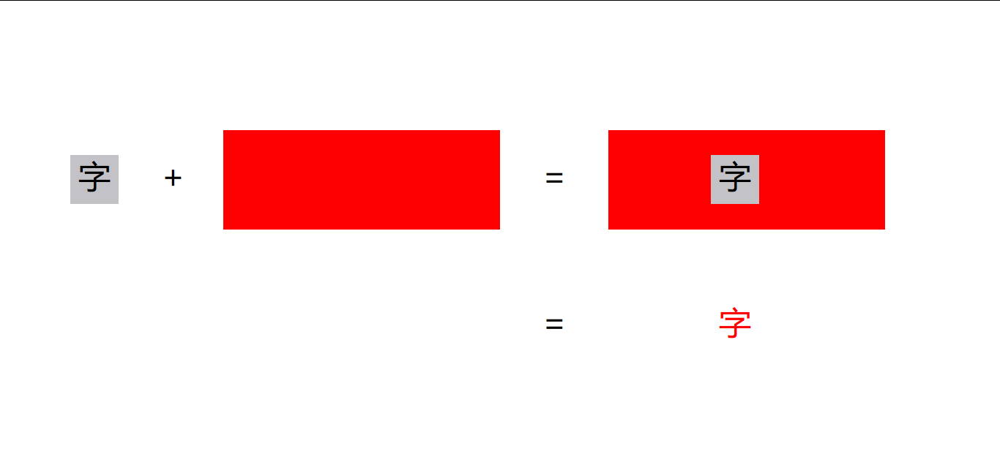
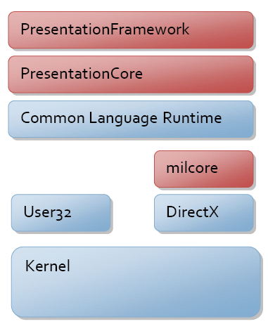

# dotnet 读 WPF 源代码笔记 渲染层是如何将字符 GlyphRun 画出来的

从业务代码构建出来 GlyphRun 对象，在 WPF 的渲染层里，如何利用 GlyphRun 提供的数据将字符在界面呈现出来。本文将和大家聊聊从 WPF 的渲染层获取到 GlyphRun 数据，到调用 DirectX 的各个渲染相关方法的过程，也就是 WPF 绘制文本字符的原理或者实现方法

<!--more-->
<!-- CreateTime:2023/1/12 16:19:33 -->

<!-- 发布 -->
<!-- 博客 -->

大家印象中的绘制一段文本是调用 DrawText 等相关方法，看起来很简单。在上一篇 [WPF 简单聊聊如何使用 DrawGlyphRun 绘制文本](https://blog.lindexi.com/post/WPF-%E7%AE%80%E5%8D%95%E8%81%8A%E8%81%8A%E5%A6%82%E4%BD%95%E4%BD%BF%E7%94%A8-DrawGlyphRun-%E7%BB%98%E5%88%B6%E6%96%87%E6%9C%AC.html ) 博客和大家介绍了在 WPF 里面如何使用底层的方式绘制文本。使用以上简单的实现代码，在 WPF 底层是如何实现将文本字符在屏幕上显示出来的。本文将聊聊这个方法背后，渲染层做了哪些事情

为了方便大家了解本文所聊的是文本绘制渲染的哪个阶段，我画了如下示意图


如上图，本文核心聊的只是文本字符渲染里面的 MIL 层的实现方法，不包括具体的 DirectX 行为和文本排版布局方法。示意图仅仅只是用来告诉大家本文所聊的范围，而不是真正实际的文本字符排版布局绘制渲染过程

从总的方面来讲，在 WPF 的渲染层里面，即渲染线程通过 UI 线程输入的绘制命令获取到需要执行的渲染文本字符的任务，对应上图的渲染 MIL 层的功能逻辑。获取到渲染文本字符的任务，在任务里面就包含了字符渲染所需的各个信息。在进入实际渲染之前，会执行一个优化判断逻辑，决定实际执行的渲染方式，是通过 Geometry 几何的方式渲染还是直接对 GlyphRun 进行渲染

优化判断逻辑的用途是为了优化性能和渲染效果，当文本的字符的渲染尺寸特别大的时候，选用 Geometry 几何的方式渲染。为什么呢？因为文本渲染里面，一个非常重要的技术就是让字符比较小的时候，可以在屏幕上清晰显示，这就是采用 GlyphRun 进行 ClearType 等方式渲染的最重要意义，然而这不是没有成本的。在文本的字符的渲染尺寸很大的时候，将会存在较多的内耗，性能上不如 Geometry 几何的方式渲染。因此在文本的字符的渲染尺寸特别大的时候，也就是不需要 ClearType 等清晰文本渲染的时候，即可使用 Geometry 几何的方式渲染提升性能

为什么使用 GlyphRun 进行渲染的方式存在比较多的内耗？为什么我用 DWrite 时不会遇到这样的问题？这其实和 WPF 底层渲染技术策略有关，我将在下文细细告诉大家。从总的方面来说是 WPF 渲染文本字符的时候，不是调用 RenderTarget 的 DrawText 或 DrawGlyphRun 等方法，而是用一个比较少见的思路进行渲染

之所以说少见是因为在 WPF 渲染层里面调用的几个 DirectX 方法，比较少有大佬写过博客讲过用法（不是没有，只是比较少）且我之前也没有用过。这是一个有趣的思路，在 WPF 渲染层里面，将调用 DirectWrite 层让 GlyphRun 输出 Alpha 纹理，接着调用 DirectX 绘制一个矩形，让矩形填充上文本前景色画刷，同时将 Alpha 纹理作为蒙层叠加到绘制的矩形上。所谓 Alpha 纹理其实就是让文本的字形转换为不透明 Alpha 通道值，用人话来说就是假如每个字都在一个矩形范围内能画出来，那笔画可见部分的像素坐标就是不透明的，否则就是透明的部分，将这些透明和不透明的放在一起就是一个 Alpha 纹理了。将这个 Alpha 纹理叠加到一个矩形上，就可以让矩形显示出来文本字符

要是觉得这个过程比较难以理解，不妨看看我画的示意图

<!--  -->


上图的灰色底黑字就是 Alpha 纹理的示意图，灰色代表着全透明，黑色代表着不透明。红色的矩形表示的是前景色是红色的字符的绘制范围。在绘制出来的红色矩形上叠加 Alpha 纹理加裁剪的效果就是只有不透明的部分可见，透明的部分就是透明的，于是结果就是最后一个等于号的红色的字的效果

为什么这么做呢？其实是因为 WPF 上的 API 定义是提供非常自由文本绘制方式，上层的 DrawingContext.DrawGlyphRun 函数允许传入任意的 Brush 类型作为文本的前景色，这就意味着允许的前景色取值范围非常广，比如 VisualBrush 等等。为了提供足够好的且强大的渲染功能，就将传入的画刷先画出来，进行矩形填充，所谓矩形填充其实和进行矩形裁剪是差不多的事情，再叠加上 Alpha 纹理。如此即可支持非常复杂的画刷，且逻辑上也是能够复用几何填充画刷逻辑

也就是说如果只是用纯色或者是图片的方式填充，自然是用不着如此复杂的方式。只有如 WPF 这样需要处理超级多诡异复杂的开发者需求的时候，才需要用如此少见的思路实现

这也就是为什么在 WPF 的渲染层不需要调用类似 RenderTarget 的 DrawText 或 DrawGlyphRun 等方法来渲染文本字符的原因

另一条渲染方式，是通过 Geometry 几何的方式渲染，这个逻辑就简单很多。通过调用 [IDWriteFontFace::GetGlyphRunOutline](https://learn.microsoft.com/en-us/windows/win32/api/dwrite/nf-dwrite-idwritefontface-getglyphrunoutline ) 方法即可从 GlyphRun 对象生成字形的 Geometry 对象，接着走 Geometry 渲染逻辑即可。本文不讨论 Geometry 渲染逻辑，继续回到 GlyphRun 渲染的细节逻辑

不想看十分具体的细节的伙伴可以就看到这里，接下来就是代码逻辑的细节部分逻辑了，开始之前期望大家对于 WPF 框架有一定的了解。更多的 WPF 源代码博客请参阅我的 [博客导航](https://blog.lindexi.com/post/%E5%8D%9A%E5%AE%A2%E5%AF%BC%E8%88%AA.html )

由于 WPF 具备软硬渲染的能力，对于软渲染来说走的是另一个分支逻辑，有一些细节上的差异。本文将着重放在硬渲染上，关于软渲染部分只会提到部分

忽略 WPF 的渲染线程的创建和初始化。在 WPF 开始渲染的时候，可以认为的一个核心入口是 CMilSlaveRenderData 的 Draw 方法，这个方法就是在开始渲染时被调用

在 CMilSlaveRenderData 类型的 Draw 方法里面，将会接收到由 UI 线程产生的数据，作为渲染线程的绘制任务，如以下代码

```c++
HRESULT
CMilSlaveRenderData::Draw(
    __in_ecount(1) IDrawingContext *pIDC
    )
{
    // 读取渲染任务
    IFC(cmdReader.GetFirstItemSafe(&nItemID, &pItemData, &nItemDataSize));
    ... // 忽略其他代码
    while (hr == S_OK)
    {
            switch (nItemID)
            {
                ... // 忽略其他代码
                case MilDrawGlyphRun:
                {
                    MILCMD_DRAW_GLYPH_RUN *pData = reinterpret_cast<MILCMD_DRAW_GLYPH_RUN*>(pItemData);
                    
                    IFC(pCurrentDC->DrawGlyphRun(
                        DYNCAST(CMilBrushDuce, rgpResources[pData->hForegroundBrush]),
                        DYNCAST(CGlyphRunResource, rgpResources[pData->hGlyphRun])
                        ));
                    break;
                }
            }

        ... // 忽略其他代码

        // 读取下一个渲染任务
        IFC(cmdReader.GetNextItemSafe(
            &nItemID,
            &pItemData,
            &nItemDataSize
            ));
    }
}
```

这里的前置知识是 WPF 至少有两个线程，一个是 UI 线程，一个是渲染线程。其中 UI 线程将会对接业务端应用的逻辑，是开发者直接编写的界面等逻辑，将会输送渲染任务给到 WPF 的渲染线程执行实际的渲染逻辑。渲染任务里面是包含了各个渲染的小点的任务项，例如界面有两个 TextBlock 那就需要至少发送两个渲染任务项，分别是两个 TextBlock 元素的渲染任务项，实际发送的数量将会更多

在 WPF 的渲染线程里面，将会进入一个类似 `while (true)` 的循环，读取完这一次，可以理解为一帧的渲染任务，的所有渲染任务项。分别对这些渲染任务项进行渲染

当然，这个过程还存在很多优化逻辑，例如缓存和不可见不渲染优化等等，这部分逻辑就散落在各个渲染具体任务的执行，也不是本文重点

其中以上代码给出的是执行任务项是 MilDrawGlyphRun 的任务。这里的 Mil 指的是 Mil 层，也就是 Media Integration Library 层，如下图在 WPF 架构里面的 milcore 层里的逻辑。架构上的功能是用来对接 DirectX 层的，细节请参阅[官方文档](https://learn.microsoft.com/en-us/dotnet/desktop/wpf/advanced/wpf-architecture) 的 WPF 架构文档

<!--  -->


以上代码的 `IFC` 是一个宏，用途就是判断方法执行是否成功。如果方法执行失败，将会调用 goto 关键字跳转到 Cleanup 标签里面。如下面代码例子，如果 GetFirstItemSafe 方法执行失败，将会 goto 到 Cleanup 的代码，进行清理和返回

```c++
HRESULT
CMilSlaveRenderData::Draw(
    __in_ecount(1) IDrawingContext *pIDC
    )
{
    // 读取渲染任务
    IFC(cmdReader.GetFirstItemSafe(&nItemID, &pItemData, &nItemDataSize));

    ... // 忽略其他代码

Cleanup:

    RRETURN(hr);
}
```

这样的写法是因为这是远古时代的逻辑，那时候要啥现代的机制都没有。而且 goto 也只是用来清理而已，看起来还行

以上代码的 MILCMD_DRAW_GLYPH_RUN 类型就是渲染任务项的信息，类型定义如下。大概就是一个 GlyphRun 和 ForegroundBrush 两个有用的属性

```c++
struct MILCMD_DRAW_GLYPH_RUN
{
    MILCMD type;
    HMIL_RESOURCE hForegroundBrush;
    HMIL_RESOURCE hGlyphRun;
};
```

先不用探究 `HMIL_RESOURCE` 类型的内容，反正后面也只是调用 DYNCAST 转换而已

在拿到渲染任务项的信息，将调用 `pCurrentDC` 的 DrawGlyphRun 方法，如以下代码

```csharp
                    IFC(pCurrentDC->DrawGlyphRun(
                        DYNCAST(CMilBrushDuce, rgpResources[pData->hForegroundBrush]),
                        DYNCAST(CGlyphRunResource, rgpResources[pData->hGlyphRun])
                        ));
```

这里的 `pCurrentDC` 是 CDrawingContext 类型，继承 IDrawingContext 接口。接口的定义和上层的 DrawingContext 非常靠近。至于 DYNCAST 和 rgpResources 这两个，就认为是两个打杂的吧，不用细究。只需要经过了 DYNCAST 之后就获取到一个 CMilBrushDuce 画刷和一个字符资源信息 CGlyphRunResource 对象即可

在 CDrawingContext 的 DrawGlyphRun 函数里面，将会一开始就判断是否应该使用 Geometry 几何方式渲染，代码大概如下

```c++
HRESULT
CDrawingContext::DrawGlyphRun(
    __in_ecount_opt(1) CMilBrushDuce *pBrush,
    __in_ecount_opt(1) CGlyphRunResource *pGlyphRun
    )
{
    HRESULT hr = S_OK;

    CBrushRealizer *pFillBrush = xxx; // 填充画刷，文本前景色
    ... // 忽略其他代码

    // 判断 ShouldUseGeometry 是否应该使用 Geometry 几何方式渲染，如果是，那就采用 DrawGeometry 方法进行实际的渲染
    if (pGlyphRun->ShouldUseGeometry(&m_contextState.WorldToDevice, m_contextState.GetCurrentOrDefaultDisplaySettings()))
    {
        // 获取字形的 Geometry 几何
        const CMilGeometryDuce *pGeometry = pGlyphRun->GetGeometryRes();
        ... // 忽略其他代码

        // 调用 DrawGeometry 绘制 Geometry 内容，这个 Geometry 就是文本的字形的 Geometry 几何
        DrawGeometry(
                pBrush,
                NULL, // Pen
                pGlyphRun->GetGeometryRes()
                );
    }
    else  // Assume this GlyphRun uses realizations; we will create them on demand as needed
    {
        ... // 忽略其他代码

        // 构建出 DrawGlyphsParameters 绘制 Glyphs 的参数对象
                DrawGlyphsParameters pars;
                    pars.pContextState = &m_contextState;
                    pars.pBrushContext = &m_brushContext;
                    pars.pGlyphRun = pGlyphRun;
                    pars.pBrushRealizer = pFillBrush;


                ... // 忽略其他代码

        // 调用 m_pIRenderTarget 的 DrawGlyphs 执行渲染
                IFC(m_pIRenderTarget->DrawGlyphs(pars));
    }

Cleanup:
    if (pFillBrush)
    {
        pFillBrush->FreeRealizationResources();
        pFillBrush->Release();
    }

    ... // 忽略其他代码

    RRETURN(hr);
}
```

通过上面代码可以看到，开始调用 ShouldUseGeometry 方法决定是否使用 Geometry 几何方式渲染。这里的 ShouldUseGeometry 方法里面核心就是判断文本的渲染尺寸是否很大，详细逻辑就不在这里聊，还请自行阅读源代码

调用到这里的堆栈如下

```
   wpfgfx_cor3.dll!CDrawingContext::DrawGlyphRun(CMilBrushDuce * pBrush, CGlyphRunResource * pGlyphRun) 行 1984 C++
   wpfgfx_cor3.dll!CMilSlaveRenderData::Draw(IDrawingContext * pIDC) 行 845 C++
   wpfgfx_cor3.dll!CMilVisual::RenderContent(CDrawingContext * pDrawingContext) 行 1204 C++
   wpfgfx_cor3.dll!CDrawingContext::PreSubgraph(int * pfVisitChildren) 行 5076 C++
   wpfgfx_cor3.dll!CGraphIterator::Walk(IGraphNode * pRoot, IGraphIteratorSink * pSink) 行 308   C++
   wpfgfx_cor3.dll!CDrawingContext::DrawVisualTree(CMilVisual * pRoot, const _D3DCOLORVALUE * pClearColor, const TMilRect_<float,MilRectF,MilPointAndSizeF,RectUniqueness::NotNeeded> & dirtyRect, bool fDrawingIntoVisualBrush) 行 4424   C++
   wpfgfx_cor3.dll!CDrawingContext::Render(CMilVisual * pRoot, IMILRenderTarget * pIRenderTarget, const _D3DCOLORVALUE * pClearColor, const TMilRect_<float,MilRectF,MilPointAndSizeF,RectUniqueness::NotNeeded> & rcSurfaceBounds, int fFullRender, unsigned int uNumInvalidTargetRegions, const MilRectF * rgInvalidTargetRegions, bool fCanAccelerateScroll, int * pfNeedsFullPresent) 行 5994   C++
   wpfgfx_cor3.dll!CSlaveHWndRenderTarget::Render(bool * pfNeedsPresent) 行 185   C++
   wpfgfx_cor3.dll!CRenderTargetManager::Render(bool * pfPresentNeeded) 行 339 C++
   wpfgfx_cor3.dll!CComposition::Render(bool * pfPresentNeeded) 行 859   C++
   wpfgfx_cor3.dll!CComposition::ProcessComposition(bool * pfPresentNeeded) 行 712   C++
   wpfgfx_cor3.dll!CComposition::Compose(bool * pfPresentNeeded) 行 805  C++
   wpfgfx_cor3.dll!CPartitionThread::RenderPartition(Partition * pPartition) 行 134  C++
   wpfgfx_cor3.dll!CPartitionThread::Run() 行 246   C++
   wpfgfx_cor3.dll!CPartitionThread::ThreadMain(void * pv) 行 51   C++
```

以上代码的 `m_pIRenderTarget->DrawGlyphs(pars)` 就是本文的重点，调用 `m_pIRenderTarget` 的 DrawGlyphs 方法绘制 Glyph 内容。在 WPF 的 gfx 层的规范是采用 `m_` 开头的就是表示类型的字段。这里的 `m_pIRenderTarget` 当前的运行实际类型是 CDesktopHWNDRenderTarget 类型，代码定义的是 IRenderTargetInternal 接口。如果开启了软渲染，那么这里的 `m_pIRenderTarget` 将是 CSwRenderTargetGetBounds 类型。有关于软渲染的逻辑，将会在下文再聊，这里先集中火力到常用的硬渲染的逻辑

这里的 CDesktopHWNDRenderTarget 表示的是对桌面窗口的 RenderTarget 封装，没有多少实际的代码，继承关系大概如下

```c++
class CDesktopHWNDRenderTarget:
    public CDesktopRenderTarget
{
}

class CDesktopRenderTarget:
    public CMILCOMBase,
    public CMetaRenderTarget,
    public IMILRenderTargetHWND
{
}

class CMetaRenderTarget:
    public IRenderTargetInternal
{
STDMETHODIMP CMetaRenderTarget::DrawGlyphs(
    __inout_ecount(1) DrawGlyphsParameters &pars
    )
    {
        ... // 忽略其他代码
    }
}
```

继续往下的继承关系也不是本文的重点，可以看到的是 CDesktopHWNDRenderTarget 类型的 DrawGlyphs 实际是在 CMetaRenderTarget 类型里面定义的。通过这个关系代码，期望大家在阅读的时候，不会找不到代码

这里的 `CMetaRenderTarget` 的 DrawGlyphs 方法也只是一个中转，不是实际执行的逻辑，代码大概如下

```c++
STDMETHODIMP CMetaRenderTarget::DrawGlyphs(
    __inout_ecount(1) DrawGlyphsParameters &pars
    )
{
    HRESULT hr = S_OK;
    ... // 忽略其他代码
            IRenderTargetInternal *pRTInternalNoAddRef = xxx;

            IFC(pRTInternalNoAddRef->DrawGlyphs(pars));

Cleanup:
    ... // 忽略其他代码

    RRETURN(hr);
}
```

以上代码的 `pRTInternalNoAddRef` 当前的实际运行类型是 CHwHWNDRenderTarget 类型，这里的中转是为了兼容软渲染和硬渲染逻辑。对应在进行软渲染时，将会是 CSwRenderTargetHWND 类型。这里的 CHwHWNDRenderTarget 的 Hw 的意思就是 Hardware 硬件的意思，继承关系如下

```c++
class CHwHWNDRenderTarget : 
    public CHwDisplayRenderTarget
{
}

class CHwDisplayRenderTarget :
    public CMILCOMBase,
    public CHwSurfaceRenderTarget,
    public IRenderTargetHWNDInternal
{
    STDMETHODIMP
    CHwDisplayRenderTarget::DrawGlyphs(
        __inout_ecount(1) DrawGlyphsParameters &pars
    )
    {
        ... // 忽略其他代码
    }
}
```

如以上的继承关系可以了解到，调用的 `pRTInternalNoAddRef->DrawGlyphs(pars)` 的具体实现是在 `CHwDisplayRenderTarget` 里面完成的。然而这 `CHwDisplayRenderTarget::DrawGlyphs` 方法也只是一个中转的封装代码，最终的实现还要看 CD3DGlyphRunPainter 类型。以下是我删减为核心调用的实现代码

```c++
class CHwDisplayRenderTarget :
    public CMILCOMBase,
    public CHwSurfaceRenderTarget,
    public IRenderTargetHWNDInternal
{
    STDMETHODIMP
    CHwDisplayRenderTarget::DrawGlyphs(
        __inout_ecount(1) DrawGlyphsParameters &pars
    )
    {
        ... // 忽略其他代码
        IFC(CHwSurfaceRenderTarget::DrawGlyphs(pars));
    }
}

class CHwSurfaceRenderTarget :
    public CBaseSurfaceRenderTarget<CHwRenderTargetLayerData>
{
    STDMETHODIMP
    CHwSurfaceRenderTarget::DrawGlyphs(
       __inout_ecount(1) DrawGlyphsParameters &pars
       )
    {
        CD3DGlyphRunPainter painter;

        IFC(painter.Paint(
            pars,
            fTargetSupportsClearType,
            m_pD3DDevice,
            m_fmtTarget
            ));
    }
```

当前的调用堆栈如下

```csharp
>  wpfgfx_cor3.dll!CD3DGlyphRunPainter::Paint(DrawGlyphsParameters & pars, bool fTargetSupportsClearType, CD3DDeviceLevel1 * pDevice, MilPixelFormat::Enum fmtTargetSurface) 行 50   C++
   wpfgfx_cor3.dll!CHwSurfaceRenderTarget::DrawGlyphs(DrawGlyphsParameters & pars) 行 2067 C++
   wpfgfx_cor3.dll!CHwDisplayRenderTarget::DrawGlyphs(DrawGlyphsParameters & pars) 行 1232 C++
   wpfgfx_cor3.dll!CMetaRenderTarget::DrawGlyphs(DrawGlyphsParameters & pars) 行 1012   C++
   wpfgfx_cor3.dll!CDrawingContext::DrawGlyphRun(CMilBrushDuce * pBrush, CGlyphRunResource * pGlyphRun) 行 1984 C++
   wpfgfx_cor3.dll!CMilSlaveRenderData::Draw(IDrawingContext * pIDC) 行 845 C++
```

从以上代码可以看到实现的逻辑还需要进入到 CD3DGlyphRunPainter 里面，期望删减后的代码可以更好帮助大家阅读，不会被边角的逻辑带偏。在 CD3DGlyphRunPainter 里面就是真正的实现渲染的逻辑

在 CD3DGlyphRunPainter 的 Paint 方法里面的执行过程是先刷一遍前景色画刷，但此时不是真正调用渲染画出来矩形哦，接着获取到字符的字形的 Alpha 纹理，叠加到一起推送到更底层的 DirectX 渲染层上去。如此即可完成字符的渲染

下面是详细的实现逻辑

第一步是进行边角的优化，即不可见优化实现逻辑。判断文本字符的渲染范围是否在当前的可见范围内，如果不在可见范围内，那就直接结束。在 WPF 里面结束的方法是 `goto Cleanup` 进行结束的，如以下代码

```c++
HRESULT
CD3DGlyphRunPainter::Paint(
    __in_ecount(1) DrawGlyphsParameters &pars,
    bool fTargetSupportsClearType,
    __inout_ecount(1) CD3DDeviceLevel1* pDevice,
    MilPixelFormat::Enum fmtTargetSurface
    )
{
    MilPointAndSizeL rcClip;
    m_pDevice->GetClipRect(&rcClip);

    ... // 忽略其他代码

        // Do a rough check for glyph run visibility.
        // We need it, at least, to protect against
        // overflows in rendering routines.
        CRectF<CoordinateSpace::Device> rcClipF(
            static_cast<float>(rcClip.X),
            static_cast<float>(rcClip.Y),
            static_cast<float>(rcClip.Width),
            static_cast<float>(rcClip.Height),
            XYWH_Parameters
            );

        if (!pars.rcBounds.Device().DoesIntersect(rcClipF))
            goto Cleanup;
    
}
```

如以上代码，判断可见范围，嗯，约等于判断裁剪范围。如果矩形范围没有重叠，那就证明字符是在可见范围之外的。在可见范围之外的字符也就不需要渲染了，毕竟渲染了又看不见。于是直接 `goto Cleanup;` 结束。这里的 `goto Cleanup;` 约等于调用 return 函数进行结束，只不过 WPF 需要在结束之前进行一些资源清理。毕竟这部分是 C++ 代码，资源都需要手动清理，十分费事

完成判断之后，就是进入 Init 初始化函数，在初始化函数里面将调用 [IDWriteGlyphRunAnalysis::CreateAlphaTexture](https://learn.microsoft.com/en-us/windows/win32/api/dwrite/nf-dwrite-idwriteglyphrunanalysis-createalphatexture) 这个 DirectWrite 函数。这个函数的作用就是生成给定的字符的字形的 Alpha 数组值。通过这个 Alpha 数组值可以用来生成 Alpha 纹理。先看看 [IDWriteGlyphRunAnalysis::CreateAlphaTexture](https://learn.microsoft.com/en-us/windows/win32/api/dwrite/nf-dwrite-idwriteglyphrunanalysis-createalphatexture) 的函数定义

```csharp
HRESULT CreateAlphaTexture(
        DWRITE_TEXTURE_TYPE textureType,
  [in]  RECT const          *textureBounds,
  [out] BYTE                *alphaValues,
        UINT32              bufferSize
);
```

调用到 CreateAlphaTexture 的一个调用堆栈如下

```csharp
>  wpfgfx_cor3.dll!CGlyphRunRealization::RealizeAlphaBoundsAndTextures(DWRITE_TEXTURE_TYPE textureType, const EnhancedContrastTable * pECT, unsigned int * pTextureSize, tagRECT * pBoundingBox, unsigned char * * pAlphaMap) 行 1896   C++
   wpfgfx_cor3.dll!CGlyphRunRealization::EnsureValidAlphaMap(const EnhancedContrastTable * pECT) 行 1684  C++
   wpfgfx_cor3.dll!CGlyphRunResource::GetAvailableScale(float * pScaleX, float * pScaleY, const DisplaySettings * pDisplaySettings, MilTextRenderingMode::Enum textRenderingMode, MilTextHintingMode::Enum textHintingMode, RenderingMode * pRecommendedRenderingMode, CGlyphRunRealization * * ppRealization, const IDpiProvider * pDpiProvider) 行 684  C++
   wpfgfx_cor3.dll!CBaseGlyphRunPainter::Init(CGlyphPainterMemory * pGlyphPainterMemory, CGlyphRunResource * pGlyphRunResource, CContextState * pContextState) 行 109 C++
   wpfgfx_cor3.dll!CD3DGlyphRunPainter::Paint(DrawGlyphsParameters & pars, bool fTargetSupportsClearType, CD3DDeviceLevel1 * pDevice, MilPixelFormat::Enum fmtTargetSurface) 行 86   C++
   wpfgfx_cor3.dll!CHwSurfaceRenderTarget::DrawGlyphs(DrawGlyphsParameters & pars) 行 2067 C++
   wpfgfx_cor3.dll!CHwDisplayRenderTarget::DrawGlyphs(DrawGlyphsParameters & pars) 行 1232 C++
   wpfgfx_cor3.dll!CMetaRenderTarget::DrawGlyphs(DrawGlyphsParameters & pars) 行 1012   C++
   wpfgfx_cor3.dll!CDrawingContext::DrawGlyphRun(CMilBrushDuce * pBrush, CGlyphRunResource * pGlyphRun) 行 1984 C++
   wpfgfx_cor3.dll!CMilSlaveRenderData::Draw(IDrawingContext * pIDC) 行 845 C++
```

从 `CBaseGlyphRunPainter::Init` 到 `CGlyphRunRealization::GetAvailableScale` 中间的过程可以忽略，看起来没有什么特别重点的逻辑。在 `CGlyphRunRealization::GetAvailableScale` 函数里面处理了很多细节的逻辑，其中重要的只有两点，分别是调用 `CreateRealization` 函数和通过 `EnsureValidAlphaMap` 函数从而进入到 `RealizeAlphaBoundsAndTextures` 里面

在进入 `CGlyphRunResource::CreateRealization` 函数时，最重要的功能点就是调用 [IDWriteFactory::CreateGlyphRunAnalysis](https://learn.microsoft.com/en-us/windows/win32/api/dwrite/nf-dwrite-idwritefactory-createglyphrunanalysis) 函数，此 DirectWrite 函数的功能就是给定一个 DWrite 的 glyph run 对象和其他必要参数，返回一个 `IDWriteGlyphRunAnalysis` 对象出来，函数的签名如下

```csharp
HRESULT CreateGlyphRunAnalysis(
  [in]           DWRITE_GLYPH_RUN const  *glyphRun,
                 FLOAT                   pixelsPerDip,
  [in, optional] DWRITE_MATRIX const     *transform,
                 DWRITE_RENDERING_MODE   renderingMode,
                 DWRITE_MEASURING_MODE   measuringMode,
                 FLOAT                   baselineOriginX,
                 FLOAT                   baselineOriginY,
  [out]          IDWriteGlyphRunAnalysis **glyphRunAnalysis
);
```

拿到的 `IDWriteGlyphRunAnalysis` 对象将会被设置进入到 `CGlyphRunRealization` 里面作为 `CGlyphRunRealization.m_pIDWriteGlyphRunAnalysis` 字段的值。通过 `IDWriteGlyphRunAnalysis` 对象，可以调用 DWrite 的 GetAlphaTextureBounds 获取到 Alpha 数组值

拿到的 IDWriteGlyphRunAnalysis 将会在 `CGlyphRunRealization::GetAvailableScale` 函数里面的第二个重要的调用函数里使用，也就是通过调用 `EnsureValidAlphaMap` 函数从而进入到 `RealizeAlphaBoundsAndTextures` 里面

在 `CGlyphRunRealization::RealizeAlphaBoundsAndTexture` 里面将需要用到之前拿到的 `m_pIDWriteGlyphRunAnalysis` 字段，使用此字段提供的 [IDWriteGlyphRunAnalysis::CreateAlphaTexture](https://learn.microsoft.com/en-us/windows/win32/api/dwrite/nf-dwrite-idwriteglyphrunanalysis-createalphatexture) 函数获取到 Alpha 数组值。方法的实现代码大概如下

```c++
HRESULT
CGlyphRunRealization::RealizeAlphaBoundsAndTextures(
    DWRITE_TEXTURE_TYPE textureType, 
    __in_opt const EnhancedContrastTable *pECT,
    __out UINT32 *pTextureSize,
    __out RECT *pBoundingBox,
    __deref_out_ecount_opt(*pTextureSize) BYTE **pAlphaMap
    )
{
    HRESULT hr = S_OK;
    RECT boundingBox;
    BYTE *pAlphaValues = NULL;
    
    IFC(m_pIDWriteGlyphRunAnalysis->GetAlphaTextureBounds(
        textureType,
        &boundingBox
        ));

    ... // 忽略其他代码

        //
        // Calculate required buffer size considering the bounds
        //
        UINT32 width = boundingBox.right - boundingBox.left;
        UINT32 height = boundingBox.bottom - boundingBox.top;        
        UINT32 textureStride = width;
        if (textureType == DWRITE_TEXTURE_CLEARTYPE_3x1) 
        {
            // ClearType bitmaps (DWRITE_TEXTURE_CLEARTYPE_3x1) contain 3 bytes per pixel, 
            // Aliased bitmaps only contain 1.
            textureStride *= 3;
        }
        UINT32 textureSize = textureStride * height;
        
        pAlphaValues = (BYTE *)WPFAlloc(ProcessHeap,
                                        (textureType == DWRITE_TEXTURE_CLEARTYPE_3x1 ? Mt(GlyphBitmapClearType) : Mt(GlyphBitmapBiLevel)),
                                        textureSize);
        ... // 忽略其他代码

        // 这是核心调用代码
        IFC(m_pIDWriteGlyphRunAnalysis->CreateAlphaTexture(
            textureType,
            &boundingBox,
            pAlphaValues,
            textureSize
            ));
                                                    
        *pAlphaMap = pAlphaValues;
        *pTextureSize = textureSize;
        *pBoundingBox = boundingBox;

Cleanup:
    
    RRETURN(hr);
}
```

通过以上代码可以看到，先调用的是 [IDWriteGlyphRunAnalysis::GetAlphaTextureBoundsn](https://learn.microsoft.com/en-us/windows/win32/api/dwrite/nf-dwrite-idwriteglyphrunanalysis-getalphatexturebounds) 方法获取范围，再通过范围了解需要创建的数组有多大，再创建数组。接着调用 [IDWriteGlyphRunAnalysis::CreateAlphaTexture](https://learn.microsoft.com/en-us/windows/win32/api/dwrite/nf-dwrite-idwriteglyphrunanalysis-createalphatexture) 函数获取到 Alpha 数组值

如此即可拿到 `pAlphaMap` 返回值。在拿到 `pAlphaMap` 数组值之后，为了在 DirectX 渲染时使用，还需要转换为纹理信息

转换为纹理信息是在 `CD3DSubGlyph::ValidateAlphaMap` 将 alpha 纹理内容放入到 CD3DGlyphBank 的 pTankSurface 里面。这里的 CD3DGlyphBank 其实是一个缓存相关的概念类型，用途就是减少重复的 Glyph 需要创建重复的纹理的逻辑，从而提升性能。进入 `CD3DSubGlyph::ValidateAlphaMap` 的调用堆栈如下，可以看到也是在 `CD3DGlyphRunPainter::Paint` 里面调用的。只不过这个调用过程是发生在准备画刷和选择绘制矩形函数之后的逻辑，这是因为 ValidateAlphaMap 函数是对于一串文本里面的每个字符都会调用的，而画刷等是对于整个文本来说可以共用的。换句话说就是一段文本可以使用相同的前景色，此时可以统一处理，之后的每个字符单独处理

```csharp
>  wpfgfx_cor3.dll!CD3DSubGlyph::ValidateAlphaMap(CD3DGlyphRunPainter * pPainter) 行 57 C++
   wpfgfx_cor3.dll!CD3DGlyphRunPainter::Paint(DrawGlyphsParameters & pars, bool fTargetSupportsClearType, CD3DDeviceLevel1 * pDevice, MilPixelFormat::Enum fmtTargetSurface) 行 178  C++
   wpfgfx_cor3.dll!CHwSurfaceRenderTarget::DrawGlyphs(DrawGlyphsParameters & pars) 行 2067 C++
   wpfgfx_cor3.dll!CHwDisplayRenderTarget::DrawGlyphs(DrawGlyphsParameters & pars) 行 1232 C++
   wpfgfx_cor3.dll!CMetaRenderTarget::DrawGlyphs(DrawGlyphsParameters & pars) 行 1012   C++
   wpfgfx_cor3.dll!CDrawingContext::DrawGlyphRun(CMilBrushDuce * pBrush, CGlyphRunResource * pGlyphRun) 行 1984 C++
   wpfgfx_cor3.dll!CMilSlaveRenderData::Draw(IDrawingContext * pIDC) 行 845 C++

```

这里只需要知道在 ValidateAlphaMap 里面将会处理从 AlphaMap 数组转换为纹理过程即可，先回到 `CD3DGlyphRunPainter::Paint` 的逻辑上

在完成 Init 初始化之后，接下来就是准备画刷和选择具体的绘制矩形的函数，选择函数使用的是函数指针，约等于 C# 代码里面的委托。有删减的代码大概如此

```c++
    if (m_data.m_pHwColorSource == NULL)
    {
        // solid brush

        if (fClearType)
        {
            m_pfnDrawRectangle = m_pDevice->CanDrawTextUsingPS20()
                ? sc_pfnDrawRectangle_CVertM1_CT_1Pass
                : sc_pfnDrawRectangle_CVertM3_1Pass;

            IFC(m_pDevice->SetRenderState_Text_ClearType_SolidBrush(m_data.color, pars.pGlyphRun->GetGammaIndex()));
        }
        else
        {
            m_pfnDrawRectangle = sc_pfnDrawRectangle_CVertM1_1Pass;
            IFC(m_pDevice->SetRenderState_Text_GreyScale_SolidBrush(m_data.color, pars.pGlyphRun->GetGammaIndex()));
        }
    }
    else
    {   // textured brush
        if (fClearType)
        {
            m_pfnDrawRectangle = sc_pfnDrawRectangle_CVertBM_3Pass;
            IFC(m_pDevice->SetRenderState_Text_ClearType_TextureBrush(pars.pGlyphRun->GetGammaIndex(), flAlphaScale));
        }
        else
        {
            m_pfnDrawRectangle = sc_pfnDrawRectangle_CVertBM_1Pass;
            IFC(m_pDevice->SetRenderState_Text_GreyScale_TextureBrush(pars.pGlyphRun->GetGammaIndex(), flAlphaScale));
        }
    }
```

这里判断 `m_pHwColorSource` 是决定是否填充的是纯色的画刷，如果是纯色画刷，再根据是否使用 ClearType 执行不同的分支函数。细节还请自行阅读代码，这里其实不重要。只需要知道如此做就能准备好画刷的渲染和具体的执行绘制矩形函数即可

完成画刷之后就是一个个单独的字符的处理了，在以下的代码里面，可以理解为相同的绘制属性，也就是在一个 WPF 上层的 `System.Windows.Media.GlyphRun` 对象里面是可以拥有多个字符的，多个字符在这里就被组成一个链表。遍历这个链表执行绘制逻辑

```c++
HRESULT
CD3DGlyphRunPainter::Paint(
    __in_ecount(1) DrawGlyphsParameters &pars,
    bool fTargetSupportsClearType,
    __inout_ecount(1) CD3DDeviceLevel1* pDevice,
    MilPixelFormat::Enum fmtTargetSurface
    )
{
    ... // 忽略其他代码

    for (m_pSubGlyph = m_pGlyphRun->GetFirstSubGlyph(); m_pSubGlyph; m_pSubGlyph = m_pSubGlyph->GetNext())
    {
        ... // 忽略其他代码
        IFC(m_pSubGlyph->ValidateAlphaMap(this));
        ... // 忽略其他代码
    }
}
```

在 `CD3DSubGlyph::ValidateAlphaMap` 将 alpha 纹理内容放入到 CD3DGlyphBank 的 pTankSurface 里面，实现的方法是获取到刚才创建出来的 Alpha 数组，调用  `CD3DGlyphBank::RectFillAlpha` 方法，通过 `CD3DGlyphBank::RectFillAlpha` 的 UpdateSurface 方法写入到纹理平面里面

```c++
HRESULT
CD3DSubGlyph::ValidateAlphaMap(CD3DGlyphRunPainter* pPainter)
{
    ... // 忽略其他代码

        BYTE* pAlphaArray = NULL;
        UINT32 alphaArraySize = 0;
        pPainter->GetAlphaArray(&pAlphaArray, &alphaArraySize);

        IFC(pPainter->GetBank()->RectFillAlpha(
            m_pTank,
            tankLocation,
            pAlphaArray, 
            pRun->GetFilteredRect(),
            m_rcFiltered
            ));

    ... // 忽略其他代码
}

//+-----------------------------------------------------------------------------
//
//  Member:
//      CD3DGlyphBank::RectFillAlpha
//
//  Synopsis:
//      Fill rectangular space in shared glyph bank storage with given alpha
//      data. Given pSrcData and fullDataRect represent the whole data array,
//      where pSrcData[0] corresponds to left top corner of fullDataRect and
//      pitch = fullDataRect's width. Only part of these data is moved to
//      destination; this part is limited with srcRect. The srcRect not
//      necessary lays inside fullDataRect; if some texels of srcRect are out of
//      fullDataRect, then zeroes are moved to corresponding destination texels.
//
//------------------------------------------------------------------------------
HRESULT CD3DGlyphBank::RectFillAlpha(
    __inout_ecount(1) CD3DGlyphTank* pTank,
    __in_ecount(1) const POINT& dstPoint,
    __in_ecount(1) const BYTE* pSrcData,
    __in_ecount(1) const RECT& fullDataRect,
    __in_ecount(1) const RECT& srcRect
    )
{
    ... // 忽略其他代码
    // 将传入的 pSrcData 等信息先写入到 pTempSurface 里面，再通过 UpdateSurface 更新到 pTankSurface 里面
    IDirect3DSurface9* pTankSurface = pTank->GetSurfaceNoAddref();

    IFC( m_pDevice->UpdateSurface(
        pTempSurface,
        &rcTemp,
        pTankSurface,
        &dstPoint
        ));

    ... // 忽略其他代码
}
```

以上的 RectFillAlpha 是直接调用 memcpy 等方法，将传入的 pSrcData 等信息先写入到 pTempSurface 里面，再通过 UpdateSurface 更新到 `pTankSurface` 里面。也就是调用此方法将可以写入 Alpha 数组到 `CD3DGlyphTank` 里面的纹理

更新纹理也就是说原本就是存在纹理的，原本存在的纹理是在 `CD3DGlyphBank::CreateTank` 里初始化时创建的，大概的代码如下

```c++
HRESULT
CD3DGlyphBank::CreateTank(UINT uHeight, BOOL fPersistent)
{
    HRESULT hr = S_OK;

    IDirect3DSurface9 *pSurface = NULL;
    IDirect3DTexture9 *pTexture = NULL;
    CD3DGlyphTank* pTank = 0;

    D3DSURFACE_DESC sd;
    sd.Format = m_pDevice->GetAlphaTextureFormat();
    sd.Type = D3DRTYPE_TEXTURE;
    sd.Usage = 0;
    sd.Pool = D3DPOOL_DEFAULT;
    sd.MultiSampleType = D3DMULTISAMPLE_NONE;
    sd.MultiSampleQuality = 0;
    sd.Width = m_uMaxTankWidth;
    sd.Height = uHeight;

    IFC( m_pDevice->CreateTexture(&sd, 1, &pTexture) );

    IFC( pTexture->GetSurfaceLevel(0, &pSurface) );

    ... // 忽略其他代码

    pTank = new CD3DGlyphTank(
        pTexture,
        pSurface,
        m_uMaxTankWidth,
        uHeight,
        m_pResourceManager
        );

    ... // 忽略其他代码
}
```

这里面的 IDirect3DTexture9 纹理和 IDirect3DSurface9 平面没有什么特殊的参数，了解到是这里创建的就好了，继续回到 `CD3DGlyphRunPainter::Paint` 上。执行完成了 ValidateAlphaMap 即可确保完成了 Alpha 纹理的正确存在。接下来就是到了关键的一步，调用方法指针，类似于委托，绘制矩形叠加上 Alpha 纹理

```c++
class CD3DGlyphRunPainter : public CBaseGlyphRunPainter
{

    HRESULT
    CD3DGlyphRunPainter::Paint(
        __in_ecount(1) DrawGlyphsParameters &pars,
        bool fTargetSupportsClearType,
        __inout_ecount(1) CD3DDeviceLevel1* pDevice,
        MilPixelFormat::Enum fmtTargetSurface
        )
    {
        ... // 忽略其他代码

        for (m_pSubGlyph = m_pGlyphRun->GetFirstSubGlyph(); m_pSubGlyph; m_pSubGlyph = m_pSubGlyph->GetNext())
        {
            ... // 忽略其他代码
            IFC(m_pSubGlyph->ValidateAlphaMap(this));
            ... // 忽略其他代码
            m_data.pMaskTexture = m_pSubGlyph->GetTank()->GetTextureNoAddref();
            ... // 忽略其他代码
            MIL_THR((this->*m_pfnDrawRectangle)()); // 这是一个方法指针，将会根据不同的参数调用到不同的方法进行绘制矩形
            ... // 忽略其他代码
        }
    }

private:
    VertexFillData m_data;
}

struct VertexFillData
{
    // matrix transform from work space to render space
    const MILMatrix3x2* pxfGlyphWR;

    // scaling transform from work space to masking texture space
    float kxWT, kyWT, dxWT, dyWT;

    // mask texture container
    IDirect3DTexture9* pMaskTexture;

    // offsets in texture space corresponding to shift by 1/3 pixel
    // along X-coordinate in render space
    float ds, dt;

    // solid brush color
    DWORD color;

    // brush texture
    CHwTexturedColorSource *m_pHwColorSource;

    // matrix transform from render space to brush texture space
    MILMatrix3x2 xfBrushRT;

    float blueOffset;
};
```

以上代码核心的就是将 SubGlyph 的 Alpha 纹理传入到 VertexFillData 的 `pMaskTexture` 里面，也就是 `m_data.pMaskTexture = m_pSubGlyph->GetTank()->GetTextureNoAddref();` 这句话的功能。接着调用 `this->*m_pfnDrawRectangle` 即可调用方法指针，类似于委托的功能，执行具体的绘制矩形的方法

调用方法指针 `(this->*m_pfnDrawRectangle)()` 进行绘制矩形，在绘制矩形添加 MaskTexture 的方式，将文字当成蒙层加上，于是就能支持任意的画刷

这就是文本字符渲染的实现方法。回顾一下，在 UI 线程完成文本排版布局之后，即可知道每个 GlyphRun 应该在哪里渲染，有哪些字符可以使用相同的前景色和字号等字符属性，可以放入到相同的一个 GlyphRun 里面一起绘制。在渲染线程上，获取到文本字符渲染任务，将会执行渲染逻辑。执行渲染逻辑时进行一些优化判断，决定是否走 GlyphRun 渲染还是 Geometry 渲染。如果执行 GlyphRun 方式渲染，就需要用到 DirectWrite 提供的方法将字形转换为 Alpha 纹理的方式，通过绘制矩形叠加蒙层的方式进行渲染文本字符。如果采用 Geometry 渲染，也是调用 DirectWrite 获取字符的 Geometry 从而调用 Geometry 渲染逻辑。中间还加上了很多优化逻辑，例如不可见就不渲染，以及大量的缓存。如此可以看到 WPF 的字符渲染模块是又强大，性能又好的

以上就是使用硬渲染为主的渲染调用方法。这也是大部分时候使用的渲染方式。再来聊聊另一个分支，那就是在开启软渲染之后的逻辑

在代码里面，可以在 App 构造函数里面使用以下代码开启软渲染

```csharp
RenderOptions.ProcessRenderMode = RenderMode.SoftwareOnly;
```

开启软渲染之后就有一些不同的逻辑了，集中在于所使用的类型是不相同的。比如在 `CMetaRenderTarget::DrawGlyphs` 里面，此时获取到的 `pRTInternalNoAddRef` 将会是 CSwRenderTargetHWND 类型的。如类型的名字，这里的 CSwRenderTargetHWND 的 Sw 就是 Software 软件的意思，也就是软渲染的意思。在 WPF 里面的命名还是很有趣的，硬件渲染是 `CHwHWNDRenderTarget` 类型，而软件渲染是 `CSwRenderTargetHWND` 类型，两个命名的字符差不多，只不过单词写的顺序不同，也不知道是不是有特别含义

```c++
STDMETHODIMP CMetaRenderTarget::DrawGlyphs(
    __inout_ecount(1) DrawGlyphsParameters &pars
    )
{
    ... // 忽略其他代码
    IFC(pRTInternalNoAddRef->DrawGlyphs(pars)); // pRTInternalNoAddRef 0x000002d9a322ea50 {m_hwnd=0x0000000004422b20 {unused=??? } m_pPresenter=0x000002d9a14a2540 {m_pIdealDisplay=...} ...}  IRenderTargetInternal * {CSwRenderTargetHWND}
}
```

这里的 CSwRenderTargetHWND 的继承关系如下

```c++
class CSwRenderTargetHWND :
    public CSwRenderTargetSurface,
    public IRenderTargetHWNDInternal
    DBG_STEP_RENDERING_COMMA_PARAM(public ISteppedRenderingDisplayRT)
{
}

class CSwRenderTargetSurface :
    public CMILCOMBase,
    public CBaseSurfaceRenderTarget<CSwRenderTargetLayerData>,
    public CSpanSink
{
    STDMETHODIMP CSwRenderTargetSurface::DrawGlyphs(
    __inout_ecount(1) DrawGlyphsParameters &pars
    )
    {
        ... // 忽略其他代码
    }
}
```

如此可以看到实际调用的 `pRTInternalNoAddRef->DrawGlyphs(pars)` 的实现是在 CSwRenderTargetSurface 里面的。在 CSwRenderTargetSurface 里面也是一层中专，删减的代码如下

```c++
class CSwRenderTargetSurface :
    public CMILCOMBase,
    public CBaseSurfaceRenderTarget<CSwRenderTargetLayerData>,
    public CSpanSink
{
    STDMETHODIMP CSwRenderTargetSurface::DrawGlyphs(
    __inout_ecount(1) DrawGlyphsParameters &pars
    )
    {
        ... // 忽略其他代码
        IFC(m_sr.DrawGlyphRun(
            this,
            &Clipper,
            pars,
            pBrushNoRef,
            flAlphaScale,
            &m_glyphPainterMemory,
            fTargetSupportsClearType
            ));
    }

protected:
   CSoftwareRasterizer m_sr;
}
```

对比一下在硬渲染的这一层，调用的是 `CD3DGlyphRunPainter::Paint` 执行绘制的核心逻辑，而在软渲染使用的是 `CSoftwareRasterizer::DrawGlyphRun` 执行核心逻辑。其调用堆栈如下

```csharp
    wpfgfx_cor3.dll!CSoftwareRasterizer::DrawGlyphRun(CSpanSink * pSpanSink, CSpanClipper * pSpanClipper, DrawGlyphsParameters & pars, CMILBrush * pBrush, float flEffectAlpha, CGlyphPainterMemory * pGlyphPainterMemory, bool fTargetSupportsClearType, bool * pfClearTypeUsedToRender) 行 424 C++
    wpfgfx_cor3.dll!CSwRenderTargetSurface::DrawGlyphs(DrawGlyphsParameters & pars) 行 1096  C++
    wpfgfx_cor3.dll!CMetaRenderTarget::DrawGlyphs(DrawGlyphsParameters & pars) 行 1012   C++
    wpfgfx_cor3.dll!CDrawingContext::DrawGlyphRun(CMilBrushDuce * pBrush, CGlyphRunResource * pGlyphRun) 行 1984 C++
    wpfgfx_cor3.dll!CMilSlaveRenderData::Draw(IDrawingContext * pIDC) 行 845 C++
```

同样的，在进行软渲染时，也会调用到 `CGlyphRunResource::CreateRealization` 方法执行和硬渲染相似的逻辑，调用堆栈如下

```
    wpfgfx_cor3.dll!CGlyphRunResource::CreateRealization(float scaleX, float scaleY, bool fAnimationQuality, bool fBiLevelRequested, const DisplaySettings * pDisplaySettings, MilTextRenderingMode::Enum textRenderingMode, CGlyphRunRealization * * ppRealization) 行 893  C++
    wpfgfx_cor3.dll!CGlyphRunResource::GetAvailableScale(float * pScaleX, float * pScaleY, const DisplaySettings * pDisplaySettings, MilTextRenderingMode::Enum textRenderingMode, MilTextHintingMode::Enum textHintingMode, RenderingMode * pRecommendedRenderingMode, CGlyphRunRealization * * ppRealization, const IDpiProvider * pDpiProvider) 行 641    C++
    wpfgfx_cor3.dll!CBaseGlyphRunPainter::Init(CGlyphPainterMemory * pGlyphPainterMemory, CGlyphRunResource * pGlyphRunResource, CContextState * pContextState) 行 109   C++
    wpfgfx_cor3.dll!CSWGlyphRunPainter::Init(DrawGlyphsParameters & pars, float flEffectAlpha, CGlyphPainterMemory * pGlyphPainterMemory, int fTargetSupportsClearType, int * pfVisible) 行 59   C++
    wpfgfx_cor3.dll!CSoftwareRasterizer::DrawGlyphRun(CSpanSink * pSpanSink, CSpanClipper * pSpanClipper, DrawGlyphsParameters & pars, CMILBrush * pBrush, float flEffectAlpha, CGlyphPainterMemory * pGlyphPainterMemory, bool fTargetSupportsClearType, bool * pfClearTypeUsedToRender) 行 424 C++
    wpfgfx_cor3.dll!CSwRenderTargetSurface::DrawGlyphs(DrawGlyphsParameters & pars) 行 1096  C++
    wpfgfx_cor3.dll!CMetaRenderTarget::DrawGlyphs(DrawGlyphsParameters & pars) 行 1012   C++
    wpfgfx_cor3.dll!CDrawingContext::DrawGlyphRun(CMilBrushDuce * pBrush, CGlyphRunResource * pGlyphRun) 行 1984 C++
    wpfgfx_cor3.dll!CMilSlaveRenderData::Draw(IDrawingContext * pIDC) 行 845 C++
```

接着同样进入了 `CGlyphRunRealization::RealizeAlphaBoundsAndTextures` 方法，也是在 `CGlyphRunResource::GetAvailableScale` 里面间接调用，调用堆栈如下

```
    wpfgfx_cor3.dll!CGlyphRunRealization::RealizeAlphaBoundsAndTextures(DWRITE_TEXTURE_TYPE textureType, const EnhancedContrastTable * pECT, unsigned int * pTextureSize, tagRECT * pBoundingBox, unsigned char * * pAlphaMap) 行 1852   C++
    wpfgfx_cor3.dll!CGlyphRunRealization::EnsureValidAlphaMap(const EnhancedContrastTable * pECT) 行 1684    C++
    wpfgfx_cor3.dll!CGlyphRunResource::GetAvailableScale(float * pScaleX, float * pScaleY, const DisplaySettings * pDisplaySettings, MilTextRenderingMode::Enum textRenderingMode, MilTextHintingMode::Enum textHintingMode, RenderingMode * pRecommendedRenderingMode, CGlyphRunRealization * * ppRealization, const IDpiProvider * pDpiProvider) 行 684    C++
    wpfgfx_cor3.dll!CBaseGlyphRunPainter::Init(CGlyphPainterMemory * pGlyphPainterMemory, CGlyphRunResource * pGlyphRunResource, CContextState * pContextState) 行 109   C++
    wpfgfx_cor3.dll!CSWGlyphRunPainter::Init(DrawGlyphsParameters & pars, float flEffectAlpha, CGlyphPainterMemory * pGlyphPainterMemory, int fTargetSupportsClearType, int * pfVisible) 行 59   C++
    wpfgfx_cor3.dll!CSoftwareRasterizer::DrawGlyphRun(CSpanSink * pSpanSink, CSpanClipper * pSpanClipper, DrawGlyphsParameters & pars, CMILBrush * pBrush, float flEffectAlpha, CGlyphPainterMemory * pGlyphPainterMemory, bool fTargetSupportsClearType, bool * pfClearTypeUsedToRender) 行 424 C++
    wpfgfx_cor3.dll!CSwRenderTargetSurface::DrawGlyphs(DrawGlyphsParameters & pars) 行 1096  C++
    wpfgfx_cor3.dll!CMetaRenderTarget::DrawGlyphs(DrawGlyphsParameters & pars) 行 1012   C++
    wpfgfx_cor3.dll!CDrawingContext::DrawGlyphRun(CMilBrushDuce * pBrush, CGlyphRunResource * pGlyphRun) 行 1984 C++
    wpfgfx_cor3.dll!CMilSlaveRenderData::Draw(IDrawingContext * pIDC) 行 845 C++
```

只不过软渲染时，不再需要调用 `CD3DGlyphBank::CreateTank` 更新纹理信息

代替的是通过如 `CSWGlyphRunPainter::ScanOpClearTypeLinearOver` 等对应方法，通过 `CSWGlyphRun.GetAlphaArray` 获取到 Alpha 数组直接赋值拷贝。调用堆栈如下

```
    wpfgfx_cor3.dll!CSWGlyphRunPainter::ScanOpClearTypeLinearOver<1>(const PipelineParams * pPP, const ScanOpParams * pSOP) 行 1365  C++
    wpfgfx_cor3.dll!CScanPipeline::Run(void * pvDest, const void * pvSrc, unsigned int uiCount, int iX, int iY) 行 157   C++
    wpfgfx_cor3.dll!CSwRenderTargetSurface::OutputSpan(int y, int xMin, int xMax) 行 1748    C++
    wpfgfx_cor3.dll!CRectClipper::OutputSpan(int y, int xMin, int xMax) 行 63    C++
    [内联框架] wpfgfx_cor3.dll!CAntialiasedFiller::GenerateOutput(int) 行 986    C++
    wpfgfx_cor3.dll!CAntialiasedFiller::RasterizeEdges(CEdge * pEdgeActiveList, CInactiveEdge * pInactiveEdgeArray, int nSubpixelYCurrent, int nSubpixelYBottom, MilFillMode::Enum fillMode) 行 2770 C++
    wpfgfx_cor3.dll!RasterizePath(const MilPoint2F * rgPoints, const unsigned char * rgTypes, const unsigned int cPoints, const CBaseMatrix * pMatPointsToDevice, MilFillMode::Enum fillMode, MilAntiAliasMode::Enum antiAliasMode, CSpanSink * pSpanSink, CSpanClipper * pClipper, const MilPointAndSizeL * prcBounds, float rComplementFactor, const TMilRect_<int,tagRECT,MilPointAndSizeL,RectUniqueness::_CMILSurfaceRect_> * prcComplementBounds) 行 3074  C++
    wpfgfx_cor3.dll!CSoftwareRasterizer::DrawGlyphRun(CSpanSink * pSpanSink, CSpanClipper * pSpanClipper, DrawGlyphsParameters & pars, CMILBrush * pBrush, float flEffectAlpha, CGlyphPainterMemory * pGlyphPainterMemory, bool fTargetSupportsClearType, bool * pfClearTypeUsedToRender) 行 492 C++
    wpfgfx_cor3.dll!CSwRenderTargetSurface::DrawGlyphs(DrawGlyphsParameters & pars) 行 1096  C++
    wpfgfx_cor3.dll!CMetaRenderTarget::DrawGlyphs(DrawGlyphsParameters & pars) 行 1012   C++
    wpfgfx_cor3.dll!CDrawingContext::DrawGlyphRun(CMilBrushDuce * pBrush, CGlyphRunResource * pGlyphRun) 行 1984 C++
    wpfgfx_cor3.dll!CMilSlaveRenderData::Draw(IDrawingContext * pIDC) 行 845 C++
```

以上的 `CSWGlyphRunPainter::ScanOpClearTypeLinearOver` 等对应方法是在 `CSWGlyphRunPainter::Init` 时就决定的方法指针，代码大概如下

```c++
HRESULT
CSWGlyphRunPainter::Init(
    __inout_ecount(1) DrawGlyphsParameters &pars,
    FLOAT flEffectAlpha,
    __inout_ecount(1) CGlyphPainterMemory* pGlyphPainterMemory,
    BOOL fTargetSupportsClearType,
    __out_ecount(1) BOOL* pfVisible
    )
{
    ... // 忽略其他代码

        if (m_fIsClearType)
        {
            m_pfnScanOpFuncCopyBGR = sc_pfnClearTypeBilinear32bppBGRCopy;
            m_pfnScanOpFuncOverBGR = sc_pfnClearTypeBilinear32bppBGROver;
            m_pfnScanOpFuncCopyPBGRA = sc_pfnClearTypeBilinear32bppPBGRACopy;
            m_pfnScanOpFuncOverPBGRA = sc_pfnClearTypeBilinear32bppPBGRAOver;
        }
        else
        {
            m_pfnScanOpFuncCopyBGR = sc_pfnGreyScaleBilinear32bppBGRCopy;
            m_pfnScanOpFuncOverBGR = sc_pfnGreyScaleBilinear32bppBGROver;
            m_pfnScanOpFuncCopyPBGRA = sc_pfnGreyScaleBilinear32bppPBGRACopy;
            m_pfnScanOpFuncOverPBGRA = sc_pfnGreyScaleBilinear32bppPBGRAOver;
        }

    ... // 忽略其他代码
}
```

设置之后的 `m_pfnScanOpFuncOverPBGRA` 等函数指针将会在如 `CSWGlyphRunPainter::GetScanOpOver` 等方法被获取，大概代码如下

```c++
ScanOpFunc
CSWGlyphRunPainter::GetScanOpCopy(MilPixelFormat::Enum fmtColorSource)
{
    if (fmtColorSource == MilPixelFormat::BGR32bpp)
    {
        return m_pfnScanOpFuncCopyBGR;
    }
    else
    {
        Assert(fmtColorSource == MilPixelFormat::PBGRA32bpp);
        return m_pfnScanOpFuncCopyPBGRA;
    }
}

ScanOpFunc
CSWGlyphRunPainter::GetScanOpOver(MilPixelFormat::Enum fmtColorSource)
{
    if (fmtColorSource == MilPixelFormat::BGR32bpp)
    {
        return m_pfnScanOpFuncOverBGR;
    }
    else
    {
        Assert(fmtColorSource == MilPixelFormat::PBGRA32bpp);
        return m_pfnScanOpFuncOverPBGRA;
    }
}
```

获取的调用堆栈如下

```
    wpfgfx_cor3.dll!CSWGlyphRunPainter::GetScanOpOver(MilPixelFormat::Enum fmtColorSource) 行 279    C++
    wpfgfx_cor3.dll!CScanPipelineRendering::InitializeForTextRendering(CSPIntermediateBuffers & oIntermediateBuffers, MilPixelFormat::Enum fmtDest, CColorSource * pColorSource, MilCompositingMode::Enum eCompositingMode, CSWGlyphRunPainter & painter, bool fNeedsAA) 行 536  C++
    wpfgfx_cor3.dll!CSwRenderTargetSurface::SetupPipelineForText(CColorSource * pColorSource, MilCompositingMode::Enum eCompositingMode, CSWGlyphRunPainter & painter, bool fNeedsAA) 行 1828    C++
    wpfgfx_cor3.dll!CSoftwareRasterizer::DrawGlyphRun(CSpanSink * pSpanSink, CSpanClipper * pSpanClipper, DrawGlyphsParameters & pars, CMILBrush * pBrush, float flEffectAlpha, CGlyphPainterMemory * pGlyphPainterMemory, bool fTargetSupportsClearType, bool * pfClearTypeUsedToRender) 行 477 C++
    wpfgfx_cor3.dll!CSwRenderTargetSurface::DrawGlyphs(DrawGlyphsParameters & pars) 行 1096  C++
    wpfgfx_cor3.dll!CMetaRenderTarget::DrawGlyphs(DrawGlyphsParameters & pars) 行 1012   C++
    wpfgfx_cor3.dll!CDrawingContext::DrawGlyphRun(CMilBrushDuce * pBrush, CGlyphRunResource * pGlyphRun) 行 1984 C++
    wpfgfx_cor3.dll!CMilSlaveRenderData::Draw(IDrawingContext * pIDC) 行 845 C++
```

获取的函数指针将会加入到 `CScanPipelineRendering::InitializeForTextRendering` 被加入到 Builder 里面，在 `CScanPipeline::Run` 软渲染过程里面使用

后续的逻辑没有十分特殊的，而且软渲染也用的比较少，这里就不继续展开了

参考文档：

[IDWriteFontFace::GetGlyphRunOutline (dwrite.h) - Win32 apps Microsoft Learn](https://learn.microsoft.com/en-us/windows/win32/api/dwrite/nf-dwrite-idwritefontface-getglyphrunoutline )

[IDirect3DDevice9：：SetTexture (d3d9.h) - Win32 apps Microsoft Learn](https://learn.microsoft.com/zh-cn/windows/win32/api/d3d9/nf-d3d9-idirect3ddevice9-settexture )

[DWRITE_TEXTURE_TYPE (dwrite.h) - Win32 apps Microsoft Learn](https://learn.microsoft.com/zh-cn/windows/win32/api/dwrite/ne-dwrite-dwrite_texture_type)

[IDWriteGlyphRunAnalysis：：CreateAlphaTexture (dwrite.h) - Win32 apps Microsoft Learn](https://learn.microsoft.com/zh-cn/windows/win32/api/dwrite/nf-dwrite-idwriteglyphrunanalysis-createalphatexture )

[使用自定义文本呈现器进行呈现 - Win32 apps Microsoft Learn](https://learn.microsoft.com/zh-cn/windows/win32/directwrite/how-to-implement-a-custom-text-renderer )

[ID2D1RenderTarget::DrawGlyphRun (d2d1.h) - Win32 apps Microsoft Learn](https://learn.microsoft.com/en-us/windows/win32/api/d2d1/nf-d2d1-id2d1rendertarget-drawglyphrun )

[IDWriteGlyphRunAnalysis：：CreateAlphaTexture (dwrite.h) - Win32 apps Microsoft Learn](https://learn.microsoft.com/zh-cn/windows/win32/api/dwrite/nf-dwrite-idwriteglyphrunanalysis-createalphatexture )