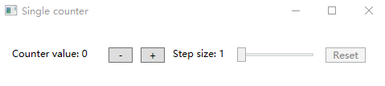

# dotnet 通过 Elmish.WPF 使用 F# 编写 WPF 应用

本文来安利大家一个有趣而且强大的库，通过 F# 和 C# 混合编程编写 WPF 应用，可以在 WPF 中使用到 F# 强大的数据处理能力

<!--more-->
<!-- CreateTime:2021/5/18 19:59:36 -->

<!-- 发布 -->

在 GitHub 上完全开源 Elmish.WPF 库，请看 [https://github.com/elmish/Elmish.WPF](https://github.com/elmish/Elmish.WPF)

在阅读本文之前，我期望大家已了解部分 F# 的知识。在学会 C# 基础知识之下，了解 F# 基础知识是很快的，而本文也仅仅只是用到很少的知识。大家都知道，使用 F# 能带来很好的数据处理能力，从 F# 语法层面带来的编写效率提升和编写逻辑的优化，而 F# 本身是没有带 GUI 可视化应用编程的。但是 F# 是在 dotnet 体系下的，天然就可以用上 dotnet 系的技术，当然就包括 WPF 了。因此上一句话说 F# 本身是没有带 GUI 可视化应用编程是完全错误的，因为 F# 可以非常方便调起 WPF 和 WinForms 等成熟的 UI 框架作为自身的可视化应用框架

通过 Elmish.WPF 库，将可以让开发更顺，以下是一个简单的例子。这个例子的代码完全放在 Elmish.WPF 库里，可以通过 [https://github.com/elmish/Elmish.WPF](https://github.com/elmish/Elmish.WPF) 获取所有代码

咱依然通过 VS 创建一个空白的 C# 空白 WPF 程序，在此例子里面，几乎没有 C# 多少的戏份，只是为了使用 C# 更好的驱动 WPF 程序而已，因为部分初始化方法和类型等在 F# 写起来的代码量可不少。本文的主角将交给 XAML 和 F# 这两个语言

打开 App.xaml.cs 文件，咱将修改本文仅有的一点 C# 代码

```csharp
  public partial class App : Application
  {
    public App()
    {
      this.Activated += StartElmish;
    }

    private void StartElmish(object sender, EventArgs e)
    {
      this.Activated -= StartElmish;
      Program.main(MainWindow);
    }
  }
```

以上代码的 Program 类是在 F# 项目里面编写的，也就是说 C# 语言只是胶水，用来做初始化的连接

接下来咱来创建一个简单的界面，这个界面如下

<!--  -->


基本功能是点击加号和减号分别实现当前数值的加减

大概的 XAML 代码如下

```xaml
  <StackPanel Orientation="Horizontal" HorizontalAlignment="Center" VerticalAlignment="Top" Margin="0,25,0,0">
    <TextBlock Text="{Binding CounterValue, StringFormat='Counter value: {0}'}" Width="110" Margin="0,5,10,5" />
    <Button Command="{Binding Decrement}" Content="-" Margin="0,5,10,5" Width="30" />
    <Button Command="{Binding Increment}" Content="+" Margin="0,5,10,5" Width="30" />
    <TextBlock Text="{Binding StepSize, StringFormat='Step size: {0}'}" Width="70" Margin="0,5,10,5" />
    <Slider Value="{Binding StepSize}" TickFrequency="1" Maximum="10" Minimum="1" IsSnapToTickEnabled="True" Width="100" Margin="0,5,10,5" />
    <Button Command="{Binding Reset}" Content="Reset" Margin="0,5,10,5" Width="50" />
  </StackPanel>
```

在 XAML 中定义了命令和值的绑定，没有做实际的实现

接下来创建一个 F# 项目，将这个项目被刚才创建的 WPF 项目所引用，将 WPF 项目作为启动项目。运行的顺序是先启动 WPF 项目，进入 App 类里面，在 App 的 Activated 事件，调用 F# 项目的逻辑，然后接下来就交给 F# 来进行数据绑定，在 F# 项目中，将给 MainWindow 附加自身作为 DataContext 数据用于在 XAML 绑定

在 F# 的 Program.fs 文件里面添加如下代码

```
module Elmish.WPF.Samples.SingleCounter.Program

open Serilog
open Serilog.Extensions.Logging
open Elmish.WPF

type Model =
  { Count: int
    StepSize: int }

type Msg =
  | Increment
  | Decrement
  | SetStepSize of int
  | Reset

let init =
  { Count = 0
    StepSize = 1 }

let canReset = (<>) init

let update msg m =
  match msg with
  | Increment -> { m with Count = m.Count + m.StepSize }
  | Decrement -> { m with Count = m.Count - m.StepSize }
  | SetStepSize x -> { m with StepSize = x }
  | Reset -> init

let bindings () : Binding<Model, Msg> list = [
  "CounterValue" |> Binding.oneWay (fun m -> m.Count)
  "Increment" |> Binding.cmd Increment
  "Decrement" |> Binding.cmd Decrement
  "StepSize" |> Binding.twoWay(
    (fun m -> float m.StepSize),
    int >> SetStepSize)
  "Reset" |> Binding.cmdIf(Reset, canReset)
]

let designVm = ViewModel.designInstance init (bindings ())

let main window =

  let logger =
    LoggerConfiguration()
      .MinimumLevel.Override("Elmish.WPF.Update", Events.LogEventLevel.Verbose)
      .MinimumLevel.Override("Elmish.WPF.Bindings", Events.LogEventLevel.Verbose)
      .MinimumLevel.Override("Elmish.WPF.Performance", Events.LogEventLevel.Verbose)
      .WriteTo.Console()
      .CreateLogger()

  WpfProgram.mkSimple (fun () -> init) update bindings
  |> WpfProgram.withLogger (new SerilogLoggerFactory(logger))
  |> WpfProgram.startElmishLoop window
```

十分简单的逻辑，在 F# 定义的命令等将可以通过 Elmish.WPF 库和 WPF 的 XAML 绑定，相当于 XAML 提供界面逻辑，而 F# 提供数据驱动的处理逻辑。各个语言的职责是 XAML 负责界面，而 F# 负责后台逻辑。将 XAML 和 F# 连接起来以及应用程序的启动是 C# 语言

<a rel="license" href="http://creativecommons.org/licenses/by-nc-sa/4.0/"></a><br />本作品采用<a rel="license" href="http://creativecommons.org/licenses/by-nc-sa/4.0/">知识共享署名-非商业性使用-相同方式共享 4.0 国际许可协议</a>进行许可。欢迎转载、 使用、重新发布，但务必保留文章署名[林德熙](http://blog.csdn.net/lindexi_gd)(包含链接:http://blog.csdn.net/lindexi_gd )，不得用于商业目的，基于本文修改后的作品务必以相同的许可发布。如有任何疑问，请与我[联系](mailto:lindexi_gd@163.com)。  
