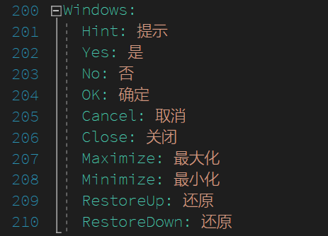

# dotnet 通过 dotnetCampus.YamlToCsharp 将 YAML 多语言文件构建为代码

我在团队内的几乎所有 dotnet 项目，包括 UWP 和 WPF 桌面端以及 Xamarin 移动端和 ASP.NET Core 后端等需要用到多语言的项目，我的多语言都是通过 YAML 写的，这样相对来说在项目比较小的时候维护方便。但是 YAML 写的文件要读取需要用到 YAML 解析等，这部分的解析速度不够快，于是我就写了一个工具，用于在软件构建的时候自动将 YAML 多语言文件构建为代码。这样不仅能提升软件的执行速度，还能减少软件发布时需要带出去 YAML 解析库

<!--more-->
<!-- CreateTime:2020/2/29 11:29:01 -->

<!-- 发布 -->

用 YAML 做多语言有什么好处？其实在项目用的语言项不多的时候可读性还是很好的，维护起来也很清真

<!--  -->


但是用 YAML 作为输出的缺点是需要在软件运行的时候解析这个 YAML 多语言文件，而解析 YAML 多语言文件需要 YAML 解析库，但是实际上我可以在软件构建的时候将 YAML 文件转换为 C# 代码，这样我就可以在软件运行的时候不需要解析这个 YAML 文件，提升我软件的运行速度

在客户端的应用，很多时候在软件运行第一个界面就需要用到多语言，而启动的时候文件读写最多的。如果此时还需要读取 YAML 文件，那么对软件启动速度还是很伤的。而刚好 dotnet 的一项技术就是 Roslyn 预编译技术，虽然本文用到的技术和 Roslyn 没有什么关系。但是可以在软件构建的时候将 YAML 转 C# 相当于将用户需要执行的时间放在构建时间上，基本上可以认定构建只需要一次，而用户端需要执行很多次，这部分节省的时间只要小伙伴不砍我就可以了

那么我如何在构建的时候将 YAML 转 C# 代码，放心我开源了一个工具，可以用来协助小伙伴从 YAML 生成 C# 代码

每个项目和框架使用的多语言风格都不相同，但是基本上都能作为一个字典的形式创建，也就是多语言项 和 多语言内容

也就是我需要将 YAML 转换为对应的 C# 的字典

在辅助构建项目里面添加 dotnetCampus.YamlToCsharp 库，然后可以在辅助构建多语言项目里面使用库里面的工具方法将 YAML 文件转换为 C# 代码文件

在 YamlFileToCsharpFile 类就提供了将 YAML 转换为 C# 的字典的方法，需要传入 YAML 文件和转换保存的 C# 代码文件地址，以及这个 C# 代码文件的类命名控件和类继承的接口和类名，以及返回多语言字典的方法

假设我的 YAML 文件为 `C:\lindexi\1.yml` 我期望将 1.yml 文件转换为 Foo.cs 文件，可以使用下面代码

```csharp
var yamlFileToCsharpFile = new YamlFileToCsharpFile();
yamlFileToCsharpFile.ParseToCsharpFile(new FileInfo(@"C:\lindexi\1.yml"), new FileInfo("Foo.cs"));
```

此时默认创建的代码的命名空间是 dotnetCampus.Localizations 而返回多语言的方法是 GetLang 而类名则是传入的文件名



```csharp
$@"//------------------------------------------------------------------------------
// <auto-generated>
//     此代码由工具生成。
//     运行时版本:4.0.30319.42000
//
//     对此文件的更改可能会导致不正确的行为，并且如果
//     重新生成代码，这些更改将会丢失。
// </auto-generated>
//------------------------------------------------------------------------------

using System.Collections.Generic;

namespace {classNamespace}
{{
    [System.CodeDom.Compiler.GeneratedCode(""dotnetCampus.YamlToCsharp"", ""1.0.0"")]
    public class {className} {interfaceName}
    {{
        public Dictionary<string, string> {methodName}()
        {{
            return {dictionary};
        }}
    }}
}}";
```



这个工具适用于在各个开发框架里面，因为这个工具不会被放入最终创建的项目，而是将这个工具生成的代码放入项目中。这个工具创建的代码使用的内容又全部是很基础的 C# 类的内容，虽然有一个特别的特性，但是这个特性是给 VisualStudio 用的，如果你有项目不认识这个特性，只要你提个 Issus 我就去优化

通过这个方式不仅能用上 YAML 简洁多语言配置，同时兼顾软件的运行性能

但是如何将这个库作为一个工具帮助你生成工具就需要你自己写额外的工具咯，因为这个框架使用的多语言都不同

这个库是开源的，请看 [dotnet-campus/dotnetCampus.YamlToCsharp: 将 YAML 文件转 C# 代码](https://github.com/dotnet-campus/dotnetCampus.YamlToCsharp )

如何写一个构建时执行的工具，在构建中添加自己的步骤请看下面博客

[如何创建一个基于命令行工具的跨平台的 NuGet 工具包 - walterlv](https://blog.walterlv.com/post/create-a-cross-platform-command-based-nuget-tool.html )

<a rel="license" href="http://creativecommons.org/licenses/by-nc-sa/4.0/"></a><br />本作品采用<a rel="license" href="http://creativecommons.org/licenses/by-nc-sa/4.0/">知识共享署名-非商业性使用-相同方式共享 4.0 国际许可协议</a>进行许可。欢迎转载、使用、重新发布，但务必保留文章署名[林德熙](http://blog.csdn.net/lindexi_gd)(包含链接:http://blog.csdn.net/lindexi_gd )，不得用于商业目的，基于本文修改后的作品务必以相同的许可发布。如有任何疑问，请与我[联系](mailto:lindexi_gd@163.com)。 
