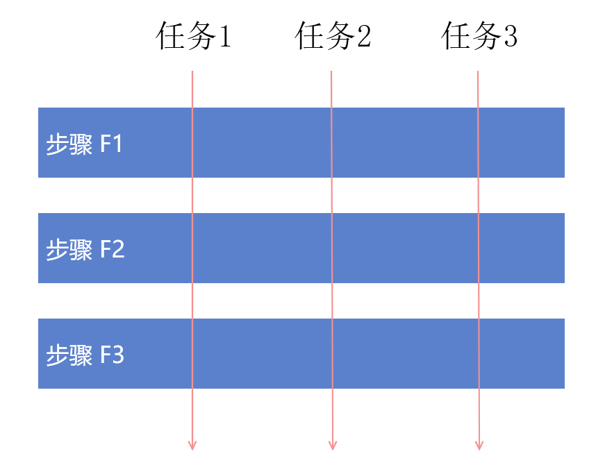

# dotnet 通过依赖注入的 Scoped 给工作流注入相同的上下文信息

本文将来聊聊 Microsoft.Extensions.DependencyInjection 这个依赖注入框架的 Scoped 功能的一个应用，这个框架是默认 ASP.NET Core 的核心库将会默认被引用。而其他 .NET 的应用如 WPF 或 Xamarin 等也可以使用这个库。因此本文标题就是 dotnet 而不是具体哪个框架

在开发的时候，咱会有一些复杂的逻辑需要多个类合作进行执行，而在使用多个类进行执行的时候，就涉及到上下文信息的传递。例如最简单的追踪 Id 的值，假定在多个类组成的多个步骤里面，因为存在多线程调用的问题，咱在定位问题的时候需要在日志里面输出当前步骤所使用的追踪 Id 是哪个，这样就运行进行并行多次任务同时执行，同时日志不会乱

<!--more-->
<!-- CreateTime:7/7/2020 2:53:44 PM -->

<!-- 发布 -->

尽管本文使用 Scoped 仅作为日志记录的功能没能发挥强大的日志库的作为，但是减弱日志库是为了提升 DependencyInjection 的强大，因此请小伙伴仅认为日志库和输出文本到控制台之间没有任何差别

<!--  -->


如上图，假定有三个步骤，分别是 F1 和 F2 和 F3 三个步骤，此时有3个任务同时进来。而我期望能够在日志里面的相关输出能包含当前的步骤在执行的任务是哪一个

最简单的方法是在每个步骤的参数里面传递上任务的追踪 Id 值，此时就可以在每个步骤里面的输出添加追踪信息

这个方法存在什么问题？如果我想要多添加额外的参数，此时我需要改一条链。另外也没有发挥 Scoped 的功能

那么什么是 Scoped 的功能？在 Microsoft.Extensions.DependencyInjection 提供的对象注入里面提供了三个不同的方式，第一个是瞬时 Transient 模式，这个模式可以让每次获取实例的时候，拿到的都是全新的实例。第二个是 Singleton 单例，无论在哪里从这个容器获取到的都是相同的对象。而最后一个也是最复杂的就是 Scoped 范围模式，也是本文要来安利大家的功能

先不说 Scoped 的定义，先来聊聊他的作用。在相同的 using 范围内，嗯，这个 Scoped 是容器的状态，容器可以通过 CreateScope 方法进入 Scoped 范围，如下面代码

```csharp
// IServiceProvider serviceProvider
using (var serviceScope = serviceProvider.CreateScope())
{
    
}
```

此时在一个相同的 serviceScope 实例创建的对象，如果这个对象在注入的时候标记了自己是 Scoped 范围，那么将会拿到相同的实例。而在标记了 Scoped 范围的对象在不同的 ServiceScope 实例创建的是不同的对象，如下面代码

```csharp
// IServiceProvider serviceProvider

// Foo 是注册为 Scoped 的对象
// services.AddScoped<Foo>();

using (var serviceScope1 = serviceProvider.CreateScope())
{
	// 下面代码的 foo 和 foo1 是相同的对象
    var foo = serviceScope.ServiceProvider.GetService<Foo>();
    var foo1 = serviceScope.ServiceProvider.GetService<Foo>();
}

using (var serviceScope2 = serviceProvider.CreateScope())
{
	// 下面的 foo2 和 foo 不是相同的对象
    var foo2 = serviceScope.ServiceProvider.GetService<Foo>();
}
```

因此假设将各个步骤加上步骤需要的上下文信息类都作为 Scoped 范围注入，那么此时在一次任务过程中，任务使用的步骤都在一个 Scoped 里面，如果此时的任务使用相同的类型的上下文信息类，那么此上下文信息将会是相同的对象。因此各个任务可以使用上下文信息共享信息

假设上下文信息类是 Info 类，里面只有使用一个信息就是 Id 这个信息

```csharp
    public class Info
    {
        public string Id { set; get; }
    }
```

为了方便起见，我还是创建一个 ASP.NET Core 应用，因为这个应用框架默认部署好了依赖注入

在 Startup.cs 里面进行注册

```csharp
        public void ConfigureServices(IServiceCollection services)
        {
            services.AddScoped<Info>();
        }
```

然后定义三个步骤的类

```csharp
    public class F1
    {
        public F1(ILogger<F1> logger, Info info, F2 f2)
        {
            _logger = logger;
            Info = info;
            F2 = f2;
        }

        public Info Info { get; }

        public void Do()
        {
            _logger.LogInformation(Info.Id);
            F2.Do();
        }

        private readonly ILogger<F1> _logger;

        private F2 F2 { get; }
    }

    public class F2
    {
        public F2(ILogger<F2> logger, Info info)
        {
            _logger = logger;
            Info = info;
        }

        public Info Info { get; }

        public void Do()
        {
            _logger.LogInformation(Info.Id);
        }

        private readonly ILogger<F2> _logger;
    }

    public class F3
    {
        public F3(ILogger<F3> logger, Info info)
        {
            _logger = logger;
            Info = info;
        }

        public Info Info { get; }

        public void Do()
        {
            _logger.LogInformation(Info.Id);
        }

        private readonly ILogger<F3> _logger;
    }
```

可以看到上面三个类都是只有一个 Do 方法，在 Do 方法里面调用日志记录上下文信息

在 Startup.cs 里面进行注册这三个步骤

```csharp
        public void ConfigureServices(IServiceCollection services)
        {
            services.AddControllers();

            services.AddScoped<Info>();

            services.AddScoped<F1>();
            services.AddScoped<F2>();
            services.AddScoped<F3>();
        }
```

在使用的时候，默认控制器就是注册为 Scoped 的，因此在控制器里面无论是构造注入或者是使用容器获取都是在相同的 Scoped 里面

上面代码是 F1 步骤引用 F2 步骤，咱在构造将 F1 注入。而 F3 是独立步骤，咱通过容器获取

```csharp
    [ApiController]
    [Route("[controller]")]
    public class WeatherForecastController : ControllerBase
    {
        public WeatherForecastController(ILogger<WeatherForecastController> logger, F1 f1, Info info,
            IServiceProvider serviceProvider)
        {
            Info = info;
            _logger = logger;
            _f1 = f1;
            _serviceProvider = serviceProvider;

            using (var serviceScope = serviceProvider.CreateScope())
            {
                var foo = serviceScope.ServiceProvider.GetService<Info>();
                var foo1 = serviceScope.ServiceProvider.GetService<Info>();
                if (ReferenceEquals(foo, foo1))
                {

                }
            }
        }

        public Info Info { get; }

        [HttpGet]
        public IActionResult Get()
        {
            Info.Id = DateTime.Now.ToString();
            _logger.LogInformation(Info.Id);
            _f1.Do();

            var f3 = _serviceProvider.GetService<F3>();
            f3.Do();

            return Ok();
        }

        private readonly F1 _f1;

        private readonly ILogger<WeatherForecastController> _logger;
        private readonly IServiceProvider _serviceProvider;
    }
```

执行代码可以看到 F1 和 F2 和 F3 的 Info 对象都是相同的对象，于是在 Info 对象设置的值可以在三个步骤使用

通过这个方法，在后续修改的时候，假如有一个信息是 F1 和 F3 都需要的，但是 F1 和 F3 是独立的，此时就可以再新建一个类用于存放此参数，然后将这个类注册为 Scoped 的。接着在 F1 和 F3 注入这个类，此时使用的对象就是相同的对象，因此参数也就能传递

有趣的是这个方法改动仅仅只是 F1 和 F3 两个类加上依赖注入构造，其他模块可以不动

本文代码放在 [github](https://github.com/lindexi/lindexi_gd/tree/9fb0b0aa1d6836e5ca652cc36f56900243c76bf8/YuqerejearniLearjiwhurhemcacemke) 欢迎小伙伴访问

<a rel="license" href="http://creativecommons.org/licenses/by-nc-sa/4.0/"></a><br />本作品采用<a rel="license" href="http://creativecommons.org/licenses/by-nc-sa/4.0/">知识共享署名-非商业性使用-相同方式共享 4.0 国际许可协议</a>进行许可。欢迎转载、使用、重新发布，但务必保留文章署名[林德熙](http://blog.csdn.net/lindexi_gd)(包含链接:http://blog.csdn.net/lindexi_gd )，不得用于商业目的，基于本文修改后的作品务必以相同的许可发布。如有任何疑问，请与我[联系](mailto:lindexi_gd@163.com)。
