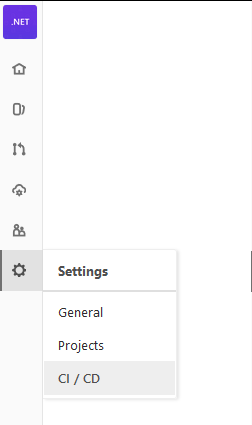
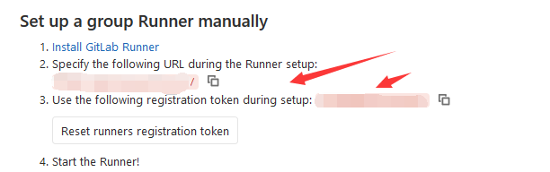
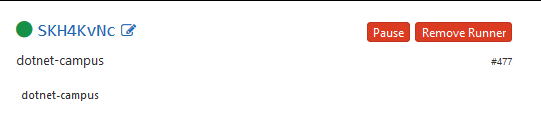
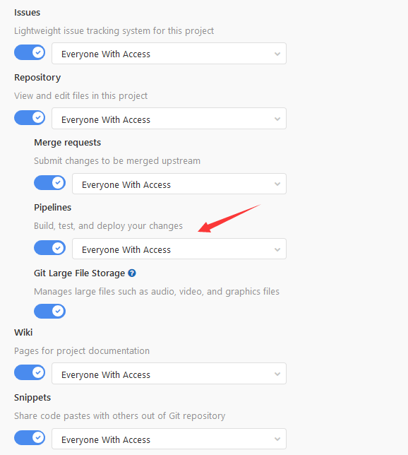

# dotnet 配置 Gitlab 的 Runner 做 CI 自动构建

今天在少珺小伙伴的协助下，使用了 gitlab 的 runner 给全组的项目做自动的构建。为什么需要使用 Gitlab 的 Runner 做自动构建，原因是之前是用的是 Jenkins 而新建一个底层库项目想要接入自动构建等，需要来回在 Gitlab 和 Jenkins 上配置，大概步骤差不多有 20 步，同时还有一堆 Jenkins 的坑。另外服务器是共有的，有其他组的小伙伴安装了诡异的工具让我的打包不断炸掉。于是我就和头像大人商量使用虚拟机环境的方法，我在空闲的服务器上安装了 VirtualBox 虚拟机，然后在虚拟机部署 Runner 接着在项目接入，这样就可以确定打包的环境，同时迁移服务器也比较方便

<!--more-->
<!-- CreateTime:2020/1/16 12:20:35 -->

<!-- 发布 -->

我在团队内负责团队各个项目用到的 CBB 也就是底层库也就是 NuGet 包项目的维护，作为配置管理员，最近有好多项目在准备接入，而小伙伴有炸掉了之前的 Jeknins 打包服务器，因为他需要在 Jenkins 打包服务器上安装 VS 2015 编译驱动项目。而每个新项目接入 Jenkins 都需要先找 Jenkins 管理员新建三个 Jenkins 项目，然后拷贝 Jenkins 项目的触发链接，在 gitlab 上对应项目给 Deploy Key 权限，然后设置集成路径，整个步骤非常多。而最近 Jenkins 管理员干掉了 Deploy Key 的权限用了一个新的，而我有60个项目需要改。为了提升效率，减少对服务器和 Jenkins 的依赖，我尝试了在虚拟机部署 gitlab runner 的方式，相对于原有的优势在于新建一个项目，如果都是相同技术栈，如 dotnet 技术栈的，只需要拷贝一个 `.gitlab-ci.yml` 文件，无需做任何配置就可以集成 CI 自动单元测试，每个 push 自动构建，合并 master 分支自动打包发布 nuget 包。也就是从原本平均 20 分钟搭建一个项目，每天不断修配置，到现在不到1分钟搞定

当然上面说的 1 分钟搞定不包含我首次弄虚拟机到配置打包等，我踩了以下的坑

- 服务器使用无线网，此时无线网不稳定，让 gitlab 打包失败
- 虚拟机是用的是 nat 方式，建议使用桥接方式让 gitlab 和虚拟机在相同局域网
- 虚拟机里面的 runner 使用服务运行，也就是访问不到用户变量和用户路径的文件

首先在服务器上安装 VirualBox 然后安装 Win10 最新版本，为什么使用 VirualBox 原因是这个是免费的。迁移服务器只需要复制虚拟机硬盘就可以了

从 Gitlab 官方下载[runner](https://docs.gitlab.com/runner/install/windows.html) 本文接下来都是在虚拟机做的，其实不是虚拟机也相同

将 runner 放在磁盘的非根文件夹，推荐此时的文件夹路径不要太长，如我放在 `c:\gitlab` 文件夹，原因是 runner 将会在相同文件夹创建 build 文件夹，这个文件夹里面下载代码然后编译，如果此时的路径太长了，可能因为超过了 260 个字符，让后续的配置需要考虑，另外请设置这个路径可以读写，默认在 Windows 创建的文件夹都是可以读写的，只需要尝试右击新建文件夹看是否成功就知道创建的文件夹是否有权限

用管理员权限命令行进入 runner 所在的文件夹，运行下面两句命令将 runner 安装作为服务

```csharp
.\gitlab-runner.exe install
.\gitlab-runner.exe start
```

我推荐给 gitlab 的全组进行配置 runner 在进行全组的配置和对单个项目配置是差不多的

<!--  -->


从 gitlab 的设置点击 CI 选项

展开 Runners 内容

此时可以看到对应的 url 链接和 token 的值

<!--  -->


在命令行输入 `gitlab-runner.exe register` 回车

此时命令行要求输入 gitlab 的路径，输入上面复制的链接，接着输入上面复制的key然后给这个 Runner 命名，如果成功可以在刷新 gitlab 看到刚才的 runner 运行

<!--  -->


因为 gitlab runner 是使用 System 在虚拟机运行的，也就是在虚拟机里面需要做比较多的配置让服务可以访问到各个工具

在下载安装了 VisualStudio 2019 企业版激活之后，可以在 `C:\Program Files (x86)\Microsoft Visual Studio\2019\Enterprise\MSBuild\Current\Bin\MSBuild.exe` 找到 msbuild 工具，右击计算机属性，高级系统设置，高级，环境变量，设置全局环境变量

双击系统变量的  Path 值，将路径 `C:\Program Files (x86)\Microsoft Visual Studio\2019\Enterprise\MSBuild\Current\Bin\` 加入，加入之后重新打开一个命令行，输入 `msbuild` 如果看到msbuild运行那么就是设置成功。如果安装的不是 VisualStudio 2019 企业版，那么请将上面路径替换为你的 msbuild 路径

接下来进入 nuget.org 官网，点击下载，下载最新的 NuGet 工具，将下载的 NuGet 工具放在一个文件夹，将这个文件夹加入到系统变量的 Path 值，用一个新的命令行输入 nuget 看是否可以找到

如果需要用到内部网络的 NuGet 源，注意不能直接通过 VisualStudio 配置，原因是 VisualStudio 配置的 NuGet 文件是否在 user 文件夹的，而 Runner 使用 System权限运行，所以找不到 VisualStudio 设置的文件

先通过 VisualStudio 设置私有的 NuGet 源，或通过 SublimeText 等工具设置，如何设置请看 [全局或为单独的项目添加自定义的 NuGet 源 - walterlv](https://blog.walterlv.com/post/add-custom-nuget-source.html )

然后打开 `%appdata%\NuGet\` 文件夹，可以找到 `nuget.config` 文件，将这个文件复制到 `%ProgramFiles(x86)%\NuGet\Config` 文件夹，这样 Runner 就能访问到这里的文件，读取私有的 NuGet 链接

下一步就是给具体的项目配置 CI 了，如果没有在项目看到这个图标，那么就是这个项目没有配置好


进入 General Settings 然后展开 Visibility, project features, permissions 的内容，让你的设置和我下面的图片相同

<!--  -->


如果之前配置过 Jenkins 那么请到 Integrations Settings 将链接删掉

在开始配置之前，请在本地尝试各个命令行能运行通过，本文使用 dotnet core 作为例子，同时用到了 NuGet 的上传而不是 dotnet 的上传

在项目的根文件夹放一个 `.gitlab-ci.yml` 文件，尝试添加下面代码

```yaml
# 这是一个 yaml 文件，使用 # 作为注释
stages:
  - build
  - test
  - publish
# 定义编译需要三个 job 分别是编译和测试和发布，注意不同的 job 是在完全空白的项目，不会用到上一个job编译的文件

build:
  stage: build
  script:
    - "chcp 65001" # 这里的 chcp 65001 是支持中文 GBK 解决命令行输出
    - "dotnet build -c release"

test:
  stage: test
  script:
    - "chcp 65001"
    - "dotnet test" # 如果有单元测试将请加上，没有就删除这一行

publish:
  stage: publish
  script:
    - "chcp 65001"
    - "dotnet build -c release" # 因为 job 不会用到上一个 job 创建的文件，所以需要重新执行编译
    - 'nuget push bin\release\*.nupkg -Source Origin -SkipDuplicate -ApiKey $NuGetKey' # 通过 NuGet 上传到 Origin 源，请将这个 Origin替换为你需要上传的链接，另外 $NuGetKey 是在全局配置的变量，在本文下面会告诉大家

  only:
    - master # 设置 publish 只有在推 master 分支时触发

```

上面的配置将会在每次push触发，然后自动执行编译，只有在 master 分支被 push 时触发发布

请注意在本地将上面命令运行一下，确定命令可以运行

为什么需要在 NuGet 使用 -ApiKey 输入全局配置的变量而不是使用 nuget.config 的配置？原因是如果没有配置将会提示系统找不到文件

```
系统找不到指定的路径。
System.Security.Cryptography.CryptographicException: 系统找不到指定的路径。

   在 System.Security.Cryptography.ProtectedData.Unprotect(Byte[] encryptedData, Byte[] optionalEntropy, DataProtectionScope scope)
   在 NuGet.Configuration.EncryptionUtility.DecryptString(String encryptedString)
   在 NuGet.Configuration.SettingsUtility.GetDecryptedValueForAddItem(ISettings settings, String section, String key, Boolean isPath)
   在 NuGet.Commands.CommandRunnerUtility.GetApiKey(ISettings settings, String endpoint, String source, String defaultApiKey, Boolean isSymbolApiKey)
   在 NuGet.Commands.PushRunner.<>c__DisplayClass0_0.<Run>b__0(String endpoint)
   在 NuGet.Protocol.Core.Types.PackageUpdateResource.<Push>d__14.MoveNext()
--- 引发异常的上一位置中堆栈跟踪的末尾 ---
   在 System.Runtime.ExceptionServices.ExceptionDispatchInfo.Throw()
   在 System.Runtime.CompilerServices.TaskAwaiter.HandleNonSuccessAndDebuggerNotification(Task task)
   在 NuGet.Commands.PushRunner.<Run>d__0.MoveNext()
--- 引发异常的上一位置中堆栈跟踪的末尾 ---
   在 System.Runtime.ExceptionServices.ExceptionDispatchInfo.Throw()
   在 System.Runtime.CompilerServices.TaskAwaiter.HandleNonSuccessAndDebuggerNotification(Task task)
   在 NuGet.CommandLine.PushCommand.<ExecuteCommandAsync>d__36.MoveNext()
--- 引发异常的上一位置中堆栈跟踪的末尾 ---
   在 System.Runtime.ExceptionServices.ExceptionDispatchInfo.Throw()
   在 System.Runtime.CompilerServices.TaskAwaiter.HandleNonSuccessAndDebuggerNotification(Task task)
   在 NuGet.CommandLine.Command.Execute()
   在 NuGet.CommandLine.Program.MainCore(String workingDirectory, String[] args)
```

在全局配置和单独项目进行配置是相同的方法，点击设置进入 CI 设置，点击 Variables 设置变量

在 Key 选项填入 `NuGetKey` 在 Value 填对应的 NuGet 的 ApiKey 的值。如果在 Key 选项填入 `foo` 那么在 ci.yaml 文件里面通过 `$foo` 拿到值

现在有新项目接入就快多了，只需要让新项目复制 `.gitlab-ci.yml` 文件就可以了。如果服务器被弄坏了，只需要将备份的虚拟机硬盘拿出来重新在新的服务器使用

如果存在全局的 Runner 设置，请在 job 输出看具体在哪个 runner 运行，如下面有一个全局共享的运行

```csharp
Running with gitlab-runner 12.4.1 (05161b14)
  on runner-gitlab-runner-79235b5bd8-vxzt2 neRzXdJb
```

我的代码需要在 windows 下运行，此时请在项目设置，点击 CI 设置，禁用 Shared Runners 运行

如提示也就是在 linux 环境运行，请看具体在哪个运行

```csharp
chcp 65001
/bin/bash: line 85: chcp: command not found
```

如我的需要在 dotnet campus 的设备运行，通过输出就可以看到在哪个运行

如果此时用到了 msbuild 同时项目使用 SDK 格式，此时的 NuGet 将会放在 `user\.nuget` 文件夹里面，而如果 runner 使用的是服务运行，使用的用户是 System 那么将找不到 user 文件夹，此时的 NuGet 文件就找不到，可以看到下面提示

```
         C:\Program Files\dotnet\sdk\3.1.101\Sdks\Microsoft.NET.Sdk\targets\Microsoft.PackageDependencyResolution.targets(234,5): error NETSDK1064: 未找到版本为 16.2.0 的包 Microsoft.CodeCoverage。它可能已在 NuGet 还原后删除。否则，NuGet 还原可能只是部分完成，这种情况可能是最大路径长度限制所导致。 [C:\gitlab\builds\SKH4KvNc\0\dotnet-campus\dotnetCampus.Lindexi\Code\dotnetCampus.Lindexi.Tests\dotnetCampus.Lindexi.Tests.csproj]
```

解决方法是让 Runner 使用某个用户权限运行，其实如果让 Runner 使用某个用户权限运行，此时上面的很多全局配置也就不需要做了。如果有关注我的博客的小伙伴就会发现其实本文是分两次写的，因为开始我使用了 dotnet 没有发现问题，而后续用到了 msbuid 就发现了这个坑

如果已经安装上了 Runner 可以执行下面代码卸载

```powershell
.\gitlab-runner.exe stop
.\gitlab-runner.exe uninstall
```

注意使用管理员权限运行

然后用某个用户权限安装，因为我是在虚拟机运行的，我可以使用登录用户作为运行 Runner 用户

```
.\gitlab-runner.exe install --user ".\ENTER-YOUR-USERNAME" --password "ENTER-YOUR-PASSWORD"
```

注意需要在 `--user` 添加的用户名加上 `.\` 如我的用户名是 `lindexi` 密码是  `lindexishidoubi` 那么可以这样安装

```
.\gitlab-runner.exe install --user ".\lindexi" --password "lindexishidoubi"
```

然后输入 `.\gitlab-runner.exe start` 启动，如果输出没有权限，那么请继续往下看

```
FATA[0000] Failed to start GitLab Runner: The service did not start due to a logon failure.
```

这是因为登录用户没有使用服务权限登录

进入控制面板，进入系统和安全，进入管理工具，在新打开的界面打开本地安全策略工具。点击安全设置下的本地策略，展开本地策略点击用户权限分配，找到右侧作为服务登录 双击添加用户或组将刚才 `--user` 使用的用户添加

这个用户就作为服务登录，因为我是在虚拟机使用，所以我可以将当前用户作为服务登录。不过如果在开发设备上，也可以这样设置，此时可以模拟一些有趣的用户环境，找到一些有趣的坑

但我现在也遇到以下问题：

如何将 CI 打包推送的 NuGet 包和源仓库的 Tag 关联起来，作为需要维护一个有历史的 CBB 基本上通过某个 NuGet 包回溯到对应的 Tag 是十分需要的功能，否则会被小伙伴砍的。我用到了一个 NuGet 包，我发现这个包有问题，我如何拿到这个包的代码？这是最大的坑。于是我就有以下问题

- 是否应该在 CI 自动推送 NuGet 包时，自动给源仓库打一个 Tag 号
- 如果 CI 适合给源仓库打一个 Tag 号，那么这个 Tag 应该如何做
- 是否应该放在 git 的 Hook 里面，通过 git Hook 触发打包推送 NuGet 包或通过 hook 打 Tag 号
- 如果应该放在 Hook 那么这个 Tag 如何生成？
- 是否应该在手动推 Tag 时触发打包，那么这个手动推的 Tag 如何关联到 NuGet 版本号

最好不要写脚本，因为脚本写起来只有了解版本的小伙伴才能了解，基本上不可维护，除非只是调用这个命令行

<a rel="license" href="http://creativecommons.org/licenses/by-nc-sa/4.0/"></a><br />本作品采用<a rel="license" href="http://creativecommons.org/licenses/by-nc-sa/4.0/">知识共享署名-非商业性使用-相同方式共享 4.0 国际许可协议</a>进行许可。欢迎转载、使用、重新发布，但务必保留文章署名[林德熙](http://blog.csdn.net/lindexi_gd)(包含链接:http://blog.csdn.net/lindexi_gd )，不得用于商业目的，基于本文修改后的作品务必以相同的许可发布。如有任何疑问，请与我[联系](mailto:lindexi_gd@163.com)。
