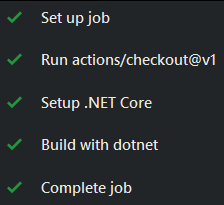
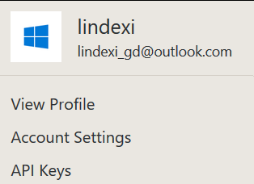
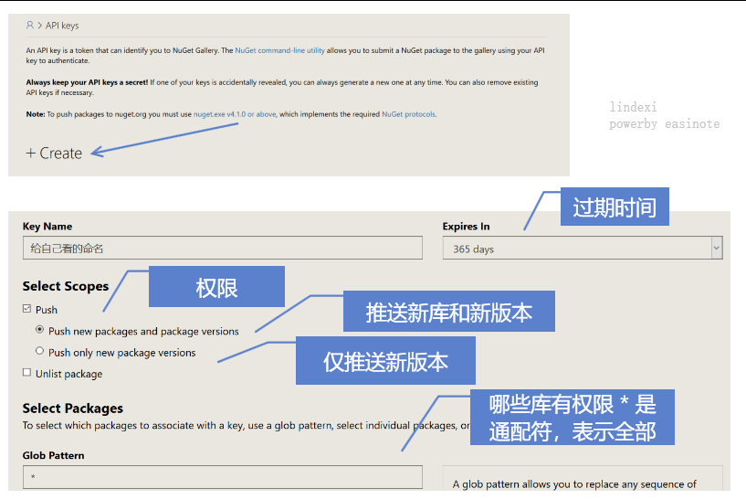
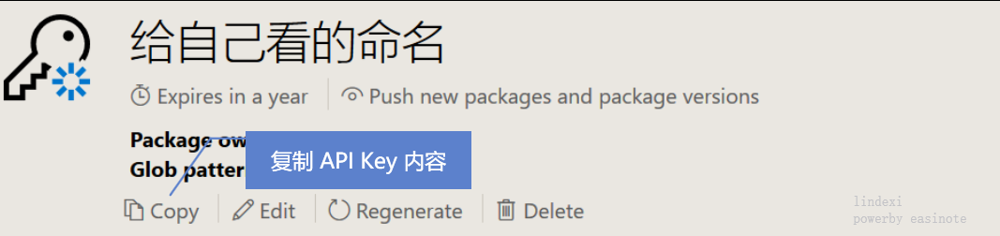
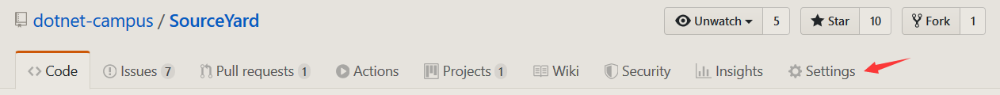
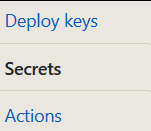
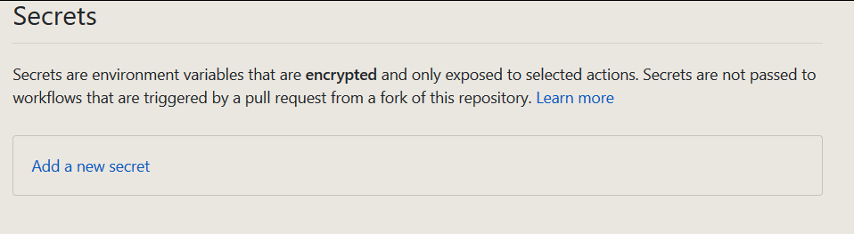
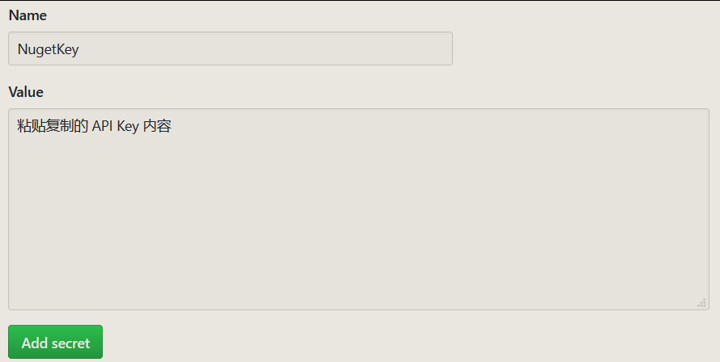

# dotnet 配置 github 自动打包上传 nuget 文件

在上一篇博客告诉小伙伴如何使用 github 做持续集成，本文告诉大家如何配置 github 让在 master 每次合并都会自动创建一个 nuget 文件，自动上传

<!--more-->
<!-- CreateTime:2019/12/19 11:08:03 -->

<!-- 发布 -->
<!-- 标签：Github，GithubAction -->

在 github 的 action 功能可以很方便创建打包任务，但是没有很方便进行 nuget 上传，需要额外写一点代码

全部的源代码请看 [github](https://github.com/dotnet-campus/SourceYard/blob/25939a6/.github/workflows/PublishNuget.yml) 如果发现有坑请邮件告诉我

## 创建配置文件

在[上一篇](https://blog.lindexi.com/post/dotnet-%E9%83%A8%E7%BD%B2-github-%E7%9A%84-Action-%E8%BF%9B%E8%A1%8C%E6%8C%81%E7%BB%AD%E9%9B%86%E6%88%90.html)博客告诉小伙伴在 `.github/workflows` 文件夹创建 `*.yml` 文件就可以作为 action 配置文件

创建一个随意命名的 yml 文件在 `.github/workflows` 文件夹，完成创建配置文件

## 标识

每个 workflow 都可以使用单独的命名，这个命名不是从文件名读取，而是通过 `name:` 属性读取。在读本文之前，我认为小伙伴都是了解 YAML 格式的，也就不对大家说明 YAML 的语法

```yaml
name: publish nuget
```

上面的代码就会添加命名是 `publish nuget` 的 workflow 在 action 页面可以通过对应的命名找到不同的 workflow 如


## 触发条件

因为我不需要在任何的分支都触发打包，只需要触发在 master 合并，可以使用下面代码

```yml
on: 
  push:
    branches: 
      - master

```

这里 on 属性就是表示触发条件，触发条件是 push 同时要求分支是 `master` 分支，当然这里支持多个分支

我不会在这里和官方文档一样详细告诉大家其他更多有趣的配置

## 运行环境

接下来的代码都会放在 jobs 下面

```yaml
jobs:
  build:

```

通过 runs-on 属性可以指定在哪个环境运行，如在 windows 的最新版本运行

```yaml
jobs:
  build:
    runs-on: windows-latest
```

## 切换分支

接下来就是打包步骤，在编译前需要通过 git 拿到当前代码

```yaml
jobs:
  build:
    runs-on: windows-latest
    steps:
    - uses: actions/checkout@v1
```

然后就是一个个具体的打包步骤了

## 安装 dotnet 应用

其实使用最新的 windows 环境是不需要做安装 dotnet 应用的

在打包步骤，每个步骤都包含一个 name 属性，用于在打包告诉开发执行的步骤，效果如下

<!--  -->


在安装 dotnet 应用将会使用现有的脚本，其实在上一步的 `uses: actions/checkout@v1` 其实就是使用 github 的 `https://github.com/actions/checkout` 仓库的脚本

安装 dotnet 可以使用 `actions/setup-dotnet` 脚本

```yaml
    steps:
    - uses: actions/checkout@v1

    - name: Setup .NET Core
      uses: actions/setup-dotnet@v1
      with:
        dotnet-version: 3.1.100
```

这里的 with 属性就是添加参数，通过值和键的方式，上面代码就给了 dotnet 版本

## 编译代码

在 dotnet 可以通过 pack 命令编译打包，在打包步骤，除了使用 `uses` 使用现有代码，还可以使用 run 执行命令行代码


```yaml
    - name: Build with dotnet
      run: dotnet pack --configuration Release
      shell: pwsh
```

默认在 windows 执行的是 PowerShellCore 脚本，可以通过 shell 属性指定使用哪个平台，可选的是

- bash 在非 windows 平台降级为 sh 脚本
- pwsh 使用 PowerShellCore 脚本
- python 使用 python 命令
- sh 使用 sh 命令
- cmd 使用批处理脚本
- powershell 使用 powershell 脚本

在执行上面代码的要求是在仓库的文件夹存在 `.sln` 文件，如果仓库文件夹不存在，那么需要加入 sln 所在的路径

## 安装 nuget 应用

在 windows 平台都没有安装 nuget 需要从官方下载

下载 nuget 需要多句命令，在 action 通过在 run 添加 `|` 写多行命令

```yaml
    - name: Install Nuget
      run: |
        $sourceNugetExe = "https://dist.nuget.org/win-x86-commandline/latest/nuget.exe"
        $targetNugetExe = "nuget.exe"
        Invoke-WebRequest $sourceNugetExe -OutFile $targetNugetExe
      shell: pwsh
```

使用 PowerShell 脚本下载 nuget 文件，因为 nuget 文件不需要加入环境变量，所以就不需要额外步骤

另外官方提供了安装 NuGet 的脚本，只需要使用下面代码就可以完成安装

```yaml
- name: Install Nuget
  uses: nuget/setup-nuget@v1
  with:
    nuget-version: '5.x'
```

多谢 [h神](http://www.cnblogs.com/h82258652) 提供的方法

## 添加上传信息

可以上传 nuget 到 nuget.org 也可以上传在对应的 github 仓库，上传到 github 仓库请看 [Github 给仓库上传 NuGet 库](https://blog.lindexi.com/post/Github-%E7%BB%99%E4%BB%93%E5%BA%93%E4%B8%8A%E4%BC%A0-NuGet-%E5%BA%93.html )

请先测试一下按照 [Github 给仓库上传 NuGet 库](https://blog.lindexi.com/post/Github-%E7%BB%99%E4%BB%93%E5%BA%93%E4%B8%8A%E4%BC%A0-NuGet-%E5%BA%93.html ) 是否成功上传 nuget 库，如果成功那么添加下面代码

```yaml
    - name: Add private GitHub registry to NuGet
      run: |
        .\nuget sources add -name github -Source https://nuget.pkg.github.com/ORGANIZATION_NAME/index.json -Username ORGANIZATION_NAME -Password ${ { secrets.GITHUB_TOKEN } }
```

这样就添加对应的仓库，可以用来上传

当然，上传到 nuget.org 就需要设置 ApiKey 了，打开 nuget.org 用自己的帐号登录，点击 API keys 设置

<!--  -->


进入之后按照下图给配置，或根据自己的需要给配置

<!--  -->


点击完成，将 API key 复制

<!--  -->


小伙伴也不想将这个的 API Key 放在脚本里面，如果放在脚本里面，也许有逗比会哪这个 API Key 传一些有趣的库，所以需要在这个 API Key 放在安全的地方

打开对应仓库的设置页面

<!--  -->


点击安全

<!--  -->


点击新建安全

<!--  -->


粘贴刚才复制的 API Key 到内容

<!--  -->


这里的 name 在脚本通过 `${ { secrets.Name } }` 替换，这里的 `secrets.Name` 的 Name 就是输入的 name 如上面输入的是 NugetKey 在使用脚本需要下面代码

```yaml
${ { secrets.NugetKey } }  # 请删除 } 和 } 中间的空格
```

完成配置之后就是上传库

## 上传文件

使用 nuget 用下面命令上传 nuget 文件

```yaml
.\nuget push .\bin\release\*.nupkg -Source github -SkipDuplicate
```

上面代码就是将 `bin\release\` 文件夹的所有 `nupkg` 文件上传到 github 这个源，同时跳过已经上传的版本

而刚才没有配置 nuget.org 的源，需要使用这个代码上传

```yaml
.\nuget push .\bin\release\*.nupkg -Source https://api.nuget.org/v3/index.json -SkipDuplicate -ApiKey ${ { secrets.NugetKey } } -NoSymbols
```

这里 `-ApiKey` 用到上一步添加的安全信息，细心小伙伴发现添加了 `-NoSymbols` 因为 nuget.org 默认上传 snupkg 文件，如果找不到文件就会提示找不到文件，请看 [NuGet 命令行上传找不到 snupkg 文件](https://blog.lindexi.com/post/NuGet-%E5%91%BD%E4%BB%A4%E8%A1%8C%E4%B8%8A%E4%BC%A0%E6%89%BE%E4%B8%8D%E5%88%B0-snupkg-%E6%96%87%E4%BB%B6.html)

现在就完成了合并代码到 master 分支自动执行持续集成，打包完成自动上传 nuget 和 github 同时配置很简单

## 全部代码

下面代码直接复制可能无法在你的项目运行，请根据你的项目修改

```yaml
name: publish nuget

on: 
  push:
    branches: 
      - master

jobs:
  build:

    runs-on: windows-latest

    steps:
    - uses: actions/checkout@v1
 
    - name: Setup .NET Core
      uses: actions/setup-dotnet@v1
      with:
        dotnet-version: 3.1.100
    - name: Build with dotnet
      run: dotnet pack --configuration Release
    - name: Install Nuget
      run: |
        $sourceNugetExe = "https://dist.nuget.org/win-x86-commandline/latest/nuget.exe"
        $targetNugetExe = "nuget.exe"
        Invoke-WebRequest $sourceNugetExe -OutFile $targetNugetExe
      shell: pwsh
    - name: Add private GitHub registry to NuGet
      run: |
        .\nuget sources add -name github -Source https://nuget.pkg.github.com/ORGANIZATION_NAME/index.json -Username ORGANIZATION_NAME -Password ${ { secrets.GITHUB_TOKEN } } # 请删除 } 和 } 中间的空格
    - name: Push generated package to GitHub registry
      run: |
        .\nuget push .\bin\release\*.nupkg -Source github -SkipDuplicate
        .\nuget push .\bin\release\*.nupkg -Source https://api.nuget.org/v3/index.json -SkipDuplicate -ApiKey ${ { secrets.NugetKey } } -NoSymbols 
```

上面的代码在 [SourceYard](https://github.com/dotnet-campus/SourceYard) 使用，这是我开源的项目，支持制作源代码的 nuget 库文件。也就是通过 nuget 给小伙伴的不是 dll 引用，而是源代码引用，特别适合小的库

本文的所有代码放在 [GitHub](https://github.com/dotnet-campus/SourceYard/blob/01841b40f5c3dec111052097f157fc7c591acd77/.github/workflows/PublishNuget.yml) 欢迎小伙伴访问

<a rel="license" href="http://creativecommons.org/licenses/by-nc-sa/4.0/"></a><br />本作品采用<a rel="license" href="http://creativecommons.org/licenses/by-nc-sa/4.0/">知识共享署名-非商业性使用-相同方式共享 4.0 国际许可协议</a>进行许可。欢迎转载、使用、重新发布，但务必保留文章署名[林德熙](http://blog.csdn.net/lindexi_gd)(包含链接:http://blog.csdn.net/lindexi_gd )，不得用于商业目的，基于本文修改后的作品务必以相同的许可发布。如有任何疑问，请与我[联系](mailto:lindexi_gd@163.com)。
