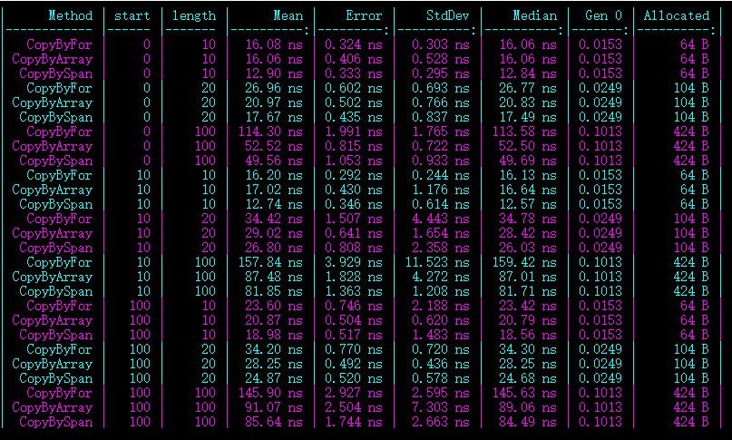

# dotnet 6 数组拷贝性能对比

本文来对比多个不同的方法进行数组拷贝，和测试其性能

<!--more-->


<!-- CreateTime:2021/8/30 8:45:46 -->

<!-- 博客 -->
<!-- 发布 -->

测试性能必须采用基准（标准）性能测试方法，否则测试结果不可信。在 dotnet 里面，可以采用 [BenchmarkDotNet](https://benchmarkdotnet.org/Guides/ChoosingRunStrategy.htm ) 进行性能测试。详细请看 [C# 标准性能测试](https://blog.lindexi.com/post/C-%E6%A0%87%E5%87%86%E6%80%A7%E8%83%BD%E6%B5%8B%E8%AF%95.html )

拷贝某个数组的从某个起始点加上某个长度的数据到另一个数组里面，可选方法有很多，本文仅列举出使用 `for` 循环拷贝，和使用 Array.Copy 方法和用 Span 方法进行拷贝进行对比

假定有需要被拷贝的数组是 `TestData` 其定义如下

```csharp
        static Program()
        {
            TestData = new int[1000];
            for (int i = 0; i < 1000; i++)
            {
                TestData[i] = i;
            }
        }

        private static readonly int[] TestData;
```

使用 `for` 循环拷贝的方法如下

```csharp
        public object CopyByFor(int start, int length)
        {
            var rawPacketData = TestData;

            var data = new int[length];
            for (int localIndex = 0, rawArrayIndex = start; localIndex < data.Length; localIndex++, rawArrayIndex++)
            {
                data[localIndex] = rawPacketData[rawArrayIndex];
            }
            return data;
        }
```

以上代码返回 data 作为 object 仅仅只是为了做性能测试，避免被 dotnet 优化掉

另一个拷贝数组是采用 `Array.Copy` 拷贝，逻辑如下

```csharp
        public object CopyByArray(int start, int length)
        {
            var rawPacketData = TestData;
            var data = new int[length];
            Array.Copy(rawPacketData,start,data,0, length);
            return data;
        }
```

采用新的 dotnet 提供的 Span 进行拷贝，代码如下

```csharp
        public object CopyBySpan(int start, int length)
        {
            var rawPacketData = TestData;
            var rawArrayStartIndex = start;
            var data = rawPacketData.AsSpan(rawArrayStartIndex, length).ToArray();
            return data;
        }
```

接着加上一些性能调试辅助逻辑

```csharp
        [Benchmark]
        [ArgumentsSource(nameof(ProvideArguments))]
        public object CopyByFor(int start, int length)
        {
            var rawPacketData = TestData;

            var data = new int[length];
            for (int localIndex = 0, rawArrayIndex = start; localIndex < data.Length; localIndex++, rawArrayIndex++)
            {
                data[localIndex] = rawPacketData[rawArrayIndex];
            }
            return data;
        }

        [Benchmark]
        [ArgumentsSource(nameof(ProvideArguments))]
        public object CopyByArray(int start, int length)
        {
            var rawPacketData = TestData;
            var data = new int[length];
            Array.Copy(rawPacketData,start,data,0, length);
            return data;
        }

        public IEnumerable<object[]> ProvideArguments()
        {
            foreach (var start in new[] { 0, 10, 100 })
            {
                foreach (var length in new[] { 10, 20, 100 })
                {
                    yield return new object[] { start, length };
                }
            }
        }
```

在我的设备上的测试效果如下

```
BenchmarkDotNet=v0.13.1, OS=Windows 10.0.19042.1200 (20H2/October2020Update)
Intel Core i7-9700K CPU 3.60GHz (Coffee Lake), 1 CPU, 8 logical and 8 physical cores
.NET SDK=6.0.100-preview.7.21379.14
  [Host]     : .NET 6.0.0 (6.0.21.37719), X64 RyuJIT
  DefaultJob : .NET 6.0.0 (6.0.21.37719), X64 RyuJIT
```

<!--  -->


可以看到，在对比使用 `for` 循环拷贝和使用 `Array.Copy` 拷贝中，使用 `Array.Copy` 拷贝的性能更好，在拷贝的数组长度越长的时候，使用 Array.Copy 拷贝性能优势就更好

接下来再加上 Span 的性能比较，如下面代码

```csharp
        [Benchmark]
        [ArgumentsSource(nameof(ProvideArguments))]
        public object CopyBySpan(int start, int length)
        {
            var rawPacketData = TestData;
            var rawArrayStartIndex = start;
            var data = rawPacketData.AsSpan(rawArrayStartIndex, length).ToArray();
            return data;
        }
```

性能对比测试如下

<!--  -->


可以看到 Span 的性能比 `Array.Copy` 拷贝性能更强

在 Span 里面，转换为数组的逻辑如下

```csharp
        [MethodImpl(MethodImplOptions.AggressiveInlining)]
        public T[] ToArray()
        {
            if (_length == 0)
                return Array.Empty<T>();

            var destination = new T[_length];
            Buffer.Memmove(ref MemoryMarshal.GetArrayDataReference(destination), ref _pointer.Value, (nuint)_length);
            return destination;
        }
```

这里使用到的 Buffer 的有黑科技的 Memmove 方法，此方法的实现如下

```csharp
        [MethodImpl(MethodImplOptions.AggressiveInlining)]
        internal static void Memmove<T>(ref T destination, ref T source, nuint elementCount)
        {
            if (!RuntimeHelpers.IsReferenceOrContainsReferences<T>())
            {
                // Blittable memmove

                Memmove(
                    ref Unsafe.As<T, byte>(ref destination),
                    ref Unsafe.As<T, byte>(ref source),
                    elementCount * (nuint)Unsafe.SizeOf<T>());
            }
            else
            {
                // Non-blittable memmove
                BulkMoveWithWriteBarrier(
                    ref Unsafe.As<T, byte>(ref destination),
                    ref Unsafe.As<T, byte>(ref source),
                    elementCount * (nuint)Unsafe.SizeOf<T>());
            }
        }
```

以上性能测试使用的是 int 数组，刚好能进入 Memmove 的分支，而不是 BulkMoveWithWriteBarrier 这个分支。在里层的 Memmove 方法里面用到了很多黑科技，本文只是用来对比多个方法拷贝数组的性能，黑科技部分就需要大家自己去阅读 dotnet 的源代码啦


另外，如果需要做完全的数组的拷贝，数组里面存放的是值类型对象，如 int 类型，那么拷贝整个数组还有另一个可选项是通过 `Clone` 方法进行拷贝，代码如下

```csharp
        public object CopyByClone()
        {
            var data = (int[]) TestData.Clone();
            return data;
        }
```

使用 `Clone` 的方法的行为是返回数组的浅表拷贝，也就是说数组里面的元素没有做深拷贝，只是拷贝数组本身而已。对于值类型来说，就没有啥问题了

稍微更改一下性能测试，更改的代码如下

```csharp
    [MemoryDiagnoser]
    public class Program
    {
        static void Main(string[] args)
        {
            BenchmarkRunner.Run<Program>();
        }

        static Program()
        {
            TestData = new int[1000];
            for (int i = 0; i < 1000; i++)
            {
                TestData[i] = i;
            }
        }

        [Benchmark]
        public object CopyByFor()
        {
            var rawPacketData = TestData;
            var length = TestData.Length;

            var data = new int[length];
            for (int localIndex = 0, rawArrayIndex = 0; localIndex < data.Length; localIndex++, rawArrayIndex++)
            {
                data[localIndex] = rawPacketData[rawArrayIndex];
            }
            return data;
        }

        [Benchmark]
        public object CopyByArray()
        {
            var length = TestData.Length;
            var start = 0;

            var rawPacketData = TestData;
            var data = new int[length];
            Array.Copy(rawPacketData,start,data,0, length);
            return data;
        }

        [Benchmark]
        public object CopyByClone()
        {
            var data = (int[]) TestData.Clone();
            return data;
        }

        private static readonly int[] TestData;
    }
```

通过下图可以了解到采用 Clone 方法和采用 Array.Copy 方法的性能差不多，但 Clone 稍微快一点

<!--  -->


以上是给 WPF 框架做性能优化时测试的，详细请看

- [Using `Array.Copy` to make array copy faster in StylusPointCollection by lindexi · Pull Request #5217 · dotnet/wpf](https://github.com/dotnet/wpf/pull/5217 )
- [Using the `Clone` method to fast clone the array in StylusPoint by lindexi · Pull Request #5218 · dotnet/wpf](https://github.com/dotnet/wpf/pull/5218 )

特别感谢[ThomasGoulet73](https://github.com/ThomasGoulet73)大佬教我使用 AsSpan 的方法拷贝数组


<a rel="license" href="http://creativecommons.org/licenses/by-nc-sa/4.0/"></a><br />本作品采用<a rel="license" href="http://creativecommons.org/licenses/by-nc-sa/4.0/">知识共享署名-非商业性使用-相同方式共享 4.0 国际许可协议</a>进行许可。欢迎转载、使用、重新发布，但务必保留文章署名[林德熙](http://blog.csdn.net/lindexi_gd)(包含链接:http://blog.csdn.net/lindexi_gd )，不得用于商业目的，基于本文修改后的作品务必以相同的许可发布。如有任何疑问，请与我[联系](mailto:lindexi_gd@163.com)。