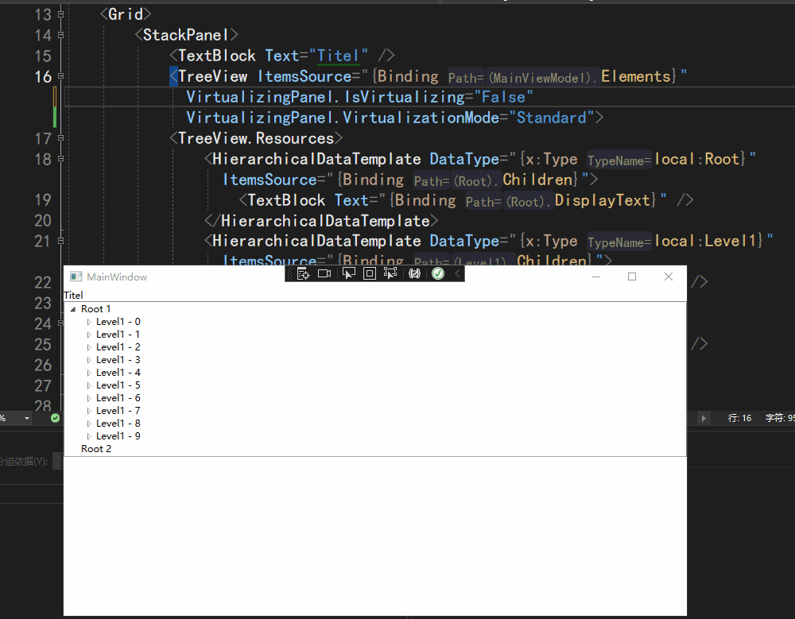
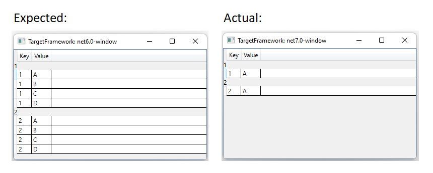

# dotnet 7 已知问题 WPF 的 TreeView 开启虚拟化之后只显示首项

本文记录 WPF 在 dotnet 7 的一个已知问题，此问题当前已修复，只需更新 SDK 或运行时即可。使用 TreeView 在开启虚拟化之后只显示首项，其他项不显示。本文将告诉大家此问题的原因和修复方式

<!--more-->

<!-- CreateTime:2023/1/11 8:39:25 -->

<!-- 博客 -->
<!-- 发布 -->

先来看看问题的动态图片

<!--  -->

此问题影响的不仅仅只是 TreeView 开启虚拟化的情况。也影响到 DataGrid 控件，让 DataGrid 控件只显示首项，如下图

<!--  -->

最简复现代码请看 [https://github.com/lindexi/lindexi_gd/commit/49d40420d1a99b09a129c31c240466032fb69e46](https://github.com/lindexi/lindexi_gd/commit/49d40420d1a99b09a129c31c240466032fb69e46)

此问题的报告地址： [https://github.com/dotnet/wpf/issues/7321](https://github.com/dotnet/wpf/issues/7321 )

此问题的修复地址： [https://github.com/dotnet/wpf/pull/7426](https://github.com/dotnet/wpf/pull/7426)

问题的原因是在 dotnet 7 的性能优化中，为了减少装箱损耗，修改了相等判断逻辑。从原本的引用相等判断 `object.ReferenceEquals` 修改为 `EqualityComparer<T>.Default.Equals` 判断方法，导致了判断行为变更。使用引用相等判断，要求传入的对象是引用相等的，才能返回 true 值。而 Equals 是对象逻辑相等判断，只要逻辑上是等价的，如重写 Equals 方法，根据一定的规则返回 true 值，那将返回相等

这就导致了在判断后续项的时候，判断逻辑行为变更，而且判断逻辑不符合预期，导致只显示一项

当前此问题已修复，只需等待 dotnet 7 发布修复版本之后，更新 SDK 或运行时版本即可

 本作品采用<a rel="license" href="http://creativecommons.org/licenses/by-nc-sa/4.0/">知识共享署名-非商业性使用-相同方式共享 4.0 国际许可协议</a>进行许可。欢迎转载、使用、重新发布，但务必保留文章署名[林德熙](http://blog.csdn.net/lindexi_gd)(包含链接:http://blog.csdn.net/lindexi_gd )，不得用于商业目的，基于本文修改后的作品务必以相同的许可发布。如有任何疑问，请与我[联系](mailto:lindexi_gd@163.com)。