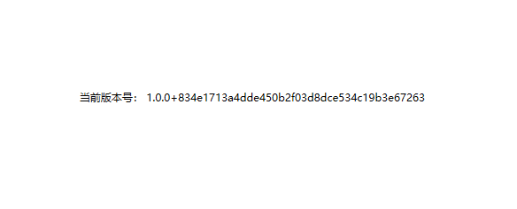
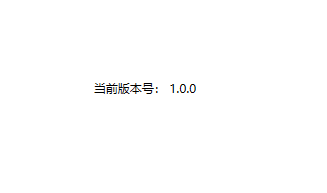
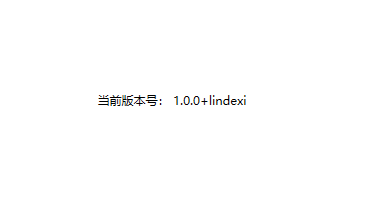

# dotnet 8 破坏性改动 在 AssemblyInformationalVersionAttribute 添加上 git 的 commit 号

我在一个 WPF 项目里面，在界面显示应用的版本号，更新到 dotnet 8 的 SDK 之后，发现我的界面布局损坏了。本质上这个破坏性改动和 WPF 没有什么关系，是 dotnet 的 SDK 或编译器的破坏性变更，在 AssemblyInformationalVersionAttribute 的 InformationalVersion 属性里面写入了当前的 git 的 commit 提交号

<!--more-->


<!-- CreateTime:2023/11/23 20:20:46 -->

<!-- 发布 -->
<!-- 博客 -->

咱可以非常方便写出代码获取到当前应用的版本号信息，如下面代码，我新建了一个简单的 WPF 界面用来显示当前应用的版本号

```xml
    <Grid>
        <TextBlock HorizontalAlignment="Center" VerticalAlignment="Center">
            <Run Text="当前版本号："/>
            <Run x:Name="AppVersionRun"></Run>
        </TextBlock>
    </Grid>
```

对应的后台 cs 代码如下

```csharp
    public MainWindow()
    {
        InitializeComponent();

        var assemblyInformationalVersionAttribute = GetType().Assembly.GetCustomAttributes<System.Reflection.AssemblyInformationalVersionAttribute>().First();
        AppVersionRun.Text = assemblyInformationalVersionAttribute.InformationalVersion;
    }
```

在使用 dotnet 8 的 SDK 构建时，无论使用的运行时是 dotnet 6 还是 dotnet 7 等，都会在 InformationalVersion 里面拿到 `版本号+commit` 格式的字符串，如下图

<!--  -->


此变更不仅修改了版本号字符串，还影响了 VisualStudio 的热重载

```
obj\Debug\net7.0-windows\Xxx.AssemblyInfo.cs (第 17 行): 错误 ENC0003: 更新“属性”需要重启应用程序。
```

如果不想要在 InformationalVersion 里面拿到的版本号信息包含 commit 信息，则可以在 csproj 里面配置 IncludeSourceRevisionInInformationalVersion 属性设置为 false 值，如下面代码

```xml
<Project Sdk="Microsoft.NET.Sdk">

  <PropertyGroup>
    <OutputType>WinExe</OutputType>
    <TargetFramework>net7.0-windows</TargetFramework>
    <Nullable>enable</Nullable>
    <ImplicitUsings>enable</ImplicitUsings>
    <UseWPF>true</UseWPF>
    <IncludeSourceRevisionInInformationalVersion>false</IncludeSourceRevisionInInformationalVersion>
  </PropertyGroup>

</Project>
```

修改之后的重新构建应用运行，可以看到此时界面只显示版本号

<!--  -->


如果想要自定义版本号后面添加的信息，可以通过配置 SourceRevisionId 属性。在没有设置 IncludeSourceRevisionInInformationalVersion 为 false 的前提下，设置 SourceRevisionId 属性的值，即可让 SourceRevisionId 设置的内容在 InformationalVersion 属性里面追加到版本号字符串后面

如以下代码

```xml
<Project Sdk="Microsoft.NET.Sdk">

  <PropertyGroup>
    <OutputType>WinExe</OutputType>
    <TargetFramework>net7.0-windows</TargetFramework>
    <Nullable>enable</Nullable>
    <ImplicitUsings>enable</ImplicitUsings>
    <UseWPF>true</UseWPF>
    <SourceRevisionId>lindexi</SourceRevisionId>
  </PropertyGroup>

</Project>
```

以上代码即可使用 SourceRevisionId 的信息代替默认的 git 的 commit 提交信息，拼接到版本字符串后面

以上代码运行的界面如下

<!--  -->


更多请参阅：

- [MSBuild properties for Microsoft.NET.Sdk - .NET Microsoft Learn](https://learn.microsoft.com/en-us/dotnet/core/project-sdk/msbuild-props )
- [Git commit ID included in assembly ProductVersion field when building with sdk 8 · Issue #34568 · dotnet/sdk](https://github.com/dotnet/sdk/issues/34568 )
- [c# - FileVersionInfo.ProductVersion suddenly contains git commit hash - Stack Overflow](https://stackoverflow.com/questions/77050814/fileversioninfo-productversion-suddenly-contains-git-commit-hash )

本文以上的代码放在[github](https://github.com/lindexi/lindexi_gd/tree/21cb92ee87b9903552120695ecd8db785ec9dfff/ChedemwoheGelnairkoni) 和 [gitee](https://gitee.com/lindexi/lindexi_gd/tree/21cb92ee87b9903552120695ecd8db785ec9dfff/ChedemwoheGelnairkoni) 欢迎访问

可以通过如下方式获取本文的源代码，先创建一个空文件夹，接着使用命令行 cd 命令进入此空文件夹，在命令行里面输入以下代码，即可获取到本文的代码

```
git init
git remote add origin https://gitee.com/lindexi/lindexi_gd.git
git pull origin 21cb92ee87b9903552120695ecd8db785ec9dfff
```

以上使用的是 gitee 的源，如果 gitee 不能访问，请替换为 github 的源。请在命令行继续输入以下代码

```
git remote remove origin
git remote add origin https://github.com/lindexi/lindexi_gd.git
git pull origin 21cb92ee87b9903552120695ecd8db785ec9dfff
```

获取代码之后，进入 ChedemwoheGelnairkoni 文件夹


<a rel="license" href="http://creativecommons.org/licenses/by-nc-sa/4.0/"></a><br />本作品采用<a rel="license" href="http://creativecommons.org/licenses/by-nc-sa/4.0/">知识共享署名-非商业性使用-相同方式共享 4.0 国际许可协议</a>进行许可。欢迎转载、使用、重新发布，但务必保留文章署名[林德熙](http://blog.csdn.net/lindexi_gd)(包含链接:http://blog.csdn.net/lindexi_gd )，不得用于商业目的，基于本文修改后的作品务必以相同的许可发布。如有任何疑问，请与我[联系](mailto:lindexi_gd@163.com)。