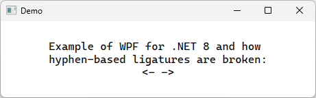
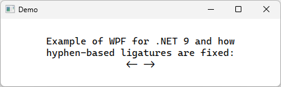

# dotnet 9 WPF 连字符渲染支持

连字符渲染功能是 WPF 呼声很高的一个功能，核心需求方是使用 Visual Studio 的开发者们。开发者们期望使用连字符的时候可以进行连字符渲染，让开发过程中的视觉效果更加。于是作为 Visual Studio 的基础设施的 WPF 就要承担此功能的实现。经过漫长的开发，终于在 dotnet 9 里面加入了此功能

<!--more-->


<!-- CreateTime:2024/11/14 07:29:19 -->
<!-- 发布 -->
<!-- 博客 -->

如下图是 dotnet 9 之前的渲染效果界面图：

<!--  -->


如下图是 dotnet 9 版本的渲染效果界面图：

<!--  -->


## 如何启用或关闭此功能

默认升级到 dotnet 9 即可自动开启

如在 dotnet 9 版本上，期望能够关闭此功能，还原到旧版本的渲染行为，可通过 `Switch.System.Windows.DisableSpecialCharacterLigature` 进行设置

```csharp
        public App()
        {
            AppContext.SetSwitch("Switch.System.Windows.DisableSpecialCharacterLigature", true);
        }
```

## 此功能是如何实现的

此功能是在不开源的 PresentationNative.dll 里面实现的，因此咱没有直接的实现代码可以看到。但预计只是调用 DirectX 的科技即可实现。从哪可以了解到其实现信息？请参阅： [Adding AppContext Switch for disabling special character ligatures by Kuldeep-MS · Pull Request #8990 · dotnet/wpf](https://github.com/dotnet/wpf/pull/8990 )

更多实现 dotnet 9 的 WPF 更新请参阅：[What's new in WPF for .NET 9 - WPF .NET](https://learn.microsoft.com/zh-cn/dotnet/desktop/wpf/whats-new/net90?view=netdesktop-9.0 )


<a rel="license" href="http://creativecommons.org/licenses/by-nc-sa/4.0/"></a><br />本作品采用<a rel="license" href="http://creativecommons.org/licenses/by-nc-sa/4.0/">知识共享署名-非商业性使用-相同方式共享 4.0 国际许可协议</a>进行许可。欢迎转载、使用、重新发布，但务必保留文章署名[林德熙](http://blog.csdn.net/lindexi_gd)(包含链接:http://blog.csdn.net/lindexi_gd )，不得用于商业目的，基于本文修改后的作品务必以相同的许可发布。如有任何疑问，请与我[联系](mailto:lindexi_gd@163.com)。