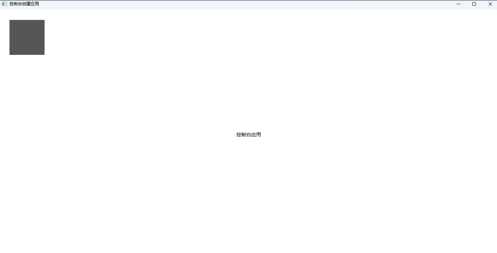
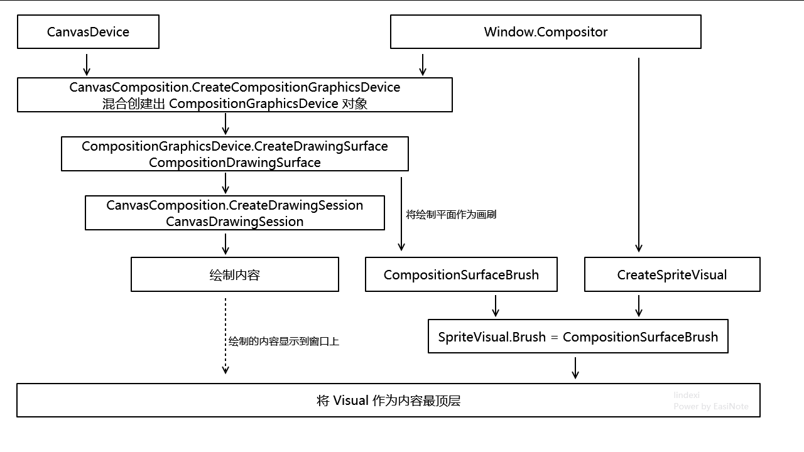

# dotnet C# 从控制台开始 关联 Win2D 和 WinUI 3 应用

本文将告诉大家如何从最简单的控制台开始搭建，让 Win2D 和 WinUI 3 关联起来，让 Win2D 可以将内容渲染到 WinUI 3 应用上

<!--more-->


<!-- CreateTime:2024/08/25 07:21:25 -->
<!-- 置顶2 -->
<!-- 发布 -->
<!-- 博客 -->

本文适合想了解 WinUI 3 基础机制以及 Win2D 与 WinUI 3 协同的方式的伙伴。阅读本文将可以了解到一个简单的方式，简单到使用控制台项目即可进行搭建整个简单应用

在 [上一篇博客](https://blog.lindexi.com/post/C-%E4%BB%8E%E6%8E%A7%E5%88%B6%E5%8F%B0%E5%88%9B%E5%BB%BA-WinUI-3-%E5%BA%94%E7%94%A8.html ) 里，告诉大家可以如何简单从控制台搭建起一个 WinUI 3 应用。本文将在此基础上告诉大家如何关联上 Win2D 进行基础界面绘制

大概制作出来的应用的界面如下图

<!--  -->


上图里面的左上角的灰色矩形就是使用 Win2D 绘制出来的内容，中间的文字则是 TextBlock 控件所提供的界面内容

本文的重点都在于如何让 Win2D 绘制出上图的左上角的灰色矩形

当然了，只要 Win2D 能在上面绘制出灰色矩形，自然也就能绘制出更多有趣的界面内容了

按照 dotnet 的惯例，在开始之前，咱需要安装 Win2D 的 NuGet 库。如按照 [dotnet WinUI3 Win2D 翻转图片](https://blog.lindexi.com/post/dotnet-WinUI3-Win2D-%E7%BF%BB%E8%BD%AC%E5%9B%BE%E7%89%87.html ) 博客提供的方法，快速编辑 csproj 项目文件，替换为如下代码即可完成初始化部署逻辑
<!-- [dotnet WinUI3 Win2D 翻转图片 - lindexi - 博客园](https://www.cnblogs.com/lindexi/p/18288633 ) -->

```xml
<Project Sdk="Microsoft.NET.Sdk">

  <PropertyGroup>
    <OutputType>Exe</OutputType>
    <TargetFramework>net6.0-windows10.0.19041</TargetFramework>
    <ImplicitUsings>enable</ImplicitUsings>
    <Nullable>enable</Nullable>
    <PlatformTarget>x86</PlatformTarget>
    <RuntimeIdentifiers>win10-x86;win10-x64</RuntimeIdentifiers>
    <TargetPlatformMinVersion>10.0.17763.0</TargetPlatformMinVersion>
    <AllowUnsafeBlocks>true</AllowUnsafeBlocks>
    <UseWinUI>true</UseWinUI>
    <WindowsPackageType>None</WindowsPackageType>
  </PropertyGroup>

  <ItemGroup>
    <PackageReference Include="Microsoft.Graphics.Win2D" Version="1.2.0" />
  </ItemGroup>

</Project>
```

接下来按照 [上一篇博客](https://blog.lindexi.com/post/C-%E4%BB%8E%E6%8E%A7%E5%88%B6%E5%8F%B0%E5%88%9B%E5%BB%BA-WinUI-3-%E5%BA%94%E7%94%A8.html ) 提供的方法创建一个简单 WinUI 3 应用，代码如下

```csharp
public class App : Application
{
    protected override void OnLaunched(LaunchActivatedEventArgs args)
    {
        var window = new Window()
        {
            Title = "控制台创建应用"
        };
        window.Content = new Grid()
        {
            Children =
            {
                new TextBlock()
                {
                    Text = "控制台应用",
                    HorizontalAlignment = HorizontalAlignment.Center,
                    VerticalAlignment = VerticalAlignment.Center
                }
            }
        };

        window.Activated += (sender, eventArgs) =>
        {
            ... // 忽略其他代码
        };

        window.Activate();

        base.OnLaunched(args);
    }
}

internal class Program
{
    static void Main(string[] args)
    {
        global::WinRT.ComWrappersSupport.InitializeComWrappers();

        global::Microsoft.UI.Xaml.Application.Start(p =>
        {
            var app = new App();
            _ = app;
        });
    }
}
```

将 Win2D 关联到 WinUI 3 应用，核心的一点就是让 Win2D 能够绘制到 WinUI 3 应用的平面上

下面代码写到 Window 的 Activated 事件里面，更具体来说这里只是随便找一个事件，确保窗口等初始化完成之后执行关联的代码而已

先创建或获取共享的设备，按照 DirectX 的使用概念里面，需要先有明确的设备

```csharp
            var canvasDevice = new CanvasDevice();
            // 或
            var canvasDevice = CanvasDevice.GetSharedDevice();
```

接着取出窗口的 Compositor 用于调用 Win2D 的 CreateCompositionGraphicsDevice 方法，创建出 CompositionGraphicsDevice 设备

```csharp
            var compositor = window.Compositor;

            CompositionGraphicsDevice compositionGraphicsDevice = CanvasComposition.CreateCompositionGraphicsDevice(compositor, canvasDevice);
```

此时的 CompositionGraphicsDevice 即可打通 Win2D 和 WinUI 3 之间的渲染关联

为了使用 Win2D 绘制内容，需要创建出一个平面让 Win2D 绘制。这里的平面大家可以理解为画布，即创建一个画布让 Win2D 在上面绘制内容

```csharp
            CompositionDrawingSurface compositionDrawingSurface = compositionGraphicsDevice.CreateDrawingSurface(new Windows.Foundation.Size(200, 200),
                DirectXPixelFormat.B8G8R8A8UIntNormalized,
                DirectXAlphaMode.Premultiplied);
```

创建画布的时候，最重要的两个参数就是画布的尺寸以及使用的颜色格式。这里的 B8G8R8A8UIntNormalized 的意思就是颜色格式采用 Blue 蓝色 8 个 bit 长度，和 Green 绿色 8 个 bit 长度，和 Red 红色 8 个 bit 长度，和 Alpha 透明度 8 个 bit 长度。这是十分标准且通用性非常好，且 GPU 友好的颜色像素格式

最后一个 Premultiplied 参数的意思就是是否进行 Alpha 预乘，这属于 WinUI 3 渲染层所要求。尽管预乘可能会造成精度丢失问题，但是可以减少后续步骤重复的计算过程。详细请看 [图片Alpha预乘的作用[转] - 孤海傲月 - 博客园](https://www.cnblogs.com/xiaonanxia/p/9448444.html )

拿到了 CompositionDrawingSurface 之后，即可在此平面上绘制，如以下代码

```csharp
            using (CanvasDrawingSession drawingSession =
                   CanvasComposition.CreateDrawingSession(compositionDrawingSurface))
            {
                drawingSession.FillRectangle(new Rect(10, 10, 100, 100),
                    Windows.UI.Color.FromArgb(0xFF, 0x56, 0x56, 0x56));
            }
```

从上面代码可以在 `CanvasComposition.CreateDrawingSession` 返回咱十分熟悉的 CanvasDrawingSession 对象

所有的 Win2D 绘制逻辑都可在 CanvasDrawingSession 的辅助下进行。大家可以将以上的 FillRectangle 方法换成自己的使用 Win2D 绘制复杂的界面的代码，如此即可画出好看的界面内容

完成上述步骤，只是将 Win2D 绘制的内容放在一个平面上，接下来需要将这个平面放入到 WinUI 3 的框架里面进行显示

本文选用的方式是走贴图 Brush 的方式，将 Brush 贴到 SpriteVisual 上，再让 SpriteVisual 加入到窗口的内容里面

如此即可使用 SpriteVisual 的贴图显示出 Win2D 绘制的内容

实现的逻辑代码如下，先将 CompositionDrawingSurface 创建为画刷作为贴图

```csharp
            // 在 Win2d 渲染到平面完成之后，将这个平面作为一个画刷用于在之后的效果
            CompositionSurfaceBrush surfaceBrush = compositor.CreateSurfaceBrush(compositionDrawingSurface);
```

换回 Compositor 创建出 SpriteVisual 且应用画刷

```csharp
            SpriteVisual visual = compositor.CreateSpriteVisual();
            visual.Brush = surfaceBrush;
            visual.Size = new Vector2(200, 200);
            visual.Offset = new Vector3(20, 20, 0);
```

上述代码核心只是 `visual.Brush = surfaceBrush;` 但是添加尺寸是必须的，否则界面将看不见 Win2D 的内容。至于 Offset 只是为了控制在哪显示，可以不写

再将 SpriteVisual 放到窗口内容的最上方，代码如下

```csharp
            Visual elementVisual = ElementCompositionPreview.GetElementVisual(window.Content);
            if (elementVisual is ContainerVisual containerVisual)
            {
                containerVisual.Children.InsertAtTop(visual);
            }
```

如此即完成了逻辑，可以将 Win2D 绘制的内容作为 WinUI 3 界面的一部分，这个过程全从控制台开始搭建，减少了许多中间的封装

整个创建 Win2D 和 WinUI 3 关联的核心代码全部如下

```csharp
        window.Activated += (sender, eventArgs) =>
        {
            var canvasDevice = new CanvasDevice();

            var compositor = window.Compositor;

            var compositionGraphicsDevice = CanvasComposition.CreateCompositionGraphicsDevice(compositor, canvasDevice);

            var compositionDrawingSurface = compositionGraphicsDevice.CreateDrawingSurface(
                new Windows.Foundation.Size(200, 200),
                DirectXPixelFormat.B8G8R8A8UIntNormalized,
                DirectXAlphaMode.Premultiplied);
            using (CanvasDrawingSession? drawingSession =
                   CanvasComposition.CreateDrawingSession(compositionDrawingSurface))
            {
                drawingSession.FillRectangle(new Rect(10, 10, 100, 100),
                    Windows.UI.Color.FromArgb(0xFF, 0x56, 0x56, 0x56));
            }

            // 在 Win2d 渲染到平面完成之后，将这个平面作为一个画刷用于在之后的效果
            CompositionSurfaceBrush surfaceBrush = compositor.CreateSurfaceBrush(compositionDrawingSurface);

            SpriteVisual visual = compositor.CreateSpriteVisual();
            visual.Brush = surfaceBrush;
            visual.Size = new Vector2(200, 200);
            visual.Offset = new Vector3(20, 20, 0);

            Visual elementVisual = ElementCompositionPreview.GetElementVisual(window.Content);
            if (elementVisual is ContainerVisual containerVisual)
            {
                containerVisual.Children.InsertAtTop(visual);
            }
        };
```

可以看到关联的代码不多，整体过程如下图

<!--  -->


<!-- https://13.r302.cc/04LpyN8 -->

先创建或获取共享设备，通过 CanvasComposition.CreateCompositionGraphicsDevice
混合 Compositor 和 CanvasDevice 创建出 CompositionGraphicsDevice 对象。这个 CompositionGraphicsDevice 对象同样也是 Win2D 的设备对象概念，只是加上了 Composition 的能力，可以和 WinUI 3 交互。使用 CompositionGraphicsDevice 创建出 CompositionDrawingSurface 平面。将 CompositionDrawingSurface 作为画布，调用 CanvasComposition.CreateDrawingSession 创建出 CanvasDrawingSession 用于调用 Win2D 的绘制逻辑。再将 CompositionDrawingSurface 作为 CompositionSurfaceBrush 画刷，贴到 SpriteVisual 上。最后将 SpriteVisual 放在窗口内容的最上层

全部的代码如下

```csharp
public class App : Application
{
    protected override void OnLaunched(LaunchActivatedEventArgs args)
    {
        var window = new Window()
        {
            Title = "控制台创建应用"
        };
        window.Content = new Grid()
        {
            Children =
            {
                new TextBlock()
                {
                    Text = "控制台应用",
                    HorizontalAlignment = HorizontalAlignment.Center,
                    VerticalAlignment = VerticalAlignment.Center
                }
            }
        };

        window.Activated += (sender, eventArgs) =>
        {
            var canvasDevice = new CanvasDevice();

            var compositor = window.Compositor;

            var compositionGraphicsDevice = CanvasComposition.CreateCompositionGraphicsDevice(compositor, canvasDevice);

            var compositionDrawingSurface = compositionGraphicsDevice.CreateDrawingSurface(
                new Windows.Foundation.Size(200, 200),
                DirectXPixelFormat.B8G8R8A8UIntNormalized,
                DirectXAlphaMode.Premultiplied);
            using (CanvasDrawingSession? drawingSession =
                   CanvasComposition.CreateDrawingSession(compositionDrawingSurface))
            {
                drawingSession.FillRectangle(new Rect(10, 10, 100, 100),
                    Windows.UI.Color.FromArgb(0xFF, 0x56, 0x56, 0x56));
            }

            // 在 Win2d 渲染到平面完成之后，将这个平面作为一个画刷用于在之后的效果
            CompositionSurfaceBrush surfaceBrush = compositor.CreateSurfaceBrush(compositionDrawingSurface);

            SpriteVisual visual = compositor.CreateSpriteVisual();
            visual.Brush = surfaceBrush;
            visual.Size = new Vector2(200, 200);
            visual.Offset = new Vector3(20, 20, 0);

            Visual elementVisual = ElementCompositionPreview.GetElementVisual(window.Content);
            if (elementVisual is ContainerVisual containerVisual)
            {
                containerVisual.Children.InsertAtTop(visual);
            }
        };

        window.Activate();

        base.OnLaunched(args);
    }
}

internal class Program
{
    static void Main(string[] args)
    {
        global::WinRT.ComWrappersSupport.InitializeComWrappers();

        global::Microsoft.UI.Xaml.Application.Start(p =>
        {
            var app = new App();
            _ = app;
        });
    }
}
```

本文代码放在 [github](https://github.com/lindexi/lindexi_gd/tree/9d873f09744d27de84d1877c61fc3e1b0526e4f9/Workbench/HuremluhuhaChilejelawlai) 和 [gitee](https://gitee.com/lindexi/lindexi_gd/tree/9d873f09744d27de84d1877c61fc3e1b0526e4f9/Workbench/HuremluhuhaChilejelawlai) 上，可以使用如下命令行拉取代码。我整个代码仓库比较庞大，使用以下命令行可以进行部分拉取，拉取速度比较快

先创建一个空文件夹，接着使用命令行 cd 命令进入此空文件夹，在命令行里面输入以下代码，即可获取到本文的代码

```
git init
git remote add origin https://gitee.com/lindexi/lindexi_gd.git
git pull origin 9d873f09744d27de84d1877c61fc3e1b0526e4f9
```

以上使用的是国内的 gitee 的源，如果 gitee 不能访问，请替换为 github 的源。请在命令行继续输入以下代码，将 gitee 源换成 github 源进行拉取代码。如果依然拉取不到代码，可以发邮件向我要代码

```
git remote remove origin
git remote add origin https://github.com/lindexi/lindexi_gd.git
git pull origin 9d873f09744d27de84d1877c61fc3e1b0526e4f9
```

获取代码之后，进入 Workbench/HuremluhuhaChilejelawlai 文件夹，即可获取到源代码

更多技术博客，请参阅 [博客导航](https://blog.lindexi.com/post/%E5%8D%9A%E5%AE%A2%E5%AF%BC%E8%88%AA.html )


<a rel="license" href="http://creativecommons.org/licenses/by-nc-sa/4.0/"></a><br />本作品采用<a rel="license" href="http://creativecommons.org/licenses/by-nc-sa/4.0/">知识共享署名-非商业性使用-相同方式共享 4.0 国际许可协议</a>进行许可。欢迎转载、使用、重新发布，但务必保留文章署名[林德熙](http://blog.csdn.net/lindexi_gd)(包含链接:http://blog.csdn.net/lindexi_gd )，不得用于商业目的，基于本文修改后的作品务必以相同的许可发布。如有任何疑问，请与我[联系](mailto:lindexi_gd@163.com)。