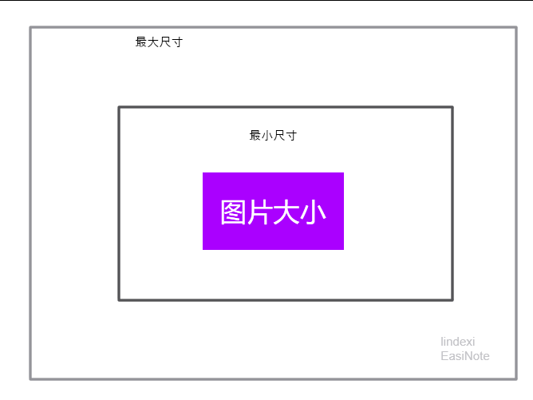
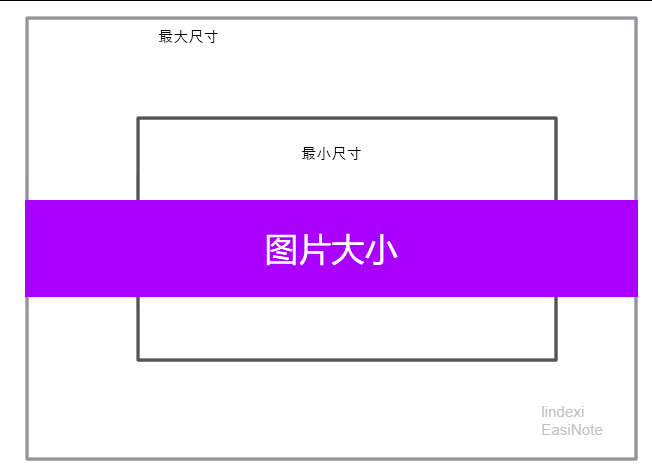

# dotnet C# 图片等比限制最大和最小大小缩放算法

本文只是告诉大家如何计算缩放之后的宽度和高度，不包含实际的图片缩放方法

<!--more-->


<!-- CreateTime:5/7/2020 10:25:58 AM -->


如下图，我要将图片的大小进行等比缩放，此时我要求图片的宽度和高度大于最小尺寸，但是要求宽度和高度都不大于最大尺寸，如果这两个规则冲突，优先满足不大于最大尺寸

<!--  -->


按照规则可以看到，如下图，图片的宽度等于最大宽度了，此时虽然图片的高度小于最小高度，但是也不应该对图片进行缩放

<!--  -->


为什么需要有最大限制？原因是等比缩放对于长图计算不友好，如果我有一张图片的宽度和高度比例是 1:1000 那么此时如果没有限制最大高度，那么将宽度缩放到最小宽度需要缩放10倍，此时的高度就太大了

下面就是计算方法

先定义大小这个类

```csharp
    public class Size
    {
        public Size(double width, double height)
        {
            Width = width;
            Height = height;
        }

        public double Width { set; get; }
        public double Height { set; get; }

        /// <inheritdoc />
        public override string ToString()
        {
            return $"Width={Width:0.00} Height={Height:0.00}";
        }
    }
```

计算的方法需要传入当前图片的宽度和高度，最小的宽度和高度和最大的宽度和高度，返回的值是计算的宽度和高度

```csharp
        static Size OptimizationSize(Size currentSize, Size minSize, Size maxSize)
```

计算的方法就是先获取宽度和高度的缩放到最小大小的缩放值

```csharp
            var height = currentSize.Height;
            var width = currentSize.Width;
            var widthScale = minSize.Width / width;
            var heightScale = minSize.Height / height;
```

如果此时的图片本来就大于最小宽度和高度，就不能让图片的缩放比原来小，除非大于最大宽度或高度

```csharp
            var minScale = Math.Max(widthScale, heightScale);
            minScale = Math.Max(minScale, 1.0);
```

计算图片和最大宽度和高度的缩放，同时拿到最大缩放里面的最小的一个，这样缩放完成之后就不会大于最大的宽度和高度

```csharp
            var maxWidthScale = maxSize.Width / width;
            var maxHeightScale = maxSize.Height / height;

            var maxScale = Math.Min(maxWidthScale, maxHeightScale);
```

现在获取了 minScale 和 maxScale 需要根据这两个缩放计算最小的缩放

```csharp
            var scale = Math.Min(minScale, maxScale);
```

为了让图片显示更锐利，这里让缩放是整数，使用整数可能略大于最大的宽度和高度

```csharp
            scale = Math.Ceiling(scale);
```

所有代码

```csharp
        /// <summary>
        /// 宽度和高度不小于最小大小，但是不大于最大大小，缩放使用等比缩放
        /// <para/>
        /// 规则：
        /// <para/>
        /// - 如果有一边小于最小大小，那么缩放到这一边大于等于最小大小
        /// <para/>
        /// - 如果一边缩放之后大于最大的大小，那么限制不能超过最大的大小
        /// <para/>
        /// - 尽可能让大小接近最小大小，但是保证宽度和高度都不大于最大大小
        /// </summary>
        /// <param name="currentSize"></param>
        /// <param name="minSize"></param>
        /// <param name="maxSize"></param>
        /// <returns></returns>
        static Size OptimizationSize(Size currentSize, Size minSize, Size maxSize)
        {
            if (currentSize.Width > minSize.Width && currentSize.Height > minSize.Height)
            {
                if (currentSize.Width <= maxSize.Width && currentSize.Height <= maxSize.Height)
                {
                    return currentSize;
                }
            }

            var height = currentSize.Height;
            var width = currentSize.Width;
            var widthScale = minSize.Width / width;
            var heightScale = minSize.Height / height;

            // 如果超过最大的大小
            var maxWidthScale = maxSize.Width / width;
            var maxHeightScale = maxSize.Height / height;

            var maxScale = Math.Min(maxWidthScale, maxHeightScale);
            var minScale = Math.Max(widthScale, heightScale);
            minScale = Math.Max(minScale, 1.0);
            var scale = Math.Min(minScale, maxScale);
            // 尽可能使用整数
            scale = Math.Ceiling(scale);
            return new Size(width * scale, height * scale);
        }
```

在 WPF 中可以通过设置 Image 控件的宽度和高度，此时因为尺寸是使用相同的值缩放，所以刚好图片使用 Fill 就能贴上去

但是无论用什么的算法，只要图片和原始尺寸不相同，那么一定会糊。无论是图片进行放大或缩小，都会模糊，这是基础的知识，想了解原理请自行百度

另一个算法是按照填充像素数量计算的，限制填充像素数量限制大小

```csharp
public static Size GetImageOptimizationSize(Size originSize, int maxPixel, int requestedPixel)
```

传入图片的大小，以及限制的最大像素和期望的像素大小。如果图片大小大于期望的像素，小于最大的像素大小，那么返回图片原始大小

```csharp
        public static Size GetImageOptimizationSize(Size originSize, int maxPixel, int requestedPixel)
        {
            var imagePixel = originSize.Width * originSize.Height;
            if (imagePixel <= maxPixel)
            {
                // 是不是太小了，需要缩放
                if (imagePixel < requestedPixel)
                {
                    return GetOptimizationSize(originSize, requestedPixel);
                }
            }
            else
            {
                return GetOptimizationSize(originSize, maxPixel);
            }

            return originSize;

            static Size GetOptimizationSize(Size originSize, double requestedPixel)
            {
                // 定义 Ow 是 originSize.Width
                // 定义 Oh 是 originSize.Height
                // 返回值为 requestedSize 根据 requestedPixel 计算
                // 定义 Rw 是 requestedSize.Width
                // 定义 Rh 是 requestedSize.Height
                // 假定比例不变，于是有
                // Ow / Oh = Rw / Rh 
                // 也就是前后的宽度高度比例不变
                // 上面表达式交换可以等于
                // Ow * Rh = Rw * Oh
                // 而 requestedPixel = requestedSize.Width * requestedSize.Height
                // 定义 P 是 requestedPixel
                // 于是有 Rw = P / Rh
                // 因此 Ow * Rh = Rw * Oh = P / Rh * Oh
                // Ow * Rh = P / Rh * Oh
                // Rh * Rh = P * Oh / Ow
                // 因此 Rh = Math.Sqrt(P * Oh / Ow)
                // 相同方式可以计算 Rw 的值

                var requestedWidth = (int)Math.Sqrt(requestedPixel * originSize.Width / originSize.Height);
                var requestedHeight = (int)Math.Sqrt(requestedPixel * originSize.Height / originSize.Width);

                return new Size(requestedWidth, requestedHeight);
            }
        }
```

上面的方法更简单，但是我添加了很多注释用来告诉大家这是如何计算的


<a rel="license" href="http://creativecommons.org/licenses/by-nc-sa/4.0/"></a><br />本作品采用<a rel="license" href="http://creativecommons.org/licenses/by-nc-sa/4.0/">知识共享署名-非商业性使用-相同方式共享 4.0 国际许可协议</a>进行许可。欢迎转载、使用、重新发布，但务必保留文章署名[林德熙](http://blog.csdn.net/lindexi_gd)(包含链接:http://blog.csdn.net/lindexi_gd )，不得用于商业目的，基于本文修改后的作品务必以相同的许可发布。如有任何疑问，请与我[联系](mailto:lindexi_gd@163.com)。