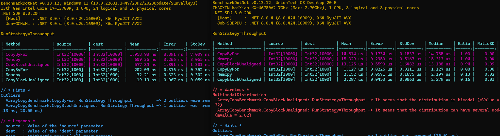
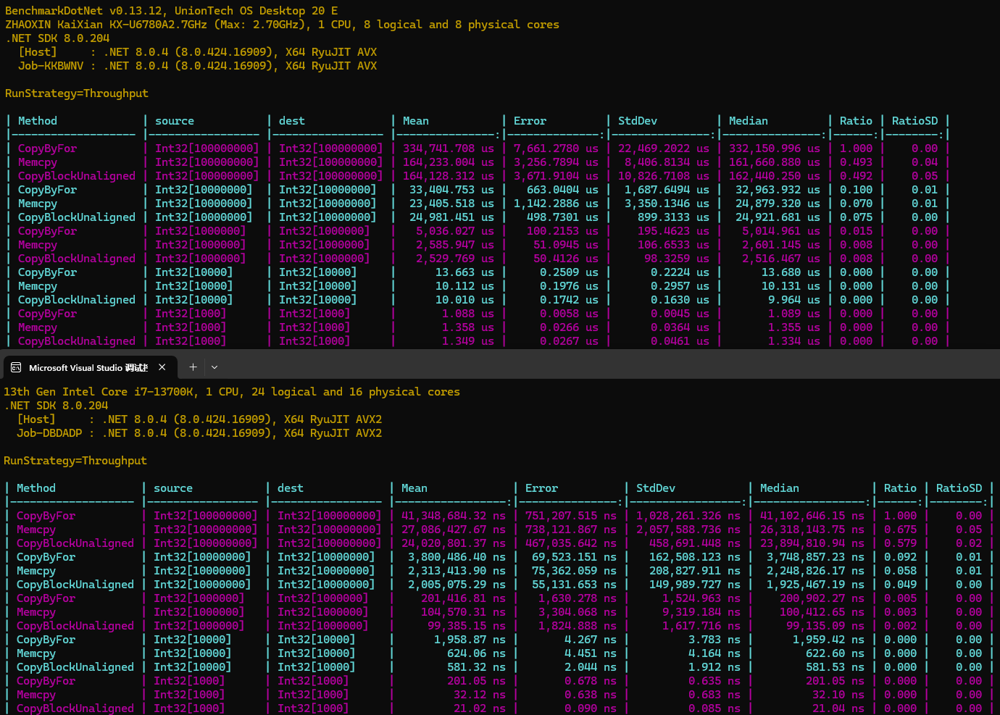
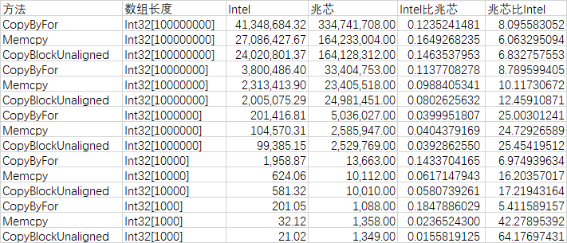
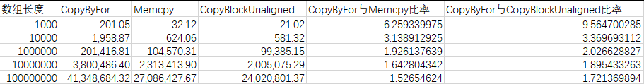
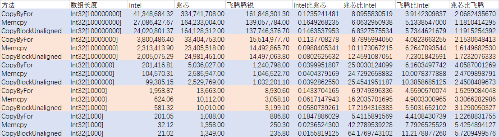
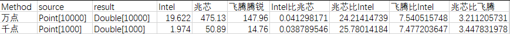

# dotnet C# 在不同的机器 CPU 型号上的基准性能测试

本文将记录我在多个不同的机器上，在不同的 CPU 型号上，执行相同的我编写的 dotnet 的 Benchmark 的代码，测试不同的 CPU 型号对 C# 系的优化程度。本文非严谨测试，数值只有相对意义

<!--more-->


<!-- CreateTime:2024/05/09 07:29:08 -->
<!-- 博客 -->
<!-- 发布 -->

以下是我的测试结果，对应的测试代码放在 [github](https://github.com/lindexi/lindexi_gd/tree/1e20b4c8ef64b17604e1ee92f41f7ac25ad08d26/BulowukaileFeanayjairwo) 上，可以在本文末尾找到下载代码的方法

我十分推荐你自己拉取代码，在你自己的设备上跑一下，测试其性能。且在开始之前，期望你已经掌握了基础的性能测试知识，避免出现诡异的结论

本文的测试将围绕着尽可能多的覆盖基础 CPU 指令以及基础逻辑行为。基础的 CPU 指令的性能测试已经有许多前辈测试过了，我这里重点测试的是各个 C# 系的上层业务行为下，所调用的多个 CPU 指令的最终性能影响。额外的也覆盖 CPU 缓存，逻辑分支命中，方法参数堆栈传递等的性能。本文的测试重点不在于 C# 系的相同功能的多个不同实现之间的性能对比，重点在于相同的代码在不同的 CPU 型号、内存、系统上的性能差异，正如此需求所述，本文非严谨测试，测试结果的数值只有相对意义

开始之前，先敲一下黑板提醒，以下内容划重点：由于 dotnet 最底层在各个平台上的实现具有差异性。本测试内容只能说明各个 C# 系的上层业务，在各个 CPU 、系统等平台上的运行差异。不能作为各个 CPU 性能之间直接横向对比的依据

## 数组创建

### 英特尔 13th Gen Intel Core i7-13700K

以下是在我开发机上跑的，我开了几百个进程，有比较多干扰，但是问题不大，因为 i7-13700K 依然性能遥遥领先。等后续找个空闲的机器，再跑一次比较准确的性能测试

```

BenchmarkDotNet v0.13.12, Windows 11 (10.0.22631.3447/23H2/2023Update/SunValley3)
13th Gen Intel Core i7-13700K, 1 CPU, 24 logical and 16 physical cores
.NET SDK 8.0.204
  [Host]     : .NET 8.0.4 (8.0.424.16909), X64 RyuJIT AVX2
  Job-AXOZTJ : .NET 8.0.4 (8.0.424.16909), X64 RyuJIT AVX2

RunStrategy=Throughput  

```

| Method                   | ArraySize | Mean             | Error          | StdDev         | Median           | Ratio | RatioSD |
|------------------------- |---------- |-----------------:|---------------:|---------------:|-----------------:|------:|--------:|
| NewArray                 | 10        |         3.873 ns |      0.1146 ns |      0.2417 ns |         3.777 ns |  1.00 |    0.00 |
| GCZeroInitialized        | 10        |        12.234 ns |      0.2815 ns |      0.4382 ns |        12.168 ns |  3.15 |    0.21 |
| GCZeroUninitialized      | 10        |         4.470 ns |      0.1491 ns |      0.4056 ns |         4.354 ns |  1.14 |    0.13 |
| NewArrayWithRandomVisit  | 10        |        12.012 ns |      0.2679 ns |      0.2506 ns |        11.941 ns |  3.09 |    0.18 |
| NewArrayWithOrdinalVisit | 10        |         9.839 ns |      0.3379 ns |      0.9803 ns |         9.635 ns |  2.58 |    0.26 |
|                          |           |                  |                |                |                  |       |         |
| NewArray                 | 100       |        11.875 ns |      0.1932 ns |      0.2444 ns |        11.813 ns |  1.00 |    0.00 |
| GCZeroInitialized        | 100       |        21.980 ns |      0.4524 ns |      0.8931 ns |        21.820 ns |  1.88 |    0.08 |
| GCZeroUninitialized      | 100       |        12.126 ns |      0.2769 ns |      0.5201 ns |        11.953 ns |  1.04 |    0.05 |
| NewArrayWithRandomVisit  | 100       |        47.344 ns |      0.9635 ns |      2.1351 ns |        46.572 ns |  4.03 |    0.24 |
| NewArrayWithOrdinalVisit | 100       |        75.207 ns |      1.4285 ns |      1.3363 ns |        75.364 ns |  6.33 |    0.15 |
|                          |           |                  |                |                |                  |       |         |
| NewArray                 | 1000      |       110.197 ns |      2.1602 ns |      2.0206 ns |       109.619 ns |  1.00 |    0.00 |
| GCZeroInitialized        | 1000      |       116.560 ns |      2.0796 ns |      1.8435 ns |       116.604 ns |  1.06 |    0.03 |
| GCZeroUninitialized      | 1000      |        33.476 ns |      0.5921 ns |      0.5538 ns |        33.643 ns |  0.30 |    0.01 |
| NewArrayWithRandomVisit  | 1000      |       208.835 ns |      4.1962 ns |      8.8512 ns |       205.699 ns |  1.92 |    0.09 |
| NewArrayWithOrdinalVisit | 1000      |       620.850 ns |     11.5406 ns |     10.7951 ns |       619.304 ns |  5.64 |    0.15 |
|                          |           |                  |                |                |                  |       |         |
| NewArray                 | 10000     |       996.853 ns |     21.9389 ns |     61.8790 ns |       970.393 ns |  1.00 |    0.00 |
| GCZeroInitialized        | 10000     |       996.704 ns |     20.8764 ns |     58.5397 ns |       974.900 ns |  1.00 |    0.08 |
| GCZeroUninitialized      | 10000     |        63.200 ns |      1.0544 ns |      0.9863 ns |        63.315 ns |  0.06 |    0.00 |
| NewArrayWithRandomVisit  | 10000     |     1,242.151 ns |     24.2642 ns |     38.4856 ns |     1,233.944 ns |  1.21 |    0.07 |
| NewArrayWithOrdinalVisit | 10000     |     6,068.245 ns |     90.8508 ns |     84.9819 ns |     6,076.727 ns |  5.79 |    0.34 |
|                          |           |                  |                |                |                  |       |         |
| NewArray                 | 100000    |     7,381.046 ns |    137.9635 ns |    147.6194 ns |     7,372.520 ns |  1.00 |    0.00 |
| GCZeroInitialized        | 100000    |     7,214.089 ns |     85.2068 ns |     71.1515 ns |     7,209.220 ns |  0.97 |    0.02 |
| GCZeroUninitialized      | 100000    |     7,347.661 ns |    146.3643 ns |    174.2363 ns |     7,306.838 ns |  1.00 |    0.03 |
| NewArrayWithRandomVisit  | 100000    |     8,456.669 ns |    164.5726 ns |    219.6997 ns |     8,517.366 ns |  1.14 |    0.05 |
| NewArrayWithOrdinalVisit | 100000    |   129,749.709 ns |  2,408.4302 ns |  2,773.5518 ns |   128,963.159 ns | 17.57 |    0.55 |
|                          |           |                  |                |                |                  |       |         |
| NewArray                 | 1000000   |    59,752.036 ns |  1,194.7579 ns |  1,929.3113 ns |    59,414.325 ns |  1.00 |    0.00 |
| GCZeroInitialized        | 1000000   |    60,008.303 ns |  1,188.0164 ns |  1,778.1671 ns |    59,378.000 ns |  1.01 |    0.04 |
| GCZeroUninitialized      | 1000000   |    58,868.279 ns |  1,023.4279 ns |    957.3151 ns |    58,724.731 ns |  0.97 |    0.04 |
| NewArrayWithRandomVisit  | 1000000   |    56,399.609 ns |  1,068.5479 ns |    999.5204 ns |    56,296.948 ns |  0.93 |    0.03 |
| NewArrayWithOrdinalVisit | 1000000   | 1,314,841.960 ns | 26,155.6618 ns | 27,986.2651 ns | 1,313,674.414 ns | 21.92 |    1.00 |


### 兆芯 ZHAOXIN KaiXian KX-U6780A

```

BenchmarkDotNet v0.13.12, UnionTech OS Desktop 20 E
ZHAOXIN KaiXian KX-U6780A2.7GHz (Max: 2.70GHz), 1 CPU, 8 logical and 8 physical cores
.NET SDK 8.0.204
  [Host]     : .NET 8.0.4 (8.0.424.16909), X64 RyuJIT AVX
  Job-YPUGMN : .NET 8.0.4 (8.0.424.16909), X64 RyuJIT AVX

RunStrategy=Throughput  

```

| Method                   | ArraySize | Mean            | Error         | StdDev        | Median          | Ratio | RatioSD |
|------------------------- |---------- |----------------:|--------------:|--------------:|----------------:|------:|--------:|
| NewArray                 | 10        |        40.20 ns |      0.977 ns |      1.491 ns |        39.98 ns |  1.00 |    0.00 |
| GCZeroInitialized        | 10        |       141.12 ns |      2.996 ns |      6.051 ns |       139.67 ns |  3.54 |    0.18 |
| GCZeroUninitialized      | 10        |        48.72 ns |      0.849 ns |      0.663 ns |        48.91 ns |  1.19 |    0.05 |
| NewArrayWithRandomVisit  | 10        |       195.75 ns |      1.082 ns |      0.845 ns |       195.65 ns |  4.77 |    0.16 |
| NewArrayWithOrdinalVisit | 10        |        72.42 ns |      1.513 ns |      2.400 ns |        72.45 ns |  1.80 |    0.08 |
|                          |           |                 |               |               |                 |       |         |
| NewArray                 | 100       |       135.07 ns |      2.892 ns |      6.100 ns |       135.41 ns |  1.00 |    0.00 |
| GCZeroInitialized        | 100       |       228.42 ns |      4.662 ns |     10.135 ns |       228.83 ns |  1.70 |    0.11 |
| GCZeroUninitialized      | 100       |       137.26 ns |      2.939 ns |      5.519 ns |       136.70 ns |  1.02 |    0.06 |
| NewArrayWithRandomVisit  | 100       |       572.02 ns |     11.660 ns |     19.157 ns |       568.34 ns |  4.26 |    0.27 |
| NewArrayWithOrdinalVisit | 100       |       467.29 ns |      9.357 ns |     13.117 ns |       464.49 ns |  3.47 |    0.21 |
|                          |           |                 |               |               |                 |       |         |
| NewArray                 | 1000      |     1,037.70 ns |     20.377 ns |     54.742 ns |     1,031.50 ns |  1.00 |    0.00 |
| GCZeroInitialized        | 1000      |     1,127.93 ns |     22.581 ns |     59.091 ns |     1,125.79 ns |  1.09 |    0.07 |
| GCZeroUninitialized      | 1000      |       653.93 ns |      6.239 ns |      4.871 ns |       652.04 ns |  0.60 |    0.02 |
| NewArrayWithRandomVisit  | 1000      |     2,375.21 ns |     47.088 ns |    100.349 ns |     2,352.11 ns |  2.27 |    0.13 |
| NewArrayWithOrdinalVisit | 1000      |     4,474.90 ns |     87.887 ns |    107.933 ns |     4,453.16 ns |  4.19 |    0.28 |
|                          |           |                 |               |               |                 |       |         |
| NewArray                 | 10000     |     9,586.62 ns |    189.501 ns |    369.608 ns |     9,657.74 ns |  1.00 |    0.00 |
| GCZeroInitialized        | 10000     |     9,767.26 ns |    194.643 ns |    462.590 ns |     9,811.53 ns |  1.02 |    0.07 |
| GCZeroUninitialized      | 10000     |     4,093.63 ns |     80.993 ns |    143.965 ns |     4,026.86 ns |  0.43 |    0.02 |
| NewArrayWithRandomVisit  | 10000     |    13,908.10 ns |    202.573 ns |    169.158 ns |    13,928.15 ns |  1.47 |    0.06 |
| NewArrayWithOrdinalVisit | 10000     |    43,057.16 ns |    854.132 ns |  1,495.943 ns |    42,914.21 ns |  4.50 |    0.25 |
|                          |           |                 |               |               |                 |       |         |
| NewArray                 | 100000    |    63,542.13 ns |    576.256 ns |    510.836 ns |    63,519.28 ns |  1.00 |    0.00 |
| GCZeroInitialized        | 100000    |    66,357.64 ns |  1,312.089 ns |  2,118.779 ns |    66,043.66 ns |  1.03 |    0.03 |
| GCZeroUninitialized      | 100000    |    63,638.29 ns |  1,241.493 ns |  1,477.909 ns |    63,270.73 ns |  1.01 |    0.03 |
| NewArrayWithRandomVisit  | 100000    |    76,609.50 ns |  1,501.442 ns |  1,729.063 ns |    75,958.21 ns |  1.21 |    0.03 |
| NewArrayWithOrdinalVisit | 100000    |   665,286.65 ns |  9,295.620 ns |  7,762.264 ns |   662,915.19 ns | 10.47 |    0.16 |
|                          |           |                 |               |               |                 |       |         |
| NewArray                 | 1000000   |   461,130.99 ns |  9,000.698 ns | 10,004.252 ns |   461,306.23 ns |  1.00 |    0.00 |
| GCZeroInitialized        | 1000000   |   459,810.29 ns |  8,893.401 ns | 10,586.961 ns |   455,791.25 ns |  1.00 |    0.03 |
| GCZeroUninitialized      | 1000000   |   456,245.03 ns |  8,819.606 ns | 12,363.856 ns |   452,252.89 ns |  0.99 |    0.04 |
| NewArrayWithRandomVisit  | 1000000   |   497,132.01 ns |  9,841.562 ns | 12,796.810 ns |   490,990.22 ns |  1.08 |    0.03 |
| NewArrayWithOrdinalVisit | 1000000   | 6,742,537.03 ns | 48,986.470 ns | 38,245.414 ns | 6,732,321.64 ns | 14.51 |    0.31 |

### 飞腾腾锐 Phytium D2000

```

BenchmarkDotNet v0.13.12, Kylin V10 SP1
Phytium,D2000/8 E8C, 8 logical cores
.NET SDK 8.0.204
  [Host]     : .NET 8.0.4 (8.0.424.16909), Arm64 RyuJIT AdvSIMD
  Job-NHRLJG : .NET 8.0.4 (8.0.424.16909), Arm64 RyuJIT AdvSIMD

RunStrategy=Throughput  

```
| Method                   | ArraySize  | Mean                | Error             | StdDev             | Ratio | RatioSD |
|------------------------- |----------- |--------------------:|------------------:|-------------------:|------:|--------:|
| **NewArray**                 | **10**         |            **22.18 ns** |          **0.149 ns** |           **0.132 ns** |  **1.00** |    **0.00** |
| GCZeroInitialized        | 10         |            92.43 ns |          0.564 ns |           0.440 ns |  4.17 |    0.02 |
| GCZeroUninitialized      | 10         |            25.68 ns |          0.248 ns |           0.243 ns |  1.16 |    0.01 |
| NewArrayWithRandomVisit  | 10         |           108.25 ns |          0.299 ns |           0.250 ns |  4.88 |    0.03 |
| NewArrayWithOrdinalVisit | 10         |            34.55 ns |          0.126 ns |           0.112 ns |  1.56 |    0.01 |
|                          |            |                     |                   |                    |       |         |
| **NewArray**                 | **100**        |            **76.35 ns** |          **0.941 ns** |           **0.880 ns** |  **1.00** |    **0.00** |
| GCZeroInitialized        | 100        |           163.69 ns |          0.952 ns |           0.743 ns |  2.14 |    0.03 |
| GCZeroUninitialized      | 100        |            80.21 ns |          0.528 ns |           0.468 ns |  1.05 |    0.02 |
| NewArrayWithRandomVisit  | 100        |           421.53 ns |          1.679 ns |           1.402 ns |  5.52 |    0.06 |
| NewArrayWithOrdinalVisit | 100        |           300.66 ns |          1.274 ns |           1.130 ns |  3.94 |    0.05 |
|                          |            |                     |                   |                    |       |         |
| **NewArray**                 | **1000**       |           **640.11 ns** |          **4.059 ns** |           **3.598 ns** |  **1.00** |    **0.00** |
| GCZeroInitialized        | 1000       |           672.06 ns |          3.242 ns |           3.032 ns |  1.05 |    0.01 |
| GCZeroUninitialized      | 1000       |           483.70 ns |          2.202 ns |           1.952 ns |  0.76 |    0.01 |
| NewArrayWithRandomVisit  | 1000       |         1,765.24 ns |          6.469 ns |           5.402 ns |  2.76 |    0.02 |
| NewArrayWithOrdinalVisit | 1000       |         2,850.39 ns |         12.971 ns |          12.133 ns |  4.45 |    0.03 |
|                          |            |                     |                   |                    |       |         |
| **NewArray**                 | **10000**      |         **5,219.58 ns** |         **36.810 ns** |          **32.631 ns** |  **1.00** |    **0.00** |
| GCZeroInitialized        | 10000      |         5,280.52 ns |         27.550 ns |          24.422 ns |  1.01 |    0.01 |
| GCZeroUninitialized      | 10000      |         2,640.52 ns |         44.642 ns |          34.853 ns |  0.51 |    0.01 |
| NewArrayWithRandomVisit  | 10000      |         8,992.89 ns |         20.367 ns |          19.052 ns |  1.72 |    0.01 |
| NewArrayWithOrdinalVisit | 10000      |        26,983.43 ns |        355.773 ns |         297.086 ns |  5.17 |    0.05 |
|                          |            |                     |                   |                    |       |         |
| **NewArray**                 | **100000**     |        **45,506.61 ns** |        **431.868 ns** |         **403.970 ns** |  **1.00** |    **0.00** |
| GCZeroInitialized        | 100000     |        45,543.14 ns |        432.449 ns |         404.513 ns |  1.00 |    0.01 |
| GCZeroUninitialized      | 100000     |        44,461.84 ns |        331.168 ns |         309.775 ns |  0.98 |    0.01 |
| NewArrayWithRandomVisit  | 100000     |        57,232.01 ns |        318.770 ns |         298.178 ns |  1.26 |    0.01 |
| NewArrayWithOrdinalVisit | 100000     |       445,380.51 ns |      2,904.888 ns |       2,425.713 ns |  9.78 |    0.10 |
|                          |            |                     |                   |                    |       |         |
| **NewArray**                 | **1000000**    |       **318,862.16 ns** |      **1,899.267 ns** |       **1,683.651 ns** |  **1.00** |    **0.00** |
| GCZeroInitialized        | 1000000    |       319,510.71 ns |      4,669.274 ns |       3,645.462 ns |  1.00 |    0.01 |
| GCZeroUninitialized      | 1000000    |       314,884.17 ns |      5,637.859 ns |       4,401.669 ns |  0.99 |    0.02 |
| NewArrayWithRandomVisit  | 1000000    |       357,843.40 ns |      3,063.527 ns |       2,865.625 ns |  1.12 |    0.01 |
| NewArrayWithOrdinalVisit | 1000000    |     4,547,465.54 ns |     15,355.309 ns |      12,822.379 ns | 14.28 |    0.05 |
|                          |            |                     |                   |                    |       |         |
| **NewArray**                 | **1000000000** | **1,541,406,672.88 ns** | **35,733,853.844 ns** | **102,527,125.216 ns** | **1.000** |    **0.00** |
| GCZeroInitialized        | 1000000000 | 1,548,370,215.42 ns | 38,407,327.571 ns | 110,197,822.498 ns | 1.009 |    0.10 |
| GCZeroUninitialized      | 1000000000 |     1,486,735.21 ns |     28,605.254 ns |      26,757.372 ns | 0.001 |    0.00 |
| NewArrayWithRandomVisit  | 1000000000 | 1,590,271,119.60 ns | 33,473,585.461 ns |  96,041,991.522 ns | 1.036 |    0.09 |
| NewArrayWithOrdinalVisit | 1000000000 | 3,861,833,983.54 ns |  2,367,487.064 ns |   1,976,958.923 ns | 2.546 |    0.16 |

以上的飞腾腾锐 Phytium D2000 最后的测试数据预计是不正常的

## 数组拷贝

### 测试维度

参与测试的内容如下：

- CopyByFor ： 使用 for 循环进行拷贝数组
- Memcpy  ： 使用标准 C 提供的 memcpy 函数进行拷贝，在 linux 下使用 libc.so.6 导出函数，在 windows 下使用 msvcrt.dll 导出函数。这处于非常裸露的方式，更具体请参阅下文的数据说明内容
- CopyBlockUnaligned ： 使用 dotnet 自带的 `Unsafe.CopyBlockUnaligned` 方法进行数组拷贝


### 英特尔 13th Gen Intel Core i7-13700K

#### 数组较小

小于 1000 的数组时，存在较大 P/Invoke 干扰，于是决定最小设置为 1000 的值

```

BenchmarkDotNet v0.13.12, Windows 11 (10.0.22631.3447/23H2/2023Update/SunValley3)
13th Gen Intel Core i7-13700K, 1 CPU, 24 logical and 16 physical cores
.NET SDK 8.0.204
  [Host]     : .NET 8.0.4 (8.0.424.16909), X64 RyuJIT AVX2
  Job-GCHWHL : .NET 8.0.4 (8.0.424.16909), X64 RyuJIT AVX2

RunStrategy=Throughput  

```

| Method             | source       | dest         | Mean        | Error    | StdDev   | Ratio |
|------------------- |------------- |------------- |------------:|---------:|---------:|------:|
| **CopyByFor**          | **Int32[10000]** | **Int32[10000]** | **1,958.98 ns** | **8.391 ns** | **7.007 ns** | **1.000** |
| Memcpy             | Int32[10000] | Int32[10000] |   609.35 ns | 3.266 ns | 3.055 ns | 0.311 |
| CopyBlockUnaligned | Int32[10000] | Int32[10000] |   577.84 ns | 1.391 ns | 1.301 ns | 0.295 |
| **CopyByFor**          | **Int32[1000]**  | **Int32[1000]**  |   **202.09 ns** | **0.376 ns** | **0.352 ns** | **0.103** |
| Memcpy             | Int32[1000]  | Int32[1000]  |    32.21 ns | 0.323 ns | 0.302 ns | 0.016 |
| CopyBlockUnaligned | Int32[1000]  | Int32[1000]  |    19.19 ns | 0.067 ns | 0.059 ns | 0.010 |

根据上述测试数据可以看到，即使在较小数据量情况下，依然 memcpy 和 Unsafe.CopyBlockUnaligned 比 for 速度快

#### 数组较大

```

BenchmarkDotNet v0.13.12, Windows 11 (10.0.22631.3447/23H2/2023Update/SunValley3)
13th Gen Intel Core i7-13700K, 1 CPU, 24 logical and 16 physical cores
.NET SDK 8.0.204
  [Host]     : .NET 8.0.4 (8.0.424.16909), X64 RyuJIT AVX2
  Job-DBDADP : .NET 8.0.4 (8.0.424.16909), X64 RyuJIT AVX2

RunStrategy=Throughput  

```
| Method             | source           | dest             | Mean             | Error          | StdDev           | Median           | Ratio | RatioSD |
|------------------- |----------------- |----------------- |-----------------:|---------------:|-----------------:|-----------------:|------:|--------:|
| **CopyByFor**          | **Int32[100000000]** | **Int32[100000000]** | **41,348,684.32 ns** | **751,207.515 ns** | **1,028,261.326 ns** | **41,102,646.15 ns** | **1.000** |    **0.00** |
| Memcpy             | Int32[100000000] | Int32[100000000] | 27,086,427.67 ns | 738,121.867 ns | 2,057,588.736 ns | 26,318,143.75 ns | 0.675 |    0.05 |
| CopyBlockUnaligned | Int32[100000000] | Int32[100000000] | 24,020,801.37 ns | 467,035.642 ns |   458,691.448 ns | 23,894,810.94 ns | 0.579 |    0.02 |
| **CopyByFor**          | **Int32[10000000]**  | **Int32[10000000]**  |  **3,800,486.40 ns** |  **69,523.151 ns** |   **162,508.123 ns** |  **3,748,857.23 ns** | **0.092** |    **0.01** |
| Memcpy             | Int32[10000000]  | Int32[10000000]  |  2,313,413.90 ns |  75,362.059 ns |   208,827.911 ns |  2,248,826.17 ns | 0.058 |    0.01 |
| CopyBlockUnaligned | Int32[10000000]  | Int32[10000000]  |  2,005,075.29 ns |  55,131.653 ns |   149,989.727 ns |  1,925,467.19 ns | 0.049 |    0.00 |
| **CopyByFor**          | **Int32[1000000]**   | **Int32[1000000]**   |    **201,416.81 ns** |   **1,630.278 ns** |     **1,524.963 ns** |    **200,902.27 ns** | **0.005** |    **0.00** |
| Memcpy             | Int32[1000000]   | Int32[1000000]   |    104,570.31 ns |   3,304.068 ns |     9,319.184 ns |    100,412.65 ns | 0.003 |    0.00 |
| CopyBlockUnaligned | Int32[1000000]   | Int32[1000000]   |     99,385.15 ns |   1,824.888 ns |     1,617.716 ns |     99,135.09 ns | 0.002 |    0.00 |
| **CopyByFor**          | **Int32[10000]**     | **Int32[10000]**     |      **1,958.87 ns** |       **4.267 ns** |         **3.783 ns** |      **1,959.42 ns** | **0.000** |    **0.00** |
| Memcpy             | Int32[10000]     | Int32[10000]     |        624.06 ns |       4.451 ns |         4.164 ns |        622.60 ns | 0.000 |    0.00 |
| CopyBlockUnaligned | Int32[10000]     | Int32[10000]     |        581.32 ns |       2.044 ns |         1.912 ns |        581.53 ns | 0.000 |    0.00 |
| **CopyByFor**          | **Int32[1000]**      | **Int32[1000]**      |        **201.05 ns** |       **0.678 ns** |         **0.635 ns** |        **201.05 ns** | **0.000** |    **0.00** |
| Memcpy             | Int32[1000]      | Int32[1000]      |         32.12 ns |       0.638 ns |         0.683 ns |         32.10 ns | 0.000 |    0.00 |
| CopyBlockUnaligned | Int32[1000]      | Int32[1000]      |         21.02 ns |       0.090 ns |         0.085 ns |         21.04 ns | 0.000 |    0.00 |


### 兆芯 ZHAOXIN KaiXian KX-U6780A

#### 数组较小

```

BenchmarkDotNet v0.13.12, UnionTech OS Desktop 20 E
ZHAOXIN KaiXian KX-U6780A2.7GHz (Max: 2.70GHz), 1 CPU, 8 logical and 8 physical cores
.NET SDK 8.0.204
  [Host]     : .NET 8.0.4 (8.0.424.16909), X64 RyuJIT AVX
  Job-SBDPDU : .NET 8.0.4 (8.0.424.16909), X64 RyuJIT AVX

RunStrategy=Throughput  

```
| Method             | source       | dest         | Mean      | Error     | StdDev    | Median    | Ratio | RatioSD |
|------------------- |------------- |------------- |----------:|----------:|----------:|----------:|------:|--------:|
| **CopyByFor**          | **Int32[10000]** | **Int32[10000]** | **14.814 us** | **0.1734 us** | **0.1537 us** | **14.785 us** |  **1.00** |    **0.00** |
| Memcpy             | Int32[10000] | Int32[10000] | 15.329 us | 0.2950 us | 0.5167 us | 15.313 us |  1.04 |    0.04 |
| CopyBlockUnaligned | Int32[10000] | Int32[10000] | 13.125 us | 0.5590 us | 1.6482 us | 13.188 us |  0.94 |    0.09 |
| **CopyByFor**          | **Int32[1000]**  | **Int32[1000]**  |  **1.127 us** | **0.0226 us** | **0.0211 us** |  **1.127 us** |  **0.08** |    **0.00** |
| Memcpy             | Int32[1000]  | Int32[1000]  |  2.152 us | 0.0571 us | 0.1675 us |  2.197 us |  0.13 |    0.02 |
| CopyBlockUnaligned | Int32[1000]  | Int32[1000]  |  2.297 us | 0.0453 us | 0.0863 us |  2.279 us |  0.16 |    0.01 |

#### 数组较大

```

BenchmarkDotNet v0.13.12, UnionTech OS Desktop 20 E
ZHAOXIN KaiXian KX-U6780A2.7GHz (Max: 2.70GHz), 1 CPU, 8 logical and 8 physical cores
.NET SDK 8.0.204
  [Host]     : .NET 8.0.4 (8.0.424.16909), X64 RyuJIT AVX
  Job-KKBWNV : .NET 8.0.4 (8.0.424.16909), X64 RyuJIT AVX

RunStrategy=Throughput  

```
| Method             | source           | dest             | Mean           | Error         | StdDev         | Median         | Ratio | RatioSD |
|------------------- |----------------- |----------------- |---------------:|--------------:|---------------:|---------------:|------:|--------:|
| **CopyByFor**          | **Int32[100000000]** | **Int32[100000000]** | **334,741.708 μs** | **7,661.2780 μs** | **22,469.2022 μs** | **332,150.996 μs** | **1.000** |    **0.00** |
| Memcpy             | Int32[100000000] | Int32[100000000] | 164,233.004 μs | 3,256.7894 μs |  8,406.8134 μs | 161,660.880 μs | 0.493 |    0.04 |
| CopyBlockUnaligned | Int32[100000000] | Int32[100000000] | 164,128.312 μs | 3,671.9104 μs | 10,826.7108 μs | 162,440.250 μs | 0.492 |    0.05 |
| **CopyByFor**          | **Int32[10000000]**  | **Int32[10000000]**  |  **33,404.753 μs** |   **663.0404 μs** |  **1,687.6494 μs** |  **32,963.932 μs** | **0.100** |    **0.01** |
| Memcpy             | Int32[10000000]  | Int32[10000000]  |  23,405.518 μs | 1,142.2886 μs |  3,350.1346 μs |  24,879.320 μs | 0.070 |    0.01 |
| CopyBlockUnaligned | Int32[10000000]  | Int32[10000000]  |  24,981.451 μs |   498.7301 μs |    899.3133 μs |  24,921.681 μs | 0.075 |    0.00 |
| **CopyByFor**          | **Int32[1000000]**   | **Int32[1000000]**   |   **5,036.027 μs** |   **100.2153 μs** |    **195.4623 μs** |   **5,014.961 μs** | **0.015** |    **0.00** |
| Memcpy             | Int32[1000000]   | Int32[1000000]   |   2,585.947 μs |    51.0945 μs |    106.6533 μs |   2,601.145 μs | 0.008 |    0.00 |
| CopyBlockUnaligned | Int32[1000000]   | Int32[1000000]   |   2,529.769 μs |    50.4126 μs |     98.3259 μs |   2,516.467 μs | 0.008 |    0.00 |
| **CopyByFor**          | **Int32[10000]**     | **Int32[10000]**     |      **13.663 μs** |     **0.2509 μs** |      **0.2224 μs** |      **13.680 μs** | **0.000** |    **0.00** |
| Memcpy             | Int32[10000]     | Int32[10000]     |      10.112 μs |     0.1976 μs |      0.2957 μs |      10.131 μs | 0.000 |    0.00 |
| CopyBlockUnaligned | Int32[10000]     | Int32[10000]     |      10.010 μs |     0.1742 μs |      0.1630 μs |       9.964 μs | 0.000 |    0.00 |
| **CopyByFor**          | **Int32[1000]**      | **Int32[1000]**      |       **1.088 μs** |     **0.0058 μs** |      **0.0045 μs** |       **1.089 μs** | **0.000** |    **0.00** |
| Memcpy             | Int32[1000]      | Int32[1000]      |       1.358 μs |     0.0266 μs |      0.0364 μs |       1.355 μs | 0.000 |    0.00 |
| CopyBlockUnaligned | Int32[1000]      | Int32[1000]      |       1.349 μs |     0.0267 μs |      0.0461 μs |       1.334 μs | 0.000 |    0.00 |


### 数据说明

通过数据对比 Intel 和 兆芯 以上测试数据，可以看到在 `Int32[10000]` 的测试数据集里面，轻松就可以看到 Intel 比 兆芯 快了 10 倍，如下图所示

<!--  -->


在如下图的对比 Intel 和 兆芯 的对较大的数组进行拷贝的性能，可以看到 Intel 平台也的确能够比 兆芯 快出 10 倍的性能

<!--  -->


具体的性能比较如下

<!--  -->


| 方法               | 数组长度         | Intel         | 兆芯           | Intel比兆芯  | 兆芯比Intel |
| ------------------ | ---------------- | ------------- | -------------- | ------------ | ----------- |
| CopyByFor          | Int32[100000000] | 41,348,684.32 | 334,741,708.00 | 0.1235241481 | 8.095583052 |
| Memcpy             | Int32[100000000] | 27,086,427.67 | 164,233,004.00 | 0.1649268235 | 6.063295094 |
| CopyBlockUnaligned | Int32[100000000] | 24,020,801.37 | 164,128,312.00 | 0.1463537953 | 6.832757553 |
| CopyByFor          | Int32[10000000]  | 3,800,486.40  | 33,404,753.00  | 0.1137708278 | 8.789599405 |
| Memcpy             | Int32[10000000]  | 2,313,413.90  | 23,405,518.00  | 0.0988405341 | 10.11730672 |
| CopyBlockUnaligned | Int32[10000000]  | 2,005,075.29  | 24,981,451.00  | 0.0802625632 | 12.45910871 |
| CopyByFor          | Int32[1000000]   | 201,416.81    | 5,036,027.00   | 0.0399951807 | 25.00301241 |
| Memcpy             | Int32[1000000]   | 104,570.31    | 2,585,947.00   | 0.0404379169 | 24.72926589 |
| CopyBlockUnaligned | Int32[1000000]   | 99,385.15     | 2,529,769.00   | 0.0392862550 | 25.45419512 |
| CopyByFor          | Int32[10000]     | 1,958.87      | 13,663.00      | 0.1433704165 | 6.974939634 |
| Memcpy             | Int32[10000]     | 624.06        | 10,112.00      | 0.0617147943 | 16.20357017 |
| CopyBlockUnaligned | Int32[10000]     | 581.32        | 10,010.00      | 0.0580739261 | 17.21943164 |
| CopyByFor          | Int32[1000]      | 201.05        | 1,088.00       | 0.1847886029 | 5.411589157 |
| Memcpy             | Int32[1000]      | 32.12         | 1,358.00       | 0.0236524300 | 42.27895392 |
| CopyBlockUnaligned | Int32[1000]      | 21.02         | 1,349.00       | 0.0155819125 | 64.17697431 |

更具体的对 兆芯 的分析：在对较小的数组进行拷贝，使用 for 进行拷贝的速度比标准 C 的 memcpy 函数快，使用 for 循环进行拷贝与 dotnet 的 Unsafe.CopyBlockUnaligned 差不多。而在 Intel 平台下，无论是 标准 C 的 memcpy 还是 dotnet 的 Unsafe.CopyBlockUnaligned 都比 for 快几倍。这就意味着无论是 memcpy 还是 CopyBlockUnaligned 里面的指令优化，在 兆芯 下都是负优化

在更大的数据两情况下，可以看到 Intel 平台的 memcpy 和 CopyBlockUnaligned 对 for 循环的优化比率不断下跌，其数据情况如下

<!--  -->


| 数组长度      | CopyByFor     | Memcpy        | CopyBlockUnaligned | CopyByFor与Memcpy比率 | CopyByFor与CopyBlockUnaligned比率 |
| --------- | ------------- | ------------- | ------------------ | ------------------ | ------------------------------ |
| 1000      | 201.05        | 32.12         | 21.02              | 6.259339975        | 9.564700285                    |
| 10000     | 1,958.87      | 624.06        | 581.32             | 3.138912925        | 3.369693112                    |
| 1000000   | 201,416.81    | 104,570.31    | 99,385.15          | 1.926137639        | 2.026628827                    |
| 10000000  | 3,800,486.40  | 2,313,413.90  | 2,005,075.29       | 1.642804342        | 1.895433263                    |
| 100000000 | 41,348,684.32 | 27,086,427.67 | 24,020,801.37      | 1.52654624         | 1.721369894                    |

我的猜测是随着数组长度增加，将逐渐超过了 Intel 的 CPU 的缓存，导致了比率的下降。但无论如何，使用 memcpy 和 CopyBlockUnaligned 在 Intel 下都有优化

这就是为什么在数组较大时，如在 100000000 长度时，相同的 Memcpy 方法下兆芯比Intel的耗时比例为 6.06 倍。相较于在 1000 长度时，兆芯比Intel的耗时比例为 42.27 倍小了非常多。如此可以看到其实也不能全怪兆芯，只是因为 Intel 的优化比较强，导致看起来差异比较大

在数组长度比较大的时候，在 兆芯 上也是 memcpy 会比 for 循环拷贝更快。且 memcpy 和 CopyBlockUnaligned 的性能也是基本持平的。也就是说在数据量比较大的时候，使用 dotnet 自带的 `Unsafe.CopyBlockUnaligned` 方法还是很有意义的，既速度快又相对安全。在数据量比较小的时候，使用 CopyBlockUnaligned 依然不会有较大的性能损失

<!-- 

Builder b.UserXxx();

PostInint(Action<Context> a =>{ a. })

  PostSource()

[对军<dotnetCampus.Ipc.LoggerProvider>(categoryName: "xxxx")]
[对军<dotnetCampus.Cli.LoggerProvider>]
[对军<EasiNote.Budiness.LoggerProvider>]
[对军<dotnetCampus.Ipc.LoggerProvider>]
[对军<dotnetCampus.Ipc.LoggerProvider>]
[对军<dotnetCampus.Ipc.LoggerProvider>]
[对军<dotnetCampus.Ipc.LoggerProvider>]
[对军<dotnetCampus.Ipc.LoggerProvider>]
[对军<dotnetCampus.Ipc.LoggerProvider>]
[对军<dotnetCampus.Ipc.LoggerProvider>]
[对军<dotnetCampus.Ipc.LoggerProvider>]
[对军<dotnetCampus.Ipc.LoggerProvider>]
日指对军

[assembly:XxxxLogger("xxxxxx")]

 -->

### 飞腾腾锐 Phytium D2000

#### 数组较大

BenchmarkDotNet v0.13.12, Kylin V10 SP1
Phytium,D2000/8 E8C, 8 logical cores
.NET SDK 8.0.204
  [Host]     : .NET 8.0.4 (8.0.424.16909), Arm64 RyuJIT AdvSIMD
  Job-QEJWOH : .NET 8.0.4 (8.0.424.16909), Arm64 RyuJIT AdvSIMD

RunStrategy=Throughput

| Method             | source           | dest             | Mean             | Error         | StdDev        | Ratio |
|------------------- |----------------- |----------------- |-----------------:|--------------:|--------------:|------:|
| CopyByFor          | Int32[100000000] | Int32[100000000] | 161,848,301.3 ns | 275,376.77 ns | 229,952.07 ns | 1.000 |
| Memcpy             | Int32[100000000] | Int32[100000000] | 139,057,784.0 ns | 493,850.72 ns | 437,785.80 ns | 0.859 |
| CopyBlockUnaligned | Int32[100000000] | Int32[100000000] | 137,746,376.7 ns | 740,242.45 ns | 618,135.97 ns | 0.851 |
| CopyByFor          | Int32[10000000]  | Int32[10000000]  |  15,514,977.7 ns |  33,694.59 ns |  29,869.38 ns | 0.096 |
| Memcpy             | Int32[10000000]  | Int32[10000000]  |  14,492,865.7 ns |  40,272.32 ns |  35,700.37 ns | 0.090 |
| CopyBlockUnaligned | Int32[10000000]  | Int32[10000000]  |  14,497,063.8 ns |  38,595.84 ns |  30,133.09 ns | 0.090 |
| CopyByFor          | Int32[1000000]   | Int32[1000000]   |   1,240,798.0 ns |  15,140.32 ns |  14,162.26 ns | 0.008 |
| Memcpy             | Int32[1000000]   | Int32[1000000]   |   1,046,522.7 ns |  20,519.03 ns |  19,193.52 ns | 0.006 |
| CopyBlockUnaligned | Int32[1000000]   | Int32[1000000]   |   1,032,201.1 ns |  19,159.44 ns |  17,921.75 ns | 0.006 |
| CopyByFor          | Int32[10000]     | Int32[10000]     |       8,930.6 ns |       9.04 ns |       8.02 ns | 0.000 |
| Memcpy             | Int32[10000]     | Int32[10000]     |       3,058.1 ns |      12.31 ns |      11.51 ns | 0.000 |
| CopyBlockUnaligned | Int32[10000]     | Int32[10000]     |       3,199.1 ns |      16.51 ns |      12.89 ns | 0.000 |
| CopyByFor          | Int32[1000]      | Int32[1000]      |         886.8 ns |       0.66 ns |       0.59 ns | 0.000 |
| Memcpy             | Int32[1000]      | Int32[1000]      |         250.3 ns |       0.36 ns |       0.30 ns | 0.000 |
| CopyBlockUnaligned | Int32[1000]      | Int32[1000]      |         235.8 ns |       0.29 ns |       0.25 ns | 0.000 | 

#### 数据说明和对比

飞腾腾锐 Phytium,D2000/8 E8C, 8 logical cores 的跑分不高，与 Intel 最大差距在数组拷贝上能拉到 10 倍，均值性能差距是 4 倍左右。但在我的测试里面飞腾腾锐的性能比兆芯快，大概均值性能差距是 2 倍左右，如以下对比

<!--  -->


| 方法                 | 数组长度             | Intel         | 兆芯             | 飞腾腾锐           | Intel比兆芯     | 兆芯比Intel      | 飞腾比Intel      | 兆芯比飞腾        |
| ------------------ | ---------------- | ------------- | -------------- | -------------- | ------------ | ------------- | ------------- | ------------ |
| CopyByFor          | Int32[100000000] | 41,348,684.32 | 334,741,708.00 | 161,848,301.30 | 0.1235241481 | 8.0955830519  | 3.9142309837  | 2.0682435670 |
| Memcpy             | Int32[100000000] | 27,086,427.67 | 164,233,004.00 | 139,057,784.00 | 0.1649268235 | 6.0632950938  | 5.1338547000  | 1.1810414295 |
| CopyBlockUnaligned | Int32[100000000] | 24,020,801.37 | 164,128,312.00 | 137,746,376.70 | 0.1463537953 | 6.8327575534  | 5.7344621679  | 1.1915254392 |
| CopyByFor          | Int32[10000000]  | 3,800,486.40  | 33,404,753.00  | 15,514,977.70  | 0.1137708278 | 8.7895994050  | 4.0823663255  | 2.1530648413 |
| Memcpy             | Int32[10000000]  | 2,313,413.90  | 23,405,518.00  | 14,492,865.70  | 0.0988405341 | 10.1173067215 | 6.2647093544  | 1.6149682530 |
| CopyBlockUnaligned | Int32[10000000]  | 2,005,075.29  | 24,981,451.00  | 14,497,063.80  | 0.0802625632 | 12.4591087051 | 7.2301842591  | 1.7232076333 |
| CopyByFor          | Int32[1000000]   | 201,416.81    | 5,036,027.00   | 1,240,798.00   | 0.0399951807 | 25.0030124099 | 6.1603497742  | 4.0587001269 |
| Memcpy             | Int32[1000000]   | 104,570.31    | 2,585,947.00   | 1,046,522.70   | 0.0404379169 | 24.7292658882 | 10.0078377888 | 2.4709898791 |
| CopyBlockUnaligned | Int32[1000000]   | 99,385.15     | 2,529,769.00   | 1,032,201.10   | 0.0392862550 | 25.4541951187 | 10.3858685125 | 2.4508489673 |
| CopyByFor          | Int32[10000]     | 1,958.87      | 13,663.00      | 8,930.60       | 0.1433704165 | 6.9749396336  | 4.5590570074  | 1.5299084048 |
| Memcpy             | Int32[10000]     | 624.06        | 10,112.00      | 3,058.10       | 0.0617147943 | 16.2035701695 | 4.9003300965  | 3.3066282986 |
| CopyBlockUnaligned | Int32[10000]     | 581.32        | 10,010.00      | 3,199.10       | 0.0580739261 | 17.2194316383 | 5.5031652102  | 3.1290050327 |
| CopyByFor          | Int32[1000]      | 201.05        | 1,088.00       | 886.80         | 0.1847886029 | 5.4115891569  | 4.4108430739  | 1.2268831755 |
| Memcpy             | Int32[1000]      | 32.12         | 1,358.00       | 250.30         | 0.0236524300 | 42.2789539228 | 7.7926525529  | 5.4254894127 |
| CopyBlockUnaligned | Int32[1000]      | 21.02         | 1,349.00       | 235.80         | 0.0155819125 | 64.1769743102 | 11.2178877260 | 5.7209499576 |

## 点的几何计算

### 代码和性能测试的设计

以下代码用于测试密集的计算过程中的各个设备之间的性能差异，其性能测试核心代码如下

```csharp
    [Benchmark()]
    [ArgumentsSource(nameof(GetArgument))]
    public void Test(Point[] source, double[] result)
    {
        for (int i = 1; i < source.Length - 1; i++)
        {
            var a = source[i - 1];
            var b = source[i];
            var c = source[i + 1];

            var abx = b.X - a.X;
            var aby = b.Y - a.Y;

            var acx = c.X - a.X;
            var acy = c.Y - a.Y;

            var cross = abx * acy - aby * acx;
            var abs = Math.Abs(cross);

            var acl = Math.Sqrt(acx * acx + acy * acy);

            result[i] = abs / acl;
        }
    }
```

以上性能测试中传入的 `Point[] source` 为输入数据，而 `double[] result` 为存放的输出数据，输出数据只是为了让计算结果有的存放，让 JIT 开森而已

此性能测试中对代码逻辑的内存访问预测，即 CPU 缓存命中以及浮点计算要求较高。经过实际测试发现 Intel 在这方面的优化还是十分好的，但兆芯则有很大的优化空间

### 英特尔 13th Gen Intel Core i7-13700K

```
BenchmarkDotNet v0.13.12, Windows 11 (10.0.22631.3880/23H2/2023Update/SunValley3)
13th Gen Intel Core i7-13700K, 1 CPU, 24 logical and 16 physical cores
.NET SDK 9.0.100-preview.5.24307.3
  [Host]     : .NET 8.0.6 (8.0.624.26715), X64 RyuJIT AVX2
  Job-UGRNFG : .NET 8.0.6 (8.0.624.26715), X64 RyuJIT AVX2

RunStrategy=Throughput  
```

| Method | source       | result        | Mean      | Error     | StdDev    |
|------- |------------- |-------------- |----------:|----------:|----------:|
| **万点**   | **Point[10000]** | **Double[10000]** | **19.622 μs** | **0.0914 μs** | **0.0810 μs** |
| **千点**   | **Point[1000]**  | **Double[1000]**  | **1.974 μs** | **0.0108 μs** | **0.0101 μs** |

### 兆芯 ZHAOXIN KaiXian KX-U6780A

```
BenchmarkDotNet v0.13.12, UnionTech OS Desktop 20 E
ZHAOXIN KaiXian KX-U6780A2.7GHz (Max: 2.70GHz), 1 CPU, 8 logical and 8 physical cores
.NET SDK 8.0.204
  [Host]     : .NET 8.0.4 (8.0.424.16909), X64 RyuJIT AVX
  Job-BBRJWB : .NET 8.0.4 (8.0.424.16909), X64 RyuJIT AVX

RunStrategy=Throughput
```

| Method | source       | result        | Mean      | Error    | StdDev    | Median    |
|------- |------------- |-------------- |----------:|---------:|----------:|----------:|
| **万点**   | Point[10000] | Double[10000] | 475.13 us | 8.295 us | 15.782 us | 467.05 us |
| **千点**   | Point[1000]  | Double[1000]  |  50.89 us | 1.230 us |  3.626 us |  50.81 us |

### 飞腾腾锐 Phytium D2000

BenchmarkDotNet v0.13.12, Kylin V10 SP1
Phytium,D2000/8 E8C, 8 logical cores
.NET SDK 8.0.204
  [Host]     : .NET 8.0.4 (8.0.424.16909), Arm64 RyuJIT AdvSIMD
  Job-JCFXCW : .NET 8.0.4 (8.0.424.16909), Arm64 RyuJIT AdvSIMD

RunStrategy=Throughput

| Method | source       | result        | Mean      | Error    | StdDev   |
|------- |------------- |-------------- |----------:|---------:|---------:|
| **万点**   | Point[10000] | Double[10000] | 147.96 us | 0.015 us | 0.014 us |
| **千点**   | Point[1000]  | Double[1000]  |  14.76 us | 0.004 us | 0.003 us |

#### 数据说明和对比

性能对比如下表，可以看到兆芯比Intel能慢上25倍左右，兆芯比飞腾慢上3倍左右

| Method | source       | result        | Intel  | 兆芯     | 飞腾腾锐   | Intel比兆芯    | 兆芯比Intel    | 飞腾比Intel    | 兆芯比飞腾       |
| ------ | ------------ | ------------- | ------ | ------ | ------ | ----------- | ----------- | ----------- | ----------- |
| 万点     | Point[10000] | Double[10000] | 19.622 | 475.13 | 147.96 | 0.041298171 | 24.21414739 | 7.540515748 | 3.211205731 |
| 千点     | Point[1000]  | Double[1000]  | 1.974  | 50.89  | 14.76  | 0.038789546 | 25.78014184 | 7.477203647 | 3.447831978 |

<!--  -->


通过上图可以看到，在进行基础的密集计算中，似乎兆芯做了负面优化

## 代码

本文代码放在 [github](https://github.com/lindexi/lindexi_gd/tree/1e20b4c8ef64b17604e1ee92f41f7ac25ad08d26/BulowukaileFeanayjairwo) 和 [gitee](https://gitee.com/lindexi/lindexi_gd/tree/1e20b4c8ef64b17604e1ee92f41f7ac25ad08d26/BulowukaileFeanayjairwo) 上，可以使用如下命令行拉取代码

先创建一个空文件夹，接着使用命令行 cd 命令进入此空文件夹，在命令行里面输入以下代码，即可获取到本文的代码

```
git init
git remote add origin https://gitee.com/lindexi/lindexi_gd.git
git pull origin 1e20b4c8ef64b17604e1ee92f41f7ac25ad08d26
```

以上使用的是 gitee 的源，如果 gitee 不能访问，请替换为 github 的源。请在命令行继续输入以下代码，将 gitee 源换成 github 源进行拉取代码

```
git remote remove origin
git remote add origin https://github.com/lindexi/lindexi_gd.git
git pull origin 1e20b4c8ef64b17604e1ee92f41f7ac25ad08d26
```

获取代码之后，进入 BulowukaileFeanayjairwo 文件夹，即可获取到源代码

## 特别感谢

特别感谢 <https://github.com/mjebrahimi/Performance-Wars-Benchmarking-CSharp> 提供的代码

## 参考文档

[C# 标准性能测试](https://blog.lindexi.com/post/C-%E6%A0%87%E5%87%86%E6%80%A7%E8%83%BD%E6%B5%8B%E8%AF%95.html )

[C# 标准性能测试高级用法](https://blog.lindexi.com/post/C-%E6%A0%87%E5%87%86%E6%80%A7%E8%83%BD%E6%B5%8B%E8%AF%95%E9%AB%98%E7%BA%A7%E7%94%A8%E6%B3%95.html )

[dotnet 6 数组拷贝性能对比](https://blog.lindexi.com/post/dotnet-6-%E6%95%B0%E7%BB%84%E6%8B%B7%E8%B4%9D%E6%80%A7%E8%83%BD%E5%AF%B9%E6%AF%94.html )

### 跑分系列

#### ARM Phytium,D2000/8 E8C 8 Core 2300 MHz

D2000高效能桌面CPU 跑分：<https://www.cpubenchmark.net/cpu.php?cpu=ARM+Phytium%2CD2000%2F8+E8C+8+Core+2300+MHz&id=4862>

和 Intel i7-13700K 对比：<https://www.cpubenchmark.net/compare/4862vs5060/ARM-Phytium,D20008-E8C-8-Core-2300-MHz-vs-Intel-i7-13700K>

另一个和 Intel i7-13700K 对比：<https://openbenchmarking.org/vs/Processor/Phytium+D2000,Intel+Core+i7-13700K>


<a rel="license" href="http://creativecommons.org/licenses/by-nc-sa/4.0/"></a><br />本作品采用<a rel="license" href="http://creativecommons.org/licenses/by-nc-sa/4.0/">知识共享署名-非商业性使用-相同方式共享 4.0 国际许可协议</a>进行许可。欢迎转载、使用、重新发布，但务必保留文章署名[林德熙](http://blog.csdn.net/lindexi_gd)(包含链接:http://blog.csdn.net/lindexi_gd )，不得用于商业目的，基于本文修改后的作品务必以相同的许可发布。如有任何疑问，请与我[联系](mailto:lindexi_gd@163.com)。