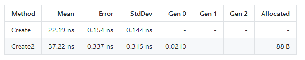

# dotnet ConcurrentDictionary 的 GetOrAdd 性能比 TryGetValue 加 TryAdd 低

我在 Office 的 Open-XML-SDK 库里面找到有代码线程不安全，代码里面使用了 TryGetValue 加 TryAdd 的方法添加对象，而线程安全的方法是通过 GetOrAdd 方法。不过在小伙伴的评论我找到了 GetOrAdd 性能其实在有闭包的时候不如使用 TryGetValue 加 TryAdd 调用这两个方法，但是 GetOrAdd 的优势在于能做到只创建一次对象

<!--more-->


<!-- CreateTime:2020/7/16 11:00:59 -->

<!-- 发布 -->

在 [Avoid multi-thread creates ElementMetadata object by lindexi · Pull Request #758 · OfficeDev/Open-XML-SDK](https://github.com/OfficeDev/Open-XML-SDK/pull/758 ) 我找到了 OpenXML SDK 的代码存在线程不安全，代码如下

```csharp
        public static ElementMetadata Create(OpenXmlElement element)
        {
            var type = element.GetType();

            // Use TryGetValue first for the common case of already existing types to limit number of allocations
            if (_lookup.TryGetValue(type, out var result))
            {
                return result;
            }

            // 假设有两个线程进来，此时两个线程都判断 TryGetValue 不存在，于是就会使用 CreateInternal 创建对象

            var metadata = CreateInternal(element);

            _lookup.TryAdd(type, metadata);

            return metadata;
        }
```

也就是调用 Create 多线程调用将会创建多个不同的实例，如果修改为 GetOrAdd 方法，那么只会创建一个对象实例

但是如果在对象创建的时间可以忽略的前提下，如 CreateInternal 方法的耗时可以忽略，同时在 OpenXML 的这个业务里面，其实多创建对象是没有问题的，那么此时使用 TryGetValue 加上 TryAdd 的方法的性能会比使用 GetOrAdd 的性能高

这是我更改的方法，使用 GetOrAdd 可以做到只创建一个对象

```csharp
        public static ElementMetadata Create2(OpenXmlElement element)
        {
            var type = element.GetType();

            // Use GetOrAdd first for the common case of already existing types to limit number of allocations
            return _lookup.GetOrAdd(type, _ => CreateInternal(element));
        }
```

此时做性能测试对比，性能测试的代码放在本文最后

可以看到使用 Create 方法的性能更好，同时申请的对象也更少

<!--  -->


|  Method |     Mean |    Error |   StdDev |  Gen 0 | Gen 1 | Gen 2 | Allocated |
|-------- |---------:|---------:|---------:|-------:|------:|------:|----------:|
|  Create | 22.19 ns | 0.154 ns | 0.144 ns |      - |     - |     - |         - |
| Create2 | 37.22 ns | 0.337 ns | 0.315 ns | 0.0210 |     - |     - |      88 B |

为什么 Create2 方法会更慢，同时需要申请内存？原因是调用

每次使用 GetOrAdd 方法都需要创建一个 Lambda 表达式和传入参数，需要创建类，所以性能上不如原先代码

那么如果没有闭包呢？

接下来我测试了值存在和不存在等的比较，测试效果如下 GetOrAdd 需要传入一个 Lambda 表达式，这个表达式需要传入一个 element 变量，这将需要创建一个闭包

``` ini

BenchmarkDotNet=v0.12.1, OS=Windows 10.0.19041.264 (19062/3/20H1)
Intel Core i7-6700 CPU 3.40GHz (Skylake), 1 CPU, 8 logical and 4 physical cores
.NET Core SDK=3.1.301
  [Host]     : .NET Core 3.1.5 (CoreCLR 4.700.20.26901, CoreFX 4.700.20.27001), X64 RyuJIT
  DefaultJob : .NET Core 3.1.5 (CoreCLR 4.700.20.26901, CoreFX 4.700.20.27001), X64 RyuJIT


```

|                        Method |     Mean |     Error |    StdDev |   Median |
|------------------------------ |---------:|----------:|----------:|---------:|
|       GetOrAddExistWithClosed | 1.702 μs | 0.0339 μs | 0.0772 μs | 1.659 μs |
|        GetOrAddExistWithValue | 1.586 μs | 0.0460 μs | 0.1335 μs | 1.518 μs |
|    GetOrAddNotExistWithClosed | 1.422 μs | 0.0181 μs | 0.0141 μs | 1.417 μs |
|     GetOrAddNotExistWithValue | 1.591 μs | 0.0665 μs | 0.1940 μs | 1.529 μs |
|    GetOrAddExistWithoutClosed | 1.986 μs | 0.0204 μs | 0.0180 μs | 1.991 μs |
| GetOrAddNotExistWithoutClosed | 2.054 μs | 0.0167 μs | 0.0130 μs | 2.057 μs |
|              TryGetValueExist | 1.149 μs | 0.0132 μs | 0.0117 μs | 1.144 μs |
|           TryGetValueNotExist | 1.281 μs | 0.0353 μs | 0.1019 μs | 1.229 μs |


这里的 TryGetValueNotExist 就是使用 TryGetValue 判断之后再使用 TryAdd 加回去。同时每个 Key 都是不存在的，代码如下

```csharp
        [Benchmark]
        public object TryGetValueNotExist()
        {
            object o = null;
            for (int i = 0; i < Count; i++)
            {
                if (_concurrentDictionary.TryGetValue(i, out var value))
                {
                }
                else
                {
                    o = GetObject();

                    _concurrentDictionary.TryAdd(i, o);
                }
            }

            return o;
        }
```

而 GetOrAddExistWithClosed 就是使用 GetOrAdd 方法，同时 Key 是存在的，也就是每次获取的都是存在的相同的值。而 Closed 表示闭包，也就是存在一次闭包的委托创建，代码如下

```csharp
        [Benchmark]
        public object GetOrAddExistWithClosed()
        {
            object o = null;
            for (int i = 0; i < Count; i++)
            {
                o = GetObject();

                _concurrentDictionary.GetOrAdd(-1, _ => o);
            }

            return o;
        }
```

在 GetOrAdd 还有重载的方法，可以传入需要的参数，也就是 GetOrAddExistWithValue 方法，此时没有传入闭包，而是传入参数

```csharp
        [Benchmark]
        public object GetOrAddExistWithValue()
        {
            object o = GetObject();
            for (int i = 0; i < Count; i++)
            {
                o = _concurrentDictionary.GetOrAdd(-1, (_, value) => value, o);
            }

            return o;
        }
```

同时测试了不传入闭包，也就是使用类的方法，代码如下

```csharp
        [Benchmark]
        public object GetOrAddExistWithoutClosed()
        {
            object o = null;
            for (int i = 0; i < Count; i++)
            {
                o = _concurrentDictionary.GetOrAdd(-1, _ => GetObject());
            }

            return o;
        }
```

上面是测试 `_concurrentDictionary` 存在值的，因为在初始化给了 `-1` 的值，也就是每次获取都是存在值的

如果每次都是 Key 不存在的，也测试了性能就是对应的 `NotExist` 方法

上面测试的代码放在 [github](https://github.com/lindexi/lindexi_gd/tree/4f1793cb116e8609ec09c2c6f00c63413ba96aca/YawyahunecafeCorekeenaine ) 欢迎小伙伴访问

这是在 OpenXML 的性能测试代码

```csharp
// Copyright (c) Microsoft. All rights reserved.
// Licensed under the MIT license. See LICENSE file in the project root for full license information.
using BenchmarkDotNet.Attributes;
using DocumentFormat.OpenXml.Framework.Metadata;

namespace DocumentFormat.OpenXml.Benchmarks
{
    public class ElementMetadataTests
    {
        [GlobalSetup]
        public void Setup()
        {
            _element = new AlternateContent();
        }

        private OpenXmlElement _element;

        [BenchmarkCategory("ElementMetadataTests")]
        [Benchmark]
        public void Create()
        {
            _ = ElementMetadata.Create(_element);
        }

        [BenchmarkCategory("ElementMetadataTests")]
        [Benchmark]
        public void Create2()
        {
            _ = ElementMetadata.Create2(_element);
        }
    }
}
```


<a rel="license" href="http://creativecommons.org/licenses/by-nc-sa/4.0/"></a><br />本作品采用<a rel="license" href="http://creativecommons.org/licenses/by-nc-sa/4.0/">知识共享署名-非商业性使用-相同方式共享 4.0 国际许可协议</a>进行许可。欢迎转载、使用、重新发布，但务必保留文章署名[林德熙](http://blog.csdn.net/lindexi_gd)(包含链接:http://blog.csdn.net/lindexi_gd )，不得用于商业目的，基于本文修改后的作品务必以相同的许可发布。如有任何疑问，请与我[联系](mailto:lindexi_gd@163.com)。