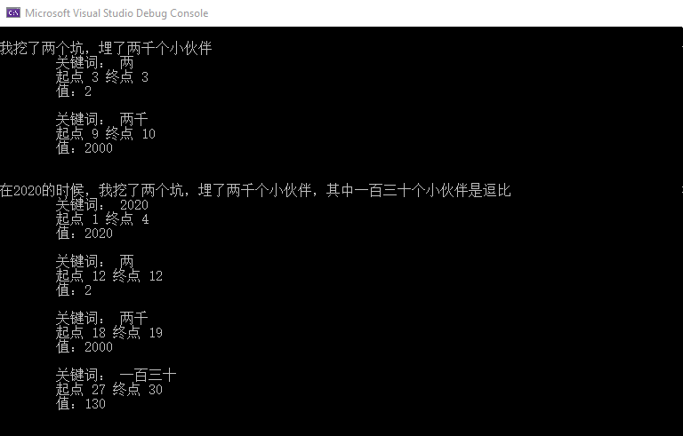
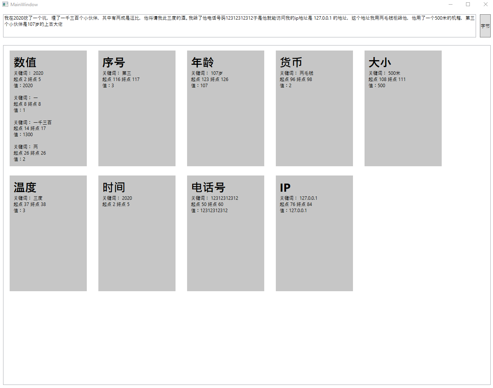
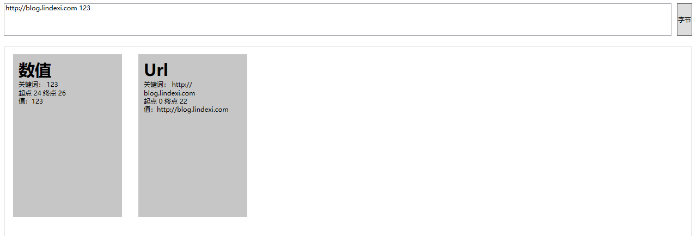

# dotnet Microsoft.Recognizers.Text 超强大的自然语言关键词提取库

本文和大家介绍一个使用超级简单，但是功能特别强大的自然语言关键词提取库，可以根据输入的自然语言提取出里面的信息。例如我在一句话里面说了哪些数值变量或者说了手机号码等

<!--more-->


<!-- CreateTime:5/23/2020 5:29:01 PM -->


先看看下图的一个效果，下图是尝试识别一句话里面的数值信息

<!--  -->


新建一个 WPF 项目，大概运行效果如下

<!--  -->


先编辑 csproj 文件，在里面添加安装库的代码

```xml
    <ItemGroup>
        <PackageReference Include="Microsoft.Recognizers.Text" Version="1.3.2"></PackageReference>
        <PackageReference Include="Microsoft.Recognizers.Text.Number" Version="1.3.2"></PackageReference>
        <PackageReference Include="Microsoft.Recognizers.Text.NumberWithUnit" Version="1.3.2"></PackageReference>
        <PackageReference Include="Microsoft.Recognizers.Text.DateTime" Version="1.3.2"></PackageReference>
        <PackageReference Include="Microsoft.Recognizers.Text.Sequence" Version="1.3.2"></PackageReference>
        <PackageReference Include="Microsoft.Recognizers.Text.Choice" Version="1.3.2"></PackageReference>
    </ItemGroup>
```

这几个库提供了如下的功能

## 数值

```csharp
 var recognizeNumber = NumberRecognizer.RecognizeNumber(text, Culture.Chinese);
```

返回的值是解析到多少个数值，可以通过下面代码转换为字符串

```csharp
        private static string ModelResultToString(List<ModelResult> list)
        {
            var pre = "";
            var breakLine = "\r\n";
            var str = new StringBuilder();
            foreach (var modelResult in list)
            {
                str.Append(pre)
                    .Append("关键词： ")
                    .Append(modelResult.Text)
                    .Append(breakLine)
                    .Append(pre)
                    .Append($"起点 {modelResult.Start} 终点 {modelResult.End}")
                    .Append(breakLine);
                if (modelResult.Resolution.TryGetValue("value", out var value))
                {
                    str.Append(pre)
                        .Append("值：")
                        .Append(value)
                        .Append(breakLine);
                }

                str.Append(breakLine);
            }

            return str.ToString();
        }
```

返回值包含了原文的关键词，也就是通过关键词解析的数值，关键词在原文的起点和终点。还有解析出的值

## 布尔

```csharp
  var recognizeBoolean = ChoiceRecognizer.RecognizeBoolean("对的", Culture.Chinese);
```

## IP

```csharp
var recognizeIpAddress = SequenceRecognizer.RecognizeIpAddress(text, Culture.Chinese);
```

## 链接

```csharp
var recognizeUrl = SequenceRecognizer.RecognizeURL(text, Culture.Chinese);
```

<!--  -->


## 电话号

```csharp
var recognizePhoneNumber = SequenceRecognizer.RecognizePhoneNumber(text, Culture.Chinese);
```

## 时间

```csharp
var recognizeDateTime = DateTimeRecognizer.RecognizeDateTime("下午6点", Culture.Chinese);
```

## 温度

```csharp
var recognizeTemperature = NumberWithUnitRecognizer.RecognizeTemperature("十度", Culture.Chinese);
```

## 大小

```csharp
var recognizeDimension = NumberWithUnitRecognizer.RecognizeDimension("十米", Culture.Chinese);
```

## 货币

```csharp
var recognizeCurrency = NumberWithUnitRecognizer.RecognizeCurrency(text, Culture.Chinese);
```

## 年龄

```csharp
var recognizeAge = NumberWithUnitRecognizer.RecognizeAge(text, Culture.Chinese);
```

## 序号

```csharp
var recognizeOrdinal = NumberRecognizer.RecognizeOrdinal(text, Culture.Chinese);
```

这是一个开源的项目，请看 [Recognizers-Text/.NET at master · microsoft/Recognizers-Text](https://github.com/microsoft/Recognizers-Text/tree/master/.NET )

本文的界面使用 WPF 写的，代码放在 [github](https://github.com/lindexi/lindexi_gd/tree/9ff7e5fd2029099f852972664e32731aea9130cc/DairqeldejuDawyewheawelbehe) 欢迎小伙伴访问

界面如下

```xml
    <Grid>
        <Grid.RowDefinitions>
            <RowDefinition Height="Auto" />
            <RowDefinition />
        </Grid.RowDefinitions>
        <Grid Margin="10,10,10,10">
            <Grid.ColumnDefinitions>
                <ColumnDefinition />
                <ColumnDefinition Width="Auto" />
            </Grid.ColumnDefinitions>
            <TextBox x:Name="Text" AcceptsReturn="True" Height="60" TextWrapping="Wrap" />
            <Button Margin="10,0,0,0" Grid.Column="1" Content="字节" Click="Button_OnClick" />
        </Grid>
        <Grid Grid.Row="1" Margin="10,10,10,10">
            <ListView x:Name="ListView" ScrollViewer.HorizontalScrollBarVisibility="Disabled">
                <ListView.ItemsPanel>
                    <ItemsPanelTemplate>
                        <WrapPanel Orientation="Horizontal" />
                    </ItemsPanelTemplate>
                </ListView.ItemsPanel>
                <ListView.ItemTemplate>
                    <DataTemplate DataType="local:ModelInfo">
                        <Grid Height="300" Width="200" Margin="10,10,10,10" Background="#C6C6C6">
                            <Grid Margin="10,10,10,10">
                                <Grid.RowDefinitions>
                                    <RowDefinition Height="Auto" />
                                    <RowDefinition />
                                </Grid.RowDefinitions>
                                <TextBlock FontWeight="Bold" FontSize="30" Text="{Binding Title}" />
                                <TextBlock Grid.Row="1" Text="{Binding Content}" TextWrapping="Wrap" />
                            </Grid>
                        </Grid>
                    </DataTemplate>
                </ListView.ItemTemplate>
            </ListView>
        </Grid>
    </Grid>
```

数据绑定的是 ModelInfo 里面包含两个值

```csharp
    public class ModelInfo
    {
        public ModelInfo(string title, string content)
        {
            Title = title;
            Content = content;
        }

        public string Title { get; }

        public string Content { get; }
    }
```

在每次点击按钮的时候重新创建列表给 ListView 控件

```csharp
        private void Button_OnClick(object sender, RoutedEventArgs e)
        {
            var text = Text.Text;
            var modelInfoList = new List<ModelInfo>();

            RecognizeNumber(text, modelInfoList);
            RecognizeOrdinal(text, modelInfoList);

            RecognizeAge(text, modelInfoList);
            RecognizeCurrency(text, modelInfoList);
            RecognizeDimension(text, modelInfoList);
            RecognizeTemperature(text, modelInfoList);

            RecognizeDateTime(text, modelInfoList);

            RecognizePhoneNumber(text, modelInfoList);
            RecognizeIpAddress(text, modelInfoList);

            RecognizeBoolean(text, modelInfoList);

            ListView.ItemsSource = modelInfoList;
        }
```

对应的几个方法就是判断如果存在对应的值就添加到列表


<a rel="license" href="http://creativecommons.org/licenses/by-nc-sa/4.0/"></a><br />本作品采用<a rel="license" href="http://creativecommons.org/licenses/by-nc-sa/4.0/">知识共享署名-非商业性使用-相同方式共享 4.0 国际许可协议</a>进行许可。欢迎转载、使用、重新发布，但务必保留文章署名[林德熙](http://blog.csdn.net/lindexi_gd)(包含链接:http://blog.csdn.net/lindexi_gd )，不得用于商业目的，基于本文修改后的作品务必以相同的许可发布。如有任何疑问，请与我[联系](mailto:lindexi_gd@163.com)。