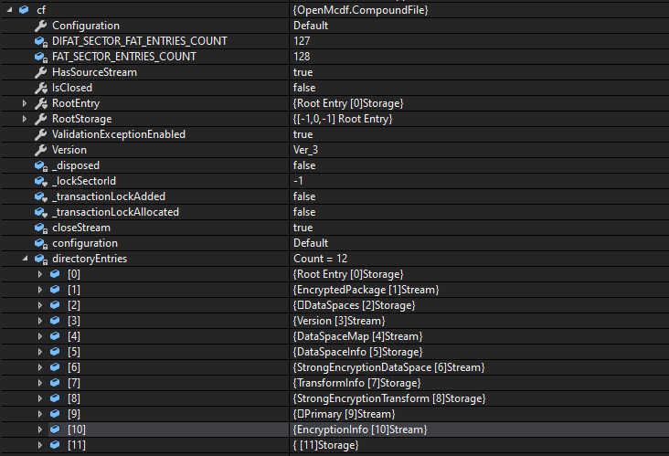

# dotnet Open XML 如何判断一份 Office 文档是否被加密

在拿到一份 PPTX 文档，或一份 Word 的 docx 文档，如何判断这份文档是被加密的

<!--more-->


<!-- CreateTime:2020/9/17 19:15:50 -->


在 Office 里，对 pptx 文档或 docx 或 xlsx 文档的加密是将文档加密为 OLE 格式，也就是和 Office 2003 的 doc 等文档格式相同的 Ole object 格式

在没加密时，是使用 OPC 格式，也就是 zip 压缩文档。但是加密之后，文档格式使用 OLE Object 格式，就不能用 OpenXML SDK 读取。因为 OpenXML SDK 将使用压缩文档读取方法读取，这个方法不能读取 OLE 文件

如果使用 OpenXML SDK 读取一个加密的 Office 文档，那么将会在读取的时候抛出 OpenXmlPackageException 告诉开发者失败

可以使用 [openmcdf](https://github.com/ironfede/openmcdf ) 这个开源库读取 OLE 文件，然后判断这个文件是否 Office 加密文件

判断一份文档是否被加密首先需要了解加密的格式，请看 [[MS-OFFCRYPTO]: Office Document Cryptography Structure](https://docs.microsoft.com/en-us/openspecs/office_file_formats/ms-offcrypto/3c34d72a-1a61-4b52-a893-196f9157f083?WT.mc_id=DX-MVP-5003606 )

先创建一份加密的 pptx 文档，接下来尝试判断这个文件是加密的 Office 文件，我在 [github](https://github.com/lindexi/lindexi_gd/tree/efd1fc6e57388bf9b4ed65346e3230a4163b1d98/KaldaygeduWalaineejaw ) 放一份我创建的文件，小伙伴可以随意使用

最简单的方法就是通过 OpenXML SDK 读一下文档，如果抛出 OpenXmlPackageException 那么也许就是被加密了

如果想要通过读取 OLE 判断的方法，需要先在项目里面安装 [openmcdf](https://github.com/ironfede/openmcdf ) 库

```xml
  <ItemGroup>
    <PackageReference Include="OpenMcdf" Version="2.2.1.6" />
  </ItemGroup>
```

然后添加下面代码

```csharp
        private static bool CheckOfficeDocumentWithPassword(FileInfo file)
        {
            CompoundFile cf = new CompoundFile(file.FullName);
            var numDirectories = cf.GetNumDirectories();
            for (int i = 0; i < numDirectories; i++)
            {
                var nameDirEntry = cf.GetNameDirEntry(i);

                if (cf.RootStorage.TryGetStream(nameDirEntry, out var stream))
                {
                    if (nameDirEntry == "EncryptionInfo")
                    {
                        return true;
                    }
                }
            }

            return false;
        }
```

使用方法如下

```csharp
        static void Main(string[] args)
        {
            var file = @"带密码的课件PPTX.pptx";

            if (CheckOfficeDocumentWithPassword(new FileInfo(file)))
            {
                Console.WriteLine("带密码");
            }
        }
```

本文代码放在 [github](https://github.com/lindexi/lindexi_gd/tree/efd1fc6e57388bf9b4ed65346e3230a4163b1d98/KaldaygeduWalaineejaw ) 欢迎小伙伴访问

这个方法判断的原理是加密的 Office 文件里面，将会是 OLE 格式，而 OLE 是一个磁盘格式，可以理解为和 zip 差不多的格式，加密的文件里面将会包含下面内容

<!--  -->


而在 Office 的解密方法就是使用用户输入的密码和 EncryptionInfo 内容判断，然后解压缩 EncryptedPackage 文件，所以上面的判断大概是对的


更多请看 [Office 使用 OpenXML SDK 解析文档博客目录](https://blog.lindexi.com/post/Office-%E4%BD%BF%E7%94%A8-OpenXML-SDK-%E8%A7%A3%E6%9E%90%E6%96%87%E6%A1%A3%E5%8D%9A%E5%AE%A2%E7%9B%AE%E5%BD%95.html )


<a rel="license" href="http://creativecommons.org/licenses/by-nc-sa/4.0/"></a><br />本作品采用<a rel="license" href="http://creativecommons.org/licenses/by-nc-sa/4.0/">知识共享署名-非商业性使用-相同方式共享 4.0 国际许可协议</a>进行许可。欢迎转载、使用、重新发布，但务必保留文章署名[林德熙](http://blog.csdn.net/lindexi_gd)(包含链接:http://blog.csdn.net/lindexi_gd )，不得用于商业目的，基于本文修改后的作品务必以相同的许可发布。如有任何疑问，请与我[联系](mailto:lindexi_gd@163.com)。