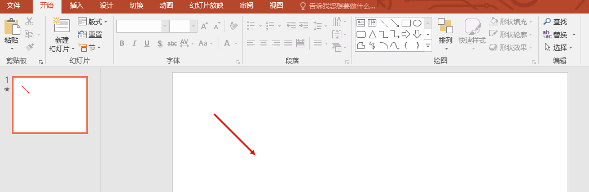
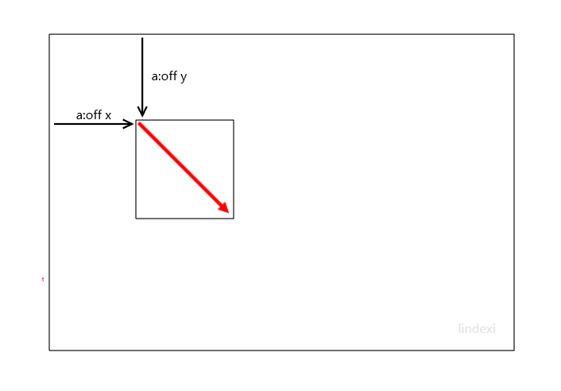
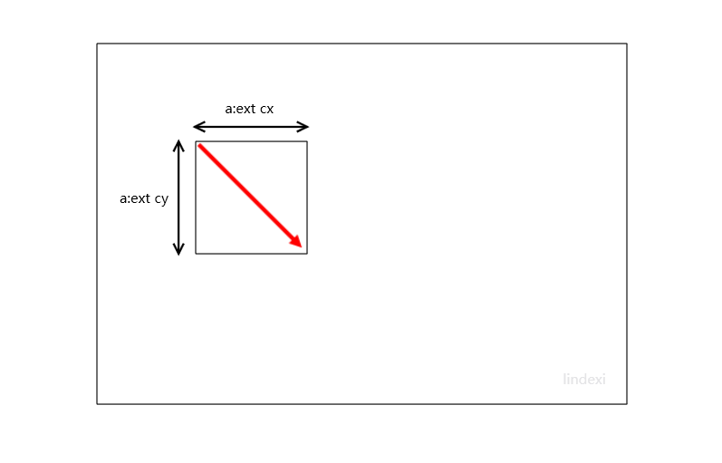
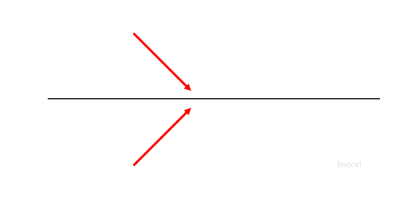

# dotnet OpenXML SDK 形状的翻转与旋转

在 OpenXML 的 PPT 元素，形状的翻转与旋转是有逻辑关系，本文来和大家聊聊形状的翻转和形状的旋转的关系

<!--more-->


<!-- 发布 -->

本文来和小伙伴聊聊最复杂的 ConnectionShape 形状的方向，这个 ConnectionShape 如果是箭头，那么请问箭头方向被多少个属性影响？有很多个影响，最简单的就是 cx 和 cy 的影响。其次就是形状的旋转，而形状的翻转影响是形状本身

先来聊聊 PPT 元素里面的 ConnectionShape 形状，也就是线条形状的，如箭头的方向，在 PPTX 格式的文档的形状的线条形状方向是需要由元素的坐标和 cx 和 cy 决定，如下面这个简单的课件

<!--  -->


这个课件的箭头内容如下

```xml
<p:spPr bwMode="auto">
  <a:xfrm>
    <a:off x="952500" y="952500" />
    <a:ext cx="952500" cy="952500" />
  </a:xfrm>
  <a:prstGeom prst="line">
    <a:avLst />
  </a:prstGeom>
  <a:noFill />
  <a:ln w="38100">
    <a:solidFill>
      <a:srgbClr val="FF0000" />
    </a:solidFill>
    <a:round />
    <a:headEnd />
    <a:tailEnd type="triangle" w="med" len="med" />
  </a:ln>
  <a:extLst>
    <a:ext uri="{909E8E84-426E-40DD-AFC4-6F175D3DCCD1}">
      <a14:hiddenFill xmlns:a14="http://schemas.microsoft.com/office/drawing/2010/main">
        <a:noFill />
      </a14:hiddenFill>
    </a:ext>
  </a:extLst>
</p:spPr>
```

课件可以从 [github](https://github.com/lindexi/lindexi_gd/blob/3c17eb86f0e8598acda355ef096f057d6492fb33/BerbereraloRojicodokigu/%E5%BD%A2%E7%8A%B6%E7%AE%AD%E5%A4%B4%E6%96%B9%E5%90%91%20%E6%9C%80%E7%AE%80%E7%AE%AD%E5%A4%B4.pptx ) 下载

箭头的方向是通过 `a:xfrm` 决定的

```xml
  <a:xfrm>
    <a:off x="952500" y="952500" />
    <a:ext cx="952500" cy="952500" />
  </a:xfrm>
```

根据 [Office Open XML 的测量单位](https://blog.lindexi.com/post/Office-Open-XML-%E7%9A%84%E6%B5%8B%E9%87%8F%E5%8D%95%E4%BD%8D.html ) 这里的单位是 EMU 单位，而 952500 就是大概 100 像素。首先通过 `a:off` 决定元素的坐标，请看下图

<!--  -->


上面图片红色的是箭头，也就是 PPTX 文档里面的形状，而黑色的是辅助线。可以看到使用  `a:off` 决定元素的坐标，而这个形状线条多长和方向就通过 `a:ext` 决定，请看下面

<!--  -->


可以看到箭头距离画布的左上角是 100 像素，而刚好箭头的指向就是刚好 x 是 100 而 y 也是 100 的方向。换句话说，可以将线条形状认为是通过两个点绘制的，而两个点是通过 `a:off` 和 `a:ext` 这两个作为点

如果此时进行翻转，将会发生什么？试试下面代码

```xml
<p:spPr bwMode="auto">
  <a:xfrm flipV="1">
    <a:off x="952500" y="952500" />
    <a:ext cx="952500" cy="952500" />
  </a:xfrm>
  <a:prstGeom prst="line">
    <a:avLst />
  </a:prstGeom>
  <a:noFill />
  <a:ln w="38100">
    <a:solidFill>
      <a:srgbClr val="FF0000" />
    </a:solidFill>
    <a:round />
    <a:headEnd />
    <a:tailEnd type="triangle" w="med" len="med" />
  </a:ln>
  <a:extLst>
    <a:ext uri="{909E8E84-426E-40DD-AFC4-6F175D3DCCD1}">
      <a14:hiddenFill xmlns:a14="http://schemas.microsoft.com/office/drawing/2010/main">
        <a:noFill />
      </a14:hiddenFill>
    </a:ext>
  </a:extLst>
</p:spPr>
```

对比上面代码其实加添加了 `flipV="1"` 表示垂直翻转，点击 [形状箭头方向 最简箭头 翻转.pptx](https://github.com/lindexi/lindexi_gd/blob/3c17eb86f0e8598acda355ef096f057d6492fb33/BerbereraloRojicodokigu/%E5%BD%A2%E7%8A%B6%E7%AE%AD%E5%A4%B4%E6%96%B9%E5%90%91%20%E6%9C%80%E7%AE%80%E7%AE%AD%E5%A4%B4%20%E7%BF%BB%E8%BD%AC.pptx) 即可下载此课件

```xml
  <a:xfrm flipV="1">
    <a:off x="952500" y="952500" />
    <a:ext cx="952500" cy="952500" />
  </a:xfrm>
```

在 OpenXML SDK 的 `flipV="1"` 对应代码如下

```csharp
BooleanValue verticalFlip = transform.VerticalFlip;
```

那么垂直翻转是什么含义？其实是在垂直方向给镜像，如下图

<!--  -->


而在 PPT 中，在进行垂直方向镜像之后，不能更改元素的坐标，也就是如果绘制出线条形状的外接矩形，可以看到外接矩形在元素进行翻转前后的坐标和大小不变

那么如果加上旋转呢？其实旋转是独立的，只是作用在形状的外接矩形上。在2D渲染，新旋转再翻转和先翻转再旋转的效果是不相同的

在 PPT 里，如果加上旋转如下面代码，是先翻转再旋转

```xml
<p:spPr bwMode="auto">
  <a:xfrm rot="2700000" flipV="1">
    <a:off x="952500" y="952500" />
    <a:ext cx="952500" cy="952500" />
  </a:xfrm>
  <a:prstGeom prst="line">
    <a:avLst />
  </a:prstGeom>
  <a:noFill />
  <a:ln w="38100">
    <a:solidFill>
      <a:srgbClr val="FF0000" />
    </a:solidFill>
    <a:round />
    <a:headEnd />
    <a:tailEnd type="triangle" w="med" len="med" />
  </a:ln>
  <a:extLst>
    <a:ext uri="{909E8E84-426E-40DD-AFC4-6F175D3DCCD1}">
      <a14:hiddenFill xmlns:a14="http://schemas.microsoft.com/office/drawing/2010/main">
        <a:noFill />
      </a14:hiddenFill>
    </a:ext>
  </a:extLst>
</p:spPr>
```

这份课件可以在 [github](https://github.com/lindexi/lindexi_gd/blob/3c17eb86f0e8598acda355ef096f057d6492fb33/BerbereraloRojicodokigu/%E5%BD%A2%E7%8A%B6%E7%AE%AD%E5%A4%B4%E6%96%B9%E5%90%91%20%E6%9C%80%E7%AE%80%E7%AE%AD%E5%A4%B4%20%E7%BF%BB%E8%BD%AC%E6%97%8B%E8%BD%AC.pptx) 下载

在 OpenXML 的旋转使用 `rot` 表示，通过 [Office Open XML 的测量单位](https://blog.lindexi.com/post/Office-Open-XML-%E7%9A%84%E6%B5%8B%E9%87%8F%E5%8D%95%E4%BD%8D.html ) 可以了解单位是角度，每 60000 表示一度，也就是代码 `rot="2700000"` 是 45 度。旋转方向默认是顺时针

而通过 `a:ext cx="952500" cy="952500"` 可以看到是箭头倾斜 45 度，也就是 x 方向是 100 像素和 y 方向是 100 像素，刚好是外接正方形的对角线。正方形的对角线一定是 45 度。而此时的旋转是 45 度，所以要么箭头成垂直的，要么是水平的，也就是 180 度和 90 度

在 PPT 的元素，是先翻转，然后对外接矩形旋转。在翻转之后的箭头是 45 度，而加上旋转是在翻转之后加上的，此时加上 45 度也是 90 度

所以可以看到上面代码的箭头是 90 度的

关于元素的宽度高度等请看 [C# dotnet 使用 OpenXml 解析 PPT 元素的坐标和宽度高度](https://blog.lindexi.com/post/C-dotnet-%E4%BD%BF%E7%94%A8-OpenXml-%E8%A7%A3%E6%9E%90-PPT-%E5%85%83%E7%B4%A0%E7%9A%84%E5%9D%90%E6%A0%87%E5%92%8C%E5%AE%BD%E5%BA%A6%E9%AB%98%E5%BA%A6.html)

在调试这部分细节的时候，就需要用到我的工具了，这个工具可以将 PPTX 等 Office 文档解压缩出来，方便小伙伴编辑里面的文档内容，编辑完成之后可以打包为 PPTX 文档看修改的效果。这个工具的安装方法很简单，在命令行输入下面代码即可安装

```csharp
dotnet tool isntall -g dotnetCampus.OfficeDocumentZipper
```

打开工具可以在命令行输入下面代码

```csharp
OfficeDocumentZipper
```

这个工具在 GitHub 完全开源，请看 [dotnet OpenXML 解压缩文档为文件夹工具](https://blog.lindexi.com/post/dotnet-OpenXML-%E8%A7%A3%E5%8E%8B%E7%BC%A9%E6%96%87%E6%A1%A3%E4%B8%BA%E6%96%87%E4%BB%B6%E5%A4%B9%E5%B7%A5%E5%85%B7.html )

更多请看 [Office 使用 OpenXML SDK 解析文档博客目录](https://blog.lindexi.com/post/Office-%E4%BD%BF%E7%94%A8-OpenXML-SDK-%E8%A7%A3%E6%9E%90%E6%96%87%E6%A1%A3%E5%8D%9A%E5%AE%A2%E7%9B%AE%E5%BD%95.html )


<a rel="license" href="http://creativecommons.org/licenses/by-nc-sa/4.0/"></a><br />本作品采用<a rel="license" href="http://creativecommons.org/licenses/by-nc-sa/4.0/">知识共享署名-非商业性使用-相同方式共享 4.0 国际许可协议</a>进行许可。欢迎转载、使用、重新发布，但务必保留文章署名[林德熙](http://blog.csdn.net/lindexi_gd)(包含链接:http://blog.csdn.net/lindexi_gd )，不得用于商业目的，基于本文修改后的作品务必以相同的许可发布。如有任何疑问，请与我[联系](mailto:lindexi_gd@163.com)。