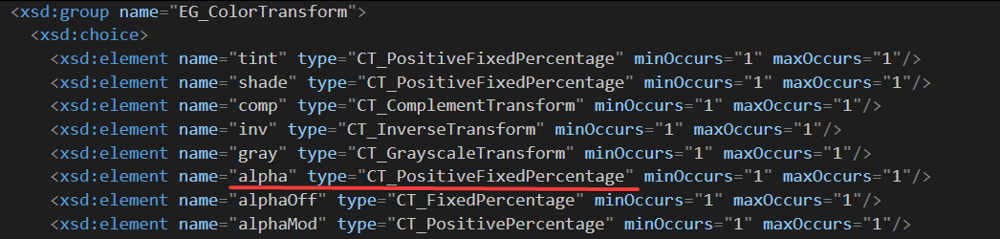

# dotnet OpenXML 修复 Office 文档里面的百分比内容包含百分号

我在解析一个 PPT 文档的时候，发现了这个 PPT 文档的背景色的透明度百分比的字符串里面包含了百分号，而不是一个 OpenXml 里面的百分比单位

<!--more-->


<!-- CreateTime:2021/1/30 10:42:23 -->


<!-- 发布 -->

这份 PPT 文档的背景内容如下

```xml
    <p:bg>
      <p:bgPr>
        <a:solidFill>
          <a:srgbClr val="383747">
            <a:alpha val="100.00%" />
          </a:srgbClr>
        </a:solidFill>
      </p:bgPr>
    </p:bg>
```

可以看到背景的 `a:alpha` 的 Val 值是一个包含了百分号的字符串。这个和 OpenXML 的单位定义的百分比不相同，从 [Office Open XML 的测量单位](https://blog.lindexi.com/post/Office-Open-XML-%E7%9A%84%E6%B5%8B%E9%87%8F%E5%8D%95%E4%BD%8D.html ) 可以了解到默认使用的是千分之一的百分比，也就是默认的字符串是一个整数的数值，其中数值的一千就代表百分之一的值，如我在 [dotnetCampus.OpenXMLUnitConverter OpenXML 单位转换开源库](https://github.com/dotnet-campus/dotnetCampus.OfficeDocumentZipper) 里面写的代码一样

如上面文档内容，如果使用 OpenXML SDK 的背景获取方式，如下面代码，将会提示出错

```csharp
            using (var presentationDocument = DocumentFormat.OpenXml.Packaging.PresentationDocument.Open("1.pptx", false))
            {
                var presentationPart = presentationDocument.PresentationPart;
                var presentation = presentationPart.Presentation;

                var slideIdList = presentation.SlideIdList;

                foreach (var slideId in slideIdList.ChildElements.OfType<SlideId>())
                {
                    SlidePart slidePart = (SlidePart)presentationPart.GetPartById(slideId.RelationshipId);

                    var slide = slidePart.Slide;

                    var background = slide.CommonSlideData.Background;
                    var backgroundProperties = background.BackgroundProperties;
                    var solidFill = backgroundProperties.GetFirstChild<SolidFill>();
                    var solidFillRgbColorModelHex = solidFill.RgbColorModelHex;
                    var alpha = solidFillRgbColorModelHex.GetFirstChild<Alpha>();
                    try
                    {
                        int alphaVal = alpha.Val;
                    }
                    catch (Exception e)
                    {
                        // Input string was not in a correct format.
                        Console.WriteLine(e);
                    }
                }
            }
```

以上的全部代码放在 [github](https://github.com/lindexi/lindexi_gd/tree/9b506dea/RurlejileGearhuheljale) 欢迎下载测试，这里面就包含了这个测试的 PPT 文档

在 OpenXML SDK 里面将 alpha 的 Val 认为是一个 Int32Value 值，因此在转换的时候就会失败。这个问题我报给了官方，请看 [OpenXML SDK will throw exception when a percentage with % char · Issue #875 · OfficeDev/Open-XML-SDK](https://github.com/OfficeDev/Open-XML-SDK/issues/875 )

咱的一个修复方法是获取的是 alpha 的 InnerText 然后进行转换

```csharp
var alphaText = alpha.InnerText;
var percentage = new Percentage(alphaText);

        public Percentage(string percentageText)
        {
            if (int.TryParse(percentageText, out var intValue))
            {
                IntValue = intValue;
                return;
            }
            else
            {
                // 如果是带了百分比的
                if (percentageText.Length > 1 && percentageText.EndsWith("%"))
                {
                    var newPercentageText = percentageText.Substring(0, percentageText.Length - 1);
                    if (double.TryParse(newPercentageText, out var doubleValue))
                    {
                        IntValue = (int)Math.Round(doubleValue * 1000);

                        return;
                    }
                }
            }

            throw new ArgumentException(
                $"Can not convert PercentageText={percentageText} to {nameof(OpenXmlUnitConverter.Percentage)} value.");
        }
```

而根据 ECMA 376 文档的定义，这里的 Alpha 值内容如下

<!--  -->


```xml
<xsd:group name="EG_ColorTransform">
  <xsd:choice>
  	<!-- 忽略代码 -->
  	<xsd:element name="alpha" type="CT_PositiveFixedPercentage" minOccurs="1" maxOccurs="1"/>
  </xsd:choice>
</xsd:group>
```

而 CT_PositiveFixedPercentage 的定义如下

```xml
<xsd:complexType name="CT_PositiveFixedPercentage">
  <xsd:attribute name="val" type="ST_PositiveFixedPercentage" use="required"/>
</xsd:complexType>
```

而 `ST_PositiveFixedPercentage` 的定义如下

```xml
<xsd:simpleType name="ST_PositiveFixedPercentage">
  <xsd:union memberTypes="s:ST_PositiveFixedPercentage"/>
</xsd:simpleType>
```

也就是说其实不算是 Int 数值

本文的属性是依靠 [dotnet OpenXML 解压缩文档为文件夹工具](https://blog.lindexi.com/post/dotnet-OpenXML-%E8%A7%A3%E5%8E%8B%E7%BC%A9%E6%96%87%E6%A1%A3%E4%B8%BA%E6%96%87%E4%BB%B6%E5%A4%B9%E5%B7%A5%E5%85%B7.html ) 工具协助测试的，这个工具是开源免费的工具，欢迎小伙伴使用

更多请看 [Office 使用 OpenXML SDK 解析文档博客目录](https://blog.lindexi.com/post/Office-%E4%BD%BF%E7%94%A8-OpenXML-SDK-%E8%A7%A3%E6%9E%90%E6%96%87%E6%A1%A3%E5%8D%9A%E5%AE%A2%E7%9B%AE%E5%BD%95.html )


<a rel="license" href="http://creativecommons.org/licenses/by-nc-sa/4.0/"></a><br />本作品采用<a rel="license" href="http://creativecommons.org/licenses/by-nc-sa/4.0/">知识共享署名-非商业性使用-相同方式共享 4.0 国际许可协议</a>进行许可。欢迎转载、使用、重新发布，但务必保留文章署名[林德熙](http://blog.csdn.net/lindexi_gd)(包含链接:http://blog.csdn.net/lindexi_gd )，不得用于商业目的，基于本文修改后的作品务必以相同的许可发布。如有任何疑问，请与我[联系](mailto:lindexi_gd@163.com)。