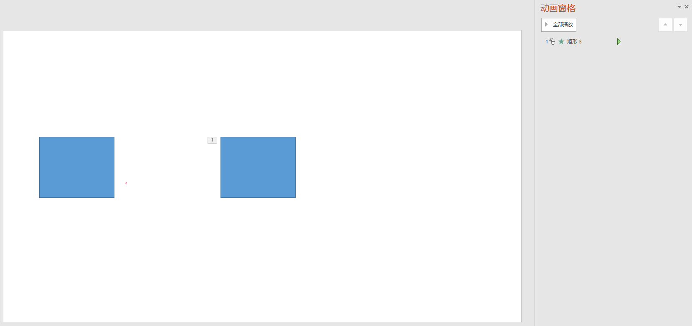
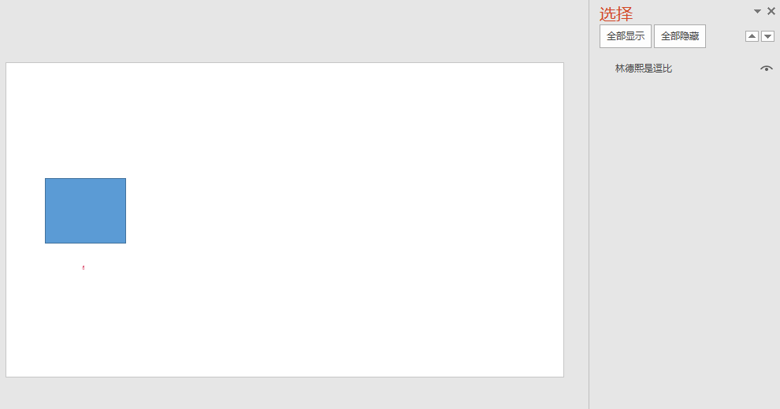
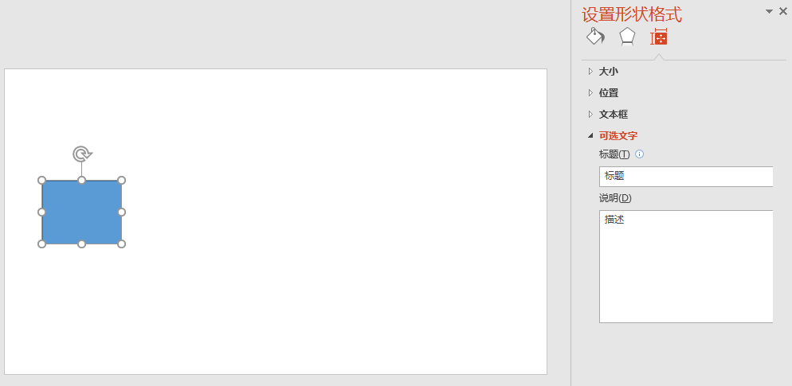
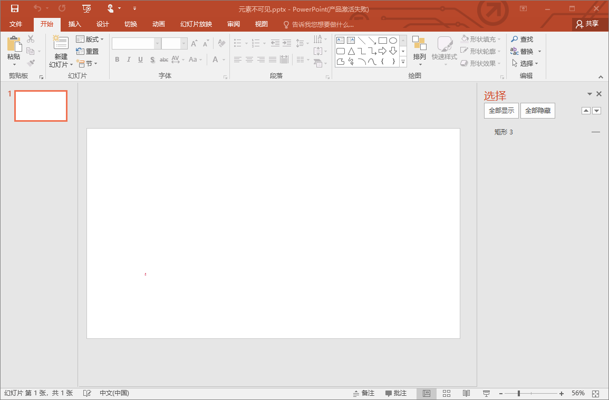
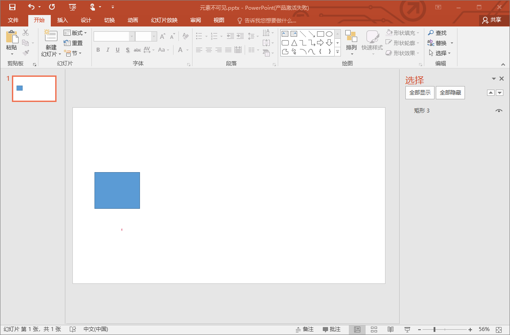
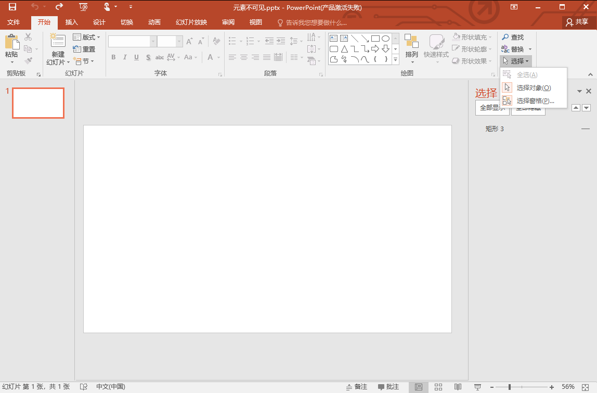

# dotnet OpenXML 元素 cNvPr NonVisual Drawing Properties 的属性作用

本文收集元素属性 cNvPr Non-Visual Drawing Properties 的属性的作用

<!--more-->


<!-- CreateTime:2020/9/27 16:29:27 -->


本文的 Non-Visual Drawing Properties 也就是在 OpenXML 文档里面的 cNvPr 代码，在 ECMA 376 的 20.2.2.3 文档有详细说明

在形状的 Non-Visual Drawing Properties 使用 p:cNvPr 表示，在图片使用 `pic:cNvPr` 表示等

本文的 OpneXMl SDK 的获取代码前提都有以下代码

```csharp
public void Foo(NonVisualDrawingProperties nonVisualDrawingProperties)
{
    
}
```

## id

这是一个必须包含的属性

虽然全名是 Unique Identifier 表示层级里面唯一的 id 标识，但是实际可以存在重复。根据 ECMA 376 的说法是在当前文档里面唯一的 id 标识。但实际上范围只是当前层级。例如在 Slide 页面里面的多个元素，可以通过这个 id 作为区分，而在一个组合元素里面，允许组合里面的元素的 id 和 Slide 页面的其他元素 id 是重复的

而且这个 id 标识是允许重复的，在实际的 Office 里面将会使用比较复杂的规则来解决 id 是重复。如果一份文档里面存在重复的 id 标识，可以认为这份文档是不规范的

这个 id 可以让元素被其他部分所引用，最简单的如动画，如下面代码，一份文档有两个矩形，而动画依靠这个 id 判断使用哪个矩形

```xml
  <p:cSld>
    <p:spTree>
      <p:sp>
        <p:nvSpPr>
          <p:cNvPr id="2" name="矩形 3" />
          <p:cNvSpPr />
          <p:nvPr />
        </p:nvSpPr>
        <!-- 忽略代码 -->
      </p:sp>
      <p:sp>
        <p:nvSpPr>
          <p:cNvPr id="3" name="矩形 3" />
          <p:cNvSpPr />
          <p:nvPr />
        </p:nvSpPr>
        <!-- 忽略代码 -->
      </p:sp>
    </p:spTree>
  </p:cSld>
  <p:timing>
    <p:tnLst>
      <p:par>
        <!-- 忽略代码 -->
                                        <p:tgtEl>
                                          <p:spTgt spid="3" />
                                        </p:tgtEl>
        <!-- 忽略代码 -->
      </p:par>
    </p:tnLst>
  </p:timing>
```

上面代码的动画使用 `p:spTgt spid="3"` 的 `spid="3"` 引用 id 是 3 的元素，使用 PPT 打开如下，可以看到第二个元素设置动画

<!--  -->


在 OpenXML SDK 的读取方法如下

```csharp
    var id = nonVisualDrawingProperties.Id;
```

测试课件请点击 [元素id形状.pptx](https://github.com/lindexi/lindexi_gd/blob/b57cf920518bde16b8eab09d38b2d9037305d54b/KedewallawFudeneanairchea/%E5%85%83%E7%B4%A0id%E5%BD%A2%E7%8A%B6.pptx) 下载

虽然在标准里面这个标识是不会重复的，但实际的课件会有重复的 id 和不存在的 id 此时就需要使用 [dotnet OpenXML 元素 cNvPr NonVisual Drawing Properties 重复 id 标识处理](https://blog.lindexi.com/post/dotnet-OpenXML-%E5%85%83%E7%B4%A0-cNvPr-NonVisual-Drawing-Properties-%E9%87%8D%E5%A4%8D-id-%E6%A0%87%E8%AF%86%E5%A4%84%E7%90%86.html ) 的方法


## name

用于表示元素的名字，这个名字使用本地语言，可以用来在应用程序给用户了解当前元素的名字。这是一个必须包含的属性

```xml
        <p:nvSpPr>
          <p:cNvPr id="2" name="林德熙是逗比"/>
          <p:cNvSpPr />
          <p:nvPr />
        </p:nvSpPr>
```

如上面代码，可以设置元素名，这个元素名可以在 PPT 的选择窗格看到。更改元素名也可以在 PPT 的选择窗格更改

<!--  -->


另一个在 PPT 可见的是在动画的窗格

在 OpenXML SDK 的读取方法如下

```csharp
    var name = nonVisualDrawingProperties.Name;
```
测试课件请点击 [元素名.pptx](https://github.com/lindexi/lindexi_gd/blob/b57cf920518bde16b8eab09d38b2d9037305d54b/KedewallawFudeneanairchea/%E5%85%83%E7%B4%A0%E5%90%8D.pptx) 下载


## title

表示当前元素的标题，标题和下面的 descr 描述的作用是在元素不能显示的时候，可以用来替换的文本。也用来给辅助模块使用，如屏幕阅读器

官方的说法是 标题和说明提供表格、图示和其他对象中包含的信息的可选、基于文本的表示法

在 OpenXML SDK 的读取方法如下

```csharp
    var title = nonVisualDrawingProperties.Title;
```

## descr 

全名是 Alternative Text for Object 用于指定当前元素的代替文本，用于提供给辅助的模块，包括屏幕阅读器使用。也可以用在不支持当前元素的时候显示的文本

在 OpenXML SDK 的读取方法如下

```csharp
    var description = nonVisualDrawingProperties.Description;
```

在 PPT 可以在形状设置看到内容，如下面代码

```xml
        <p:nvSpPr>
          <p:cNvPr id="2" name="林德熙是逗比" title="标题" descr="描述"/>
          <p:cNvSpPr />
          <p:nvPr />
        </p:nvSpPr>
```

<!--  -->


测试课件请点击 [元素标题.pptx](https://github.com/lindexi/lindexi_gd/blob/b57cf920518bde16b8eab09d38b2d9037305d54b/KedewallawFudeneanairchea/%E5%85%83%E7%B4%A0%E6%A0%87%E9%A2%98.pptx) 下载

## hidden

可以设置元素是否可见

```xml
        <p:nvSpPr>
          <p:cNvPr id="2" name="林德熙是逗比" hidden="true"/>
          <p:cNvSpPr />
          <p:nvPr />
        </p:nvSpPr>
```

这个功能可以对应在 PPT 的选择窗格里面的元素是否可见，如上面这份文档，可以在选择窗格里面看到元素是不可见的

<!--  -->


如果去掉上面这个 `hidden="true"` 属性，那么可以看到选择窗格里面的可见图标修改

<!--  -->


打开选择窗格的方法是在 PPT 的选择下拉，点击选择窗格

<!--  -->


在 OpenXML SDK 的读取方法如下

```csharp
    var hidden = nonVisualDrawingProperties.Hidden;
```

测试课件请点击 [元素不可见.pptx](https://github.com/lindexi/lindexi_gd/blob/b57cf920518bde16b8eab09d38b2d9037305d54b/KedewallawFudeneanairchea/%E5%85%83%E7%B4%A0%E4%B8%8D%E5%8F%AF%E8%A7%81.pptx) 下载

本文的属性是依靠 [dotnet OpenXML 解压缩文档为文件夹工具](https://blog.lindexi.com/post/dotnet-OpenXML-%E8%A7%A3%E5%8E%8B%E7%BC%A9%E6%96%87%E6%A1%A3%E4%B8%BA%E6%96%87%E4%BB%B6%E5%A4%B9%E5%B7%A5%E5%85%B7.html ) 工具协助测试的，这个工具是开源免费的工具，欢迎小伙伴使用


更多请看 [Office 使用 OpenXML SDK 解析文档博客目录](https://blog.lindexi.com/post/Office-%E4%BD%BF%E7%94%A8-OpenXML-SDK-%E8%A7%A3%E6%9E%90%E6%96%87%E6%A1%A3%E5%8D%9A%E5%AE%A2%E7%9B%AE%E5%BD%95.html )


<a rel="license" href="http://creativecommons.org/licenses/by-nc-sa/4.0/"></a><br />本作品采用<a rel="license" href="http://creativecommons.org/licenses/by-nc-sa/4.0/">知识共享署名-非商业性使用-相同方式共享 4.0 国际许可协议</a>进行许可。欢迎转载、使用、重新发布，但务必保留文章署名[林德熙](http://blog.csdn.net/lindexi_gd)(包含链接:http://blog.csdn.net/lindexi_gd )，不得用于商业目的，基于本文修改后的作品务必以相同的许可发布。如有任何疑问，请与我[联系](mailto:lindexi_gd@163.com)。