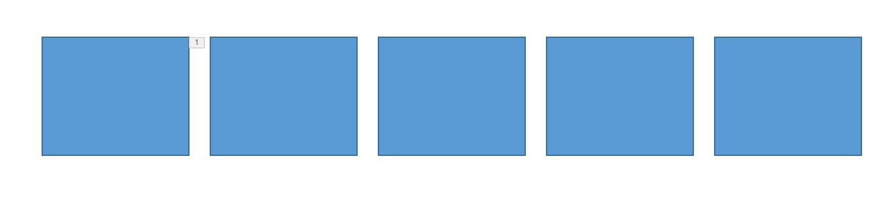

# dotnet OpenXML 元素 cNvPr NonVisual Drawing Properties 重复 id 标识处理

使用 OpenXML 的格式的 Office 文档的元素，使用 p:cNvPr Non-Visual Drawing Properties 的 Id 属性作为标识，在标准协议这个标识是唯一的，但实际很多文档都存在重复的标识。本文告诉大家在使用 Office 2016 版本测试重复 id 的行为

<!--more-->


<!-- CreateTime:2020/9/27 19:22:08 -->


在 OpenXML 的元素的标识一个好的设计是使用 uint 作为标识符，这样做的兼容能力更强。因为可以做到在存在标识符不存在以及重复的时候，自动处理

在 OpenXML 里面的元素在 xml 文档的顺序和元素的序号顺序没有关系，有很多文档的 xml 里面存放的元素的 id 标识的大小和元素所在 xml 的顺序是不同的

在 Office 里，将会尝试给存在重复的标识的元素重新按照在 xml 的顺序给定一个序号作为元素标识

重复 id 标识的规则如下

### 元素重复选第一个

如有两个元素的标识都是相同的，同时在动画被使用，那么动画将会选择在 xml 第一个读到相同的 id 的元素

```xml
  <p:cSld>
    <p:spTree>
      <p:sp>
        <p:nvSpPr>
          <p:cNvPr id="3" name="林德熙的元素" />
          <p:cNvSpPr />
          <p:nvPr />
        </p:nvSpPr>
        <!-- 忽略代码 -->
      </p:sp>
      <p:sp>
        <p:nvSpPr>
          <p:cNvPr id="3" name="林德熙的元素" />
          <p:cNvSpPr />
          <p:nvPr />
        </p:nvSpPr>
        <!-- 忽略代码 -->
      </p:sp>
    </p:spTree>
  </p:cSld>
  <p:timing>
    <p:tnLst>
      <p:par>
        <!-- 忽略代码 -->
                                        <p:tgtEl>
                                          <p:spTgt spid="3" />
                                        </p:tgtEl>
        <!-- 忽略代码 -->
      </p:par>
    </p:tnLst>
  </p:timing>
```

可以看到上面的元素有两个元素使用了 `id="3"` 同时动画也使用 `spid="3"` 的元素，在 PPT 选择在 xml 第一个读到的元素


测试课件请点击 [元素重复选第一个.pptx](https://github.com/lindexi/lindexi_gd/blob/f366cb079ba594a13bec662af39024c1f8a90ca9/%E5%85%83%E7%B4%A0id%E9%87%8D%E5%A4%8D/%E5%85%83%E7%B4%A0%E9%87%8D%E5%A4%8D%E9%80%89%E7%AC%AC%E4%B8%80%E4%B8%AA.pptx) 下载

## 元素不存在按序号

如果有动画等引用的元素的 id 是不存在的，但是在页面里面存在元素的 id 是重复的，如下面代码

```xml
  <p:cSld>
    <p:spTree>
      <p:sp>
        <p:nvSpPr>
          <p:cNvPr id="3" name="林德熙的元素" />
          <p:cNvSpPr />
          <p:nvPr />
        </p:nvSpPr>
        <!-- 忽略代码 -->
      </p:sp>
      <p:sp>
        <p:nvSpPr>
          <p:cNvPr id="3" name="林德熙的元素" />
          <p:cNvSpPr />
          <p:nvPr />
        </p:nvSpPr>
        <!-- 忽略代码 -->
      </p:sp>
    </p:spTree>
  </p:cSld>
  <p:timing>
    <p:tnLst>
      <p:par>
        <!-- 忽略代码 -->
                                        <p:tgtEl>
                                          <p:spTgt spid="2" />
                                        </p:tgtEl>
        <!-- 忽略代码 -->
      </p:par>
    </p:tnLst>
  </p:timing>
```

元素 id 序号列表是 1 3 3 4 5 6 但没有动画引用的 `spid="2"` 的元素

因为元素 id 是 uint 的，可以按照 xml 的顺序，将重复的元素重新给序号作为标识。例如上面的序号里面，就存在两个元素都是重复的 3 作为标识。此时第二个使用 3 作为标识的元素将会被作为无标识元素，再根据按照顺序所缺少的标识重新设置。上面代码缺少了一个 2 的标识，因此就将第二个使用 3 作为标识的元素的标识修改为 2 作为标识

<!--  -->


测试课件请点击 [元素不存在按序号.pptx](https://github.com/lindexi/lindexi_gd/blob/f366cb079ba594a13bec662af39024c1f8a90ca9/%E5%85%83%E7%B4%A0id%E9%87%8D%E5%A4%8D/%E5%85%83%E7%B4%A0%E4%B8%8D%E5%AD%98%E5%9C%A8%E6%8C%89%E5%BA%8F%E5%8F%B7.pptx) 下载

按照这个规则，如果元素的 id 序号列表是 1 3 3 3 5 6 而有两个动画分别应用 `spid="2"` 和 `spid="4"` 的元素，按照上面的规则，将按照序号重新给定重复的标识的元素新的值。将会给第二个使用 3 作为标识的元素的标识修改为 2 作为标识，给第三个使用 3 作为标识的元素的标识修改为 4 作为标识

本文的属性是依靠 [dotnet OpenXML 解压缩文档为文件夹工具](https://blog.lindexi.com/post/dotnet-OpenXML-%E8%A7%A3%E5%8E%8B%E7%BC%A9%E6%96%87%E6%A1%A3%E4%B8%BA%E6%96%87%E4%BB%B6%E5%A4%B9%E5%B7%A5%E5%85%B7.html ) 工具协助测试的，这个工具是开源免费的工具，欢迎小伙伴使用


更多请看 [Office 使用 OpenXML SDK 解析文档博客目录](https://blog.lindexi.com/post/Office-%E4%BD%BF%E7%94%A8-OpenXML-SDK-%E8%A7%A3%E6%9E%90%E6%96%87%E6%A1%A3%E5%8D%9A%E5%AE%A2%E7%9B%AE%E5%BD%95.html )


<a rel="license" href="http://creativecommons.org/licenses/by-nc-sa/4.0/"></a><br />本作品采用<a rel="license" href="http://creativecommons.org/licenses/by-nc-sa/4.0/">知识共享署名-非商业性使用-相同方式共享 4.0 国际许可协议</a>进行许可。欢迎转载、使用、重新发布，但务必保留文章署名[林德熙](http://blog.csdn.net/lindexi_gd)(包含链接:http://blog.csdn.net/lindexi_gd )，不得用于商业目的，基于本文修改后的作品务必以相同的许可发布。如有任何疑问，请与我[联系](mailto:lindexi_gd@163.com)。