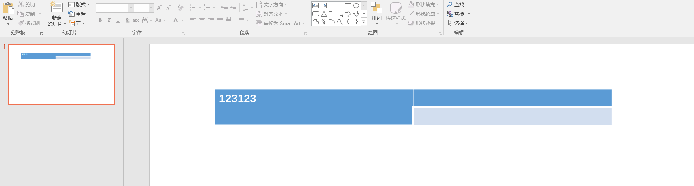
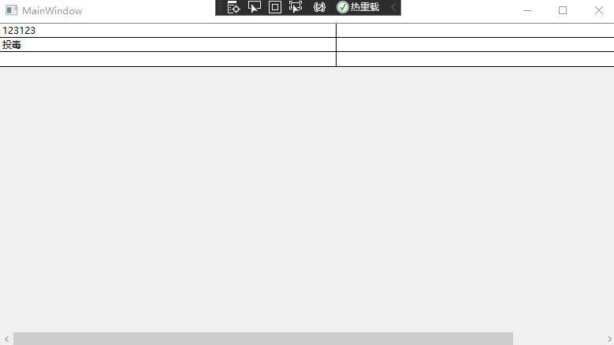

# dotnet OpenXML 利用合并表格单元格在 PPT 文档插入不可见的额外版权信息

本文告诉大家如何利用 Office 对于 OpenXML 支持的特性，在 PPT 的表格里面，通过合并单元格存放一些额外的信息，这些信息对用户来说是不可见的，但是进行拷贝表格等的时候，可以保存此信息内容

<!--more-->


<!-- CreateTime:2021/9/1 16:59:19 -->

<!-- 发布 -->

在开始之前，期望大家已了解很多 OpenXML 知识，详细请看 [Office 使用 OpenXML SDK 解析文档博客目录](https://blog.lindexi.com/post/Office-%E4%BD%BF%E7%94%A8-OpenXML-SDK-%E8%A7%A3%E6%9E%90%E6%96%87%E6%A1%A3%E5%8D%9A%E5%AE%A2%E7%9B%AE%E5%BD%95.html )

在 PPT 的表格里面，采用了 RowSpan 用来表示单元格跨行，对应的在下一行的单元格将会被标记 `vMerge="1"` 表示此单元格被垂直合并。例如我对第一行第一个单元格设置合并单元格，合并行，那么在第二行的第一列的单元格将被标记 `vMerge="1"` 表示被合并，如下面表格

<!--  -->


在 Office 读取 OpenXML 文档，将无视 `vMerge="1"` 的存在，也就是此属性只是给开发者看的而已，无论是否存在都不会影响到单元格的合并

但事实上，依然可以在标记了 `vMerge="1"` 的单元格上面添加内容，例如以下有删减的 OpenXML 文档

```xml
  <a:tbl>
    <a:tr h="370840">
      <a:tc rowSpan="2">
        <a:txBody>
          <a:bodyPr />
          <a:lstStyle />
          <a:p>
            <a:r>
              <a:rPr lang="en-US" altLang="zh-CN" dirty="0" smtClean="0" />
              <a:t>123123</a:t>
            </a:r>
            <a:endParaRPr lang="zh-CN" altLang="en-US" dirty="0" />
          </a:p>
        </a:txBody>
        <a:tcPr />
      </a:tc>
      <a:tc></a:tc>
    </a:tr>
    <a:tr h="370840">
      <a:tc vMerge="1">
        <a:txBody>
          <a:bodyPr />
          <a:lstStyle />
          <a:p>
            <a:r>
              <a:rPr lang="en-US" altLang="zh-CN" smtClean="0" />
              <a:t>投毒</a:t>
            </a:r>
            <a:endParaRPr lang="zh-CN" altLang="en-US" />
          </a:p>
        </a:txBody>
        <a:tcPr />
      </a:tc>
      <a:tc></a:tc>
    </a:tr>
  </a:tbl>
```


如上面文档，给了一个单元格写了“投毒”但在 PPT 打开时，是看不到投毒的，如下面界面

<!--  -->


以下是此 Office 文档的页面

```xml
<?xml version="1.0" encoding="UTF-8" standalone="yes"?>
<p:sld xmlns:a="http://schemas.openxmlformats.org/drawingml/2006/main" xmlns:r="http://schemas.openxmlformats.org/officeDocument/2006/relationships" xmlns:p="http://schemas.openxmlformats.org/presentationml/2006/main">
  <p:cSld>
    <p:spTree>
      <p:nvGrpSpPr>
        <p:cNvPr id="1" name="" />
        <p:cNvGrpSpPr />
        <p:nvPr />
      </p:nvGrpSpPr>
      <p:grpSpPr>
        <a:xfrm>
          <a:off x="0" y="0" />
          <a:ext cx="0" cy="0" />
          <a:chOff x="0" y="0" />
          <a:chExt cx="0" cy="0" />
        </a:xfrm>
      </p:grpSpPr>
      <p:graphicFrame>
        <p:nvGraphicFramePr>
          <p:cNvPr id="4" name="表格 3" />
          <p:cNvGraphicFramePr>
            <a:graphicFrameLocks noGrp="1" />
          </p:cNvGraphicFramePr>
          <p:nvPr />
        </p:nvGraphicFramePr>
        <p:xfrm>
          <a:off x="838200" y="1825625" />
          <a:ext cx="8128000" cy="741680" />
        </p:xfrm>
        <a:graphic>
          <a:graphicData uri="http://schemas.openxmlformats.org/drawingml/2006/table">
            <a:tbl>
              <a:tblPr firstRow="1" bandRow="1">
                <a:tableStyleId>{5C22544A-7EE6-4342-B048-85BDC9FD1C3A}</a:tableStyleId>
              </a:tblPr>
              <a:tblGrid>
                <a:gridCol w="4064000">
                  <a:extLst>
                    <a:ext uri="{9D8B030D-6E8A-4147-A177-3AD203B41FA5}">
                      <a16:colId xmlns:a16="http://schemas.microsoft.com/office/drawing/2014/main" val="1394598003" />
                    </a:ext>
                  </a:extLst>
                </a:gridCol>
                <a:gridCol w="4064000">
                  <a:extLst>
                    <a:ext uri="{9D8B030D-6E8A-4147-A177-3AD203B41FA5}">
                      <a16:colId xmlns:a16="http://schemas.microsoft.com/office/drawing/2014/main" val="3643799610" />
                    </a:ext>
                  </a:extLst>
                </a:gridCol>
              </a:tblGrid>
              <a:tr h="370840">
                <a:tc rowSpan="2">
                  <a:txBody>
                    <a:bodyPr />
                    <a:lstStyle />
                    <a:p>
                      <a:r>
                        <a:rPr lang="en-US" altLang="zh-CN" dirty="0" smtClean="0" />
                        <a:t>123123</a:t>
                      </a:r>
                      <a:endParaRPr lang="zh-CN" altLang="en-US" dirty="0" />
                    </a:p>
                  </a:txBody>
                  <a:tcPr />
                </a:tc>
                <a:tc>
                  <a:txBody>
                    <a:bodyPr />
                    <a:lstStyle />
                    <a:p>
                      <a:endParaRPr lang="zh-CN" altLang="en-US" />
                    </a:p>
                  </a:txBody>
                  <a:tcPr />
                </a:tc>
                <a:extLst>
                  <a:ext uri="{0D108BD9-81ED-4DB2-BD59-A6C34878D82A}">
                    <a16:rowId xmlns:a16="http://schemas.microsoft.com/office/drawing/2014/main" val="3287805416" />
                  </a:ext>
                </a:extLst>
              </a:tr>
              <a:tr h="370840">
                <a:tc vMerge="1">
                  <a:txBody>
                    <a:bodyPr />
                    <a:lstStyle />
                    <a:p>
                      <a:r>
                        <a:rPr lang="en-US" altLang="zh-CN" smtClean="0" />
                        <a:t>投毒</a:t>
                      </a:r>
                      <a:endParaRPr lang="zh-CN" altLang="en-US" />
                    </a:p>
                  </a:txBody>
                  <a:tcPr />
                </a:tc>
                <a:tc>
                  <a:txBody>
                    <a:bodyPr />
                    <a:lstStyle />
                    <a:p>
                      <a:endParaRPr lang="zh-CN" altLang="en-US" dirty="0" />
                    </a:p>
                  </a:txBody>
                  <a:tcPr />
                </a:tc>
                <a:extLst>
                  <a:ext uri="{0D108BD9-81ED-4DB2-BD59-A6C34878D82A}">
                    <a16:rowId xmlns:a16="http://schemas.microsoft.com/office/drawing/2014/main" val="3924701140" />
                  </a:ext>
                </a:extLst>
              </a:tr>
            </a:tbl>
          </a:graphicData>
        </a:graphic>
      </p:graphicFrame>
    </p:spTree>
    <p:extLst>
      <p:ext uri="{BB962C8B-B14F-4D97-AF65-F5344CB8AC3E}">
        <p14:creationId xmlns:p14="http://schemas.microsoft.com/office/powerpoint/2010/main" val="840519474" />
      </p:ext>
    </p:extLst>
  </p:cSld>
  <p:clrMapOvr>
    <a:masterClrMapping />
  </p:clrMapOvr>
</p:sld>
```

此时无论是保存还是拷贝表格，都不会丢失 “投毒” 内容。也就是说可以方便的在合并的单元格里面存放一些版权信息，这些版权信息对于用户来说，除非是特意去更改，否则都会放在文档里面

如果忽略合并单元格，通过 WPF 应用读取文档，使用 DataGrid 在界面显示，那么即可拿到合并单元格的内容

```csharp
            var file = new FileInfo("Test.pptx");

            using var presentationDocument = PresentationDocument.Open(file.FullName, false);
            var slide = presentationDocument.PresentationPart!.SlideParts.First().Slide;

            var graphicFrame = slide.CommonSlideData!.ShapeTree!.GetFirstChild<GraphicFrame>()!;
            var graphic = graphicFrame.Graphic!;
            var graphicData = graphic.GraphicData!;
            var table = graphicData.GetFirstChild<Table>()!; // a:tbl
            /*
               <a:tbl>
                 <a:tr h="370840">
                   <a:tc rowSpan="2">
                     <a:txBody>
                       <a:bodyPr />
                       <a:lstStyle />
                       <a:p>
                         <a:r>
                           <a:rPr lang="en-US" altLang="zh-CN" dirty="0" smtClean="0" />
                           <a:t>123123</a:t>
                         </a:r>
                         <a:endParaRPr lang="zh-CN" altLang="en-US" dirty="0" />
                       </a:p>
                     </a:txBody>
                     <a:tcPr />
                   </a:tc>
                   <a:tc></a:tc>
                 </a:tr>
                 <a:tr h="370840">
                   <a:tc vMerge="1">
                     <a:txBody>
                       <a:bodyPr />
                       <a:lstStyle />
                       <a:p>
                         <a:r>
                           <a:rPr lang="en-US" altLang="zh-CN" smtClean="0" />
                           <a:t>投毒</a:t>
                         </a:r>
                         <a:endParaRPr lang="zh-CN" altLang="en-US" />
                       </a:p>
                     </a:txBody>
                     <a:tcPr />
                   </a:tc>
                   <a:tc></a:tc>
                 </a:tr>
               </a:tbl>
             */

            var dataTable = new DataTable();
            DataGrid.DataContext = dataTable;
            DataGrid.HeadersVisibility = DataGridHeadersVisibility.None;

            var n = 0;
            foreach (var gridColumn in table.TableGrid!.Elements<GridColumn>())
            {
                var emu = new Emu(gridColumn.Width?.Value ?? 95250);

                DataGrid.Columns.Add(new DataGridTextColumn()
                {
                    Width = emu.ToPixel().Value,
                    Binding = new Binding(n.ToString())
                });

                dataTable.Columns.Add(n.ToString());
                n++;
            }

            foreach (var openXmlElement in table)
            {
                // a:tr 表格的行
                if (openXmlElement is TableRow tableRow)
                {
                    var dataRow = dataTable.NewRow();
                    dataTable.Rows.Add(dataRow);

                    var index = 0;
                    foreach (var tableCell in tableRow.Elements<TableCell>())
                    {
                        var text = tableCell.TextBody!.InnerText;
                        dataRow[index.ToString()] = text;

                        index++;
                    }
                }
            }
```

执行上面代码的界面如下

<!--  -->


本文以上的测试文件和代码放在[github](https://github.com/lindexi/lindexi_gd/tree/fd6ad246d15db91342476dae7fc841182179726d/Pptx) 和 [gitee](https://gitee.com/lindexi/lindexi_gd/tree/fd6ad246d15db91342476dae7fc841182179726d/Pptx) 欢迎访问

可以通过如下方式获取本文的源代码，先创建一个空文件夹，接着使用命令行 cd 命令进入此空文件夹，在命令行里面输入以下代码，即可获取到本文的代码

```
git init
git remote add origin https://gitee.com/lindexi/lindexi_gd.git
git pull origin fd6ad246d15db91342476dae7fc841182179726d
```

以上使用的是 gitee 的源，如果 gitee 不能访问，请替换为 github 的源

```
git remote remove origin
git remote add origin https://github.com/lindexi/lindexi_gd.git
```

获取代码之后，进入 Pptx 文件夹

更多请看 [Office 使用 OpenXML SDK 解析文档博客目录](https://blog.lindexi.com/post/Office-%E4%BD%BF%E7%94%A8-OpenXML-SDK-%E8%A7%A3%E6%9E%90%E6%96%87%E6%A1%A3%E5%8D%9A%E5%AE%A2%E7%9B%AE%E5%BD%95.html )


<a rel="license" href="http://creativecommons.org/licenses/by-nc-sa/4.0/"></a><br />本作品采用<a rel="license" href="http://creativecommons.org/licenses/by-nc-sa/4.0/">知识共享署名-非商业性使用-相同方式共享 4.0 国际许可协议</a>进行许可。欢迎转载、使用、重新发布，但务必保留文章署名[林德熙](http://blog.csdn.net/lindexi_gd)(包含链接:http://blog.csdn.net/lindexi_gd )，不得用于商业目的，基于本文修改后的作品务必以相同的许可发布。如有任何疑问，请与我[联系](mailto:lindexi_gd@163.com)。