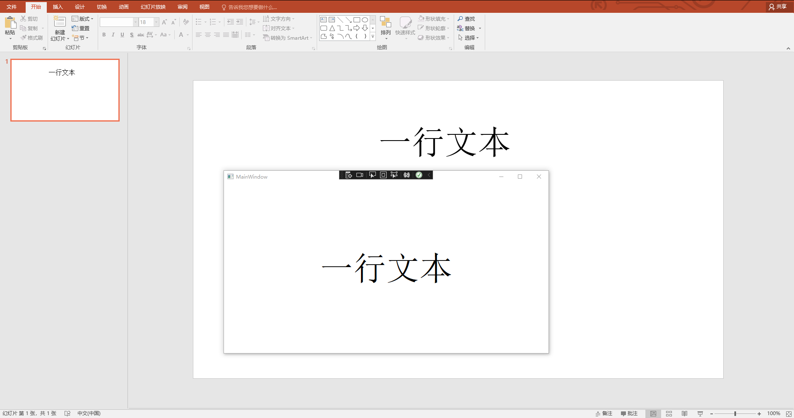

# dotnet OpenXML 文本 BodyProperties 的 FontScale 与文本字号缩放

本文来告诉大家，在 OpenXML 的 BodyProperties 的 NormalAutoFit 的 FontScale 属性缩放文本框的文本字号的方法

<!--more-->


<!-- CreateTime:2021/12/29 17:56:48 -->

<!-- 发布 -->

通过 ECMA 376 文档可以了解到 BodyProperties 属性是作用在文本框，放在 BodyProperties 的 NormalAutoFit 的 FontScale 属性，能修改文本框的文本字号缩放

更多关于 BodyProperties 属性，请看  [dotnet OpenXML 文本 BodyProperties 的属性作用](https://blog.lindexi.com/post/dotnet-OpenXML-%E6%96%87%E6%9C%AC-BodyProperties-%E7%9A%84%E5%B1%9E%E6%80%A7%E4%BD%9C%E7%94%A8.html )

通过 ECMA 376 的 21.1.2.1.3 章可以了解到使用 NormalAutoFit 的 FontScale 属性是按照百分比缩放文本框

开始之前，先使用 [C# dotnet 使用 OpenXml 解析 PPT 文件](https://blog.lindexi.com/post/C-dotnet-%E4%BD%BF%E7%94%A8-OpenXml-%E8%A7%A3%E6%9E%90-PPT-%E6%96%87%E4%BB%B6.html) 的方法读取测试的文档。此测试文件将可以在下文拿到

```csharp
            var file = new FileInfo("Test.pptx");

            using var presentationDocument = PresentationDocument.Open(file.FullName, false);
```

获取首页的第一个形状元素，此形状元素包含一个文本，此文本内容里设置了 NormalAutoFit 的 FontScale 属性

```csharp
            var slide = presentationDocument.PresentationPart!.SlideParts.First().Slide;

            var shape = slide.CommonSlideData!.ShapeTree!.GetFirstChild<Shape>()!;
```

此形状的 OpenXML 内容如下

```xml
 <p:sp>
   <p:nvSpPr>
     <p:cNvPr id="4" name="文本框 3" />
     <p:cNvSpPr txBox="1" />
     <p:nvPr />
   </p:nvSpPr>
   <p:spPr>
     <a:xfrm>
       <a:off x="4168346" y="914401" />
       <a:ext cx="6096000" cy="3170090" />
     </a:xfrm>
     <a:prstGeom prst="rect">
       <a:avLst />
     </a:prstGeom>
     <a:noFill />
   </p:spPr>
   <p:txBody>
     <a:bodyPr wrap="square" rtlCol="0">
       <a:normAutofit fontScale="60000"/>
     </a:bodyPr>
     <a:lstStyle />
     <a:p>
       <a:r>
         <a:rPr lang="zh-CN" altLang="en-US" sz="10000">
         </a:rPr>
         <a:t>一行文本</a:t>
       </a:r>
       <a:endParaRPr lang="en-US" sz="10000" dirty="0" />
     </a:p>
   </p:txBody>
 </p:sp>
```

在 `a:bodyPr` 的 `a:normAutofit` 的文本缩放设置为 60000 的值

从 ECMA 376 文档可以了解 FontScale 属性的单位是千倍百分比，可使用 [Office Open XML 的测量单位](https://blog.lindexi.com/post/Office-Open-XML-%E7%9A%84%E6%B5%8B%E9%87%8F%E5%8D%95%E4%BD%8D.html ) 提供的 [dotnetCampus.OpenXMLUnitConverter](https://www.nuget.org/packages/dotnetCampus.OpenXMLUnitConverter) 库的 Percentage 类型作为单位

获取文本框属性，可以使用以下代码

```csharp
            var shapeProperties = shape.ShapeProperties!;
            var textBody = shape.TextBody!;
            Debug.Assert(textBody != null);
            var textBodyProperties = textBody.BodyProperties!;
            Debug.Assert(textBodyProperties != null);
```

文本框属性里包含 NormalAutoFit 属性，可采用以下代码获取

```csharp
            var normalAutoFit = textBodyProperties.GetFirstChild<NormalAutoFit>()!;
            Debug.Assert(normalAutoFit != null);
```

如果文档里的 OpenXML 内容没有存在 NormalAutoFit 或者 FontScale 属性，那就是默认不做文本字号缩放。可以相当于默认的倍数是 1 的值，因为任何值乘以 1 都等于原值，相当于不做缩放

```csharp
            Percentage fontScale = normalAutoFit.FontScale is null
                ? Percentage.FromDouble(1)
                : new Percentage(normalAutoFit.FontScale);
```

此 Percentage 类型是 [dotnetCampus.OpenXMLUnitConverter](https://www.nuget.org/packages/dotnetCampus.OpenXMLUnitConverter) 库提供的

获取文本内容，在 WPF 显示代码如下

```csharp
            foreach (var paragraph in textBody.Elements<DocumentFormat.OpenXml.Drawing.Paragraph>())
            {
                // 一个文本里面有很多段落
                // 段落里面，文本有不同的样式，如一段可以有不同加粗的文本
                // 相同的样式的文本放在一个 TextRun 里面。不同的样式的文本放在不同的 TextRun 里面

                // 这个文本段落是没有属性的，为了方便样式，就不写代码
                //if (paragraph.ParagraphProperties != null)

                foreach (var run in paragraph.Elements<DocumentFormat.OpenXml.Drawing.Run>())
                {
                    var runProperties = run.RunProperties!;
                    var fontSize = new PoundHundredfold(runProperties.FontSize!.Value).ToPound();

                    // 默认字体前景色是黑色
                    var text = run.Text!.Text;

                    var textBlock = new TextBlock()
                    {
                        Text = text,
                        FontSize = fontSize.ToPixel().Value * fontScale.DoubleValue,
                        FontFamily = new FontFamily("宋体"),
                        HorizontalAlignment = HorizontalAlignment.Center,
                        VerticalAlignment = VerticalAlignment.Center,
                    };

                    Root.Children.Add(textBlock);
                }
            }
```

运行以上代码效果如下，可以看到文本大小和 Office 的 PPT 相同

<!--  -->


本文所有代码和测试文件放在[github](https://github.com/lindexi/lindexi_gd/tree/24230fc0bb8202c567ccf9ffffb49eebc08be120/Pptx) 和 [gitee](https://gitee.com/lindexi/lindexi_gd/tree/24230fc0bb8202c567ccf9ffffb49eebc08be120/Pptx) 欢迎访问

可以通过如下方式获取本文的源代码，先创建一个空文件夹，接着使用命令行 cd 命令进入此空文件夹，在命令行里面输入以下代码，即可获取到本文的代码

```
git init
git remote add origin https://gitee.com/lindexi/lindexi_gd.git
git pull origin 24230fc0bb8202c567ccf9ffffb49eebc08be120
```

以上使用的是 gitee 的源，如果 gitee 不能访问，请替换为 github 的源

```
git remote remove origin
git remote add origin https://github.com/lindexi/lindexi_gd.git
```

获取代码之后，进入 Pptx 文件夹

更多请看 [Office 使用 OpenXML SDK 解析文档博客目录](https://blog.lindexi.com/post/Office-%E4%BD%BF%E7%94%A8-OpenXML-SDK-%E8%A7%A3%E6%9E%90%E6%96%87%E6%A1%A3%E5%8D%9A%E5%AE%A2%E7%9B%AE%E5%BD%95.html )


<a rel="license" href="http://creativecommons.org/licenses/by-nc-sa/4.0/"></a><br />本作品采用<a rel="license" href="http://creativecommons.org/licenses/by-nc-sa/4.0/">知识共享署名-非商业性使用-相同方式共享 4.0 国际许可协议</a>进行许可。欢迎转载、使用、重新发布，但务必保留文章署名[林德熙](http://blog.csdn.net/lindexi_gd)(包含链接:http://blog.csdn.net/lindexi_gd )，不得用于商业目的，基于本文修改后的作品务必以相同的许可发布。如有任何疑问，请与我[联系](mailto:lindexi_gd@163.com)。